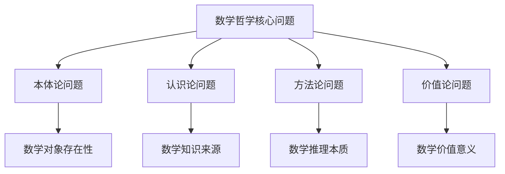

# 数学哲学基础理论

## 目录

- [数学哲学基础理论](#数学哲学基础理论)
  - [目录](#目录)
  - [1. 数学哲学概述](#1-数学哲学概述)
    - [1.1 数学哲学的定义与范围](#11-数学哲学的定义与范围)
    - [1.2 数学哲学的核心问题](#12-数学哲学的核心问题)
    - [1.3 数学哲学的历史发展](#13-数学哲学的历史发展)
  - [2. 数学本体论](#2-数学本体论)
    - [2.1 数学对象的存在性问题](#21-数学对象的存在性问题)
    - [2.2 数学实在论](#22-数学实在论)
    - [2.3 数学反实在论](#23-数学反实在论)
    - [2.4 理念驱动的本体论](#24-理念驱动的本体论)
  - [3. 数学认识论](#3-数学认识论)
    - [3.1 数学知识的来源](#31-数学知识的来源)
    - [3.2 数学直觉与推理](#32-数学直觉与推理)
    - [3.3 数学真理的性质](#33-数学真理的性质)
    - [3.4 理念驱动的认识论](#34-理念驱动的认识论)
  - [4. 数学方法论](#4-数学方法论)
    - [4.1 数学推理的本质](#41-数学推理的本质)
    - [4.2 数学证明的本质](#42-数学证明的本质)
    - [4.3 数学创造的过程](#43-数学创造的过程)
    - [4.4 理念驱动的方法论](#44-理念驱动的方法论)
  - [5. 数学美学](#5-数学美学)
    - [5.1 数学美的本质](#51-数学美的本质)
    - [5.2 数学美的类型](#52-数学美的类型)
    - [5.3 数学美的价值](#53-数学美的价值)
    - [5.4 理念驱动的美学观](#54-理念驱动的美学观)
  - [6. 数学应用哲学](#6-数学应用哲学)
    - [6.1 数学应用的本质](#61-数学应用的本质)
    - [6.2 数学与现实的联系](#62-数学与现实的联系)
    - [6.3 数学的预测能力](#63-数学的预测能力)
    - [6.4 理念驱动的应用观](#64-理念驱动的应用观)
  - [7. 批判性反思](#7-批判性反思)
    - [7.1 各流派的局限性](#71-各流派的局限性)
    - [7.2 理念驱动的优势](#72-理念驱动的优势)
    - [7.3 未来发展方向](#73-未来发展方向)
  - [总结](#总结)

---

## 1. 数学哲学概述

### 1.1 数学哲学的定义与范围

**定义**：数学哲学是研究数学的本质、基础、方法和意义的哲学分支。

**研究范围**：

1. **本体论问题**：数学对象是否存在？以什么方式存在？
2. **认识论问题**：我们如何认识数学？数学知识的来源是什么？
3. **方法论问题**：数学推理和证明的本质是什么？
4. **价值论问题**：数学的价值和意义是什么？

**形式化表达**：
$$\text{数学哲学} = \{\text{本体论}, \text{认识论}, \text{方法论}, \text{价值论}\}$$

### 1.2 数学哲学的核心问题

**核心问题**：

1. **数学是什么？** - 数学的本质和存在方式
2. **数学如何工作？** - 数学的方法和推理过程
3. **数学为什么有效？** - 数学的真理性和应用性
4. **数学向何处去？** - 数学的发展方向和未来

**问题层次结构**：

### 1.3 数学哲学的历史发展

**历史阶段**：

1. **古代数学哲学**：柏拉图主义、亚里士多德主义
2. **近代数学哲学**：理性主义、经验主义
3. **现代数学哲学**：逻辑主义、直觉主义、形式主义
4. **当代数学哲学**：自然主义、结构主义、理念驱动

---

## 2. 数学本体论

### 2.1 数学对象的存在性问题

**基本问题**：数学对象是否存在？如果存在，以什么方式存在？

**存在性类型**：

1. **物理存在**：像桌子、椅子一样的物理对象
2. **心理存在**：像思想、感觉一样的心理对象
3. **抽象存在**：像概念、关系一样的抽象对象
4. **形式存在**：像符号、规则一样的形式对象

**形式化表达**：
$$\text{存在性类型} = \{\text{物理}, \text{心理}, \text{抽象}, \text{形式}\}$$

### 2.2 数学实在论

**核心观点**：数学对象和数学真理独立于人类思维而存在。

**主要论证**：

1. **不可否认性论证**：数学真理的必然性表明其客观存在
2. **科学成功论证**：数学在科学中的成功应用支持其实在性
3. **抽象对象论证**：数学对象作为抽象实体存在

**形式化表达**：
对于任意数学命题 $P$，实在论认为：
$$\exists x \in \mathbb{M} \text{ such that } P(x) \text{ is true}$$
其中 $\mathbb{M}$ 表示数学对象的域。

**实在论的类型**：

1. **柏拉图主义**：数学对象存在于理念世界
2. **逻辑主义**：数学对象是逻辑概念
3. **结构主义**：数学对象是结构关系

### 2.3 数学反实在论

**核心观点**：数学是人类思维的构造，不具有独立的存在性。

**主要形式**：

1. **形式主义**：数学是符号游戏
2. **直觉主义**：数学是心智构造
3. **约定主义**：数学是约定俗成

**形式化表达**：
对于数学命题 $P$，反实在论认为：
$$P \text{ is true} \iff \text{human mind constructs } P$$

**反实在论的类型**：

1. **形式主义**：数学是形式系统的游戏
2. **直觉主义**：数学是构造性思维
3. **约定主义**：数学是社会约定

### 2.4 理念驱动的本体论

**核心理念**：

1. **抽象化理念**：数学对象是通过抽象化从具体现象中提取的
2. **形式化理念**：数学对象通过形式语言被精确描述
3. **公理化理念**：数学对象通过公理系统被定义
4. **结构化理念**：数学对象存在于结构关系中
5. **映射化理念**：数学对象通过映射关系相互联系

**理念驱动的调和**：

**结构化理念**：

- 数学对象存在于结构关系中
- 数学对象通过与其他对象的关系获得意义
- 数学对象既是构造的，也是发现的

**映射化理念**：

- 数学对象通过映射关系相互联系
- 数学对象在不同层次上存在
- 数学对象的存在是相对的，不是绝对的

**形式化表达**：
$$\text{数学对象} = \text{抽象化} \circ \text{形式化} \circ \text{公理化} \circ \text{结构化} \circ \text{映射化}$$

---

## 3. 数学认识论

### 3.1 数学知识的来源

**知识来源类型**：

1. **经验来源**：通过观察和实验获得
2. **理性来源**：通过推理和思考获得
3. **直觉来源**：通过直觉和洞察获得
4. **构造来源**：通过构造和创造获得

**形式化表达**：
$$\text{知识来源} = \{\text{经验}, \text{理性}, \text{直觉}, \text{构造}\}$$

### 3.2 数学直觉与推理

**数学直觉**：

**定义**：对数学对象和关系的直接、非推理性的把握。

**直觉类型**：

1. **空间直觉**：对几何关系的直觉
2. **数量直觉**：对数量关系的直觉
3. **逻辑直觉**：对逻辑关系的直觉
4. **结构直觉**：对结构关系的直觉

**形式化表达**：
$$\text{直觉}(\phi) \Rightarrow \text{可能推理}(\phi)$$

**数学推理**：

**定义**：从已知命题推导出新命题的逻辑过程。

**推理类型**：

1. **演绎推理**：从一般到特殊的推理
2. **归纳推理**：从特殊到一般的推理
3. **类比推理**：基于相似性的推理
4. **构造推理**：通过构造的推理

**形式化表达**：
$$\text{推理}(\phi_1, \phi_2, \ldots, \phi_n) \Rightarrow \psi$$

### 3.3 数学真理的性质

**数学真理的特征**：

1. **必然性**：数学真理是必然的
2. **先验性**：数学真理不依赖于经验
3. **客观性**：数学真理是客观的
4. **普遍性**：数学真理是普遍的

**形式化表达**：
$$\text{数学真理}(\phi) \Rightarrow \Box\phi \land \text{先验}(\phi) \land \text{客观}(\phi) \land \text{普遍}(\phi)$$

其中 $\Box$ 表示必然性算子。

### 3.4 理念驱动的认识论

**理念驱动的认识观**：

**抽象化理念**：

- 数学认识始于对具体现象的抽象
- 数学知识通过抽象化过程获得
- 数学认识是主动的构造过程

**形式化理念**：

- 数学认识通过形式推理进行
- 数学知识通过逻辑演绎获得
- 数学认识是严格的推理过程

**公理化理念**：

- 数学认识从基本假设出发
- 数学知识通过公理演绎获得
- 数学认识是系统的构建过程

**结构化理念**：

- 数学直觉是对结构的整体把握
- 数学推理是对结构的逻辑分析
- 直觉和推理相互补充

**映射化理念**：

- 数学直觉发现对象间的对应关系
- 数学推理验证对应关系的正确性
- 直觉引导推理，推理验证直觉

---

## 4. 数学方法论

### 4.1 数学推理的本质

**推理的本质**：

**抽象化理念**：

- 数学推理是抽象思维的逻辑过程
- 推理的有效性来自抽象化的普遍性
- 推理从特殊到一般，从具体到抽象

**形式化理念**：

- 数学推理是形式语言的演绎过程
- 推理的有效性来自形式规则的严格性
- 推理遵循形式逻辑的规则

**公理化理念**：

- 数学推理是公理体系的演绎过程
- 推理的有效性来自公理的真理性
- 推理从公理出发，通过逻辑规则得出结论

**推理类型对比**：

| 推理类型 | 方向 | 确定性 | 应用范围 |
|----------|------|--------|----------|
| 演绎推理 | 一般→特殊 | 必然 | 逻辑证明 |
| 归纳推理 | 特殊→一般 | 可能 | 猜想形成 |
| 类比推理 | 相似→相似 | 可能 | 启发发现 |
| 构造推理 | 构造→验证 | 必然 | 存在证明 |

### 4.2 数学证明的本质

**证明的本质**：

**抽象化理念**：

- 证明是抽象思维的逻辑展示
- 证明通过抽象化确立普遍真理
- 证明从具体实例抽象出一般结论

**形式化理念**：

- 证明是形式语言的严格推导
- 证明通过形式规则确立逻辑真理
- 证明遵循形式系统的规则

**公理化理念**：

- 证明是公理体系的逻辑演绎
- 证明通过公理演绎确立数学真理
- 证明从公理出发，通过逻辑规则得出结论

**证明类型**：

1. **直接证明**：从前提出发直接推导结论
2. **间接证明**：通过否定结论推导矛盾
3. **构造性证明**：构造满足条件的对象
4. **存在性证明**：证明对象存在但不构造

**形式化表达**：
$$\text{证明}(\phi) \Leftrightarrow \text{逻辑推理序列} \land \text{从公理到结论} \land \text{有效性保证}$$

### 4.3 数学创造的过程

**创造过程**：

1. **问题提出**：发现和提出数学问题
2. **直觉洞察**：通过直觉获得洞察
3. **形式化表达**：将洞察形式化表达
4. **逻辑验证**：通过逻辑验证正确性
5. **系统化**：将结果系统化

**创造机制**：

**结构化理念**：

- 创造是对结构的发现和构建
- 创造通过结构关系进行
- 创造是结构化的过程

**映射化理念**：

- 创造是对对应关系的发现
- 创造通过映射关系进行
- 创造是映射化的过程

### 4.4 理念驱动的方法论

**方法论统一**：

**结构化理念**：

- 演绎推理揭示结构的逻辑关系
- 归纳推理发现结构的模式
- 构造性证明揭示对象的结构
- 存在性证明确立对象的存在

**映射化理念**：

- 演绎推理建立对象间的逻辑对应
- 归纳推理发现对象间的经验对应
- 构造性证明建立对象间的构造对应
- 存在性证明确立对象间的存在对应

---

## 5. 数学美学

### 5.1 数学美的本质

**数学美的定义**：数学对象和理论所具有的和谐、简洁、优雅等审美特征。

**理念驱动的美学观**：

**抽象化理念**：

- 数学美是抽象思维的和谐
- 数学美通过抽象化体现简洁性
- 数学美是思想的纯粹性

**形式化理念**：

- 数学美是形式系统的和谐
- 数学美通过形式化体现精确性
- 数学美是逻辑的完美性

**公理化理念**：

- 数学美是公理体系的和谐
- 数学美通过公理化体现系统性
- 数学美是理论的完整性

**形式化表达**：
$$\text{数学美}(\phi) \Leftrightarrow \text{和谐}(\phi) \land \text{简洁}(\phi) \land \text{优雅}(\phi)$$

### 5.2 数学美的类型

**理念驱动的分类**：

**结构化理念**：

- **对称美**：结构的对称性
- **和谐美**：结构的和谐性
- **平衡美**：结构的平衡性

**映射化理念**：

- **对应美**：对象间的完美对应
- **统一美**：不同对象的统一
- **联系美**：对象间的深刻联系

**数学美的具体表现**：

1. **对称性**：
   $$\text{Symmetry}(S) \iff \forall x \in S, \exists f \in \text{Aut}(S) \text{ such that } f(x) = x$$

2. **简洁性**：用最少的公理解释最多的现象

3. **和谐性**：不同数学分支之间的内在联系

4. **统一性**：不同理论之间的统一

### 5.3 数学美的价值

**理念驱动的价值观**：

**抽象化理念**：

- 数学美指导抽象化的方向
- 数学美促进数学的简洁性
- 数学美推动数学的纯粹性

**形式化理念**：

- 数学美指导形式化的方向
- 数学美促进数学的精确性
- 数学美推动数学的严格性

**公理化理念**：

- 数学美指导公理化的方向
- 数学美促进数学的系统性
- 数学美推动数学的完整性

**数学美与数学创造**：

**结构化理念**：

- 数学美引导结构的发现
- 数学美促进结构的构建
- 数学美推动结构的创新

**映射化理念**：

- 数学美引导对应关系的发现
- 数学美促进对应关系的建立
- 数学美推动对应关系的创新

### 5.4 理念驱动的美学观

**美学统一性**：

数学美体现了理念的统一性：

- 抽象化理念体现简洁美
- 形式化理念体现精确美
- 公理化理念体现系统美
- 结构化理念体现和谐美
- 映射化理念体现统一美

---

## 6. 数学应用哲学

### 6.1 数学应用的本质

**理念驱动的应用观**：

**抽象化理念**：

- 数学应用是抽象化过程的逆过程
- 数学通过抽象化获得普遍性，从而能应用于具体
- 数学应用是抽象到具体的映射

**形式化理念**：

- 数学应用是形式系统的解释
- 数学通过形式化获得精确性，从而能精确描述现实
- 数学应用是形式到内容的映射

**公理化理念**：

- 数学应用是公理体系的解释
- 数学通过公理化获得系统性，从而能系统描述现实
- 数学应用是公理到现实的映射

### 6.2 数学与现实的联系

**联系机制**：

**结构化理念**：

- 现实世界具有数学结构
- 数学结构反映现实结构
- 结构对应是联系的基础

**映射化理念**：

- 数学对象与现实对象存在对应关系
- 对应关系是应用的基础
- 映射关系是联系的核心

**形式化表达**：
$$\text{数学应用} = \text{抽象化}^{-1} \circ \text{形式化}^{-1} \circ \text{公理化}^{-1}$$

### 6.3 数学的预测能力

**预测机制**：

1. **结构预测**：基于数学结构预测现实结构
2. **关系预测**：基于数学关系预测现实关系
3. **规律预测**：基于数学规律预测现实规律

**预测能力来源**：

**抽象化理念**：

- 数学通过抽象化获得普遍性
- 普遍性使数学具有预测能力
- 预测基于抽象化的普遍性

**形式化理念**：

- 数学通过形式化获得精确性
- 精确性使数学具有预测能力
- 预测基于形式化的精确性

### 6.4 理念驱动的应用观

**应用统一性**：

数学应用体现了理念的统一性：

- 抽象化理念支持普遍应用
- 形式化理念支持精确应用
- 公理化理念支持系统应用
- 结构化理念支持结构应用
- 映射化理念支持对应应用

---

## 7. 批判性反思

### 7.1 各流派的局限性

**实在论的局限性**：

- 难以解释数学对象的抽象性
- 难以解释数学知识的构造性
- 难以解释数学应用的多样性

**反实在论的局限性**：

- 难以解释数学真理的客观性
- 难以解释数学应用的普遍性
- 难以解释数学发展的必然性

**形式主义的局限性**：

- 难以解释数学的直觉性
- 难以解释数学的应用性
- 难以解释数学的美学性

### 7.2 理念驱动的优势

**统一性优势**：

- 统一了不同的数学哲学观点
- 统一了数学的不同方面
- 统一了数学的不同应用

**解释性优势**：

- 解释了数学的本质
- 解释了数学的方法
- 解释了数学的应用

**指导性优势**：

- 指导数学研究
- 指导数学教育
- 指导数学应用

### 7.3 未来发展方向

**理论发展**：

- 深化理念驱动的理论
- 扩展理念驱动的应用
- 完善理念驱动的体系

**实践发展**：

- 应用于数学教育
- 应用于数学研究
- 应用于数学应用

---

## 总结

理念驱动的数学哲学体系为我们提供了一个完整的数学哲学框架：

1. **本体论**：数学对象通过理念获得存在
2. **认识论**：数学知识通过理念获得
3. **方法论**：数学方法通过理念统一
4. **美学**：数学美通过理念体现
5. **应用**：数学应用通过理念实现

**核心理念**：

- **抽象化**：数学的本质特征
- **形式化**：数学的表达方式
- **公理化**：数学的构建方法
- **结构化**：数学的组织方式
- **映射化**：数学的联系方式

**统一性**：
理念驱动的数学哲学体系实现了数学哲学的统一，为理解数学的本质、方法、价值和应用提供了完整的理论框架。

---

*本文档基于理念驱动的数学哲学体系，整合了传统数学哲学的观点，建立了规范化的数学哲学理论框架。*
