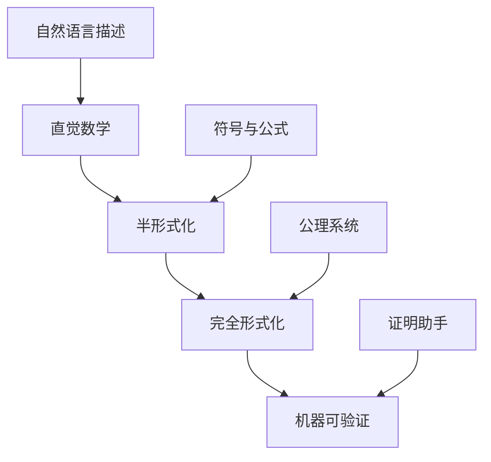
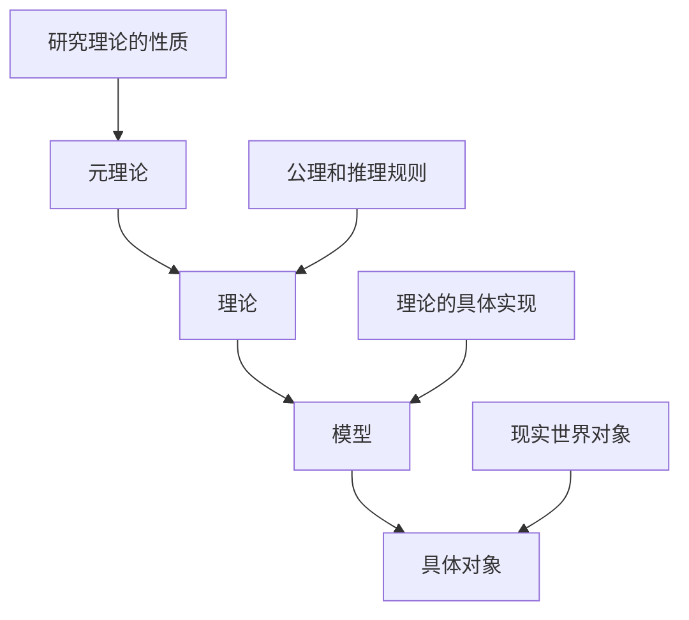

# 01-数学哲学基础

## 目录

- [01-数学哲学基础](#01-数学哲学基础)
  - [目录](#目录)
  - [1. 引言](#1-引言)
  - [2. 数学的本质：发现还是发明？](#2-数学的本质发现还是发明)
  - [3. 形式化与数学严谨性](#3-形式化与数学严谨性)
  - [4. 元结构与数学的层次性](#4-元结构与数学的层次性)
  - [5. 哥德尔不完备性定理的哲学启示](#5-哥德尔不完备性定理的哲学启示)
  - [6. 数学的认知基础](#6-数学的认知基础)
  - [7. 数学与现实的关联](#7-数学与现实的关联)
  - [8. 总结与展望](#8-总结与展望)
  - [9. 参考文献](#9-参考文献)

---

## 1. 引言

数学哲学是研究数学本质、数学知识的基础以及数学与现实世界关系的哲学分支。本文将从哲学的角度审视数学的核心概念，探讨形式化、元结构、数学认知等根本性问题。

### 1.1 数学哲学的核心问题

数学哲学主要关注以下几个核心问题：

1. **本体论问题**：数学对象是否存在？如果存在，它们是什么性质的存在？
2. **认识论问题**：我们如何获得数学知识？数学真理的本质是什么？
3. **方法论问题**：数学证明的本质是什么？形式化在数学中的作用是什么？
4. **应用问题**：为什么数学能够如此有效地描述现实世界？

### 1.2 本文结构

本文将从数学的本质问题出发，逐步深入探讨形式化、元结构、不完备性等核心概念，最终形成对数学哲学的全面理解。

---

## 2. 数学的本质：发现还是发明？

### 2.1 柏拉图主义（Platonism）

**核心观点**：数学对象是独立于人类思维的客观存在。

#### 2.1.1 柏拉图主义的基本主张

- 数学对象（如数、集合、函数）是抽象实体，存在于一个独立的数学世界中
- 数学真理是客观的，不依赖于人类的认知活动
- 数学家通过直觉或理性来"发现"这些数学对象和真理

#### 2.1.2 支持论据

1. **数学的客观性**：不同文化背景的数学家能够独立发现相同的数学真理
2. **数学的必然性**：数学真理具有逻辑必然性，不是偶然的
3. **数学的应用性**：数学能够准确描述现实世界，说明数学对象具有客观性

#### 2.1.3 面临的挑战

1. **认识论问题**：我们如何认识这些抽象对象？
2. **本体论问题**：抽象对象如何与物质世界相互作用？
3. **因果性问题**：抽象对象如何影响我们的思维？

### 2.2 形式主义（Formalism）

**核心观点**：数学是符号游戏，数学对象没有独立的存在。

#### 2.2.1 形式主义的基本主张

- 数学是形式系统的研究，数学对象只是符号
- 数学真理是相对于特定公理系统的
- 数学的有效性来自于形式系统的一致性

#### 2.2.2 支持论据

1. **避免本体论承诺**：不需要假设抽象对象的存在
2. **强调形式化**：与数学的实际实践相符
3. **解释数学的应用**：通过形式系统的解释来说明应用

#### 2.2.3 面临的挑战

1. **哥德尔不完备性定理**：形式系统的不完备性
2. **数学直觉**：无法解释数学家的直觉和洞察
3. **数学的美学**：无法解释数学的美学价值

### 2.3 直觉主义（Intuitionism）

**核心观点**：数学是人类心智的构造，数学对象存在于人类思维中。

#### 2.3.1 直觉主义的基本主张

- 数学对象是人类心智的构造
- 数学真理建立在直觉的基础上
- 排中律不总是成立，需要构造性证明

#### 2.3.2 支持论据

1. **认识论优势**：数学知识基于直觉，容易理解
2. **构造性要求**：强调构造性证明，避免非构造性存在
3. **与认知科学一致**：符合人类认知的实际过程

#### 2.3.3 面临的挑战

1. **数学的客观性**：难以解释数学的客观性
2. **经典数学**：需要放弃许多经典数学结果
3. **数学的应用**：构造性数学在应用中的局限性

### 2.4 结构主义（Structuralism）

**核心观点**：数学研究的是结构，而不是具体的对象。

#### 2.4.1 结构主义的基本主张

- 数学对象是结构中的位置
- 数学研究的是结构之间的关系
- 数学对象由其在一个结构中的位置决定

#### 2.4.2 支持论据

1. **避免本体论问题**：不需要假设具体对象的存在
2. **解释数学的应用**：结构可以应用于不同的具体系统
3. **与数学实践一致**：符合现代数学的抽象化趋势

#### 2.4.3 面临的挑战

1. **结构的本体论**：结构本身的本体论地位
2. **结构的关系**：不同结构之间的关系
3. **数学的必然性**：如何解释数学的必然性

---

## 3. 形式化与数学严谨性

### 3.1 形式化的本质

形式化是将数学概念和推理过程转化为精确的符号语言和规则的过程。

#### 3.1.1 形式化的目标

1. **消除歧义**：通过精确的符号语言避免自然语言的歧义
2. **保证严谨性**：通过严格的推理规则确保证明的正确性
3. **实现机械化**：使数学推理过程可以被计算机验证

#### 3.1.2 形式化的层次

### 3.2 公理系统

#### 3.2.1 公理的基本性质

- **自明性**：公理应该是直观上显然的
- **独立性**：公理之间不应该相互推导
- **一致性**：公理系统不应该产生矛盾
- **完备性**：所有真命题都应该能够从公理推导出来

#### 3.2.2 重要的公理系统

1. **皮亚诺公理**：自然数的公理化
2. **ZFC集合论**：现代数学的基础
3. **欧几里得公理**：几何学的基础

### 3.3 证明系统

#### 3.3.1 证明的基本要求

- **有效性**：每一步推理都必须遵循逻辑规则
- **完整性**：证明必须包含所有必要的步骤
- **可验证性**：证明过程必须能够被他人验证

#### 3.3.2 证明方法

1. **直接证明**：从前提直接推导结论
2. **反证法**：通过否定结论导出矛盾
3. **数学归纳法**：证明关于自然数的命题
4. **构造性证明**：通过构造对象来证明存在性

### 3.4 形式化的局限性

#### 3.4.1 哥德尔不完备性定理

**第一不完备性定理**：任何包含算术的一致形式系统都是不完备的。

**第二不完备性定理**：任何包含算术的一致形式系统都不能证明自身的一致性。

#### 3.4.2 形式化的哲学意义

1. **数学的局限性**：形式化无法完全捕捉数学的所有方面
2. **直觉的重要性**：形式化需要直觉的指导
3. **数学的发展性**：数学是一个不断发展的过程

---

## 4. 元结构与数学的层次性

### 4.1 元结构的概念

元结构是指那些不直接研究数学对象本身，而是以数学理论、方法、语言或模型作为研究对象的更高层次的结构。

#### 4.1.1 元结构的基本特征

- **层次性**：元结构比被研究的对象处于更高的抽象层次
- **反思性**：元结构是对数学活动本身的反思
- **工具性**：元结构为数学研究提供工具和方法

#### 4.1.2 元结构的类型

1. **元数学**：研究数学理论本身的性质
2. **元理论**：研究理论的理论
3. **元模型**：描述模型家族的更高层次结构

### 4.2 元数学

#### 4.2.1 元数学的研究内容

- **一致性**：公理系统是否一致
- **完备性**：公理系统是否完备
- **独立性**：公理是否相互独立
- **可判定性**：是否存在算法判定命题的真假

#### 4.2.2 元数学的重要结果

1. **哥德尔完备性定理**：一阶逻辑是完备的
2. **哥德尔不完备性定理**：算术系统是不完备的
3. **丘奇-图灵论题**：可计算性的界限

### 4.3 元理论与理论

#### 4.3.1 理论的结构

#### 4.3.2 元理论的作用

1. **理论比较**：比较不同理论的能力和性质
2. **理论构建**：指导新理论的构建
3. **理论应用**：指导理论的应用

### 4.4 元模型与模型

#### 4.4.1 模型的概念

模型是理论的具体实现，是使理论为真的结构。

#### 4.4.2 元模型的作用

1. **模型分类**：对模型进行分类和比较
2. **模型构造**：指导新模型的构造
3. **模型应用**：指导模型的应用

---

## 5. 哥德尔不完备性定理的哲学启示

### 5.1 不完备性定理的表述

#### 5.1.1 第一不完备性定理

**定理**：任何包含算术的一致形式系统都是不完备的。

**含义**：存在一个命题，它在系统中既不能被证明，也不能被否证。

#### 5.1.2 第二不完备性定理

**定理**：任何包含算术的一致形式系统都不能证明自身的一致性。

**含义**：系统无法证明自己不会产生矛盾。

### 5.2 哲学意义

#### 5.2.1 对形式主义的挑战

- 形式主义认为数学是符号游戏，但不完备性定理表明形式系统有内在的局限性
- 形式系统无法完全捕捉数学的所有方面

#### 5.2.2 对柏拉图主义的支持

- 不完备性定理表明数学真理超越了任何特定的形式系统
- 支持数学对象具有客观存在的观点

#### 5.2.3 对数学认知的启示

- 数学认知不能完全形式化
- 直觉在数学中具有重要作用
- 数学是一个不断发展的过程

### 5.3 对人工智能的影响

#### 5.3.1 计算的局限性

- 不完备性定理表明某些数学问题无法通过算法解决
- 对人工智能的能力提出了根本性的限制

#### 5.3.2 人类智能的特殊性

- 人类能够理解和处理不完备性
- 人类智能具有超越形式系统的能力

---

## 6. 数学的认知基础

### 6.1 数学认知的层次

#### 6.1.1 感知层次

- **模式识别**：识别数学对象中的模式
- **空间直觉**：对几何关系的直觉理解
- **数量直觉**：对数量关系的基本理解

#### 6.1.2 概念层次

- **抽象化**：从具体对象中抽象出一般概念
- **符号化**：用符号表示数学概念
- **形式化**：建立概念之间的形式关系

#### 6.1.3 元认知层次

- **反思**：对数学思维过程的反思
- **元理论**：对数学理论本身的研究
- **哲学思考**：对数学本质的哲学思考

### 6.2 数学直觉

#### 6.2.1 直觉的类型

1. **几何直觉**：对空间关系的直觉理解
2. **代数直觉**：对代数结构的直觉理解
3. **逻辑直觉**：对逻辑关系的直觉理解

#### 6.2.2 直觉的作用

- **发现**：直觉帮助发现新的数学结果
- **理解**：直觉帮助理解抽象的数学概念
- **验证**：直觉帮助验证数学结果的合理性

### 6.3 数学创造力

#### 6.3.1 创造力的来源

- **类比**：通过类比发现新的数学结构
- **抽象**：通过抽象化创造新的概念
- **综合**：通过综合不同领域创造新的理论

#### 6.3.2 创造力的培养

- **广泛学习**：学习不同领域的数学知识
- **深度思考**：深入思考数学概念的本质
- **实践应用**：通过应用加深理解

---

## 7. 数学与现实的关联

### 7.1 数学的应用性

#### 7.1.1 数学应用的范围

- **自然科学**：物理学、化学、生物学等
- **工程技术**：计算机科学、工程学等
- **社会科学**：经济学、社会学、心理学等

#### 7.1.2 数学应用的有效性

**问题**：为什么数学能够如此有效地描述现实世界？

**可能的解释**：

1. **结构相似性**：数学结构与现实世界的结构相似
2. **抽象化能力**：数学能够抽象出现实世界的本质特征
3. **逻辑必然性**：数学的逻辑必然性反映了自然规律

### 7.2 数学的实在性

#### 7.2.1 实在性的不同观点

1. **强实在论**：数学对象是独立存在的实体
2. **弱实在论**：数学对象具有某种程度的客观性
3. **反实在论**：数学对象是人类思维的构造

#### 7.2.2 实在性的证据

- **数学的客观性**：不同文化背景的数学家能够发现相同的数学真理
- **数学的必然性**：数学真理具有逻辑必然性
- **数学的应用性**：数学能够准确描述现实世界

### 7.3 数学的统一性

#### 7.3.1 统一性的表现

- **概念统一**：不同领域使用相同的数学概念
- **方法统一**：不同问题可以使用相同的数学方法
- **结构统一**：不同理论具有相似的结构

#### 7.3.2 统一性的原因

1. **抽象化**：数学通过抽象化发现共同的结构
2. **形式化**：形式化使得不同领域可以相互联系
3. **元理论**：元理论研究不同理论的共同性质

---

## 8. 总结与展望

### 8.1 主要观点总结

1. **数学的本质**：数学既包含发现的成分，也包含发明的成分
2. **形式化的作用**：形式化是数学严谨性的重要保证，但也有其局限性
3. **元结构的重要性**：元结构为数学研究提供了重要的工具和方法
4. **不完备性的启示**：不完备性定理揭示了数学和认知的根本性质
5. **认知的基础性**：数学认知建立在直觉和形式化的基础上
6. **应用的普遍性**：数学与现实世界有着深刻的关联

### 8.2 未来研究方向

#### 8.2.1 认知科学视角

- 研究数学认知的神经基础
- 探索数学直觉的机制
- 分析数学创造力的来源

#### 8.2.2 人工智能视角

- 研究机器数学推理的能力和局限
- 探索人机协作的数学研究模式
- 分析数学教育中的人工智能应用

#### 8.2.3 跨学科视角

- 数学与哲学的交叉研究
- 数学与认知科学的结合
- 数学与人工智能的融合

### 8.3 哲学意义

数学哲学的研究不仅有助于我们理解数学的本质，也为其他学科提供了重要的启示：

1. **认识论启示**：关于知识获取和验证的普遍问题
2. **本体论启示**：关于存在和实在性的根本问题
3. **方法论启示**：关于科学方法和推理的普遍原则

---

## 9. 参考文献

### 9.1 经典文献

1. Gödel, K. (1931). Über formal unentscheidbare Sätze der Principia Mathematica und verwandter Systeme I. *Monatshefte für Mathematik und Physik*, 38(1), 173-198.

2. Hilbert, D. (1926). Über das Unendliche. *Mathematische Annalen*, 95(1), 161-190.

3. Brouwer, L. E. J. (1913). Intuitionism and formalism. *Bulletin of the American Mathematical Society*, 20(2), 81-96.

4. Frege, G. (1884). *Die Grundlagen der Arithmetik*. Breslau: Wilhelm Koebner.

### 9.2 现代文献

1. Shapiro, S. (2000). *Thinking about mathematics: The philosophy of mathematics*. Oxford University Press.

2. Benacerraf, P., & Putnam, H. (Eds.). (1983). *Philosophy of mathematics: Selected readings*. Cambridge University Press.

3. Maddy, P. (1997). *Naturalism in mathematics*. Oxford University Press.

4. Field, H. (1980). *Science without numbers: A defence of nominalism*. Princeton University Press.

### 9.3 中文文献

1. 王浩. (1987). *哥德尔*. 上海人民出版社.

2. 张景中. (2002). *数学与哲学*. 湖南教育出版社.

3. 胡作玄. (2003). *数学哲学*. 商务印书馆.

### 9.4 在线资源

1. Stanford Encyclopedia of Philosophy: Philosophy of Mathematics
2. Internet Encyclopedia of Philosophy: Mathematical Platonism
3. MathOverflow: Philosophy of Mathematics

---

**最后更新**: 2024-12-19
**版本**: 1.0
**状态**: 初稿完成 