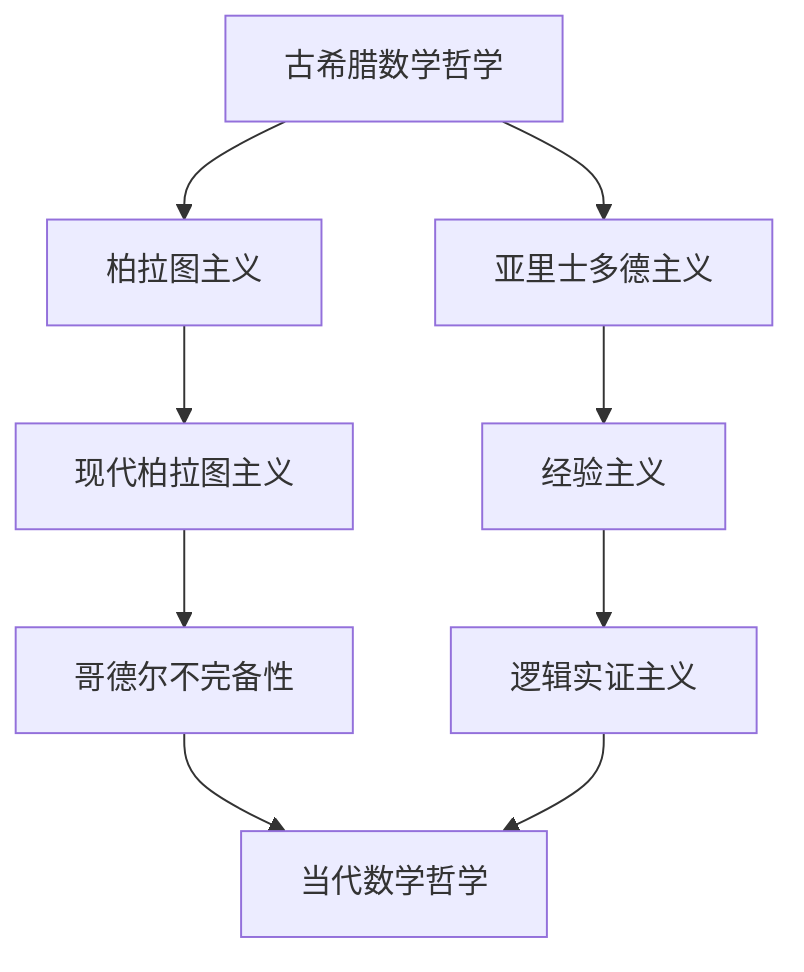
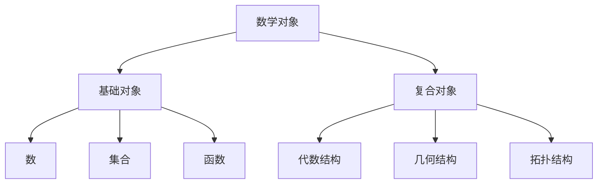

# 01-数学哲学基础

## 目录

1. [数学哲学概述](#1-数学哲学概述)
2. [理念驱动数学思考框架](#2-理念驱动数学思考框架)
3. [数学本质的哲学思考](#3-数学本质的哲学思考)
4. [数学认识论问题](#4-数学认识论问题)
5. [数学方法论批判](#5-数学方法论批判)
6. [数学哲学立场分析](#6-数学哲学立场分析)
7. [数学基础哲学问题](#7-数学基础哲学问题)
8. [数学应用哲学思考](#8-数学应用哲学思考)
9. [相关链接](#9-相关链接)

---

## 1. 数学哲学概述

### 1.1 数学哲学的定义与范围

**定义 1.1** (数学哲学)
数学哲学是研究数学的本质、基础、方法和应用的哲学分支，探讨数学知识的性质、数学真理的本质以及数学与现实世界的关系。

**核心问题：**

1. **本体论问题**：数学对象是否存在？如果存在，它们是什么性质的对象？
2. **认识论问题**：我们如何获得数学知识？数学知识的可靠性如何保证？
3. **方法论问题**：数学研究应该采用什么方法？证明的本质是什么？
4. **应用问题**：数学为什么能够应用于现实世界？

### 1.2 数学哲学的主要流派

#### 1.2.1 柏拉图主义 (Platonism)

**核心观点：**

- 数学对象是独立于人类思维的抽象实体
- 数学真理是客观存在的，人类通过直觉发现它们
- 数学知识是先验的，不依赖于经验

**形式化表述：**

```latex
\forall x \in \mathbb{M} \exists y \in \mathbb{R} (x \text{ 是数学对象} \rightarrow y \text{ 是客观实体})
```

#### 1.2.2 形式主义 (Formalism)

**核心观点：**

- 数学是符号游戏，数学对象没有独立的存在
- 数学真理是形式系统中的定理
- 数学的有效性在于其形式一致性

**形式化表述：**

```latex
\text{数学} = \{ \text{公理} \} \vdash \{ \text{定理} \}
```

#### 1.2.3 直觉主义 (Intuitionism)

**核心观点：**

- 数学是人类心智的构造
- 数学真理必须通过构造性证明建立
- 排中律在无限域中不成立

**形式化表述：**

```latex
P \vee \neg P \text{ 仅在有限域中成立}
```

#### 1.2.4 逻辑主义 (Logicism)

**核心观点：**

- 数学可以还原为逻辑
- 数学概念可以通过逻辑概念定义
- 数学真理是逻辑真理

**形式化表述：**

```latex
\text{数学} \subseteq \text{逻辑}
```

### 1.3 数学哲学的历史发展



---

## 2. 理念驱动数学思考框架

### 2.1 框架概述

**定义 2.1** (理念驱动数学思考框架)
理念驱动数学思考框架是一个基于五个核心理念的系统性数学思考方法，旨在提供统一的数学概念理解和理论构建方法。

**五个核心理念：**

1. **抽象化**：从具体到一般，从特殊到普遍
2. **形式化**：用精确的符号和规则表达思想
3. **公理化**：从基本假设出发，通过逻辑推理构建理论
4. **结构化**：在对象间建立关系网络
5. **映射化**：建立对象间的对应关系

### 2.2 抽象化理念

#### 2.2.1 抽象化层次标准

**抽象化层次框架：**

```text
Level 0: 具体实例层
- 具体数学对象和操作
- 实例：具体的数、图形、函数

Level 1: 概念抽象层
- 从具体实例抽象出的概念
- 实例：数、图形、函数的概念

Level 2: 结构抽象层
- 概念间的结构关系
- 实例：数系、几何空间、函数空间

Level 3: 理论抽象层
- 完整的理论体系
- 实例：代数理论、几何理论、分析理论

Level 4: 元理论层
- 理论的理论
- 实例：元数学、数学哲学
```

#### 2.2.2 抽象化过程模板

**抽象化过程标准模板：**

```text
步骤1：具体实例收集
- 收集相关的具体实例
- 分析实例的共同特征

步骤2：特征提取
- 识别实例的本质特征
- 区分必要特征和偶然特征

步骤3：概念形成
- 基于本质特征形成抽象概念
- 建立概念的定义

步骤4：性质验证
- 验证抽象概念保持原有性质
- 检查抽象化的合理性

步骤5：应用检验
- 检验抽象概念的应用范围
- 验证抽象化的有效性
```

### 2.3 形式化理念

#### 2.3.1 统一符号系统

**基础符号：**

```latex
\text{集合论符号：} \in, \notin, \subseteq, \subset, \cup, \cap, \emptyset, \mathbb{N}, \mathbb{Z}, \mathbb{Q}, \mathbb{R}, \mathbb{C}
```

```latex
\text{逻辑符号：} \neg, \wedge, \vee, \rightarrow, \leftrightarrow, \forall, \exists, \bot, \top
```

```latex
\text{关系符号：} =, \neq, <, >, \leq, \geq, \approx, \equiv
```

#### 2.3.2 定义标准模板

**定义标准模板：**

```latex
\text{定义 [编号] ([概念名称])} \\
\text{设 [前提条件]} \\
\text{称 [对象] 为 [概念名称]，如果 [定义条件]}
```

**示例：**

```latex
\text{定义 2.1 (群)} \\
\text{设 } G \text{ 是一个非空集合，} \cdot \text{ 是 } G \text{ 上的二元运算} \\
\text{称 } (G, \cdot) \text{ 为群，如果满足：} \\
1. \text{结合律：} \forall a,b,c \in G, (a \cdot b) \cdot c = a \cdot (b \cdot c) \\
2. \text{单位元：} \exists e \in G, \forall a \in G, e \cdot a = a \cdot e = a \\
3. \text{逆元：} \forall a \in G, \exists a^{-1} \in G, a \cdot a^{-1} = a^{-1} \cdot a = e
```

### 2.4 公理化理念

#### 2.4.1 公理选择标准

**公理选择原则：**

1. **自明性**：公理应该是直观上显然的
2. **独立性**：公理之间应该相互独立
3. **完备性**：公理系统应该足够强大
4. **一致性**：公理系统不应该导致矛盾
5. **简洁性**：公理系统应该尽可能简洁

#### 2.4.2 公理验证机制

**验证方法：**

1. **独立性验证**：通过构造模型验证公理的独立性
2. **一致性验证**：通过构造模型验证公理系统的一致性
3. **完备性验证**：通过逻辑分析验证公理系统的完备性

### 2.5 结构化理念

#### 2.5.1 结构关系框架

**基本结构关系：**

1. **包含关系**：$A \subseteq B$
2. **等价关系**：$A \sim B$
3. **序关系**：$A \leq B$
4. **映射关系**：$f: A \rightarrow B$
5. **运算关系**：$A \circ B$

#### 2.5.2 层次结构体系



### 2.6 映射化理念

#### 2.6.1 映射关系框架

**映射类型：**

1. **单射**：$f: A \rightarrow B$ 是单射，如果 $f(a_1) = f(a_2) \Rightarrow a_1 = a_2$
2. **满射**：$f: A \rightarrow B$ 是满射，如果 $\forall b \in B, \exists a \in A, f(a) = b$
3. **双射**：$f: A \rightarrow B$ 是双射，如果 $f$ 既是单射又是满射
4. **同构**：$f: A \rightarrow B$ 是同构，如果 $f$ 是双射且保持结构

---

## 3. 数学本质的哲学思考

### 3.1 数学对象的本质

#### 3.1.1 数学对象的存在性问题

**问题 3.1** (数学对象存在性)
数学对象（如数、集合、函数）是否真实存在？如果存在，它们是什么性质的对象？

**不同哲学立场：**

1. **实在论立场**：数学对象是独立于人类思维的客观存在
2. **反实在论立场**：数学对象是人类思维的构造，没有独立存在
3. **工具主义立场**：数学对象是工具，其存在性不重要，重要的是其有效性

#### 3.1.2 数学对象的性质

**数学对象的基本性质：**

1. **抽象性**：数学对象是抽象的，不依赖于具体的物理实现
2. **永恒性**：数学对象是永恒的，不随时间变化
3. **必然性**：数学真理是必然的，不可能为假
4. **普遍性**：数学对象具有普遍性，适用于所有可能的世界

### 3.2 数学真理的本质

#### 3.2.1 数学真理的类型

**数学真理分类：**

1. **分析真理**：通过概念分析得出的真理
2. **综合真理**：通过经验或构造得出的真理
3. **先验真理**：独立于经验的真理
4. **后验真理**：依赖于经验的真理

#### 3.2.2 数学真理的可靠性

**可靠性问题：**

1. **基础问题**：数学真理的基础是什么？
2. **证明问题**：如何证明数学真理？
3. **一致性问题**：数学理论是否一致？
4. **完备性问题**：数学理论是否完备？

---

## 4. 数学认识论问题

### 4.1 数学知识的来源

#### 4.1.1 先验知识论

**核心观点：**
数学知识是先验的，不依赖于经验，通过理性直觉获得。

**论证：**

```latex
\text{前提1：数学真理是必然的} \\
\text{前提2：必然真理不能从经验获得} \\
\text{结论：数学知识是先验的}
```

#### 4.1.2 经验知识论

**核心观点：**
数学知识来源于经验，通过归纳和抽象获得。

**论证：**

```latex
\text{前提1：数学概念来源于具体经验} \\
\text{前提2：数学推理基于经验规律} \\
\text{结论：数学知识是经验的}
```

### 4.2 数学直觉的本质

#### 4.2.1 直觉的类型

**数学直觉分类：**

1. **概念直觉**：对数学概念的直观理解
2. **证明直觉**：对证明过程的直观把握
3. **结构直觉**：对数学结构的直观认识
4. **关系直觉**：对数学关系的直观理解

#### 4.2.2 直觉的可靠性

**直觉可靠性问题：**

1. **个体差异**：不同人的数学直觉可能不同
2. **文化影响**：数学直觉可能受文化背景影响
3. **训练影响**：数学训练可能改变数学直觉
4. **错误直觉**：直觉可能产生错误结论

---

## 5. 数学方法论批判

### 5.1 证明方法的哲学分析

#### 5.1.1 证明的本质

**证明的定义：**
证明是从公理或已知定理出发，通过逻辑推理得出新结论的过程。

**证明的哲学问题：**

1. **证明的有效性**：什么使证明有效？
2. **证明的客观性**：证明是否客观？
3. **证明的创造性**：证明是否具有创造性？
4. **证明的美学性**：证明是否具有美学价值？

#### 5.1.2 不同证明方法的哲学分析

**构造性证明：**

- 优点：提供具体对象，具有建设性
- 缺点：可能过于复杂，难以理解

**存在性证明：**

- 优点：简洁明了，易于理解
- 缺点：不提供具体对象，缺乏建设性

**反证法：**

- 优点：逻辑清晰，易于应用
- 缺点：可能违反直觉主义原则

### 5.2 数学发现的哲学分析

#### 5.2.1 发现的模式

**数学发现的常见模式：**

1. **归纳发现**：从具体例子归纳出一般规律
2. **类比发现**：通过类比发现新的数学结构
3. **直觉发现**：通过直觉发现数学真理
4. **系统发现**：通过系统研究发现新的理论

#### 5.2.2 发现的创造性

**数学发现的创造性特征：**

1. **新颖性**：发现的内容是新的
2. **重要性**：发现的内容是重要的
3. **深刻性**：发现的内容是深刻的
4. **优雅性**：发现的内容是优雅的

---

## 6. 数学哲学立场分析

### 6.1 主要哲学立场比较

#### 6.1.1 柏拉图主义 vs 形式主义

**柏拉图主义：**

- 数学对象是客观存在的抽象实体
- 数学真理是客观的，人类通过直觉发现
- 数学知识是先验的

**形式主义：**

- 数学是符号游戏，数学对象没有独立存在
- 数学真理是形式系统中的定理
- 数学的有效性在于形式一致性

#### 6.1.2 直觉主义 vs 逻辑主义

**直觉主义：**

- 数学是人类心智的构造
- 数学真理必须通过构造性证明建立
- 排中律在无限域中不成立

**逻辑主义：**

- 数学可以还原为逻辑
- 数学概念可以通过逻辑概念定义
- 数学真理是逻辑真理

### 6.2 当代数学哲学的发展

#### 6.2.1 自然主义数学哲学

**核心观点：**
数学哲学应该采用自然科学的方法，数学知识应该通过经验研究获得。

**主要特征：**

1. 强调数学的实践性
2. 重视数学的历史发展
3. 关注数学的社会文化背景

#### 6.2.2 结构主义数学哲学

**核心观点：**
数学对象是结构中的位置，数学研究的是结构而不是具体的对象。

**主要特征：**

1. 强调数学的结构性
2. 重视数学的抽象性
3. 关注数学的普遍性

---

## 7. 数学基础哲学问题

### 7.1 集合论基础

#### 7.1.1 集合的概念

**集合的定义：**
集合是满足某种条件的对象的总体。

**集合的哲学问题：**

1. **集合的存在性**：集合是否真实存在？
2. **集合的构成**：集合如何构成？
3. **集合的无限性**：无限集合是否合理？
4. **集合的悖论**：如何避免集合论悖论？

#### 7.1.2 集合论公理系统

**ZFC公理系统：**

1. **外延公理**：两个集合相等当且仅当它们包含相同的元素
2. **空集公理**：存在一个不包含任何元素的集合
3. **配对公理**：对于任意两个集合，存在包含它们的集合
4. **并集公理**：对于任意集合族，存在包含所有成员的集合
5. **幂集公理**：对于任意集合，存在包含其所有子集的集合
6. **无穷公理**：存在一个无限集合
7. **替换公理**：对于任意函数和集合，函数的值域是集合
8. **正则公理**：每个非空集合都有一个与自身不相交的元素
9. **选择公理**：对于任意非空集合族，存在选择函数

### 7.2 逻辑基础

#### 7.2.1 逻辑的本质

**逻辑的定义：**
逻辑是研究有效推理的学科，关注从前提得出结论的规则。

**逻辑的哲学问题：**

1. **逻辑的普遍性**：逻辑是否普遍有效？
2. **逻辑的必然性**：逻辑真理是否必然？
3. **逻辑的客观性**：逻辑是否客观？
4. **逻辑的规范性**：逻辑是否具有规范性？

#### 7.2.2 经典逻辑 vs 非经典逻辑

**经典逻辑：**

- 二值性：每个命题要么为真要么为假
- 排中律：$P \vee \neg P$ 总是为真
- 矛盾律：$\neg(P \wedge \neg P)$ 总是为真

**非经典逻辑：**

- 多值逻辑：命题可以有多个真值
- 直觉主义逻辑：不承认排中律
- 模态逻辑：引入可能性和必然性概念

---

## 8. 数学应用哲学思考

### 8.1 数学与现实的联系

#### 8.1.1 数学应用的有效性

**问题 8.1** (数学应用有效性)
为什么数学能够如此有效地应用于现实世界？

**可能的解释：**

1. **结构相似性**：现实世界和数学结构具有相似性
2. **人类构造**：数学是人类根据现实世界构造的
3. **选择效应**：我们选择能够应用的数学理论
4. **工具主义**：数学是有效的工具，不需要解释其有效性

#### 8.1.2 数学应用的局限性

**数学应用的局限：**

1. **近似性**：数学模型总是对现实的近似
2. **理想化**：数学模型基于理想化假设
3. **复杂性**：现实世界的复杂性超出数学处理能力
4. **不确定性**：现实世界的不确定性难以数学化

### 8.2 数学在科学中的作用

#### 8.2.1 数学作为科学语言

**数学的语言功能：**

1. **精确表达**：数学提供精确的表达方式
2. **逻辑推理**：数学提供严格的逻辑推理
3. **预测能力**：数学提供预测能力
4. **统一框架**：数学提供统一的框架

#### 8.2.2 数学作为科学工具

**数学的工具功能：**

1. **建模工具**：数学用于建立科学模型
2. **计算工具**：数学用于科学计算
3. **分析工具**：数学用于科学分析
4. **验证工具**：数学用于验证科学理论

---

## 9. 相关链接

### 9.1 内部链接

- [02-元数学理论](./02-元数学理论.md)
- [03-批判性分析](./03-批判性分析.md)
- [02-数学基础与逻辑/01-集合论基础](../02-数学基础与逻辑/01-集合论基础.md)
- [02-数学基础与逻辑/02-数理逻辑基础](../02-数学基础与逻辑/02-数理逻辑基础.md)

### 9.2 外部链接

- [数学哲学 - 斯坦福哲学百科全书](https://plato.stanford.edu/entries/philosophy-mathematics/)
- [数学基础 - 维基百科](https://en.wikipedia.org/wiki/Foundations_of_mathematics)
- [哥德尔不完备性定理](https://en.wikipedia.org/wiki/G%C3%B6del%27s_incompleteness_theorems)

---

**参考文献：**

1. Benacerraf, P., & Putnam, H. (1983). *Philosophy of Mathematics: Selected Readings*. Cambridge University Press.
2. Shapiro, S. (2000). *Thinking About Mathematics: The Philosophy of Mathematics*. Oxford University Press.
3. Maddy, P. (1997). *Naturalism in Mathematics*. Oxford University Press.
4. Hellman, G. (1989). *Mathematics Without Numbers: Towards a Modal-Structural Interpretation*. Oxford University Press.

---

**最后更新**: 2024-12-19
**版本**: 1.0
**状态**: 初稿完成
