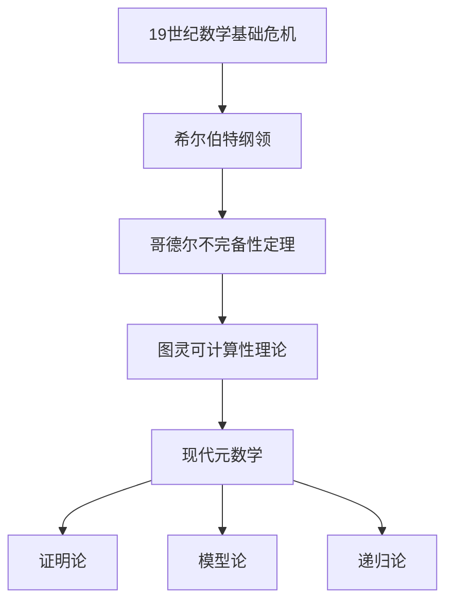

# 02-元数学理论

## 目录

1. [元数学概述](#1-元数学概述)
2. [形式系统理论](#2-形式系统理论)
3. [证明论基础](#3-证明论基础)
4. [模型论基础](#4-模型论基础)
5. [递归论基础](#5-递归论基础)
6. [哥德尔不完备性定理](#6-哥德尔不完备性定理)
7. [计算理论](#7-计算理论)
8. [形式化验证](#8-形式化验证)
9. [相关链接](#9-相关链接)

---

## 1. 元数学概述

### 1.1 元数学的定义与范围

**定义 1.1** (元数学)
元数学是研究数学理论本身的数学分支，关注数学理论的形式性质、结构特征和逻辑关系。

**元数学的研究对象：**

1. **形式系统**：公理系统、推理规则、形式语言
2. **证明理论**：证明的结构、长度、复杂性
3. **模型理论**：理论的解释、模型的性质
4. **递归理论**：可计算性、算法复杂性
5. **集合论**：数学基础、无穷理论

### 1.2 元数学的历史发展



### 1.3 元数学与数学哲学的关系

**关系分析：**

1. **元数学提供工具**：为数学哲学研究提供形式化工具
2. **哲学指导元数学**：哲学观点指导元数学研究方向
3. **相互促进**：元数学发现促进哲学思考，哲学思考指导元数学发展

---

## 2. 形式系统理论

### 2.1 形式语言

#### 2.1.1 形式语言的定义

**定义 2.1** (形式语言)
形式语言是由符号集和形成规则构成的系统，用于表达数学理论。

**形式语言的组成部分：**

1. **符号集**：包括逻辑符号、非逻辑符号、辅助符号
2. **项的形成规则**：定义如何构造项
3. **公式的形成规则**：定义如何构造公式

#### 2.1.2 一阶逻辑语言

**一阶逻辑语言的符号集：**

```latex
\text{逻辑符号：} \\
\text{连接词：} \neg, \wedge, \vee, \rightarrow, \leftrightarrow \\
\text{量词：} \forall, \exists \\
\text{等号：} = \\
\text{辅助符号：} (, ), , \\
\\
\text{非逻辑符号：} \\
\text{个体常项：} c_1, c_2, \ldots \\
\text{函数符号：} f_1, f_2, \ldots \\
\text{谓词符号：} P_1, P_2, \ldots \\
\text{变量：} x, y, z, \ldots
```

**项的形成规则：**

```latex
\text{基础：变量和常项是项} \\
\text{归纳：如果 } t_1, \ldots, t_n \text{ 是项，} f \text{ 是 } n \text{ 元函数符号，则 } f(t_1, \ldots, t_n) \text{ 是项}
```

**公式的形成规则：**

```latex
\text{原子公式：如果 } t_1, \ldots, t_n \text{ 是项，} P \text{ 是 } n \text{ 元谓词符号，则 } P(t_1, \ldots, t_n) \text{ 是公式} \\
\text{复合公式：如果 } \phi, \psi \text{ 是公式，则 } \neg\phi, \phi \wedge \psi, \phi \vee \psi, \phi \rightarrow \psi, \phi \leftrightarrow \psi \text{ 是公式} \\
\text{量化公式：如果 } \phi \text{ 是公式，} x \text{ 是变量，则 } \forall x \phi, \exists x \phi \text{ 是公式}
```

### 2.2 公理系统

#### 2.2.1 公理系统的定义

**定义 2.2** (公理系统)
公理系统是由一组公理和推理规则构成的形式系统。

**公理系统的组成部分：**

1. **公理**：作为推理起点的公式
2. **推理规则**：从已知公式推导新公式的规则
3. **定理**：通过推理规则从公理推导出的公式

#### 2.2.2 一阶逻辑公理系统

**逻辑公理：**

```latex
\text{命题公理：} \\
1. \phi \rightarrow (\psi \rightarrow \phi) \\
2. (\phi \rightarrow (\psi \rightarrow \chi)) \rightarrow ((\phi \rightarrow \psi) \rightarrow (\phi \rightarrow \chi)) \\
3. (\neg\phi \rightarrow \neg\psi) \rightarrow (\psi \rightarrow \phi) \\
\\
\text{量词公理：} \\
4. \forall x \phi(x) \rightarrow \phi(t) \text{ （其中 } t \text{ 对 } x \text{ 在 } \phi \text{ 中自由）} \\
5. \phi \rightarrow \forall x \phi \text{ （其中 } x \text{ 不在 } \phi \text{ 中自由出现）}
```

**推理规则：**

```latex
\text{分离规则：} \frac{\phi \quad \phi \rightarrow \psi}{\psi} \\
\text{概括规则：} \frac{\phi}{\forall x \phi} \text{ （其中 } x \text{ 不在 } \phi \text{ 中自由出现）}
```

### 2.3 形式系统的性质

#### 2.3.1 一致性

**定义 2.3** (一致性)
形式系统是一致的，如果不存在公式 $\phi$ 使得 $\phi$ 和 $\neg\phi$ 都是定理。

**一致性的重要性：**

- 保证理论不会产生矛盾
- 是理论可靠性的基本要求
- 是数学推理的基础

#### 2.3.2 完备性

**定义 2.4** (完备性)
形式系统是完备的，如果对于任意公式 $\phi$，要么 $\phi$ 是定理，要么 $\neg\phi$ 是定理。

**哥德尔第一不完备性定理：**
任何足够强的形式系统，如果是一致的，则是不完备的。

#### 2.3.3 独立性

**定义 2.5** (独立性)
公理 $\phi$ 在公理系统中是独立的，如果 $\phi$ 不能从其他公理推导出来。

**独立性的验证方法：**
通过构造模型验证公理的独立性。

---

## 3. 证明论基础

### 3.1 证明的概念

#### 3.1.1 形式证明

**定义 3.1** (形式证明)
形式证明是从公理出发，通过推理规则逐步推导出定理的有限序列。

**证明的结构：**

```latex
\text{证明序列：} \phi_1, \phi_2, \ldots, \phi_n \\
\text{其中每个 } \phi_i \text{ 要么是公理，要么是通过推理规则从前面的公式推导得出}
```

#### 3.1.2 证明的性质

**证明的基本性质：**

1. **有限性**：证明是有限长度的序列
2. **有效性**：每个步骤都符合推理规则
3. **目标性**：证明有明确的目标公式
4. **可验证性**：证明可以被机械地验证

### 3.2 证明系统

#### 3.2.1 自然演绎系统

**自然演绎系统的特点：**

1. **引入规则**：引入逻辑连接词的规则
2. **消除规则**：消除逻辑连接词的规则
3. **假设规则**：允许引入临时假设
4. **消解规则**：消解临时假设

**示例：合取引入规则**

```latex
\frac{\phi \quad \psi}{\phi \wedge \psi} \wedge I
```

**示例：合取消除规则**

```latex
\frac{\phi \wedge \psi}{\phi} \wedge E_1 \quad \frac{\phi \wedge \psi}{\psi} \wedge E_2
```

#### 3.2.2 希尔伯特系统

**希尔伯特系统的特点：**

1. **公理模式**：使用公理模式而不是具体公理
2. **分离规则**：唯一的推理规则是分离规则
3. **形式化程度高**：完全形式化的证明系统

### 3.3 证明复杂性

#### 3.3.1 证明长度

**定义 3.2** (证明长度)
证明的长度是证明序列中公式的个数。

**证明长度的意义：**

- 反映证明的复杂性
- 影响证明的可读性
- 与计算复杂性相关

#### 3.3.2 证明深度

**定义 3.3** (证明深度)
证明的深度是证明树的最大高度。

**证明深度的意义：**

- 反映证明的嵌套程度
- 影响证明的结构复杂性
- 与逻辑复杂性相关

---

## 4. 模型论基础

### 4.1 模型的概念

#### 4.1.1 模型的定义

**定义 4.1** (模型)
模型是形式语言的一个解释，为语言中的符号提供具体的含义。

**模型的组成部分：**

1. **论域**：模型的对象集合
2. **解释函数**：将符号映射到论域中的对象
3. **满足关系**：定义公式在模型中的真值

#### 4.1.2 一阶逻辑模型

**一阶逻辑模型的定义：**

```latex
\text{模型 } \mathcal{M} = (M, I) \text{ 其中：} \\
M \text{ 是非空集合（论域）} \\
I \text{ 是解释函数，满足：} \\
- I(c) \in M \text{ 对于常项 } c \\
- I(f): M^n \rightarrow M \text{ 对于 } n \text{ 元函数符号 } f \\
- I(P) \subseteq M^n \text{ 对于 } n \text{ 元谓词符号 } P
```

### 4.2 满足关系

#### 4.2.1 满足关系的定义

**定义 4.2** (满足关系)
满足关系 $\models$ 定义公式在模型中的真值。

**满足关系的递归定义：**

```latex
\text{原子公式：} \\
\mathcal{M} \models P(t_1, \ldots, t_n) \text{ 当且仅当 } (I(t_1), \ldots, I(t_n)) \in I(P) \\
\\
\text{复合公式：} \\
\mathcal{M} \models \neg\phi \text{ 当且仅当 } \mathcal{M} \not\models \phi \\
\mathcal{M} \models \phi \wedge \psi \text{ 当且仅当 } \mathcal{M} \models \phi \text{ 且 } \mathcal{M} \models \psi \\
\mathcal{M} \models \phi \vee \psi \text{ 当且仅当 } \mathcal{M} \models \phi \text{ 或 } \mathcal{M} \models \psi \\
\mathcal{M} \models \phi \rightarrow \psi \text{ 当且仅当 } \mathcal{M} \not\models \phi \text{ 或 } \mathcal{M} \models \psi \\
\\
\text{量化公式：} \\
\mathcal{M} \models \forall x \phi(x) \text{ 当且仅当对于所有 } a \in M, \mathcal{M} \models \phi(a) \\
\mathcal{M} \models \exists x \phi(x) \text{ 当且仅当存在 } a \in M, \mathcal{M} \models \phi(a)
```

#### 4.2.2 模型的性质

**模型的基本性质：**

1. **同构**：两个模型同构，如果存在保持结构的双射
2. **初等等价**：两个模型初等等价，如果满足相同的句子
3. **饱和**：模型是饱和的，如果满足某些饱和性条件

### 4.3 紧致性定理

#### 4.3.1 紧致性定理的陈述

**定理 4.1** (紧致性定理)
如果公式集 $\Sigma$ 的每个有限子集都有模型，则 $\Sigma$ 本身有模型。

**紧致性定理的等价形式：**
如果公式集 $\Sigma$ 没有模型，则存在 $\Sigma$ 的有限子集没有模型。

#### 4.3.2 紧致性定理的应用

**应用1：非标准分析**
通过紧致性定理构造非标准实数模型。

**应用2：模型的存在性**
证明某些理论存在无限模型。

**应用3：理论的一致性**
通过模型的存在性证明理论的一致性。

---

## 5. 递归论基础

### 5.1 可计算性理论

#### 5.1.1 可计算函数

**定义 5.1** (可计算函数)
函数 $f: \mathbb{N}^n \rightarrow \mathbb{N}$ 是可计算的，如果存在算法计算 $f$ 的值。

**可计算函数的基本性质：**

1. **部分函数**：可计算函数可能是部分函数
2. **算法性**：存在机械的算法计算函数值
3. **有限性**：计算过程在有限步内完成

#### 5.1.2 图灵机

**图灵机的定义：**
图灵机是一个抽象的计算模型，由有限状态控制器、无限长的纸带和读写头组成。

**图灵机的组成部分：**

1. **状态集**：有限的状态集合
2. **字母表**：纸带上的符号集合
3. **转移函数**：定义状态转移和读写操作
4. **初始状态**：计算的起始状态
5. **接受状态**：计算成功的状态

**图灵机计算示例：**

```rust
// 图灵机的Rust实现示例
struct TuringMachine {
    tape: Vec<char>,
    head_position: usize,
    current_state: String,
    transition_function: HashMap<(String, char), (String, char, Move)>,
    accept_states: HashSet<String>,
}

enum Move {
    Left,
    Right,
    Stay,
}

impl TuringMachine {
    fn step(&mut self) -> bool {
        let current_symbol = self.tape[self.head_position];
        let key = (self.current_state.clone(), current_symbol);
        
        if let Some((new_state, new_symbol, movement)) = self.transition_function.get(&key) {
            self.tape[self.head_position] = *new_symbol;
            self.current_state = new_state.clone();
            
            match movement {
                Move::Left => self.head_position = self.head_position.saturating_sub(1),
                Move::Right => {
                    if self.head_position == self.tape.len() - 1 {
                        self.tape.push('_');
                    }
                    self.head_position += 1;
                }
                Move::Stay => {}
            }
            true
        } else {
            false
        }
    }
}
```

### 5.2 递归函数

#### 5.2.1 原始递归函数

**原始递归函数的定义：**
原始递归函数是通过基本函数和原始递归算子构造的函数类。

**基本函数：**

1. **零函数**：$Z(x) = 0$
2. **后继函数**：$S(x) = x + 1$
3. **投影函数**：$P_i^n(x_1, \ldots, x_n) = x_i$

**原始递归算子：**
如果 $g$ 和 $h$ 是原始递归函数，则通过原始递归定义的函数 $f$ 也是原始递归函数：

```latex
f(0, x_2, \ldots, x_n) = g(x_2, \ldots, x_n) \\
f(x_1 + 1, x_2, \ldots, x_n) = h(x_1, f(x_1, x_2, \ldots, x_n), x_2, \ldots, x_n)
```

#### 5.2.2 一般递归函数

**一般递归函数的定义：**
一般递归函数是通过基本函数、原始递归算子和 $\mu$ 算子构造的函数类。

**$\mu$ 算子：**
如果 $g$ 是一般递归函数，则通过 $\mu$ 算子定义的函数 $f$ 也是一般递归函数：

```latex
f(x_1, \ldots, x_n) = \mu y[g(x_1, \ldots, x_n, y) = 0]
```

### 5.3 可判定性理论

#### 5.3.1 可判定问题

**定义 5.2** (可判定问题)
问题 $P$ 是可判定的，如果存在算法对于任意输入都能在有限步内给出"是"或"否"的答案。

**可判定问题的例子：**

1. **停机问题**：给定图灵机和输入，判断图灵机是否停机
2. **可满足性问题**：给定布尔公式，判断是否可满足
3. **素数判定问题**：给定自然数，判断是否为素数

#### 5.3.2 不可判定问题

**停机问题的不可判定性：**
停机问题是不可判定的，即不存在算法能够判定任意图灵机在给定输入下是否停机。

**证明思路：**
通过对角线方法构造矛盾，假设存在停机判定算法，然后构造一个特殊的图灵机导致矛盾。

---

## 6. 哥德尔不完备性定理

### 6.1 第一不完备性定理

#### 6.1.1 定理的陈述

**定理 6.1** (哥德尔第一不完备性定理)
任何足够强的形式系统，如果是一致的，则是不完备的。即存在一个句子 $\phi$，使得 $\phi$ 和 $\neg\phi$ 都不是定理。

**定理的条件：**

1. **足够强**：系统能够表达基本的算术
2. **一致性**：系统不会产生矛盾
3. **递归可公理化**：公理集是递归可枚举的

#### 6.1.2 定理的证明思路

**证明的关键步骤：**

1. **编码**：将公式和证明编码为自然数
2. **自指**：构造自指的句子
3. **对角线**：使用对角线方法构造矛盾

**哥德尔句子的构造：**

```latex
G = \text{"这个句子在系统中不可证明"}
```

### 6.2 第二不完备性定理

#### 6.2.1 定理的陈述

**定理 6.2** (哥德尔第二不完备性定理)
任何足够强的一致形式系统，不能证明自身的一致性。

**定理的含义：**
如果形式系统是一致的，那么它不能证明自己的一致性。这意味着数学系统的基础存在根本性的限制。

#### 6.2.2 定理的哲学意义

**哲学意义：**

1. **数学基础的局限性**：数学系统存在根本性的局限性
2. **形式化的限制**：完全形式化是不可能的
3. **直觉的重要性**：数学直觉在数学发展中起重要作用
4. **真理与可证明性**：数学真理与可证明性是不同的概念

### 6.3 不完备性定理的影响

#### 6.3.1 对数学基础的影响

**影响分析：**

1. **希尔伯特纲领的失败**：证明了完全形式化数学的不可能性
2. **数学哲学的转向**：促使数学哲学从形式主义转向其他立场
3. **数学实践的改变**：影响数学研究的方法和方向

#### 6.3.2 对计算机科学的影响

**影响分析：**

1. **算法理论**：影响可计算性理论的发展
2. **人工智能**：影响AI的理论基础
3. **程序验证**：影响形式化验证方法

---

## 7. 计算理论

### 7.1 计算复杂性理论

#### 7.1.1 时间复杂性

**定义 7.1** (时间复杂性)
算法的时间复杂性是算法执行所需的时间与输入大小的关系。

**常见的时间复杂性类：**

1. **P类**：多项式时间可解的问题
2. **NP类**：非确定性多项式时间可验证的问题
3. **EXP类**：指数时间可解的问题

**时间复杂性的表示：**

```latex
O(f(n)) \text{ 表示上界} \\
\Omega(f(n)) \text{ 表示下界} \\
\Theta(f(n)) \text{ 表示紧界}
```

#### 7.1.2 空间复杂性

**定义 7.2** (空间复杂性)
算法的空间复杂性是算法执行所需的存储空间与输入大小的关系。

**空间复杂性的重要性：**

- 反映算法的存储需求
- 影响算法的实际可行性
- 与时间复杂性相关但不相同

### 7.2 可计算性理论

#### 7.2.1 丘奇-图灵论题

**丘奇-图灵论题：**
任何可计算的函数都可以被图灵机计算。

**论题的意义：**

- 为可计算性提供了形式化定义
- 是计算理论的基础
- 至今未被证明，但被广泛接受

#### 7.2.2 计算模型

**不同的计算模型：**

1. **图灵机**：标准计算模型
2. **λ演算**：函数式计算模型
3. **递归函数**：数学函数计算模型
4. **量子计算**：基于量子力学的计算模型

**λ演算示例：**

```haskell
-- λ演算的Haskell实现示例
-- 基本λ项
data LambdaTerm = 
    Var String           -- 变量
  | App LambdaTerm LambdaTerm  -- 应用
  | Lam String LambdaTerm      -- 抽象

-- β归约
betaReduce :: LambdaTerm -> LambdaTerm
betaReduce (App (Lam x body) arg) = substitute x arg body
betaReduce (App t1 t2) = App (betaReduce t1) (betaReduce t2)
betaReduce (Lam x body) = Lam x (betaReduce body)
betaReduce (Var x) = Var x

-- 替换操作
substitute :: String -> LambdaTerm -> LambdaTerm -> LambdaTerm
substitute x new (Var y) 
  | x == y = new
  | otherwise = Var y
substitute x new (App t1 t2) = 
  App (substitute x new t1) (substitute x new t2)
substitute x new (Lam y body)
  | x == y = Lam y body
  | otherwise = Lam y (substitute x new body)
```

---

## 8. 形式化验证

### 8.1 形式化验证的概念

#### 8.1.1 验证的定义

**定义 8.1** (形式化验证)
形式化验证是使用数学方法证明系统满足其规范的过程。

**验证的类型：**

1. **模型检查**：通过穷举搜索验证有限状态系统
2. **定理证明**：通过逻辑推理证明系统性质
3. **抽象解释**：通过抽象分析系统性质

#### 8.1.2 验证的重要性

**验证的意义：**

1. **可靠性保证**：确保系统满足安全要求
2. **错误预防**：在系统部署前发现错误
3. **质量保证**：提高系统的质量和可信度
4. **成本降低**：减少后期维护和修复成本

### 8.2 形式化验证方法

#### 8.2.1 模型检查

**模型检查的原理：**
通过穷举搜索系统的所有可能状态，验证系统是否满足给定的性质。

**模型检查的优缺点：**

**优点：**

- 自动化程度高
- 能够发现反例
- 适用于有限状态系统

**缺点：**

- 状态空间爆炸问题
- 不适用于无限状态系统
- 计算复杂度高

#### 8.2.2 定理证明

**定理证明的原理：**
通过逻辑推理证明系统满足给定的性质。

**定理证明的优缺点：**

**优点：**

- 适用于无限状态系统
- 能够处理复杂的数学性质
- 证明结果可靠

**缺点：**

- 需要人工指导
- 证明过程复杂
- 自动化程度低

### 8.3 形式化验证工具

#### 8.3.1 模型检查工具

**常用模型检查工具：**

1. **SPIN**：用于并发系统验证
2. **NuSMV**：符号模型检查器
3. **PRISM**：概率模型检查器

#### 8.3.2 定理证明工具

**常用定理证明工具：**

1. **Coq**：基于构造演算的证明助手
2. **Isabelle**：通用证明助手
3. **HOL**：高阶逻辑证明系统

**Coq示例：**

```coq
(* Coq中的形式化证明示例 *)
Theorem plus_O_n : forall n : nat, 0 + n = n.
Proof.
  intros n.
  simpl.
  reflexivity.
Qed.

(* 归纳证明示例 *)
Theorem plus_n_O : forall n : nat, n + 0 = n.
Proof.
  intros n.
  induction n as [| n' IHn'].
  - (* n = 0 *)
    simpl.
    reflexivity.
  - (* n = S n' *)
    simpl.
    rewrite IHn'.
    reflexivity.
Qed.
```

---

## 9. 相关链接

### 9.1 内部链接

- [01-数学哲学基础](./01-数学哲学基础.md)
- [03-批判性分析](./03-批判性分析.md)
- [02-数学基础与逻辑/02-数理逻辑基础](../02-数学基础与逻辑/02-数理逻辑基础.md)
- [02-数学基础与逻辑/03-模型论基础](../02-数学基础与逻辑/03-模型论基础.md)
- [02-数学基础与逻辑/04-递归论基础](../02-数学基础与逻辑/04-递归论基础.md)
- [02-数学基础与逻辑/05-证明论基础](../02-数学基础与逻辑/05-证明论基础.md)

### 9.2 外部链接

- [元数学 - 维基百科](https://en.wikipedia.org/wiki/Metamathematics)
- [哥德尔不完备性定理](https://en.wikipedia.org/wiki/G%C3%B6del%27s_incompleteness_theorems)
- [图灵机](https://en.wikipedia.org/wiki/Turing_machine)
- [λ演算](https://en.wikipedia.org/wiki/Lambda_calculus)

---

**参考文献：**

1. Shoenfield, J. R. (1967). *Mathematical Logic*. Addison-Wesley.
2. Enderton, H. B. (2001). *A Mathematical Introduction to Logic*. Academic Press.
3. Boolos, G. S., Burgess, J. P., & Jeffrey, R. C. (2007). *Computability and Logic*. Cambridge University Press.
4. Smullyan, R. M. (1992). *Gödel's Incompleteness Theorems*. Oxford University Press.
5. Davis, M. (1958). *Computability and Unsolvability*. McGraw-Hill.
