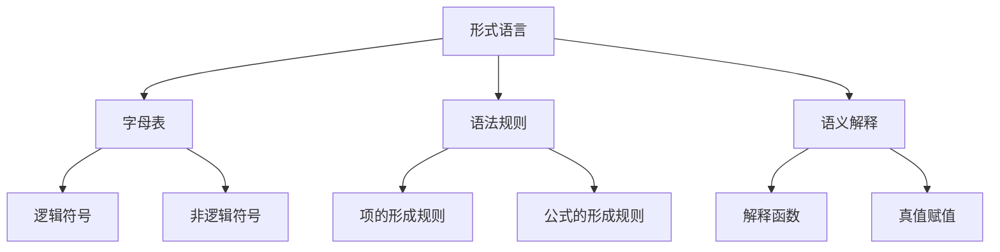
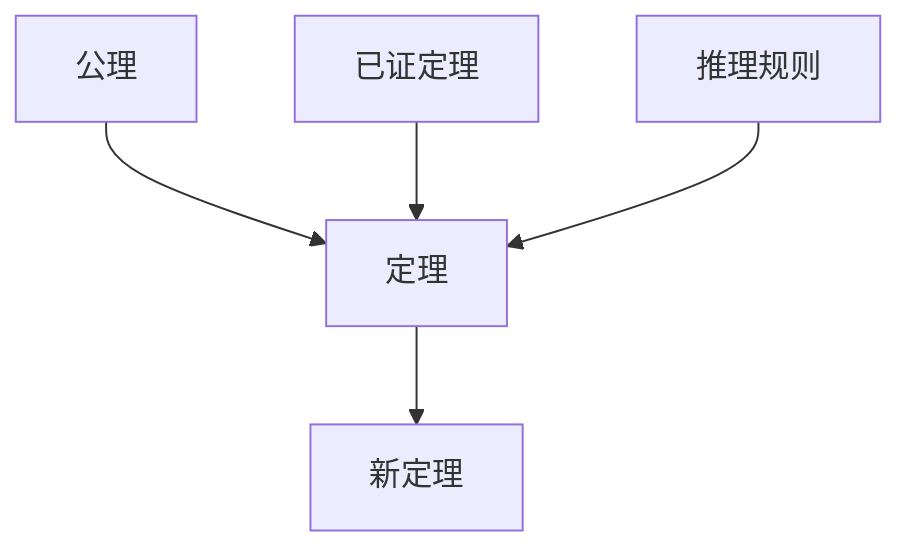
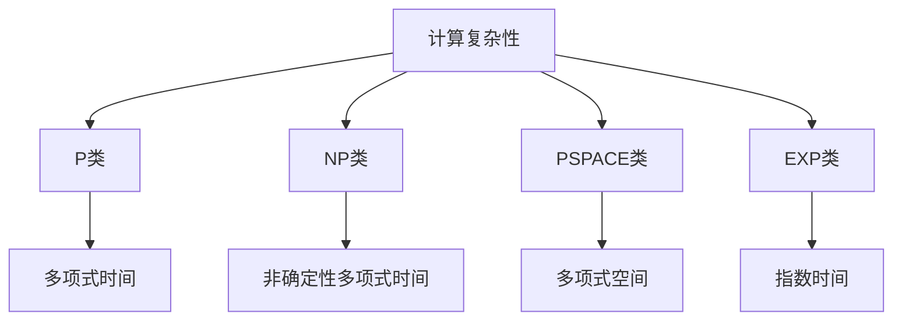

# 元数学基础理论

## 目录

- [元数学基础理论](#元数学基础理论)
  - [目录](#目录)
  - [1. 元数学概述](#1-元数学概述)
    - [1.1 元数学的定义与范围](#11-元数学的定义与范围)
    - [1.2 元数学与数学的关系](#12-元数学与数学的关系)
    - [1.3 元数学的历史发展](#13-元数学的历史发展)
  - [2. 形式系统理论](#2-形式系统理论)
    - [2.1 形式语言](#21-形式语言)
    - [2.2 公理系统](#22-公理系统)
    - [2.3 推理规则](#23-推理规则)
    - [2.4 形式系统的基本性质](#24-形式系统的基本性质)
  - [3. 证明论](#3-证明论)
    - [3.1 形式化证明](#31-形式化证明)
    - [3.2 证明的结构](#32-证明的结构)
    - [3.3 证明的方法](#33-证明的方法)
    - [3.4 证明论的基本定理](#34-证明论的基本定理)
  - [4. 模型论](#4-模型论)
    - [4.1 模型的概念](#41-模型的概念)
    - [4.2 模型论的基本定理](#42-模型论的基本定理)
    - [4.3 模型构造方法](#43-模型构造方法)
    - [4.4 模型论的应用](#44-模型论的应用)
  - [5. 递归论](#5-递归论)
    - [5.1 可计算性](#51-可计算性)
    - [5.2 不可判定性](#52-不可判定性)
    - [5.3 计算复杂性](#53-计算复杂性)
    - [5.4 递归论的应用](#54-递归论的应用)
  - [6. 元数学的哲学意义](#6-元数学的哲学意义)
    - [6.1 形式化的意义与局限](#61-形式化的意义与局限)
    - [6.2 不完备性定理的哲学意义](#62-不完备性定理的哲学意义)
    - [6.3 元数学与数学哲学](#63-元数学与数学哲学)
  - [总结](#总结)

---

## 1. 元数学概述

### 1.1 元数学的定义与范围

**定义**：元数学是研究数学理论本身的形式属性的数学分支。

**研究范围**：

1. **形式系统**：数学理论的形式化表示
2. **证明论**：数学证明的结构和性质
3. **模型论**：数学理论的语义解释
4. **递归论**：数学理论的可计算性

**形式化表达**：
$$\text{元数学} = \{\text{形式系统}, \text{证明论}, \text{模型论}, \text{递归论}\}$$

### 1.2 元数学与数学的关系

**层次关系**：

**数学层面**：研究具体的数学对象和关系

- 数、函数、集合、空间等
- 具体的定理和证明
- 数学应用和计算

**元数学层面**：研究数学理论的形式属性

- 形式语言和语法
- 证明的结构和性质
- 理论的一致性和完备性

**相互作用**：

**数学对元数学的影响**：

- 数学实践推动元数学研究
- 具体问题启发元数学理论
- 数学直觉指导元数学方向

**元数学对数学的影响**：

- 为数学提供严格基础
- 指导数学研究方法
- 发现数学的局限性

### 1.3 元数学的历史发展

**历史阶段**：

1. **早期元数学**：希尔伯特的形式化纲领
2. **哥德尔时期**：不完备性定理的发现
3. **现代元数学**：证明论、模型论、递归论的发展
4. **当代元数学**：计算机辅助证明、形式化验证

---

## 2. 形式系统理论

### 2.1 形式语言

**字母表**：$\Sigma = \{a_1, a_2, \ldots, a_n\}$

**合式公式**：
递归定义：

1. 原子公式是合式公式
2. 如果 $\phi$ 和 $\psi$ 是合式公式，则 $\neg\phi$, $\phi \land \psi$, $\phi \lor \psi$, $\phi \rightarrow \psi$ 是合式公式
3. 如果 $\phi$ 是合式公式，$x$ 是变量，则 $\forall x \phi$, $\exists x \phi$ 是合式公式

**形式语言的结构**：

### 2.2 公理系统

**公理**：不证自明的基本命题集合 $A = \{A_1, A_2, \ldots, A_n\}$

**公理系统的要求**：

1. **一致性**：不能推导出矛盾
2. **独立性**：公理间相互独立
3. **完备性**：所有真命题都可证

**形式化表述**：
$$\text{Axiom System} = \{\text{Axiom}_1, \text{Axiom}_2, \ldots, \text{Axiom}_n\}$$

**公理类型**：

1. **逻辑公理**：逻辑推理的基本规则
2. **非逻辑公理**：特定理论的基本假设

### 2.3 推理规则

**推理规则**是从已知命题推导新命题的规则。

**基本推理规则**：

1. **分离规则（Modus Ponens）**：
   $$\frac{\phi \rightarrow \psi \quad \phi}{\psi}$$

2. **全称概括**：
   $$\frac{\phi(x)}{\forall x \phi(x)}$$

3. **存在引入**：
   $$\frac{\phi(t)}{\exists x \phi(x)}$$

**推理规则的性质**：

- **可靠性**：从真前提只能推导出真结论
- **完备性**：所有逻辑真理都可以推导出来

### 2.4 形式系统的基本性质

**形式系统**是一个三元组：
$$S = (\mathcal{L}, \mathcal{A}, \mathcal{R})$$

其中：

- $\mathcal{L}$ 是形式语言
- $\mathcal{A}$ 是公理集
- $\mathcal{R}$ 是推理规则集

**基本性质**：

1. **语法性质**：符号、公式、证明
2. **语义性质**：解释、模型、真值
3. **元性质**：一致性、完备性、可判定性

---

## 3. 证明论

### 3.1 形式化证明

**形式化证明**是在形式系统中从公理到定理的有限步骤序列。

**证明的定义**：
$$\text{Proof} = \langle \phi_1, \phi_2, \ldots, \phi_n \rangle$$

其中每个 $\phi_i$ 要么是公理，要么是通过推理规则从前面的公式推导出来的。

**证明的性质**：

- **有限性**：证明是有限长度的序列
- **可验证性**：每一步都可以机械地验证
- **确定性**：证明过程是确定的

### 3.2 证明的结构

**证明的结构分析**：

1. **线性结构**：证明的步骤序列
2. **树状结构**：证明的依赖关系
3. **图状结构**：证明的复杂关系

**证明的规范化**：

- **自然演绎**：使用引入和消除规则
- **希尔伯特系统**：使用公理和分离规则
- **序列演算**：使用左右规则

**证明结构图**：

### 3.3 证明的方法

**基本证明方法**：

1. **直接证明**：
   - 从前提直接推导结论
   - 使用推理规则链式推导

2. **间接证明**：
   - 假设结论的否定
   - 推导出矛盾
   - 证明原结论

3. **构造性证明**：
   - 提供构造方法
   - 证明存在性

4. **归纳证明**：
   - 基础情况
   - 归纳步骤
   - 归纳结论

### 3.4 证明论的基本定理

**切消定理（Cut Elimination）**：

**定理**：在相继式演算中，任何证明都可以转换为不使用切消规则的证明。

**意义**：

- 简化证明结构
- 提供证明的范式
- 支持证明搜索算法

**正规化定理（Normalization）**：

**定理**：在自然演绎中，任何证明都可以正规化为范式。

**意义**：

- 消除证明中的冗余
- 提供最优证明
- 支持证明简化

---

## 4. 模型论

### 4.1 模型的概念

**结构**：$\mathcal{M} = (M, R_1, R_2, \ldots, f_1, f_2, \ldots, c_1, c_2, \ldots)$

**满足关系**：
$$\mathcal{M} \models \phi \iff \text{在结构 } \mathcal{M} \text{ 中 } \phi \text{ 为真}$$

**模型的定义**：
$$\text{Model}(T) = \{\mathcal{M} \mid \mathcal{M} \models T\}$$

**模型的基本性质**：

1. **同构**：两个模型结构相同
2. **初等等价**：两个模型满足相同的句子
3. **嵌入**：一个模型嵌入另一个模型

### 4.2 模型论的基本定理

**紧致性定理**：

**定理**：如果 $\Sigma$ 的每个有限子集都有模型，则 $\Sigma$ 本身有模型。

**形式化表达**：
$$\forall \Sigma' \subseteq_{\text{fin}} \Sigma, \exists \mathcal{M}, \mathcal{M} \models \Sigma' \Rightarrow \exists \mathcal{M}, \mathcal{M} \models \Sigma$$

**应用**：

- 证明理论的一致性
- 构造非标准模型
- 建立模型的存在性

**Löwenheim-Skolem定理**：

**定理**：如果可数语言的理论有无限模型，则它有任意基数的模型。

**形式化表达**：
$$\text{If } T \text{ has an infinite model, then } \forall \kappa \geq \aleph_0, T \text{ has a model of cardinality } \kappa$$

**意义**：

- 模型的大小不受语言限制
- 支持模型构造
- 建立模型论基础

### 4.3 模型构造方法

**超积构造**：

**定义**：给定一族模型 $\{\mathcal{M}_i\}_{i \in I}$ 和超滤子 $U$，超积为：
$$\prod_U \mathcal{M}_i$$

**性质**：

- 保持一阶逻辑性质
- 构造非标准模型
- 支持模型论证明

**强制法（Forcing）**：

**定义**：通过部分序构造新模型的方法。

**应用**：

- 独立性证明
- 相对一致性
- 模型扩展

### 4.4 模型论的应用

**在数学中的应用**：

1. **代数**：域论、群论、环论
2. **分析**：实数理论、复数理论
3. **几何**：欧几里得几何、非欧几何

**在逻辑中的应用**：

1. **完备性证明**
2. **独立性证明**
3. **模型构造**

---

## 5. 递归论

### 5.1 可计算性

**递归函数**：
$$\text{Recursive}(f) \iff \text{存在算法计算 } f$$

**递归可枚举集**：
$$A \text{ is r.e.} \iff A = \text{range of some recursive function}$$

**图灵机**：

**定义**：图灵机是一个七元组：
$$M = (Q, \Sigma, \Gamma, \delta, q_0, B, F)$$

其中：

- $Q$ 是状态集
- $\Sigma$ 是输入字母表
- $\Gamma$ 是带字母表
- $\delta$ 是转移函数
- $q_0$ 是初始状态
- $B$ 是空白符号
- $F$ 是接受状态集

**丘奇-图灵论题**：

**论题**：任何可计算的函数都可以由图灵机计算。

**意义**：

- 建立可计算性的标准
- 统一计算模型
- 支持计算理论

### 5.2 不可判定性

**停机问题**：

**问题**：给定图灵机 $M$ 和输入 $w$，判断 $M$ 在输入 $w$ 上是否停机。

**定理**：停机问题是不可判定的。

**证明**：通过对角线方法构造矛盾。

**形式化表达**：
$$\text{HALT} = \{\langle M, w \rangle \mid M \text{ halts on } w\}$$
$$\text{HALT} \notin \text{RE}$$

**递归可枚举但不可判定**：

**定理**：存在递归可枚举但不可判定的集合。

**例子**：

- 停机问题
- 有效性问题
- 一致性问题

### 5.3 计算复杂性

**复杂性类**：

1. **P类**：多项式时间可解问题
2. **NP类**：非确定性多项式时间可解问题
3. **PSPACE类**：多项式空间可解问题
4. **EXP类**：指数时间可解问题

**关系**：
$$P \subseteq NP \subseteq PSPACE \subseteq EXP$$

**开放问题**：

- $P = NP?$
- $NP = PSPACE?$

**复杂性层次**：

### 5.4 递归论的应用

**在数学中的应用**：

1. **数论**：可计算数论函数
2. **代数**：可计算代数结构
3. **分析**：可计算分析函数

**在计算机科学中的应用**：

1. **算法理论**
2. **程序验证**
3. **人工智能**

---

## 6. 元数学的哲学意义

### 6.1 形式化的意义与局限

**形式化的意义**：

1. **精确性**：消除歧义和模糊性
2. **可验证性**：机械验证证明正确性
3. **普遍性**：适用于不同数学分支
4. **自动化**：支持计算机辅助证明

**形式化的局限**：

1. **不完备性**：哥德尔不完备性定理
2. **复杂性**：形式证明可能非常复杂
3. **直觉缺失**：可能掩盖数学直觉
4. **创造性限制**：可能限制数学创造

### 6.2 不完备性定理的哲学意义

**哥德尔第一不完备性定理**：

**定理**：任何包含算术的一致形式系统都是不完备的。

**形式化表达**：
如果 $\mathcal{S}$ 是包含算术的一致形式系统，那么存在句子 $G$ 使得：

- $\mathcal{S} \nvdash G$
- $\mathcal{S} \nvdash \neg G$

**哲学意义**：

1. **形式化的局限性**：形式化方法有根本限制
2. **真理超越可证性**：有些真理无法在系统内证明
3. **数学直觉的重要性**：需要非形式化直觉

**哥德尔第二不完备性定理**：

**定理**：任何包含算术的一致形式系统都无法证明自身的一致性。

**哲学意义**：

1. **自我反思的局限**：系统无法完全反思自身
2. **元理论的必要性**：需要更强的元理论
3. **数学基础的开放性**：数学基础是开放的

### 6.3 元数学与数学哲学

**元数学对数学哲学的贡献**：

1. **基础问题**：为数学基础提供严格分析
2. **真理问题**：区分真理和可证性
3. **方法问题**：分析数学方法的有效性
4. **认识问题**：理解数学知识的性质

**数学哲学对元数学的指导**：

1. **研究方向**：指导元数学研究方向
2. **问题选择**：选择有哲学意义的问题
3. **解释框架**：为元数学结果提供解释

---

## 总结

元数学作为研究数学理论本身的分支，为我们提供了：

1. **形式化基础**：为数学提供严格的证明基础
2. **证明方法**：自然演绎、相继式演算等证明方法
3. **元理论结果**：切消定理、不完备定理等重要结果
4. **实际应用**：在计算机科学、人工智能等领域有重要应用

**核心要点**：

- 掌握形式证明系统的基本概念
- 理解自然演绎和相继式演算的规则
- 掌握切消定理和一致性证明方法
- 理解哥德尔不完备定理的意义
- 能够应用证明论方法解决实际问题

**哲学意义**：

元数学揭示了数学思维的本质特征：

- 形式化的能力与局限
- 真理与可证性的关系
- 直觉与形式化的互动
- 数学基础的开放性

**下一步**：建议学习模型论，了解语义和语法之间的关系。

---

*本文档基于元数学的基础理论，整合了证明论、模型论、递归论的核心内容，建立了规范化的元数学理论框架。*
