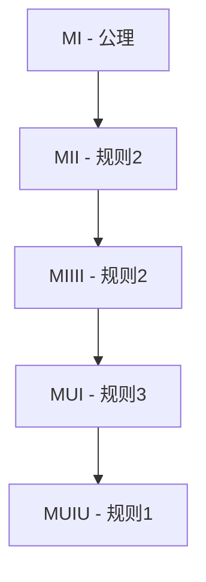

# 01-02 形式化推理方法

## 目录

- [01-02 形式化推理方法](#01-02-形式化推理方法)
  - [目录](#目录)
  - [1. 引言](#1-引言)
  - [2. 证明方法](#2-证明方法)
    - [2.1 直接证明](#21-直接证明)
    - [2.2 反证法](#22-反证法)
    - [2.3 数学归纳法](#23-数学归纳法)
    - [2.4 构造性证明](#24-构造性证明)
    - [2.5 非构造性证明](#25-非构造性证明)
  - [3. 推理规则](#3-推理规则)
    - [3.1 基本推理规则](#31-基本推理规则)
    - [3.2 量词推理规则](#32-量词推理规则)
    - [3.3 逻辑等价规则](#33-逻辑等价规则)
  - [4. 形式系统示例](#4-形式系统示例)
    - [4.1 MIU系统详解](#41-miu系统详解)
    - [4.2 系统性质分析](#42-系统性质分析)
  - [5. 推理复杂性](#5-推理复杂性)
    - [5.1 证明长度](#51-证明长度)
    - [5.2 计算复杂性](#52-计算复杂性)
  - [6. 代码实现](#6-代码实现)
    - [6.1 Rust实现：推理系统框架](#61-rust实现推理系统框架)
    - [6.2 Haskell实现：形式化推理](#62-haskell实现形式化推理)
  - [7. 相关链接](#7-相关链接)
    - [7.1 内部链接](#71-内部链接)
    - [7.2 外部参考](#72-外部参考)

## 1. 引言

形式化推理是在形式化系统的框架内，依据既定的推理规则从前提推导出结论的过程。它是数学严谨性的核心，确保每个结论都有严格的逻辑基础。

形式化推理方法不仅包括传统的证明技巧，还包括现代计算机辅助证明的方法和工具。

## 2. 证明方法

### 2.1 直接证明

**定义**: 从公理或已知定理直接推导出结论的证明方法。

**特点**:

- 逻辑链条清晰
- 每一步都有明确的依据
- 适合大多数数学命题

**示例**: 证明偶数的平方是偶数

```latex
设 n 为任意偶数，则存在整数 k 使得 n = 2k
n² = (2k)² = 4k² = 2(2k²)
因此 n² 是偶数
```

### 2.2 反证法

**定义**: 假设待证命题的否定为真，并由此导出一个矛盾，从而证明原命题为真。

**逻辑形式**:

```latex
要证明 P，假设 ¬P
从 ¬P 推导出矛盾 Q ∧ ¬Q
因此 ¬P 为假，P 为真
```

**经典示例**: 证明 √2 是无理数

```latex
假设 √2 是有理数，即存在互质整数 p,q 使得 √2 = p/q
则 2 = p²/q²，即 2q² = p²
因此 p² 是偶数，所以 p 是偶数
设 p = 2k，则 2q² = (2k)² = 4k²
即 q² = 2k²，所以 q² 是偶数，q 是偶数
这与 p,q 互质矛盾
因此 √2 是无理数
```

### 2.3 数学归纳法

**定义**: 用于证明关于自然数的命题的证明方法。

**原理**:

```latex
基础步骤: 证明 P(0) 为真
归纳步骤: 证明 ∀n ∈ ℕ, P(n) → P(n+1)
结论: ∀n ∈ ℕ, P(n)
```

**示例**: 证明 1 + 2 + ... + n = n(n+1)/2

```latex
基础步骤: n = 0 时，左边 = 0，右边 = 0(0+1)/2 = 0，成立
归纳步骤: 假设对于 n = k 成立，即 1 + 2 + ... + k = k(k+1)/2
对于 n = k+1:
左边 = 1 + 2 + ... + k + (k+1) = k(k+1)/2 + (k+1) = (k+1)(k+2)/2
右边 = (k+1)(k+1+1)/2 = (k+1)(k+2)/2
因此对于所有 n ∈ ℕ 成立
```

### 2.4 构造性证明

**定义**: 不仅证明某对象的存在性，还给出构造该对象的方法。

**特点**:

- 提供具体的构造算法
- 具有实际应用价值
- 符合直觉主义数学的要求

**示例**: 证明存在无限多个素数

```latex
构造方法: 给定任意有限素数集合 {p₁, p₂, ..., pₙ}
构造数 N = p₁p₂...pₙ + 1
N 要么是素数，要么有素因子不在原集合中
因此总能找到新的素数
```

### 2.5 非构造性证明

**定义**: 证明某对象的存在性，但不一定给出构造方法。

**特点**:

- 可能使用反证法
- 可能使用选择公理
- 不提供具体的构造算法

**示例**: 使用中间值定理证明方程有解

```latex
设 f(x) = x³ - x - 1
f(0) = -1 < 0, f(2) = 8 - 2 - 1 = 5 > 0
由中间值定理，存在 c ∈ (0,2) 使得 f(c) = 0
```

## 3. 推理规则

### 3.1 基本推理规则

**分离规则 (Modus Ponens)**:

```latex
P → Q, P ⊢ Q
```

**否定后件则否定前件 (Modus Tollens)**:

```latex
P → Q, ¬Q ⊢ ¬P
```

**假言三段论**:

```latex
P → Q, Q → R ⊢ P → R
```

**析取三段论**:

```latex
P ∨ Q, ¬P ⊢ Q
```

### 3.2 量词推理规则

**全称消去 (Universal Instantiation)**:

```latex
∀x P(x) ⊢ P(a)
```

**全称引入 (Universal Generalization)**:

```latex
P(a) ⊢ ∀x P(x)  (a 是任意常数)
```

**存在消去 (Existential Instantiation)**:

```latex
∃x P(x) ⊢ P(c)  (c 是新的常数)
```

**存在引入 (Existential Generalization)**:

```latex
P(a) ⊢ ∃x P(x)
```

### 3.3 逻辑等价规则

**双重否定**:

```latex
¬¬P ≡ P
```

**德摩根律**:

```latex
¬(P ∧ Q) ≡ ¬P ∨ ¬Q
¬(P ∨ Q) ≡ ¬P ∧ ¬Q
```

**分配律**:

```latex
P ∧ (Q ∨ R) ≡ (P ∧ Q) ∨ (P ∧ R)
P ∨ (Q ∧ R) ≡ (P ∨ Q) ∧ (P ∨ R)
```

## 4. 形式系统示例

### 4.1 MIU系统详解

MIU系统是Douglas Hofstadter在《哥德尔、艾舍尔、巴赫》中介绍的一个简单形式系统。

**系统定义**:

- **符号**: M, I, U
- **公理**: MI
- **推理规则**:
  1. 如果 xI，则 xIU
  2. 如果 Mx，则 Mxx
  3. 如果 xIIIy，则 xUy
  4. 如果 xUUy，则 xUy

**定理证明示例**:



**形式化证明**:

```latex
1. MI (公理)
2. MII (规则2: Mx → Mxx, x = "I")
3. MIIII (规则2: Mx → Mxx, x = "II")
4. MUI (规则3: xIIIy → xUy, x = "M", y = "")
```

### 4.2 系统性质分析

**可判定性问题**: "MU" 是否是这个系统的一个定理？

**分析**:

- 通过染色参数等元数学方法可以证明 MU 不是定理
- 这展示了即使是非常简单的形式系统，其性质也可能不是显而易见的
- 需要元级别的分析来理解系统的性质

## 5. 推理复杂性

### 5.1 证明长度

**定义**: 证明中步骤的数量或证明的符号长度。

**重要性**:

- 影响证明的可读性
- 影响计算机验证的效率
- 与系统的表达能力相关

**示例**: 不同证明方法的长度比较

```latex
直接证明: 通常较短，逻辑清晰
反证法: 可能较长，但逻辑简单
数学归纳法: 结构清晰，但需要两个步骤
```

### 5.2 计算复杂性

**证明验证的复杂性**:

- 线性时间: 简单的推理规则验证
- 多项式时间: 大多数形式系统的证明验证
- 指数时间: 某些复杂系统的证明搜索

**证明搜索的复杂性**:

- 不可判定: 一阶谓词逻辑
- 指数时间: 命题逻辑
- 多项式时间: 某些受限的逻辑系统

## 6. 代码实现

### 6.1 Rust实现：推理系统框架

```rust
// 推理系统的基础框架
trait InferenceSystem {
    type Formula;
    type Proof;
    type Rule;
    
    fn apply_rule(&self, premises: &[Self::Formula], rule: &Self::Rule) -> Option<Self::Formula>;
    fn verify_proof(&self, proof: &Self::Proof) -> bool;
    fn search_proof(&self, goal: &Self::Formula) -> Option<Self::Proof>;
}

// 命题逻辑推理系统
struct PropositionalLogic {
    rules: Vec<Box<dyn Fn(&[Formula]) -> Option<Formula>>>,
}

#[derive(Clone, Debug, PartialEq)]
enum Formula {
    Atom(String),
    Not(Box<Formula>),
    And(Box<Formula>, Box<Formula>),
    Or(Box<Formula>, Box<Formula>),
    Implies(Box<Formula>, Box<Formula>),
}

impl PropositionalLogic {
    fn new() -> Self {
        let mut system = PropositionalLogic {
            rules: Vec::new(),
        };
        
        // 分离规则: P → Q, P ⊢ Q
        system.rules.push(Box::new(|premises| {
            if premises.len() == 2 {
                if let (Formula::Implies(p, q), p2) = (&premises[0], &premises[1]) {
                    if p == p2 {
                        return Some(*q.clone());
                    }
                }
            }
            None
        }));
        
        // 否定后件则否定前件: P → Q, ¬Q ⊢ ¬P
        system.rules.push(Box::new(|premises| {
            if premises.len() == 2 {
                if let (Formula::Implies(p, q), Formula::Not(q2)) = (&premises[0], &premises[1]) {
                    if q == q2 {
                        return Some(Formula::Not(Box::new(*p.clone())));
                    }
                }
            }
            None
        }));
        
        system
    }
    
    fn modus_ponens(&self, p: &Formula, p_implies_q: &Formula) -> Option<Formula> {
        if let Formula::Implies(premise, conclusion) = p_implies_q {
            if p == premise {
                return Some(*conclusion.clone());
            }
        }
        None
    }
}

// 证明结构
#[derive(Debug)]
struct Proof {
    steps: Vec<ProofStep>,
}

#[derive(Debug)]
enum ProofStep {
    Axiom(Formula),
    Rule(String, Vec<usize>, Formula), // 规则名, 前提步骤索引, 结论
}

impl Proof {
    fn new() -> Self {
        Proof { steps: Vec::new() }
    }
    
    fn add_axiom(&mut self, formula: Formula) -> usize {
        let index = self.steps.len();
        self.steps.push(ProofStep::Axiom(formula));
        index
    }
    
    fn add_rule(&mut self, rule: String, premises: Vec<usize>, conclusion: Formula) -> usize {
        let index = self.steps.len();
        self.steps.push(ProofStep::Rule(rule, premises, conclusion));
        index
    }
    
    fn get_conclusion(&self) -> Option<&Formula> {
        self.steps.last().map(|step| match step {
            ProofStep::Axiom(f) => f,
            ProofStep::Rule(_, _, f) => f,
        })
    }
}

#[cfg(test)]
mod tests {
    use super::*;
    
    #[test]
    fn test_modus_ponens() {
        let system = PropositionalLogic::new();
        let p = Formula::Atom("P".to_string());
        let q = Formula::Atom("Q".to_string());
        let p_implies_q = Formula::Implies(Box::new(p.clone()), Box::new(q.clone()));
        
        let result = system.modus_ponens(&p, &p_implies_q);
        assert_eq!(result, Some(q));
    }
    
    #[test]
    fn test_proof_construction() {
        let mut proof = Proof::new();
        let p = Formula::Atom("P".to_string());
        let q = Formula::Atom("Q".to_string());
        let p_implies_q = Formula::Implies(Box::new(p.clone()), Box::new(q.clone()));
        
        let step1 = proof.add_axiom(p_implies_q);
        let step2 = proof.add_axiom(p);
        let _step3 = proof.add_rule("modus_ponens".to_string(), vec![step1, step2], q);
        
        assert_eq!(proof.get_conclusion(), Some(&q));
    }
}
```

### 6.2 Haskell实现：形式化推理

```haskell
-- 公式类型
data Formula = 
    Atom String
  | Not Formula
  | And Formula Formula
  | Or Formula Formula
  | Implies Formula Formula
  deriving (Eq, Show)

-- 推理规则
data Rule = 
    ModusPonens
  | ModusTollens
  | HypotheticalSyllogism
  | DisjunctiveSyllogism
  deriving (Show)

-- 证明步骤
data ProofStep = 
    Axiom Formula
  | RuleApplication Rule [Int] Formula
  deriving (Show)

-- 证明
type Proof = [ProofStep]

-- 推理系统
class InferenceSystem a where
  applyRule :: a -> Rule -> [Formula] -> Maybe Formula
  verifyProof :: a -> Proof -> Bool

-- 命题逻辑推理系统
data PropositionalLogic = PropositionalLogic

instance InferenceSystem PropositionalLogic where
  applyRule _ ModusPonens premises = case premises of
    [Implies p q, p'] | p == p' -> Just q
    _ -> Nothing
    
  applyRule _ ModusTollens premises = case premises of
    [Implies p q, Not q'] | q == q' -> Just (Not p)
    _ -> Nothing
    
  applyRule _ HypotheticalSyllogism premises = case premises of
    [Implies p q, Implies q' r] | q == q' -> Just (Implies p r)
    _ -> Nothing
    
  applyRule _ DisjunctiveSyllogism premises = case premises of
    [Or p q, Not p'] | p == p' -> Just q
    _ -> Nothing
    
  verifyProof _ [] = False
  verifyProof sys proof = 
    let formulas = map getFormula proof
        conclusions = map snd $ zip [0..] formulas
    in all (isValidStep sys proof) $ zip [0..] proof

-- 获取公式
getFormula :: ProofStep -> Formula
getFormula (Axiom f) = f
getFormula (RuleApplication _ _ f) = f

-- 验证证明步骤
isValidStep :: PropositionalLogic -> Proof -> (Int, ProofStep) -> Bool
isValidStep _ _ (_, Axiom _) = True
isValidStep sys proof (index, RuleApplication rule premiseIndices conclusion) =
  let premiseFormulas = map (getFormula . (proof !!)) premiseIndices
  in case applyRule sys rule premiseFormulas of
       Just f -> f == conclusion
       Nothing -> False

-- 示例：构造一个简单的证明
exampleProof :: Proof
exampleProof = [
  Axiom (Implies (Atom "P") (Atom "Q")),
  Axiom (Atom "P"),
  RuleApplication ModusPonens [0, 1] (Atom "Q")
]

-- 示例：验证证明
main :: IO ()
main = do
  let sys = PropositionalLogic
  let isValid = verifyProof sys exampleProof
  putStrLn $ "Proof verification: " ++ show isValid
  
  -- 测试推理规则
  let p = Atom "P"
  let q = Atom "Q"
  let pImpliesQ = Implies p q
  let result = applyRule sys ModusPonens [pImpliesQ, p]
  putStrLn $ "Modus Ponens result: " ++ show result
```

## 7. 相关链接

### 7.1 内部链接

- [01-形式化验证基础](./01-形式化验证基础.md) - 形式化验证的核心概念
- [03-逻辑系统与证明助手](./03-逻辑系统与证明助手.md) - 逻辑系统和证明助手
- [04-元数学基础](./04-元数学基础.md) - 元数学理论基础

### 7.2 外部参考

- 数学归纳法
- 反证法
- 构造性证明
- 形式化推理理论

---

**创建时间**: 2024-12-19 14:00
**最后更新**: 2024-12-19 14:00
**状态**: 重构完成
