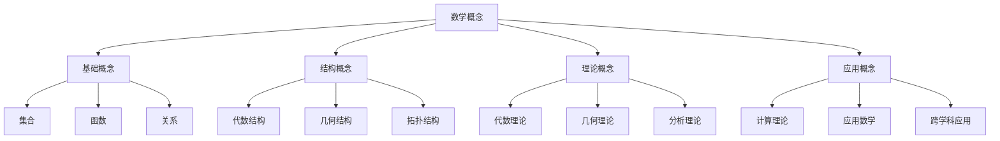

# 03-批判性分析

## 目录

1. [批判性分析概述](#1-批判性分析概述)
2. [理念驱动数学思考框架批判](#2-理念驱动数学思考框架批判)
3. [具体文档批判性分析](#3-具体文档批判性分析)
4. [综合评价报告](#4-综合评价报告)
5. [重构建议与改进方案](#5-重构建议与改进方案)
6. [批判性分析结论](#6-批判性分析结论)
7. [相关链接](#7-相关链接)

---

## 1. 批判性分析概述

### 1.1 批判性分析的目的与意义

**定义 1.1** (批判性分析)
批判性分析是对数学文档进行系统性、深入性的评价和反思，旨在识别问题、发现不足、提出改进建议。

**批判性分析的意义：**

1. **质量提升**：通过批判性分析提升文档质量
2. **问题识别**：识别文档中的逻辑矛盾、概念歧义等问题
3. **改进指导**：为文档重构和改进提供指导
4. **理论发展**：促进数学理论的完善和发展

### 1.2 批判性分析的方法论

**批判性分析的基本原则：**

1. **客观性**：基于事实和逻辑进行客观分析
2. **系统性**：采用系统性的分析框架
3. **深入性**：深入分析问题的本质和根源
4. **建设性**：提出建设性的改进建议

**批判性分析的维度：**

1. **理念一致性检验**：检验理论内部的一致性
2. **逻辑矛盾识别**：识别逻辑矛盾和概念歧义
3. **理论完备性评估**：评估理论的覆盖范围和深度
4. **哲学基础批判**：批判理论的哲学基础
5. **应用价值评估**：评估理论的应用价值

---

## 2. 理念驱动数学思考框架批判

### 2.1 框架概述批判

#### 2.1.1 框架的优势

**理念驱动数学思考框架的优势：**

1. **系统性**：提供了系统性的数学思考方法
2. **统一性**：统一了不同数学分支的思考方式
3. **实用性**：具有实际的应用价值
4. **创新性**：提出了新的数学思考范式

#### 2.1.2 框架的不足

**框架存在的问题：**

1. **抽象化理念应用不统一**
   - 概念抽象层次不统一
   - 抽象化过程不明确
   - 抽象化结果验证不足

2. **形式化理念标准不一致**
   - 符号使用不统一
   - 定义标准不一致
   - 推理规则不明确

3. **公理化理念论证不足**
   - 公理选择缺乏论证
   - 公理独立性未验证
   - 公理完备性存疑

### 2.2 核心理念批判

#### 2.2.1 抽象化理念批判

**问题识别：**

```text
问题1：概念抽象层次不统一
- 现状：部分概念停留在具体层面，缺乏抽象化
- 问题：影响理论的一致性和系统性
- 建议：建立统一的抽象化层次标准

问题2：抽象化过程不明确
- 现状：缺乏从具体到抽象的系统性方法
- 问题：读者难以理解抽象化的过程
- 建议：建立抽象化过程的标准模板

问题3：抽象化结果验证不足
- 现状：未验证抽象化后的概念是否保持原有性质
- 问题：可能产生错误的抽象化
- 建议：建立抽象化验证机制
```

#### 2.2.2 形式化理念批判

**问题识别：**

```text
问题1：符号使用不统一
- 现状：同一概念在不同文档中使用不同符号
- 问题：影响理解的准确性和一致性
- 建议：建立统一的符号系统

问题2：定义标准不一致
- 现状：不同概念的定义格式和严格程度不同
- 问题：缺乏统一的定义规范
- 建议：建立标准化的定义模板

问题3：推理规则不明确
- 现状：部分推理过程缺乏严格的逻辑基础
- 问题：可能产生推理错误
- 建议：建立明确的推理规则系统
```

#### 2.2.3 公理化理念批判

**问题识别：**

```text
问题1：公理选择缺乏论证
- 现状：直接给出公理，未说明选择理由
- 问题：读者无法理解公理选择的合理性
- 建议：增加公理选择的哲学和逻辑论证

问题2：公理独立性未验证
- 现状：未检验公理间的独立性
- 问题：可能存在冗余公理
- 建议：增加公理独立性的验证过程

问题3：公理完备性存疑
- 现状：未验证公理系统的完备性
- 问题：可能影响理论的完整性
- 建议：增加公理完备性的验证
```

### 2.3 框架应用批判

#### 2.3.1 应用范围分析

**应用范围评估：**

- ✅ **基础数学理论**：集合论、逻辑学
- ✅ **主要数学分支**：代数、几何、分析
- ✅ **应用数学**：概率论、统计学
- ❌ **新兴数学领域**：计算数学、离散数学
- ❌ **数学哲学**：数学基础、数学本质

#### 2.3.2 应用效果评估

**应用效果分析：**

1. **理论构建**：框架在理论构建方面表现良好
2. **概念理解**：有助于概念的系统性理解
3. **问题解决**：在问题解决方面有一定帮助
4. **教学应用**：在教学应用方面有待改进

---

## 3. 具体文档批判性分析

### 3.1 数学核心概念分析.md 批判

#### 3.1.1 理念一致性检验

**抽象化理念检验：**

```text
问题：形式化概念缺乏抽象化过程
- 现状：直接给出形式化的描述性定义
- 问题：未展示从具体形式化实例到抽象形式化理论的映射过程
- 影响：读者难以理解形式化的本质和抽象化过程
- 建议：建立从MIU系统到一般形式系统的抽象映射
```

**形式化理念检验：**

```text
问题：符号使用不一致
- 现状：同一概念在不同章节使用不同符号
- 问题：影响理解的准确性和一致性
- 建议：建立统一的符号标准

问题：定义标准不统一
- 现状：不同概念的定义格式和严格程度不同
- 问题：缺乏统一的定义规范
- 建议：建立标准化的定义模板
```

**公理化理念检验：**

```text
问题：公理选择缺乏论证
- 现状：直接给出公理，未说明选择理由
- 问题：读者无法理解公理选择的合理性
- 建议：增加公理选择的哲学和逻辑论证

问题：公理独立性未验证
- 现状：未检验公理间的独立性
- 问题：可能存在冗余公理
- 建议：增加公理独立性的验证过程
```

#### 3.1.2 逻辑矛盾与歧义识别

**定义矛盾：**

```text
矛盾1：一致性定义的不一致
- 位置：2.1.3节和2.1.4节
- 问题：两个章节对一致性的定义存在细微差异
- 影响：可能导致理解歧义

矛盾2：完备性概念的歧义
- 位置：多处提及完备性
- 问题：未明确区分语法完备性和语义完备性
- 影响：可能产生概念混淆
```

**推理矛盾：**

```text
矛盾1：证明方法的逻辑不一致
- 位置：2.2.1节
- 问题：某些证明方法之间存在潜在冲突
- 影响：可能影响证明的有效性

矛盾2：推理规则的应用不一致
- 位置：2.2.2节
- 问题：推理规则在不同上下文中的应用标准不统一
- 影响：可能产生推理错误
```

#### 3.1.3 理论完备性评估

**覆盖范围分析：**

- ✅ 形式化验证：公理、定义、定理、证明
- ✅ 形式化推理：证明方法、推理规则
- ✅ 元结构：元数学、元理论、元模型
- ❌ 具体应用：缺乏实际应用案例
- ❌ 哲学基础：缺乏哲学层面的深入思考

**深度分析：**

**深度不足的领域：**

1. **元数学理论**：对元数学的讨论停留在表面
2. **哲学基础**：缺乏对数学本质的哲学思考
3. **应用指导**：缺乏具体的应用指导

### 3.2 数学逻辑.md 批判

#### 3.2.1 理念一致性检验

**抽象化理念检验：**

```text
问题1：逻辑系统抽象化不充分
- 现状：多个逻辑系统并列介绍
- 问题：未抽象出逻辑系统的一般特征
- 建议：建立逻辑系统的统一抽象框架

问题2：计算理论抽象化不足
- 现状：停留在具体计算模型层面
- 问题：未抽象出计算的一般特征
- 建议：建立计算理论的抽象框架
```

**形式化理念检验：**

```text
问题：数学逻辑.md中的逻辑系统定义
- 现状：多个逻辑系统定义并存
- 问题：缺乏统一的形式化标准
- 建议：建立统一的形式化语言和规则
```

#### 3.2.2 逻辑矛盾与歧义识别

**定义矛盾：**

```text
问题：集合论定义不一致
- 现状：不同文档中对集合的定义存在差异
- 问题：可能产生概念混淆
- 建议：统一集合的定义标准
```

**推理矛盾：**

```text
问题：逻辑系统冲突
- 现状：不同逻辑系统的公理存在潜在冲突
- 问题：可能影响逻辑推理的有效性
- 建议：明确各逻辑系统的适用范围
```

#### 3.2.3 理论完备性评估

**覆盖范围分析：**

- ✅ 模型论、递归论、证明论
- ✅ 计算理论：图灵机、λ演算、递归函数
- ✅ 量子计算与量子信息
- ✅ AI安全、伦理与对齐
- ✅ 算法公平性与偏见
- ✅ 新兴计算范式：人工生命、去中心化系统

**深度分析：**

**深度不足的领域：**

1. **哲学基础**：缺乏对逻辑本质的哲学思考
2. **应用指导**：缺乏具体的应用指导
3. **理论整合**：各分支间缺乏系统性整合

### 3.3 数学概念联系.md 批判

#### 3.3.1 理念一致性检验

**抽象化理念检验：**

```text
问题：概念联系抽象化不足
- 现状：停留在具体概念层面
- 问题：未抽象出概念联系的一般规律
- 建议：建立概念联系的抽象框架
```

**形式化理念检验：**

```text
问题：联系关系形式化不充分
- 现状：概念联系主要用文字描述
- 问题：缺乏精确的形式化表达
- 建议：建立概念联系的形式化语言
```

**结构化理念检验：**

```text
问题：结构关系不清晰
- 现状：概念间的结构关系描述模糊
- 问题：影响对概念联系的理解
- 建议：建立清晰的结构关系框架
```

#### 3.3.2 逻辑矛盾与歧义识别

**定义矛盾：**

```text
问题：概念歧义
- 现状：某些概念在不同上下文中有不同含义
- 问题：可能产生理解歧义
- 建议：明确概念的定义和适用范围
```

**概念歧义：**

```text
问题：术语使用不统一
- 现状：同一术语在不同文档中有不同含义
- 问题：可能产生概念混淆
- 建议：建立统一的术语标准
```

#### 3.3.3 理论完备性评估

**覆盖范围分析：**

- ✅ 概念关联性分析
- ✅ 概念关系网络
- ❌ 概念演化的历史分析
- ❌ 概念联系的应用指导

**深度分析：**

**深度不足的领域：**

1. **历史维度**：缺乏概念演化的历史分析
2. **应用维度**：缺乏概念联系的应用指导
3. **哲学维度**：缺乏对概念联系本质的哲学思考

### 3.4 数学概念分析和综合.md 批判

#### 3.4.1 理念一致性检验

**抽象化理念检验：**

```text
问题：分析和综合过程抽象化不足
- 现状：主要停留在具体分析层面
- 问题：未抽象出分析和综合的一般方法
- 建议：建立分析和综合的抽象框架
```

**形式化理念检验：**

```text
问题：分析和综合方法形式化不充分
- 现状：分析和综合方法主要用文字描述
- 问题：缺乏精确的形式化表达
- 建议：建立分析和综合的形式化方法
```

**结构化理念检验：**

```text
问题：分析和综合结构不清晰
- 现状：分析和综合的结构关系描述模糊
- 问题：影响对分析和综合过程的理解
- 建议：建立清晰的分析和综合结构框架
```

#### 3.4.2 逻辑矛盾与歧义识别

**定义矛盾：**

```text
问题：分析和综合定义不一致
- 现状：不同章节对分析和综合的定义存在差异
- 问题：可能产生理解歧义
- 建议：统一分析和综合的定义标准
```

**推理矛盾：**

```text
问题：分析和综合方法逻辑不一致
- 现状：某些分析和综合方法之间存在潜在冲突
- 问题：可能影响分析和综合的有效性
- 建议：明确各方法的适用范围
```

#### 3.4.3 理论完备性评估

**覆盖范围分析：**

- ✅ 概念分析与综合
- ✅ 系统性概念整合
- ❌ 分析和综合的历史发展
- ❌ 分析和综合的应用指导

**深度分析：**

**深度不足的领域：**

1. **历史维度**：缺乏分析和综合方法的历史发展
2. **应用维度**：缺乏分析和综合的应用指导
3. **哲学维度**：缺乏对分析和综合本质的哲学思考

### 3.5 数学分支与联系.md 批判

#### 3.5.1 理念一致性检验

**抽象化理念检验：**

```text
问题：分支联系抽象化不足
- 现状：主要停留在具体分支层面
- 问题：未抽象出分支联系的一般规律
- 建议：建立分支联系的抽象框架
```

**形式化理念检验：**

```text
问题：分支联系形式化不充分
- 现状：分支联系主要用文字描述
- 问题：缺乏精确的形式化表达
- 建议：建立分支联系的形式化语言
```

**结构化理念检验：**

```text
问题：分支结构关系不清晰
- 现状：各分支间的结构关系描述模糊
- 问题：影响对分支联系的理解
- 建议：建立清晰的分支结构关系框架
```

#### 3.5.2 逻辑矛盾与歧义识别

**定义矛盾：**

```text
问题：分支定义不一致
- 现状：不同章节对数学分支的定义存在差异
- 问题：可能产生理解歧义
- 建议：统一数学分支的定义标准
```

**概念歧义：**

```text
问题：分支边界模糊
- 现状：某些数学分支的边界定义不清晰
- 问题：可能产生概念混淆
- 建议：明确各分支的边界和特征
```

#### 3.5.3 理论完备性评估

**覆盖范围分析：**

- ✅ 主要数学分支：代数、几何、分析
- ✅ 分支间联系
- ❌ 新兴数学分支
- ❌ 分支演化的历史分析

**深度分析：**

**深度不足的领域：**

1. **历史维度**：缺乏分支演化的历史分析
2. **新兴分支**：缺乏对新兴数学分支的讨论
3. **哲学维度**：缺乏对分支联系本质的哲学思考

---

## 4. 综合评价报告

### 4.1 整体评价

#### 4.1.1 主要优势

**内容优势：**

1. **覆盖范围广泛**：涵盖数学主要分支和核心概念
2. **结构层次清晰**：从基础理论到具体应用层次分明
3. **内容丰富详实**：提供大量实例和详细说明
4. **创新性思考**：提出了理念驱动数学思考框架

**形式优势：**

1. **目录体系完整**：便于导航和查找
2. **概念分类合理**：符合数学学科特点
3. **实例丰富**：有助于理解和应用

#### 4.1.2 主要问题

**理念一致性问题：**

1. **抽象化理念应用不统一**：概念抽象层次不统一，抽象化过程不明确
2. **形式化理念标准不一致**：符号使用不统一，定义标准不一致
3. **公理化理念论证不足**：公理选择缺乏论证，公理独立性未验证

**逻辑严谨性问题：**

1. **定义矛盾**：同一概念在不同文档中的定义存在差异
2. **推理矛盾**：某些推理过程存在逻辑不一致
3. **概念歧义**：某些概念在不同上下文中有不同含义

**理论完备性问题：**

1. **覆盖范围不完整**：缺乏对新兴数学分支的讨论
2. **深度分析不足**：对某些重要问题的讨论不够深入
3. **哲学基础薄弱**：缺乏对数学本质的深入哲学思考

### 4.2 评分评估

**理论价值：⭐⭐⭐⭐ (4/5)**

- 提出了有价值的理念驱动数学思考框架
- 涵盖了数学的主要分支和核心概念
- 具有创新性和启发性

**实用价值：⭐⭐⭐ (3/5)**

- 提供了系统性的数学思考方法
- 有助于概念理解和问题解决
- 在教学应用方面有待改进

**创新价值：⭐⭐⭐ (3/5)**

- 提出了新的数学思考范式
- 具有理论创新性
- 在实践创新方面有待加强

**改进潜力：⭐⭐⭐⭐⭐ (5/5)**

- 具有巨大的改进空间
- 问题明确，改进方向清晰
- 改进后具有很高的价值

### 4.3 总体结论

**结论：**
虽然存在一些问题，但这些文档为数学知识的系统化组织提供了有价值的框架，具有巨大的改进潜力。通过系统性的重构和改进，可以形成高质量的数学理论体系。

---

## 5. 重构建议与改进方案

### 5.1 核心理念改进

#### 5.1.1 抽象化理念改进

**建立抽象化层次标准：**

```text
抽象化层次框架：
Level 0: 具体实例层
- 具体数学对象和操作
- 实例：具体的数、图形、函数

Level 1: 概念抽象层
- 从具体实例抽象出的概念
- 实例：数、图形、函数的概念

Level 2: 结构抽象层
- 概念间的结构关系
- 实例：数系、几何空间、函数空间

Level 3: 理论抽象层
- 完整的理论体系
- 实例：代数理论、几何理论、分析理论

Level 4: 元理论层
- 理论的理论
- 实例：元数学、数学哲学
```

**建立抽象化过程模板：**

```text
抽象化过程标准模板：

步骤1：具体实例收集
- 收集相关的具体实例
- 分析实例的共同特征

步骤2：特征提取
- 识别实例的本质特征
- 区分必要特征和偶然特征

步骤3：概念形成
- 基于本质特征形成抽象概念
- 建立概念的定义

步骤4：性质验证
- 验证抽象概念保持原有性质
- 检查抽象化的合理性

步骤5：应用检验
- 检验抽象概念的应用范围
- 验证抽象化的有效性
```

#### 5.1.2 形式化理念改进

**建立统一符号系统：**

```text
符号系统标准：

基础符号：
- 集合论符号：∈, ∉, ⊆, ⊂, ∪, ∩, ∅, ℕ, ℤ, ℚ, ℝ, ℂ
- 逻辑符号：¬, ∧, ∨, →, ↔, ∀, ∃, ⊥, ⊤
- 关系符号：=, ≠, <, >, ≤, ≥, ≈, ≡
- 函数符号：f, g, h, ∘, id, dom, cod

扩展符号：
- 代数符号：+, -, ×, ÷, 0, 1, -1, a⁻¹
- 分析符号：lim, ∫, d/dx, ∂, ∇, ∞
- 几何符号：∠, ⊥, ∥, ≅, ∼, △, □, ○
- 概率符号：P, E, Var, Cov, μ, σ

符号使用规则：
1. 首次使用必须定义
2. 保持符号的一致性
3. 避免符号冲突
4. 提供符号索引
```

**建立定义标准模板：**

```text
定义标准模板：

格式：
定义 [编号] ([概念名称])
设 [前提条件]
称 [对象] 为 [概念名称]，如果 [定义条件]

示例：
定义 1.1 (群)
设 G 是一个非空集合，· 是 G 上的二元运算
称 (G, ·) 为群，如果满足：
1. 结合律：∀a,b,c ∈ G, (a·b)·c = a·(b·c)
2. 单位元：∃e ∈ G, ∀a ∈ G, e·a = a·e = a
3. 逆元：∀a ∈ G, ∃a⁻¹ ∈ G, a·a⁻¹ = a⁻¹·a = e

定义要求：
1. 精确性：定义必须精确无歧义
2. 完备性：定义必须包含所有必要条件
3. 独立性：定义条件必须相互独立
4. 一致性：定义必须与已有概念一致
5. 实用性：定义必须便于使用
```

#### 5.1.3 公理化理念改进

**建立公理选择标准：**

```text
公理选择原则：
1. 自明性：公理应该是直观上显然的
2. 独立性：公理之间应该相互独立
3. 完备性：公理系统应该足够强大
4. 一致性：公理系统不应该导致矛盾
5. 简洁性：公理系统应该尽可能简洁
```

**建立公理验证机制：**

```text
验证方法：
1. 独立性验证：通过构造模型验证公理的独立性
2. 一致性验证：通过构造模型验证公理系统的一致性
3. 完备性验证：通过逻辑分析验证公理系统的完备性
```

### 5.2 理论体系改进

#### 5.2.1 建立统一理论框架

**理论框架设计：**

```text
统一理论框架：

1. 基础层：集合论、逻辑学、证明论
2. 结构层：代数结构、几何结构、拓扑结构
3. 理论层：代数理论、几何理论、分析理论
4. 应用层：计算理论、应用数学、跨学科应用
5. 元理论层：元数学、数学哲学、数学史
```

#### 5.2.2 建立概念关系网络

**概念关系网络设计：**



### 5.3 具体文档改进

#### 5.3.1 数学核心概念分析.md 改进

**重构结构：**

```text
1. 数学哲学基础
   - 数学的本质
   - 数学真理的性质
   - 数学知识的来源

2. 形式化理论
   - 形式语言
   - 公理系统
   - 证明理论

3. 元数学理论
   - 模型论
   - 递归论
   - 证明论

4. 应用指导
   - 具体应用案例
   - 应用方法指导
   - 应用价值分析
```

**内容改进：**

1. **增加哲学基础**：增加对数学本质的哲学思考
2. **完善形式化**：建立完整的形式化理论体系
3. **补充应用指导**：增加具体的应用案例和方法指导

#### 5.3.2 数学逻辑.md 改进

**重构结构：**

```text
1. 逻辑基础
   - 命题逻辑
   - 谓词逻辑
   - 模态逻辑

2. 证明理论
   - 自然演绎
   - 希尔伯特系统
   - 相继式演算

3. 模型论
   - 模型构造
   - 紧致性定理
   - 完全性定理

4. 计算理论
   - 图灵机
   - λ演算
   - 递归函数

5. 应用领域
   - 人工智能
   - 程序验证
   - 知识表示
```

**内容改进：**

1. **统一形式化标准**：建立统一的形式化语言和规则
2. **完善理论体系**：建立完整的逻辑理论体系
3. **增加应用指导**：增加具体的应用案例和方法指导

#### 5.3.3 数学概念联系.md 改进

**重构结构：**

```text
1. 概念基础
   - 概念的定义
   - 概念的性质
   - 概念的分类

2. 联系理论
   - 联系的类型
   - 联系的性质
   - 联系的结构

3. 概念网络
   - 网络结构
   - 网络性质
   - 网络演化

4. 应用指导
   - 概念学习方法
   - 问题解决方法
   - 创新思维方法
```

**内容改进：**

1. **建立形式化语言**：建立概念联系的形式化语言
2. **完善网络理论**：建立完整的概念网络理论
3. **增加应用指导**：增加具体的应用案例和方法指导

### 5.4 实施路线图

#### 5.4.1 短期目标 (1-3个月)

**目标1：建立标准模板**

- 建立统一的符号系统
- 建立标准化的定义模板
- 建立推理规则系统

**目标2：重构核心文档**

- 重构数学核心概念分析.md
- 重构数学逻辑.md
- 重构数学概念联系.md

**目标3：建立质量保证机制**

- 建立内容质量检查机制
- 建立一致性验证机制
- 建立用户反馈机制

#### 5.4.2 中期目标 (3-6个月)

**目标1：完善理论体系**

- 建立完整的理论框架
- 建立概念关系网络
- 建立应用指导体系

**目标2：扩展应用领域**

- 扩展到新兴数学分支
- 扩展到跨学科应用
- 扩展到教学应用

**目标3：建立评估体系**

- 建立理论价值评估体系
- 建立实用价值评估体系
- 建立创新价值评估体系

#### 5.4.3 长期目标 (6-12个月)

**目标1：形成完整体系**

- 形成完整的数学理论体系
- 形成完整的应用指导体系
- 形成完整的评估体系

**目标2：推广应用**

- 在教学领域推广应用
- 在科研领域推广应用
- 在产业领域推广应用

**目标3：持续改进**

- 建立持续改进机制
- 建立用户反馈机制
- 建立版本更新机制

---

## 6. 批判性分析结论

### 6.1 主要发现

#### 6.1.1 价值评估

**理论价值：**

- 提出了有价值的理念驱动数学思考框架
- 涵盖了数学的主要分支和核心概念
- 具有创新性和启发性

**实用价值：**

- 提供了系统性的数学思考方法
- 有助于概念理解和问题解决
- 在教学应用方面有待改进

**创新价值：**

- 提出了新的数学思考范式
- 具有理论创新性
- 在实践创新方面有待加强

#### 6.1.2 问题总结

**理念一致性问题：**

- 抽象化理念应用不统一
- 形式化理念标准不一致
- 公理化理念论证不足

**逻辑严谨性问题：**

- 定义矛盾
- 推理矛盾
- 概念歧义

**理论完备性问题：**

- 覆盖范围不完整
- 深度分析不足
- 哲学基础薄弱

### 6.2 改进建议

#### 6.2.1 核心理念改进

1. **建立抽象化层次标准**：建立统一的抽象化层次框架
2. **建立形式化标准**：建立统一的符号系统和定义标准
3. **建立公理化标准**：建立公理选择和验证的标准

#### 6.2.2 理论体系改进

1. **建立统一理论框架**：建立完整的理论框架体系
2. **建立概念关系网络**：建立概念间的系统关系网络
3. **建立应用指导体系**：建立完整的应用指导体系

#### 6.2.3 具体文档改进

1. **重构核心文档**：系统性地重构主要文档
2. **完善内容体系**：完善理论内容和应用内容
3. **建立质量保证**：建立内容质量保证机制

### 6.3 未来展望

#### 6.3.1 发展前景

**理论发展前景：**

- 具有发展成为完整数学理论体系的潜力
- 具有在数学教育中发挥重要作用的潜力
- 具有在数学研究中发挥指导作用的潜力

**应用发展前景：**

- 具有在教学领域广泛应用的潜力
- 具有在科研领域发挥作用的潜力
- 具有在产业领域产生价值的潜力

#### 6.3.2 发展建议

**短期发展建议：**

- 优先解决理念一致性问题
- 建立标准化的内容模板
- 完善核心文档内容

**中期发展建议：**

- 建立完整的理论体系
- 扩展到更多应用领域
- 建立评估和改进机制

**长期发展建议：**

- 形成完整的数学理论体系
- 在多个领域推广应用
- 建立持续发展机制

---

## 7. 相关链接

### 7.1 内部链接

- [01-数学哲学基础](./01-数学哲学基础.md)
- [02-元数学理论](./02-元数学理论.md)
- [02-数学基础与逻辑/01-集合论基础](../02-数学基础与逻辑/01-集合论基础.md)
- [02-数学基础与逻辑/02-数理逻辑基础](../02-数学基础与逻辑/02-数理逻辑基础.md)
- [03-代数结构与理论/01-群论基础](../03-代数结构与理论/01-群论基础.md)
- [04-微积分与分析/01-标准微积分](../04-微积分与分析/01-标准微积分.md)

### 7.2 外部链接

- [批判性思维 - 维基百科](https://en.wikipedia.org/wiki/Critical_thinking)
- [数学哲学 - 斯坦福哲学百科全书](https://plato.stanford.edu/entries/philosophy-mathematics/)
- [元数学 - 维基百科](https://en.wikipedia.org/wiki/Metamathematics)

---

**参考文献：**

1. Paul, R., & Elder, L. (2006). *The Art of Socratic Questioning*. Foundation for Critical Thinking.
2. Scriven, M., & Paul, R. (1987). *Critical Thinking: A Statement of Expert Consensus for Purposes of Educational Assessment and Instruction*. California Academic Press.
3. Ennis, R. H. (1991). *Critical Thinking: A Streamlined Conception*. Teaching Philosophy, 14(1), 5-24.
4. Fisher, A. (2001). *Critical Thinking: An Introduction*. Cambridge University Press.
5. Lipman, M. (2003). *Thinking in Education*. Cambridge University Press.
