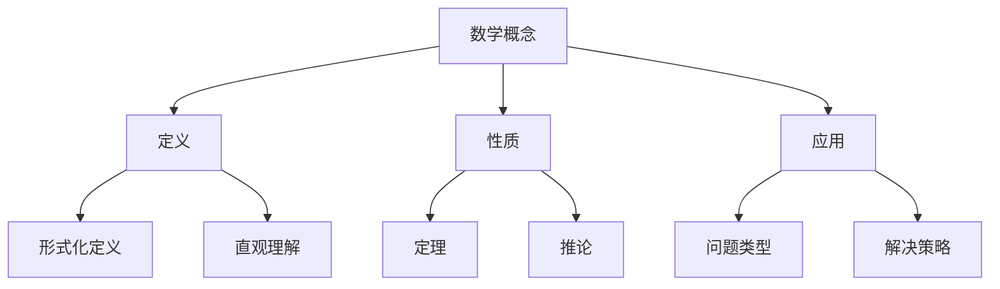

# 数学认知论：认知科学与数学思维的深层映射

## 目录

1. [引言](#1-引言)
2. [数学认知的基础理论](#2-数学认知的基础理论)
   2.1. [认知科学基础](#21-认知科学基础)
   2.2. [数学思维的本质](#22-数学思维的本质)
   2.3. [认知负荷理论](#23-认知负荷理论)
3. [数学概念的认知起源](#3-数学概念的认知起源)
   3.1. [数的认知基础](#31-数的认知基础)
   3.2. [空间认知与几何直觉](#32-空间认知与几何直觉)
   3.3. [抽象思维的认知机制](#33-抽象思维的认知机制)
4. [数学学习的认知过程](#4-数学学习的认知过程)
   4.1. [概念形成过程](#41-概念形成过程)
   4.2. [问题解决策略](#42-问题解决策略)
   4.3. [数学直觉的认知基础](#43-数学直觉的认知基础)
5. [认知偏差与数学思维](#5-认知偏差与数学思维)
   5.1. [常见认知偏差](#51-常见认知偏差)
   5.2. [数学思维中的错误模式](#52-数学思维中的错误模式)
   5.3. [克服认知偏差的策略](#53-克服认知偏差的策略)
6. [数学创造力的认知机制](#6-数学创造力的认知机制)
   6.1. [创造性思维的特征](#61-创造性思维的特征)
   6.2. [数学发现的认知过程](#62-数学发现的认知过程)
   6.3. [直觉与逻辑的相互作用](#63-直觉与逻辑的相互作用)
7. [跨文化数学认知](#7-跨文化数学认知)
   7.1. [文化对数学认知的影响](#71-文化对数学认知的影响)
   7.2. [不同数学传统的认知特点](#72-不同数学传统的认知特点)
   7.3. [数学教育的文化适应性](#73-数学教育的文化适应性)
8. [数学认知的神经基础](#8-数学认知的神经基础)
   8.1. [数学认知的脑区定位](#81-数学认知的脑区定位)
   8.2. [数学学习的神经可塑性](#82-数学学习的神经可塑性)
   8.3. [数学天才的神经特征](#83-数学天才的神经特征)
9. [人工智能与数学认知](#9-人工智能与数学认知)
   9.1. [AI的数学能力分析](#91-ai的数学能力分析)
   9.2. [人机数学认知的比较](#92-人机数学认知的比较)
   9.3. [AI辅助数学教育的认知原理](#93-ai辅助数学教育的认知原理)
10. [结论与展望](#10-结论与展望)

---

## 1. 引言

数学认知论是研究人类如何理解、学习和创造数学的认知科学分支。它探讨数学思维的本质、数学概念的认知起源、数学学习的认知过程以及数学创造力的认知机制。

### 1.1 研究背景

数学认知论的研究源于对数学教育效果的关注和对数学思维本质的好奇。随着认知科学的发展，我们逐渐认识到数学不仅仅是逻辑推理的结果，更是人类认知系统与数学对象相互作用的过程。

### 1.2 核心问题

- **数学概念如何在大脑中表征？**
- **数学直觉的认知基础是什么？**
- **数学创造力是如何产生的？**
- **文化如何影响数学认知？**

### 1.3 研究方法

数学认知论采用多种研究方法，包括：
- **行为实验**：观察数学学习行为
- **脑成像技术**：研究数学认知的神经基础
- **计算建模**：构建数学认知的计算模型
- **跨文化比较**：研究不同文化背景下的数学认知

---

## 2. 数学认知的基础理论

### 2.1 认知科学基础

#### 2.1.1 信息处理模型

人类认知系统可以看作一个信息处理系统，数学认知也不例外。根据信息处理理论，数学认知包括以下阶段：

1. **感知阶段**：接收数学信息（符号、图形、文字）
2. **编码阶段**：将信息转换为内部表征
3. **存储阶段**：在工作记忆和长时记忆中存储信息
4. **检索阶段**：从记忆中提取相关信息
5. **应用阶段**：运用信息解决数学问题

#### 2.1.2 工作记忆理论

工作记忆是数学认知的核心，根据Baddeley的工作记忆模型：

**工作记忆 = 中央执行系统 + 语音环路 + 视觉空间画板**

在数学认知中：
- **中央执行系统**：负责数学推理和问题解决
- **语音环路**：处理数学符号和语言
- **视觉空间画板**：处理几何图形和空间关系

#### 2.1.3 长时记忆结构

数学知识在长时记忆中形成复杂的网络结构：

### 2.2 数学思维的本质

#### 2.2.1 数学思维的特征

数学思维具有以下特征：

1. **抽象性**：从具体实例中提取一般规律
2. **逻辑性**：遵循严格的逻辑推理规则
3. **精确性**：要求概念和推理的精确性
4. **创造性**：需要创造新的概念和方法
5. **系统性**：构建完整的理论体系

#### 2.2.2 数学思维的类型

根据Polya的分类，数学思维包括：

- **归纳思维**：从特殊到一般
- **演绎思维**：从一般到特殊
- **类比思维**：通过相似性建立联系
- **直觉思维**：基于经验的快速判断

#### 2.2.3 数学思维的发展阶段

根据Piaget的认知发展理论，数学思维发展经历以下阶段：

1. **感知运动阶段**（0-2岁）：通过动作认识世界
2. **前运算阶段**（2-7岁）：开始使用符号，但缺乏逻辑
3. **具体运算阶段**（7-11岁）：能够进行逻辑推理，但需要具体材料
4. **形式运算阶段**（11岁以上）：能够进行抽象推理

### 2.3 认知负荷理论

#### 2.3.1 认知负荷的类型

根据Sweller的认知负荷理论，数学学习中的认知负荷包括：

1. **内在认知负荷**：由学习材料的复杂性决定
2. **外在认知负荷**：由教学设计的质量决定
3. **生成认知负荷**：由学习者的努力决定

#### 2.3.2 认知负荷的测量

认知负荷可以通过以下方式测量：

- **主观评价**：学习者自我报告
- **生理指标**：心率、瞳孔直径等
- **行为指标**：反应时间、错误率等
- **脑电指标**：EEG、fMRI等

#### 2.3.3 认知负荷的优化策略

为了优化数学学习中的认知负荷，可以采取以下策略：

1. **分块学习**：将复杂内容分解为小块
2. **提供支架**：为学习者提供必要的支持
3. **减少冗余**：消除不必要的信息
4. **增强相关性**：建立知识间的联系

---

## 3. 数学概念的认知起源

### 3.1 数的认知基础

#### 3.1.1 数感的神经基础

数感是人类与生俱来的能力，具有以下特征：

1. **近似数系统**：能够快速估计数量
2. **精确数系统**：能够精确计数
3. **数轴表征**：在心理数轴上表征数字

#### 3.1.2 数概念的发展

数概念的发展遵循以下顺序：

1. **基数概念**：理解集合的大小
2. **序数概念**：理解顺序关系
3. **测量概念**：理解连续量
4. **比例概念**：理解相对关系

#### 3.1.3 数表征的形式

数在认知中可以多种形式表征：

- **符号表征**：阿拉伯数字、罗马数字等
- **语言表征**：数词、数名等
- **视觉表征**：点阵、图形等
- **动作表征**：手势、操作等

### 3.2 空间认知与几何直觉

#### 3.2.1 空间认知的基础

空间认知是人类理解几何的基础，包括：

1. **空间定向**：确定方向和位置
2. **空间关系**：理解物体间的关系
3. **空间变换**：进行旋转、平移等操作
4. **空间推理**：进行空间逻辑推理

#### 3.2.2 几何直觉的特征

几何直觉具有以下特征：

1. **直观性**：基于视觉感知
2. **整体性**：把握图形的整体特征
3. **动态性**：能够想象图形的变化
4. **创造性**：能够创造新的几何关系

#### 3.2.3 几何思维的发展

几何思维的发展经历以下阶段：

1. **视觉阶段**：通过视觉识别图形
2. **描述阶段**：能够描述图形的性质
3. **抽象阶段**：能够进行抽象几何推理
4. **形式阶段**：能够进行形式化几何证明

### 3.3 抽象思维的认知机制

#### 3.3.1 抽象化的过程

抽象化是数学思维的核心过程，包括：

1. **识别模式**：发现具体实例中的共同特征
2. **提取本质**：提取关键特征，忽略次要特征
3. **形成概念**：将提取的特征组织成概念
4. **建立关系**：建立概念间的关系

#### 3.3.2 抽象思维的类型

根据抽象的程度，可以分为：

- **经验抽象**：基于具体经验的抽象
- **伪经验抽象**：基于想象的抽象
- **理论抽象**：基于理论的抽象

#### 3.3.3 抽象思维的发展

抽象思维的发展需要：

1. **丰富的具体经验**
2. **充分的反思机会**
3. **适当的认知挑战**
4. **有效的指导支持**

---

## 4. 数学学习的认知过程

### 4.1 概念形成过程

#### 4.1.1 概念学习的阶段

数学概念学习经历以下阶段：

1. **前概念阶段**：具有模糊的直觉理解
2. **概念形成阶段**：通过实例形成概念
3. **概念巩固阶段**：通过练习巩固概念
4. **概念应用阶段**：能够灵活应用概念

#### 4.1.2 概念表征的形式

数学概念可以多种形式表征：

- **原型表征**：以典型实例为代表
- **样例表征**：以多个实例为代表
- **规则表征**：以定义和规则为代表
- **图式表征**：以知识结构为代表

#### 4.1.3 概念学习的策略

有效的概念学习策略包括：

1. **多实例学习**：通过多个实例学习概念
2. **对比学习**：通过对比正反例学习概念
3. **变式练习**：通过变式练习巩固概念
4. **反思总结**：通过反思总结深化理解

### 4.2 问题解决策略

#### 4.2.1 问题解决的过程

数学问题解决包括以下过程：

1. **问题理解**：理解问题的要求和条件
2. **问题表征**：将问题转换为内部表征
3. **策略选择**：选择适当的解决策略
4. **策略执行**：执行选定的策略
5. **结果检验**：检验结果的正确性

#### 4.2.2 问题解决策略的类型

常用的数学问题解决策略包括：

- **算法策略**：使用标准算法
- **启发式策略**：使用经验法则
- **创造性策略**：创造新的解决方法
- **元认知策略**：监控和调节解决过程

#### 4.2.3 问题解决能力的培养

培养问题解决能力需要：

1. **丰富的知识基础**
2. **多样的策略训练**
3. **充分的练习机会**
4. **有效的反馈指导**

### 4.3 数学直觉的认知基础

#### 4.3.1 数学直觉的特征

数学直觉具有以下特征：

1. **快速性**：能够快速做出判断
2. **整体性**：把握问题的整体特征
3. **模糊性**：判断可能不够精确
4. **经验性**：基于以往的经验

#### 4.3.2 数学直觉的类型

根据直觉的对象，可以分为：

- **数量直觉**：对数量的直觉判断
- **空间直觉**：对空间的直觉判断
- **关系直觉**：对关系的直觉判断
- **模式直觉**：对模式的直觉判断

#### 4.3.3 数学直觉的培养

培养数学直觉需要：

1. **丰富的数学经验**
2. **充分的反思机会**
3. **适当的挑战任务**
4. **有效的反馈机制**

---

## 5. 认知偏差与数学思维

### 5.1 常见认知偏差

#### 5.1.1 确认偏误

确认偏误是指倾向于寻找支持自己观点的证据，而忽视相反的证据。在数学学习中表现为：

- 只关注支持自己答案的步骤
- 忽视可能存在的错误
- 不愿意考虑其他解法

#### 5.1.2 锚定效应

锚定效应是指过度依赖最初获得的信息。在数学学习中表现为：

- 被第一个想到的方法束缚
- 难以考虑其他可能性
- 对初始估计的过度依赖

#### 5.1.3 可用性启发法

可用性启发法是指根据容易想到的例子做判断。在数学学习中表现为：

- 过度依赖熟悉的例子
- 忽视不熟悉的特殊情况
- 基于表面相似性做判断

### 5.2 数学思维中的错误模式

#### 5.2.1 概念性错误

概念性错误源于对概念的错误理解：

- **过度泛化**：将特殊性质推广到一般情况
- **概念混淆**：混淆相似但不同的概念
- **概念缺失**：缺乏必要的概念理解

#### 5.2.2 程序性错误

程序性错误源于计算或推理过程的错误：

- **算法错误**：使用错误的算法
- **计算错误**：在计算过程中出错
- **符号错误**：符号使用不当

#### 5.2.3 策略性错误

策略性错误源于问题解决策略的选择错误：

- **策略不当**：选择了不适当的策略
- **策略缺失**：缺乏必要的策略
- **策略执行错误**：策略执行不当

### 5.3 克服认知偏差的策略

#### 5.3.1 元认知策略

元认知策略帮助学习者监控和调节自己的思维：

1. **自我监控**：监控自己的思维过程
2. **自我评价**：评价自己的思维质量
3. **自我调节**：调节自己的思维策略

#### 5.3.2 批判性思维策略

批判性思维策略帮助学习者质疑和验证自己的思维：

1. **质疑假设**：质疑隐含的假设
2. **寻找证据**：寻找支持结论的证据
3. **考虑反例**：考虑可能的反例

#### 5.3.3 合作学习策略

合作学习策略通过与他人交流克服个人偏见：

1. **观点交流**：与他人交流不同的观点
2. **相互质疑**：相互质疑对方的观点
3. **共同建构**：共同建构正确的理解

---

## 6. 数学创造力的认知机制

### 6.1 创造性思维的特征

#### 6.1.1 发散思维

发散思维是创造性思维的核心，具有以下特征：

1. **流畅性**：能够产生大量想法
2. **灵活性**：能够从不同角度思考
3. **独创性**：能够产生独特的想法
4. **精细性**：能够完善和发展想法

#### 6.1.2 收敛思维

收敛思维是创造性思维的重要组成部分：

1. **分析能力**：分析问题的各个方面
2. **综合能力**：综合不同的信息
3. **评价能力**：评价不同方案的优劣
4. **决策能力**：选择最佳方案

#### 6.1.3 元认知能力

元认知能力是创造性思维的基础：

1. **自我意识**：了解自己的思维过程
2. **自我监控**：监控自己的思维质量
3. **自我调节**：调节自己的思维策略

### 6.2 数学发现的认知过程

#### 6.2.1 问题发现

问题发现是数学创造的第一步：

1. **观察现象**：观察数学现象
2. **识别模式**：识别现象中的模式
3. **提出问题**：基于模式提出问题
4. **验证问题**：验证问题的重要性

#### 6.2.2 假设形成

假设形成是数学创造的关键步骤：

1. **收集信息**：收集相关信息
2. **分析信息**：分析信息的特征
3. **形成假设**：基于分析形成假设
4. **验证假设**：验证假设的合理性

#### 6.2.3 证明构造

证明构造是数学创造的核心：

1. **理解问题**：深入理解问题
2. **寻找方法**：寻找证明方法
3. **构造证明**：构造严格的证明
4. **验证证明**：验证证明的正确性

### 6.3 直觉与逻辑的相互作用

#### 6.3.1 直觉的作用

直觉在数学创造中发挥重要作用：

1. **问题识别**：帮助识别重要问题
2. **方向指引**：指引探索的方向
3. **假设生成**：帮助生成假设
4. **方法选择**：帮助选择方法

#### 6.3.2 逻辑的作用

逻辑在数学创造中提供严格性：

1. **概念定义**：提供严格的概念定义
2. **推理验证**：验证推理的正确性
3. **证明构造**：构造严格的证明
4. **理论构建**：构建完整的理论

#### 6.3.3 直觉与逻辑的平衡

成功的数学创造需要直觉与逻辑的平衡：

1. **直觉引导逻辑**：直觉为逻辑提供方向
2. **逻辑验证直觉**：逻辑验证直觉的正确性
3. **相互促进**：直觉和逻辑相互促进
4. **动态平衡**：在不同阶段有不同的平衡

---

## 7. 跨文化数学认知

### 7.1 文化对数学认知的影响

#### 7.1.1 语言的影响

语言对数学认知有重要影响：

1. **数词系统**：不同语言的数词系统影响数的认知
2. **语法结构**：语法结构影响逻辑思维
3. **表达方式**：表达方式影响概念理解

#### 7.1.2 教育传统的影响

教育传统影响数学认知的发展：

1. **教学方法**：不同的教学方法影响学习效果
2. **评价方式**：不同的评价方式影响学习动机
3. **学习环境**：不同的学习环境影响学习体验

#### 7.1.3 社会文化的影响

社会文化影响数学认知的价值取向：

1. **数学价值观**：对数学价值的认识
2. **学习动机**：学习数学的动机
3. **成功标准**：数学成功的标准

### 7.2 不同数学传统的认知特点

#### 7.2.1 西方数学传统

西方数学传统的特点：

1. **公理化方法**：强调公理化方法
2. **逻辑推理**：强调逻辑推理
3. **抽象思维**：强调抽象思维
4. **形式化表达**：强调形式化表达

#### 7.2.2 东方数学传统

东方数学传统的特点：

1. **实用导向**：强调实用价值
2. **算法思维**：强调算法思维
3. **直观理解**：强调直观理解
4. **整体思维**：强调整体思维

#### 7.2.3 现代数学传统

现代数学传统的特点：

1. **形式化**：高度形式化
2. **抽象化**：高度抽象化
3. **系统化**：高度系统化
4. **应用化**：强调应用价值

### 7.3 数学教育的文化适应性

#### 7.3.1 文化适应性原则

数学教育需要考虑文化适应性：

1. **尊重文化差异**：尊重不同文化的特点
2. **利用文化资源**：利用文化中的数学资源
3. **促进文化融合**：促进不同文化的融合
4. **培养跨文化能力**：培养跨文化数学能力

#### 7.3.2 文化适应性策略

实现文化适应性的策略：

1. **本土化教学**：将数学教学本土化
2. **文化比较**：进行文化比较
3. **多元评价**：采用多元评价方式
4. **教师培训**：培训教师的跨文化能力

#### 7.3.3 文化适应性的挑战

文化适应性面临的挑战：

1. **文化冲突**：不同文化间的冲突
2. **资源不足**：文化资源不足
3. **能力缺乏**：跨文化能力缺乏
4. **评价困难**：跨文化评价困难

---

## 8. 数学认知的神经基础

### 8.1 数学认知的脑区定位

#### 8.1.1 数量加工的脑区

数量加工主要涉及以下脑区：

1. **顶内沟**：负责数量表征
2. **额叶**：负责数量计算
3. **颞叶**：负责数量记忆
4. **枕叶**：负责数量视觉

#### 8.1.2 空间加工的脑区

空间加工主要涉及以下脑区：

1. **顶叶**：负责空间表征
2. **额叶**：负责空间推理
3. **颞叶**：负责空间记忆
4. **枕叶**：负责空间视觉

#### 8.1.3 符号加工的脑区

符号加工主要涉及以下脑区：

1. **左额叶**：负责语言符号
2. **右额叶**：负责数学符号
3. **颞叶**：负责符号记忆
4. **顶叶**：负责符号空间

### 8.2 数学学习的神经可塑性

#### 8.2.1 神经可塑性的机制

神经可塑性是数学学习的基础：

1. **突触可塑性**：突触强度的变化
2. **神经元可塑性**：神经元数量的变化
3. **网络可塑性**：神经网络结构的变化
4. **功能可塑性**：脑功能的变化

#### 8.2.2 数学学习对大脑的影响

数学学习对大脑产生重要影响：

1. **结构变化**：大脑结构的变化
2. **功能变化**：大脑功能的变化
3. **连接变化**：神经网络连接的变化
4. **效率变化**：信息处理效率的变化

#### 8.2.3 神经可塑性的教育意义

神经可塑性对教育有重要意义：

1. **学习机会**：为学习提供机会
2. **个体差异**：解释个体差异
3. **教育干预**：指导教育干预
4. **康复治疗**：指导康复治疗

### 8.3 数学天才的神经特征

#### 8.3.1 数学天才的脑结构特征

数学天才具有特殊的脑结构特征：

1. **脑容量**：某些脑区容量较大
2. **脑连接**：神经网络连接特殊
3. **脑功能**：某些脑功能特别发达
4. **脑可塑性**：神经可塑性特别强

#### 8.3.2 数学天才的脑功能特征

数学天才具有特殊的脑功能特征：

1. **信息处理**：信息处理效率高
2. **工作记忆**：工作记忆容量大
3. **注意力**：注意力集中能力强
4. **创造力**：创造力特别强

#### 8.3.3 数学天才的培养

培养数学天才需要：

1. **早期识别**：早期识别数学天赋
2. **适当挑战**：提供适当的挑战
3. **充分支持**：提供充分的支持
4. **全面发展**：促进全面发展

---

## 9. 人工智能与数学认知

### 9.1 AI的数学能力分析

#### 9.1.1 AI的数学优势

AI在数学方面具有以下优势：

1. **计算能力**：强大的计算能力
2. **存储能力**：巨大的存储能力
3. **搜索能力**：高效的搜索能力
4. **模式识别**：强大的模式识别能力

#### 9.1.2 AI的数学局限

AI在数学方面存在以下局限：

1. **理解能力**：缺乏深度理解
2. **创造能力**：缺乏创造能力
3. **直觉能力**：缺乏直觉能力
4. **元认知能力**：缺乏元认知能力

#### 9.1.3 AI的数学应用

AI在数学方面的应用：

1. **数学教育**：辅助数学教育
2. **数学研究**：辅助数学研究
3. **数学应用**：辅助数学应用
4. **数学评价**：辅助数学评价

### 9.2 人机数学认知的比较

#### 9.2.1 认知方式的比较

人机数学认知方式的比较：

| 特征 | 人类 | AI |
|------|------|----|
| 信息处理 | 并行处理 | 串行处理 |
| 学习方式 | 经验学习 | 数据学习 |
| 推理方式 | 直觉推理 | 逻辑推理 |
| 创造方式 | 灵感创造 | 算法创造 |

#### 9.2.2 能力特点的比较

人机数学能力特点的比较：

1. **人类优势**：直觉、创造、理解
2. **AI优势**：计算、存储、搜索
3. **互补性**：人机互补
4. **协同性**：人机协同

#### 9.2.3 发展前景的比较

人机数学认知的发展前景：

1. **人类发展**：认知能力不断提升
2. **AI发展**：技术不断进步
3. **融合发展**：人机融合发展
4. **创新突破**：可能产生创新突破

### 9.3 AI辅助数学教育的认知原理

#### 9.3.1 AI辅助学习的原理

AI辅助数学学习的原理：

1. **个性化学习**：根据个体特点提供个性化学习
2. **适应性学习**：根据学习进度调整学习内容
3. **智能反馈**：提供智能化的反馈
4. **学习分析**：进行学习分析

#### 9.3.2 AI辅助教学的优势

AI辅助数学教学的优势：

1. **效率提高**：提高教学效率
2. **质量提升**：提升教学质量
3. **个性化**：实现个性化教学
4. **智能化**：实现智能化教学

#### 9.3.3 AI辅助教学的挑战

AI辅助数学教学面临的挑战：

1. **技术挑战**：技术还不够成熟
2. **教育挑战**：教育理念需要更新
3. **伦理挑战**：伦理问题需要解决
4. **社会挑战**：社会接受度需要提高

---

## 10. 结论与展望

### 10.1 主要结论

#### 10.1.1 数学认知的本质

数学认知是人类认知系统与数学对象相互作用的过程，具有以下特征：

1. **多表征性**：数学概念可以多种形式表征
2. **层次性**：数学认知具有层次结构
3. **发展性**：数学认知不断发展
4. **文化性**：数学认知受文化影响

#### 10.1.2 数学学习的关键因素

数学学习的关键因素包括：

1. **认知基础**：良好的认知基础
2. **学习策略**：有效的学习策略
3. **学习环境**：良好的学习环境
4. **学习动机**：强烈的学习动机

#### 10.1.3 数学创造力的培养

数学创造力的培养需要：

1. **丰富的知识基础**
2. **多样的思维训练**
3. **充分的实践机会**
4. **有效的指导支持**

### 10.2 未来研究方向

#### 10.2.1 认知神经科学研究

未来的认知神经科学研究方向：

1. **脑机制研究**：深入研究数学认知的脑机制
2. **发展研究**：研究数学认知的发展规律
3. **个体差异研究**：研究个体差异的神经基础
4. **干预研究**：研究教育干预的神经效果**

#### 10.2.2 人工智能研究

未来的人工智能研究方向：

1. **认知建模**：构建更准确的认知模型
2. **智能教育**：开发更智能的教育系统
3. **人机交互**：研究更自然的人机交互
4. **协同学习**：研究人机协同学习

#### 10.2.3 教育应用研究

未来的教育应用研究方向：

1. **个性化教育**：实现真正的个性化教育
2. **智能评价**：开发智能化的评价系统
3. **学习分析**：进行深入的学习分析
4. **教育干预**：开发有效的教育干预

### 10.3 实践建议

#### 10.3.1 对教育者的建议

对数学教育者的建议：

1. **了解认知规律**：深入了解数学认知规律
2. **采用有效策略**：采用有效的教学策略
3. **关注个体差异**：关注学生的个体差异
4. **促进全面发展**：促进学生的全面发展

#### 10.3.2 对学习者的建议

对数学学习者的建议：

1. **建立良好基础**：建立良好的数学基础
2. **培养学习策略**：培养有效的学习策略
3. **保持学习动机**：保持强烈的学习动机
4. **勇于创新探索**：勇于创新和探索

#### 10.3.3 对研究者的建议

对数学认知研究者的建议：

1. **跨学科合作**：加强跨学科合作
2. **技术创新**：推动技术创新
3. **实践应用**：注重实践应用
4. **国际交流**：加强国际交流

---

## 参考文献

1. Baddeley, A. D. (2000). The episodic buffer: a new component of working memory? *Trends in Cognitive Sciences*, 4(11), 417-423.

2. Dehaene, S. (2011). *The number sense: How the mind creates mathematics*. Oxford University Press.

3. Polya, G. (1957). *How to solve it: A new aspect of mathematical method*. Princeton University Press.

4. Sweller, J. (1988). Cognitive load during problem solving: Effects on learning. *Cognitive Science*, 12(2), 257-285.

5. Vygotsky, L. S. (1978). *Mind in society: The development of higher psychological processes*. Harvard University Press.

---

## 相关链接

- [数学哲学基础](../01-数学哲学基础.md)
- [元数学理论](../02-元数学理论.md)
- [形式化与证明](../03-形式化与证明.md)
- [数学美学理论](./02-数学美学理论.md)
- [数学教育理论](./03-数学教育理论.md)

---

*最后更新时间：2024-12-19*
*文档版本：v1.0* 