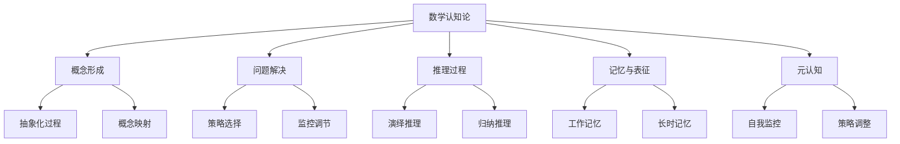
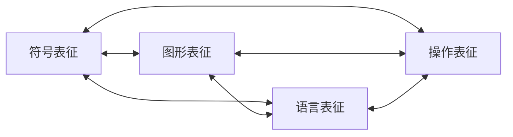
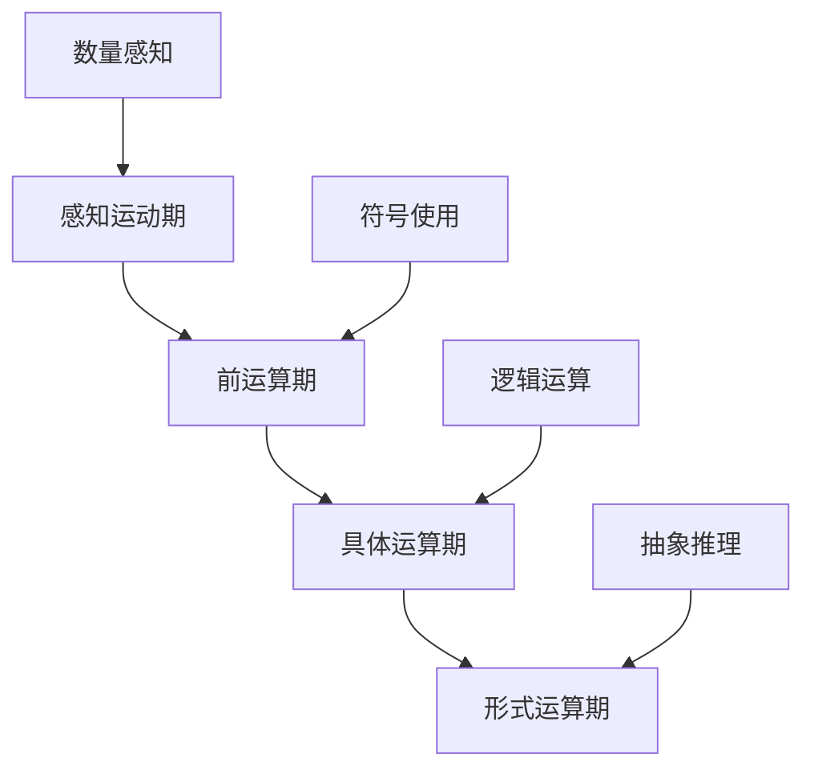
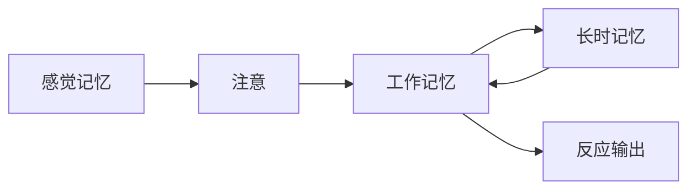
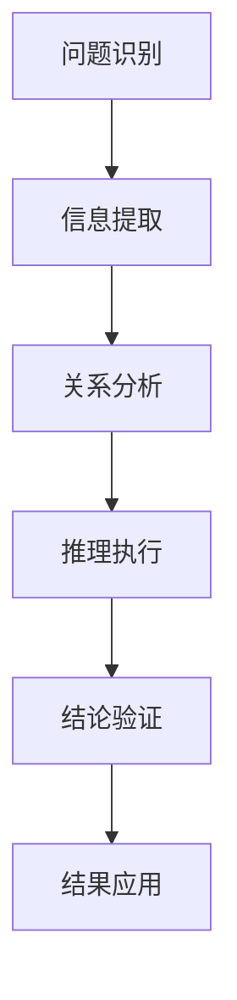
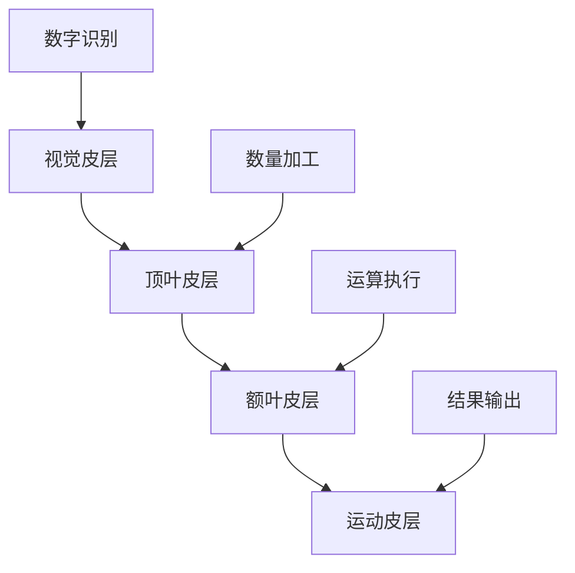

# 01-数学认知论

## 目录

1. [概述](#1-概述)
2. [数学认知的基本概念](#2-数学认知的基本概念)
3. [数学认知的理论框架](#3-数学认知的理论框架)
4. [数学认知过程分析](#4-数学认知过程分析)
5. [数学认知的发展阶段](#5-数学认知的发展阶段)
6. [数学认知的个体差异](#6-数学认知的个体差异)
7. [数学认知的教育应用](#7-数学认知的教育应用)
8. [数学认知的跨文化研究](#8-数学认知的跨文化研究)
9. [数学认知的神经科学基础](#9-数学认知的神经科学基础)
10. [数学认知的未来发展](#10-数学认知的未来发展)

---

## 1. 概述

### 1.1 数学认知论的定义

**数学认知论**是研究人类如何理解、学习和运用数学知识的学科，它结合了认知科学、心理学、神经科学和教育学的理论和方法。

**核心问题**：

- 人类如何感知和理解数学概念？
- 数学思维的本质是什么？
- 数学能力是如何发展的？
- 个体在数学学习中的差异如何产生？

### 1.2 数学认知论的研究范围

### 1.3 数学认知论的重要性

1. **教育实践指导**：为数学教育提供科学依据
2. **学习障碍诊断**：帮助识别和干预数学学习困难
3. **认知发展理解**：揭示数学思维的发展规律
4. **人工智能应用**：为数学AI系统提供认知模型

---

## 2. 数学认知的基本概念

### 2.1 数学表征

**数学表征**是指数学概念、关系和过程在认知系统中的内部表示形式。

#### 2.1.1 表征的类型

1. **符号表征**：数学符号和公式
   - 代数表达式：$ax^2 + bx + c = 0$
   - 函数表示：$f(x) = \sin(x)$
   - 集合表示：$A = \{x \in \mathbb{R} | x > 0\}$

2. **图形表征**：几何图形和图表
   - 函数图像
   - 几何图形
   - 数据图表

3. **语言表征**：自然语言描述
   - 概念定义
   - 定理陈述
   - 问题描述

4. **操作表征**：动作和过程
   - 计算步骤
   - 证明过程
   - 问题解决策略

#### 2.1.2 表征的转换

### 2.2 数学概念

**数学概念**是数学认知的基本单位，是对数学对象本质特征的抽象概括。

#### 2.2.1 概念的特征

1. **抽象性**：从具体实例中抽象出共同特征
2. **层次性**：概念之间存在包含和从属关系
3. **系统性**：概念之间形成有机联系
4. **发展性**：概念随认知发展而深化

#### 2.2.2 概念形成的阶段

1. **感知阶段**：通过感官接触具体实例
2. **分析阶段**：识别实例的共同特征
3. **抽象阶段**：提取本质特征形成概念
4. **应用阶段**：在新情境中运用概念

### 2.3 数学思维

**数学思维**是运用数学概念、方法和语言进行思考的过程。

#### 2.3.1 数学思维的类型

1. **逻辑思维**：基于逻辑规则进行推理
2. **抽象思维**：从具体中抽象出一般规律
3. **空间思维**：处理空间关系和几何问题
4. **算法思维**：按步骤解决问题的思维
5. **创造性思维**：发现新方法和新关系

#### 2.3.2 数学思维的特点

- **精确性**：要求严格的逻辑推理
- **抽象性**：处理抽象概念和关系
- **系统性**：注重概念间的联系
- **创造性**：寻求新的解决途径

---

## 3. 数学认知的理论框架

### 3.1 皮亚杰认知发展理论

#### 3.1.1 认知发展阶段

1. **感知运动期**（0-2岁）
   - 通过感官和动作认识世界
   - 发展对象永久性概念

2. **前运算期**（2-7岁）
   - 开始使用符号和语言
   - 发展数量守恒概念

3. **具体运算期**（7-11岁）
   - 能够进行逻辑推理
   - 掌握基本的数学运算

4. **形式运算期**（11岁以上）
   - 能够进行抽象推理
   - 掌握复杂的数学概念

#### 3.1.2 数学认知发展

### 3.2 维果茨基社会文化理论

#### 3.2.1 最近发展区

**最近发展区**是指学习者独立解决问题的能力与在成人指导下解决问题的能力之间的差距。

**数学学习中的应用**：

- 提供适当的支架支持
- 设计渐进式学习任务
- 促进同伴合作学习

#### 3.2.2 社会互动的作用

1. **语言的作用**：通过语言内化数学概念
2. **工具的作用**：使用数学工具辅助思维
3. **文化的作用**：文化背景影响数学认知

### 3.3 信息加工理论

#### 3.3.1 认知加工模型

#### 3.3.2 数学信息加工

1. **编码阶段**：将数学信息转换为内部表征
2. **存储阶段**：在工作记忆中保持信息
3. **检索阶段**：从长时记忆中提取相关信息
4. **应用阶段**：运用信息解决问题

### 3.4 建构主义理论

#### 3.4.1 知识建构过程

1. **同化**：将新信息纳入现有认知结构
2. **顺应**：调整认知结构以适应新信息
3. **平衡**：达到认知结构的平衡状态

#### 3.4.2 数学学习中的建构

- **主动建构**：学习者主动构建数学知识
- **社会建构**：通过社会互动建构知识
- **情境建构**：在具体情境中建构知识

---

## 4. 数学认知过程分析

### 4.1 数学问题解决

#### 4.1.1 问题解决模型

**波利亚四步法**：

1. **理解问题**：明确问题的条件和目标
2. **制定计划**：选择适当的解决策略
3. **执行计划**：按计划逐步解决问题
4. **回顾反思**：检查结果并总结经验

#### 4.1.2 问题表征

**问题表征**是指问题在认知系统中的内部表示。

**表征类型**：

- **表面表征**：基于问题的表面特征
- **深层表征**：基于问题的数学结构
- **图式表征**：基于已有的知识图式

#### 4.1.3 策略选择

**数学问题解决策略**：

1. **算法策略**：使用标准算法
2. **启发式策略**：使用经验法则
3. **创造性策略**：寻找新的解决方法
4. **元认知策略**：监控和调节解决过程

### 4.2 数学推理

#### 4.2.1 推理类型

1. **演绎推理**：从一般到特殊的推理
   - 三段论推理
   - 数学证明
   - 逻辑推理

2. **归纳推理**：从特殊到一般的推理
   - 模式识别
   - 规律发现
   - 假设形成

3. **类比推理**：基于相似性的推理
   - 结构类比
   - 功能类比
   - 过程类比

#### 4.2.2 推理过程分析

### 4.3 数学记忆

#### 4.3.1 工作记忆

**工作记忆**是处理当前信息的认知系统。

**数学工作记忆的特点**：

- 容量有限（7±2个项目）
- 信息保持时间短
- 需要主动维持

**数学工作记忆的组成**：

- **语音环路**：处理语言信息
- **视觉空间画板**：处理视觉空间信息
- **中央执行器**：协调和控制

#### 4.3.2 长时记忆

**长时记忆**是存储持久知识的系统。

**数学长时记忆的类型**：

- **陈述性知识**：数学事实和概念
- **程序性知识**：数学技能和算法
- **条件性知识**：何时使用何种知识

#### 4.3.3 记忆策略

1. **组织策略**：将信息组织成有意义的单元
2. **精加工策略**：对信息进行深度加工
3. **复述策略**：重复练习和复习
4. **元记忆策略**：监控和调节记忆过程

---

## 5. 数学认知的发展阶段

### 5.1 早期数学认知（0-6岁）

#### 5.1.1 数量感知

1. **数量直觉**：对数量的基本感知
2. **一一对应**：建立物体与数量的对应关系
3. **数量比较**：比较不同集合的数量
4. **简单计数**：掌握基本的计数技能

#### 5.1.2 空间认知

1. **空间定位**：识别物体的空间位置
2. **形状识别**：识别基本的几何形状
3. **空间关系**：理解物体间的空间关系
4. **空间变换**：理解物体的空间变换

### 5.2 基础数学认知（6-12岁）

#### 5.2.1 数概念发展

1. **自然数概念**：理解自然数的性质和运算
2. **分数概念**：理解分数的意义和运算
3. **小数概念**：理解小数的意义和运算
4. **负数概念**：理解负数的意义和运算

#### 5.2.2 运算能力发展

1. **加法运算**：掌握加法的概念和技能
2. **减法运算**：掌握减法的概念和技能
3. **乘法运算**：掌握乘法的概念和技能
4. **除法运算**：掌握除法的概念和技能

### 5.3 高级数学认知（12岁以上）

#### 5.3.1 抽象思维发展

1. **变量概念**：理解变量的意义和作用
2. **函数概念**：理解函数的概念和性质
3. **方程概念**：理解方程的概念和解法
4. **不等式概念**：理解不等式的概念和解法

#### 5.3.2 证明思维发展

1. **逻辑推理**：掌握基本的逻辑推理方法
2. **数学证明**：理解数学证明的结构和方法
3. **反证法**：掌握反证法的使用
4. **归纳法**：掌握数学归纳法的使用

---

## 6. 数学认知的个体差异

### 6.1 认知风格差异

#### 6.1.1 场依存性-场独立性

**场依存性**：倾向于依赖外部环境信息

- 在数学学习中需要更多的外部指导
- 善于解决有明确结构的数学问题

**场独立性**：倾向于依赖内部信息

- 能够独立进行数学思考
- 善于解决开放性的数学问题

#### 6.1.2 冲动性-反思性

**冲动性**：快速做出反应

- 解题速度快但容易出错
- 需要培养仔细检查的习惯

**反思性**：仔细思考后做出反应

- 解题准确但速度较慢
- 需要提高解题效率

### 6.2 数学能力差异

#### 6.2.1 数学天赋

**数学天赋的特征**：

- 对数学概念有深刻理解
- 能够进行复杂的数学推理
- 具有数学创造性思维
- 对数学有强烈的兴趣

#### 6.2.2 数学学习困难

**数学学习困难的类型**：

- **计算困难**：在基本运算方面存在困难
- **概念困难**：在理解数学概念方面存在困难
- **应用困难**：在应用数学知识方面存在困难
- **推理困难**：在数学推理方面存在困难

### 6.3 性别差异

#### 6.3.1 数学成就差异

**研究现状**：

- 在基础数学技能方面差异较小
- 在高级数学领域存在一定差异
- 差异可能受到社会文化因素影响

#### 6.3.2 数学态度差异

**态度差异的表现**：

- 对数学的兴趣和信心
- 数学焦虑的程度
- 数学职业的期望

---

## 7. 数学认知的教育应用

### 7.1 教学设计原则

#### 7.1.1 认知负荷理论

**认知负荷的类型**：

- **内在负荷**：由学习内容的复杂性决定
- **外在负荷**：由教学设计的质量决定
- **生成负荷**：由学习者的认知活动产生

**教学设计策略**：

- 减少外在认知负荷
- 优化内在认知负荷
- 增加生成认知负荷

#### 7.1.2 支架式教学

**支架的类型**：

- **概念支架**：帮助理解数学概念
- **过程支架**：帮助掌握数学过程
- **策略支架**：帮助选择解决策略
- **元认知支架**：帮助监控学习过程

### 7.2 学习策略指导

#### 7.2.1 认知策略

1. **复述策略**：重复练习和复习
2. **精加工策略**：对信息进行深度加工
3. **组织策略**：将信息组织成有意义的单元

#### 7.2.2 元认知策略

1. **计划策略**：制定学习计划
2. **监控策略**：监控学习过程
3. **调节策略**：调节学习策略

### 7.3 评估方法

#### 7.3.1 形成性评估

**评估内容**：

- 数学概念的理解程度
- 数学技能的掌握程度
- 数学思维的发展水平
- 学习策略的使用情况

#### 7.3.2 诊断性评估

**评估目的**：

- 识别学习困难
- 分析困难原因
- 制定干预方案
- 监控干预效果

---

## 8. 数学认知的跨文化研究

### 8.1 文化对数学认知的影响

#### 8.1.1 语言系统的影响

**数字系统**：

- 不同语言的数字命名系统
- 数字的语音特征
- 数字的视觉特征

**数学术语**：

- 数学概念的语言表达
- 数学符号的文化含义
- 数学隐喻的文化背景

#### 8.1.2 教育系统的影响

**教学方法**：

- 不同文化的数学教学方法
- 教师角色的文化差异
- 学生角色的文化差异

**评估方式**：

- 不同文化的数学评估方式
- 成功标准的文化差异
- 竞争与合作的文化差异

### 8.2 跨文化数学认知研究

#### 8.2.1 研究领域

1. **数学成就比较**：不同文化背景学生的数学成就
2. **数学态度比较**：不同文化背景学生的数学态度
3. **数学策略比较**：不同文化背景学生的数学策略
4. **数学思维比较**：不同文化背景学生的数学思维

#### 8.2.2 研究方法

1. **问卷调查**：收集大样本数据
2. **实验研究**：控制变量进行研究
3. **个案研究**：深入分析个别案例
4. **民族志研究**：参与观察文化现象

---

## 9. 数学认知的神经科学基础

### 9.1 数学认知的脑机制

#### 9.1.1 数字加工的脑区

**顶叶皮层**：

- 数字的语义加工
- 数量比较
- 数字运算

**额叶皮层**：

- 工作记忆
- 执行控制
- 策略选择

**颞叶皮层**：

- 数字的语音加工
- 数学语言理解
- 数学事实记忆

#### 9.1.2 数学运算的脑网络

### 9.2 数学学习障碍的神经基础

#### 9.2.1 发展性计算障碍

**神经特征**：

- 顶叶皮层的功能异常
- 数字加工的神经效率降低
- 工作记忆的神经基础受损

**行为表现**：

- 基本计算技能困难
- 数字比较能力受损
- 数学事实记忆困难

#### 9.2.2 数学焦虑的神经基础

**神经特征**：

- 杏仁核的过度激活
- 前额叶皮层的功能抑制
- 工作记忆的神经效率降低

**行为表现**：

- 数学任务表现下降
- 回避数学活动
- 生理反应异常

### 9.3 神经可塑性与数学学习

#### 9.3.1 神经可塑性的机制

**突触可塑性**：

- 突触强度的变化
- 突触连接的形成和消除
- 神经网络的重新组织

**结构可塑性**：

- 神经元形态的变化
- 神经纤维的生长
- 脑区功能的重新分配

#### 9.3.2 数学训练对脑的影响

**功能变化**：

- 数学相关脑区的激活增强
- 数学网络的效率提高
- 数学技能的自动化

**结构变化**：

- 数学相关脑区的体积增加
- 神经纤维连接的增强
- 脑区功能的专门化

---

## 10. 数学认知的未来发展

### 10.1 技术发展对数学认知的影响

#### 10.1.1 人工智能与数学认知

**AI辅助学习**：

- 个性化学习系统
- 智能辅导系统
- 自适应评估系统

**AI认知模型**：

- 数学认知的计算模型
- 数学学习的预测模型
- 数学困难的诊断模型

#### 10.1.2 虚拟现实与数学认知

**VR数学学习**：

- 三维数学概念可视化
- 沉浸式数学问题解决
- 协作式数学学习

**VR认知研究**：

- 数学认知的生态学研究
- 数学学习的自然观察
- 数学行为的实时记录

### 10.2 跨学科研究的发展

#### 10.2.1 认知科学与数学教育

**研究领域**：

- 数学学习机制的研究
- 数学教学策略的优化
- 数学评估方法的改进

**应用前景**：

- 个性化数学教育
- 智能数学教学系统
- 数学学习障碍的早期干预

#### 10.2.2 神经科学与数学教育

**研究领域**：

- 数学学习的神经机制
- 数学困难的神经诊断
- 数学训练的神经效果

**应用前景**：

- 基于脑科学的数学教育
- 神经反馈的数学训练
- 数学学习障碍的神经治疗

### 10.3 理论整合与发展

#### 10.3.1 认知理论的整合

**理论框架**：

- 整合不同认知理论
- 建立统一的认知模型
- 发展综合的解释框架

**研究方法**：

- 多方法结合的研究
- 纵向追踪研究
- 跨文化比较研究

#### 10.3.2 实践应用的拓展

**教育应用**：

- 基于认知科学的数学教育
- 个性化数学学习系统
- 数学学习障碍的干预

**社会应用**：

- 数学素养的提升
- 数学人才的培养
- 数学文化的传播

---

## 总结

数学认知论作为一门跨学科的研究领域，为我们理解人类数学思维的本质和发展规律提供了重要的理论框架。通过深入研究数学认知的基本概念、理论框架、认知过程和发展阶段，我们能够更好地指导数学教育实践，促进数学学习的发展。

未来的研究将继续探索数学认知的神经科学基础，结合人工智能和虚拟现实等新技术，推动数学认知理论和实践的进一步发展。这将为个性化数学教育、智能数学教学系统和数学学习障碍的早期干预提供科学依据。

---

-**参考文献**

1. Piaget, J. (1952). *The Child's Conception of Number*. Routledge.
2. Vygotsky, L. S. (1978). *Mind in Society: The Development of Higher Psychological Processes*. Harvard University Press.
3. Anderson, J. R. (1983). *The Architecture of Cognition*. Harvard University Press.
4. Dehaene, S. (1997). *The Number Sense: How the Mind Creates Mathematics*. Oxford University Press.
5. Geary, D. C. (2006). *Children's Mathematical Development: Research and Practical Applications*. American Psychological Association.
