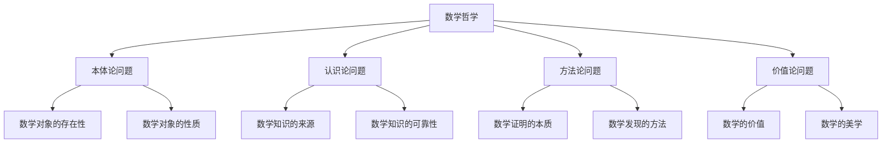

# 02-数学哲学

## 目录

1. [概述](#1-概述)
2. [数学本体论](#2-数学本体论)
3. [数学认识论](#3-数学认识论)
4. [数学方法论](#4-数学方法论)
5. [数学价值观](#5-数学价值观)
6. [数学实在论与反实在论](#6-数学实在论与反实在论)
7. [数学真理观](#7-数学真理观)
8. [数学基础问题](#8-数学基础问题)
9. [数学与逻辑的关系](#9-数学与逻辑的关系)
10. [数学哲学的未来发展](#10-数学哲学的未来发展)

---

## 1. 概述

### 1.1 数学哲学的定义

**数学哲学**是研究数学的本质、基础、方法和价值的哲学分支，它探讨数学对象的存在性、数学知识的性质、数学真理的标准以及数学在人类知识体系中的地位。

**核心问题**：
- 数学对象是否存在？如果存在，它们是什么？
- 我们如何获得数学知识？
- 数学真理的本质是什么？
- 数学与其他学科的关系如何？

### 1.2 数学哲学的研究范围

### 1.3 数学哲学的重要性

1. **基础澄清**：澄清数学的基本概念和假设
2. **方法指导**：为数学研究提供方法论指导
3. **价值反思**：反思数学的价值和意义
4. **学科整合**：促进数学与其他学科的整合

---

## 2. 数学本体论

### 2.1 数学对象的存在性问题

#### 2.1.1 柏拉图主义

**柏拉图主义**认为数学对象是独立于人类思维的抽象实体，存在于一个永恒的、非物质的领域中。

**主要观点**：
- 数学对象是客观存在的
- 数学对象是永恒的、不变的
- 数学对象独立于人类的感知和思维
- 数学发现是发现这些已存在的对象

**论证**：
1. **不可变性论证**：数学真理是永恒不变的
2. **客观性论证**：数学真理对所有理性存在者都相同
3. **应用性论证**：数学在物理世界中的成功应用

#### 2.1.2 概念主义

**概念主义**认为数学对象是人类思维的概念构造，存在于人类的心灵中。

**主要观点**：
- 数学对象是人类思维的产物
- 数学对象依赖于人类的认知能力
- 数学创造是概念构造的过程
- 数学对象具有心理实在性

**论证**：
1. **心理实在性论证**：数学对象在思维中具有实在性
2. **创造性论证**：数学家创造新的数学概念
3. **历史性论证**：数学概念随历史发展而变化

#### 2.1.3 形式主义

**形式主义**认为数学对象是形式符号系统，没有独立的存在性。

**主要观点**：
- 数学对象是符号和规则
- 数学是符号游戏
- 数学真理是形式一致性
- 数学没有内容，只有形式

**论证**：
1. **符号性论证**：数学使用符号系统
2. **规则性论证**：数学遵循形式规则
3. **一致性论证**：数学真理是形式一致性

### 2.2 数学对象的性质

#### 2.2.1 抽象性

**数学对象的抽象性**是指数学对象不依赖于具体的物理实例。

**特征**：
- 不依赖于时空位置
- 不依赖于物理性质
- 具有普遍性
- 具有必然性

**例子**：
- 数字2不依赖于两个苹果或两个橘子
- 圆的概念不依赖于具体的圆形物体
- 函数概念不依赖于具体的物理过程

#### 2.2.2 理想性

**数学对象的理想性**是指数学对象是理想化的构造。

**特征**：
- 完美的性质
- 精确的定义
- 严格的逻辑
- 无矛盾性

**例子**：
- 几何中的点没有大小
- 直线没有宽度
- 圆是完全对称的

#### 2.2.3 关系性

**数学对象的关系性**是指数学对象通过关系定义。

**特征**：
- 通过关系确定性质
- 结构决定对象
- 关系具有逻辑性
- 关系具有传递性

**例子**：
- 自然数通过后继关系定义
- 群通过运算关系定义
- 拓扑空间通过开集关系定义

---

## 3. 数学认识论

### 3.1 数学知识的来源

#### 3.1.1 理性主义

**理性主义**认为数学知识来源于理性思维，不依赖于经验。

**主要观点**：
- 数学知识是先验的
- 数学真理是必然的
- 数学知识通过理性直觉获得
- 数学不依赖于感官经验

**论证**：
1. **必然性论证**：数学真理是必然的
2. **普遍性论证**：数学真理对所有理性存在者都有效
3. **确定性论证**：数学知识具有最高确定性

#### 3.1.2 经验主义

**经验主义**认为数学知识来源于经验，是对经验的抽象和概括。

**主要观点**：
- 数学知识是后验的
- 数学概念来源于经验
- 数学真理需要经验验证
- 数学依赖于感官经验

**论证**：
1. **历史论证**：数学概念在历史中逐渐发展
2. **应用论证**：数学在经验世界中的应用
3. **学习论证**：数学学习需要经验基础

#### 3.1.3 建构主义

**建构主义**认为数学知识是人类主动建构的结果。

**主要观点**：
- 数学知识是建构的
- 数学概念是发明的
- 数学真理是社会约定的
- 数学依赖于人类活动

**论证**：
1. **创造性论证**：数学家创造新的数学概念
2. **社会性论证**：数学知识是社会建构的
3. **历史性论证**：数学概念随历史变化

### 3.2 数学知识的可靠性

#### 3.2.1 数学证明

**数学证明**是确立数学真理的主要方法。

**证明的特征**：
- **逻辑性**：基于逻辑推理
- **严格性**：每个步骤都必须明确
- **完整性**：从前提完全推导出结论
- **客观性**：对所有理性存在者都有效

**证明的类型**：
1. **直接证明**：从前提直接推导结论
2. **间接证明**：通过否定结论推导矛盾
3. **构造性证明**：构造满足条件的对象
4. **存在性证明**：证明对象存在但不构造

#### 3.2.2 数学直觉

**数学直觉**是对数学真理的直接把握。

**直觉的特征**：
- **直接性**：不经过推理直接把握
- **确定性**：具有内在的确定性
- **普遍性**：对所有理性存在者有效
- **基础性**：为其他知识提供基础

**直觉的类型**：
1. **概念直觉**：对数学概念的直接理解
2. **关系直觉**：对数学关系的直接把握
3. **结构直觉**：对数学结构的直接感知
4. **证明直觉**：对证明过程的直接理解

### 3.3 数学知识的增长

#### 3.3.1 数学发现

**数学发现**是发现新的数学真理的过程。

**发现的模式**：
1. **归纳发现**：从特殊到一般的发现
2. **类比发现**：通过类比发现新关系
3. **直觉发现**：通过直觉发现新真理
4. **系统发现**：通过系统化发现新结构

**发现的动力**：
- **内在动力**：数学内在的逻辑发展
- **外在动力**：其他学科的需求
- **美学动力**：数学美的追求
- **实用动力**：实际应用的需要

#### 3.3.2 数学创造

**数学创造**是创造新的数学概念和方法的过程。

**创造的类型**：
1. **概念创造**：创造新的数学概念
2. **方法创造**：创造新的数学方法
3. **理论创造**：创造新的数学理论
4. **应用创造**：创造新的数学应用

**创造的特征**：
- **新颖性**：创造的内容是新的
- **价值性**：创造的内容有价值
- **系统性**：创造的内容具有系统性
- **影响性**：创造的内容有重要影响

---

## 4. 数学方法论

### 4.1 数学证明方法

#### 4.1.1 演绎方法

**演绎方法**是从一般原理推导出特殊结论的方法。

**演绎的特征**：
- **必然性**：结论必然从前提得出
- **保真性**：前提为真则结论为真
- **形式性**：只关注逻辑形式
- **客观性**：不依赖于具体内容

**演绎的类型**：
1. **直接演绎**：从前提直接推导结论
2. **条件演绎**：通过条件句进行推导
3. **否定演绎**：通过否定进行推导
4. **量化演绎**：通过量词进行推导

#### 4.1.2 归纳方法

**归纳方法**是从特殊实例推导出一般结论的方法。

**归纳的特征**：
- **或然性**：结论可能但不必然为真
- **经验性**：基于经验观察
- **概括性**：从特殊概括到一般
- **假设性**：结论是假设性的

**归纳的类型**：
1. **枚举归纳**：通过枚举实例进行归纳
2. **类比归纳**：通过类比进行归纳
3. **统计归纳**：通过统计分析进行归纳
4. **科学归纳**：通过科学方法进行归纳

#### 4.1.3 构造方法

**构造方法**是通过构造对象来证明存在性的方法。

**构造的特征**：
- **具体性**：提供具体的构造过程
- **有效性**：构造过程是有效的
- **明确性**：构造的对象是明确的
- **实用性**：构造的对象可以实际使用

**构造的类型**：
1. **算法构造**：通过算法构造对象
2. **几何构造**：通过几何方法构造对象
3. **代数构造**：通过代数方法构造对象
4. **组合构造**：通过组合方法构造对象

### 4.2 数学发现方法

#### 4.2.1 启发式方法

**启发式方法**是帮助发现数学真理的经验法则。

**启发式的特征**：
- **经验性**：基于经验总结
- **指导性**：提供发现指导
- **灵活性**：可以灵活应用
- **有效性**：在实践中有效

**启发式的类型**：
1. **类比启发**：通过类比寻找相似性
2. **特殊化启发**：通过特殊化简化问题
3. **一般化启发**：通过一般化扩展问题
4. **对称性启发**：利用对称性简化问题

#### 4.2.2 直觉方法

**直觉方法**是通过直觉把握数学真理的方法。

**直觉的特征**：
- **直接性**：直接把握真理
- **整体性**：整体把握对象
- **创造性**：具有创造性特征
- **不可言传性**：难以完全用语言表达

**直觉的类型**：
1. **概念直觉**：对概念的直接理解
2. **关系直觉**：对关系的直接把握
3. **结构直觉**：对结构的直接感知
4. **证明直觉**：对证明的直接理解

### 4.3 数学验证方法

#### 4.3.1 逻辑验证

**逻辑验证**是通过逻辑推理验证数学真理的方法。

**逻辑验证的特征**：
- **严格性**：要求严格的逻辑推理
- **形式性**：关注逻辑形式
- **客观性**：不依赖于主观判断
- **普遍性**：对所有理性存在者有效

**逻辑验证的方法**：
1. **公理化方法**：从公理推导定理
2. **形式化方法**：使用形式系统
3. **模型论方法**：通过模型验证
4. **证明论方法**：通过证明理论验证

#### 4.3.2 经验验证

**经验验证**是通过经验观察验证数学真理的方法。

**经验验证的特征**：
- **观察性**：基于经验观察
- **可重复性**：可以重复验证
- **客观性**：不依赖于主观判断
- **有限性**：只能验证有限实例

**经验验证的方法**：
1. **实验验证**：通过实验验证
2. **统计验证**：通过统计分析验证
3. **应用验证**：通过实际应用验证
4. **计算验证**：通过计算验证

---

## 5. 数学价值观

### 5.1 数学的内在价值

#### 5.1.1 真理性价值

**数学的真理性价值**是指数学追求真理的价值。

**真理的特征**：
- **客观性**：独立于主观判断
- **必然性**：在逻辑上必然为真
- **普遍性**：对所有理性存在者有效
- **永恒性**：不受时间影响

**真理的价值**：
1. **认识价值**：帮助认识世界
2. **指导价值**：指导实践活动
3. **规范价值**：规范思维活动
4. **超越价值**：超越经验世界

#### 5.1.2 美学价值

**数学的美学价值**是指数学所具有的美学特征。

**数学美的特征**：
- **简洁性**：表达简洁明了
- **对称性**：结构对称和谐
- **统一性**：理论统一完整
- **深刻性**：内涵深刻丰富

**数学美的类型**：
1. **形式美**：数学表达的形式美
2. **结构美**：数学结构的和谐美
3. **思想美**：数学思想的深刻美
4. **创造美**：数学创造的创新美

#### 5.1.3 理性价值

**数学的理性价值**是指数学培养理性思维的价值。

**理性的特征**：
- **逻辑性**：遵循逻辑规则
- **系统性**：具有系统结构
- **批判性**：具有批判精神
- **创造性**：具有创造能力

**理性的价值**：
1. **思维价值**：培养逻辑思维
2. **方法价值**：提供思维方法
3. **精神价值**：培养理性精神
4. **文化价值**：丰富文化内涵

### 5.2 数学的工具价值

#### 5.2.1 科学工具价值

**数学作为科学工具的价值**是指数学在科学研究中的作用。

**科学应用**：
- **物理学**：描述物理规律
- **化学**：分析化学过程
- **生物学**：建立生物模型
- **经济学**：分析经济现象

**工具特征**：
1. **精确性**：提供精确描述
2. **预测性**：提供预测能力
3. **解释性**：提供解释框架
4. **控制性**：提供控制方法

#### 5.2.2 技术工具价值

**数学作为技术工具的价值**是指数学在技术发展中的作用。

**技术应用**：
- **计算机科学**：算法和数据结构
- **通信技术**：编码和加密
- **工程设计**：建模和优化
- **医学技术**：诊断和治疗

**技术特征**：
1. **实用性**：解决实际问题
2. **效率性**：提高工作效率
3. **创新性**：促进技术创新
4. **可靠性**：保证技术可靠

#### 5.2.3 社会工具价值

**数学作为社会工具的价值**是指数学在社会发展中的作用。

**社会应用**：
- **教育**：培养数学素养
- **管理**：提供管理方法
- **决策**：支持决策制定
- **文化**：丰富文化生活

**社会特征**：
1. **普及性**：广泛普及应用
2. **基础性**：提供基础工具
3. **发展性**：促进社会发展
4. **文化性**：丰富文化内涵

### 5.3 数学的教育价值

#### 5.3.1 智力发展价值

**数学对智力发展的价值**是指数学在培养智力方面的作用。

**智力培养**：
- **逻辑思维**：培养逻辑推理能力
- **抽象思维**：培养抽象思维能力
- **空间思维**：培养空间想象能力
- **创造性思维**：培养创造性思维能力

**发展特征**：
1. **系统性**：系统培养各种能力
2. **渐进性**：逐步提高能力水平
3. **全面性**：全面培养智力素质
4. **持久性**：具有持久的影响

#### 5.3.2 品格培养价值

**数学对品格培养的价值**是指数学在培养品格方面的作用。

**品格培养**：
- **严谨性**：培养严谨的品格
- **诚实性**：培养诚实的品格
- **坚持性**：培养坚持的品格
- **合作性**：培养合作的品格

**培养特征**：
1. **潜移默化**：在数学学习中潜移默化
2. **实践性**：通过实践培养品格
3. **持久性**：具有持久的影响
4. **普遍性**：对所有学习者有效

---

## 6. 数学实在论与反实在论

### 6.1 数学实在论

#### 6.1.1 柏拉图实在论

**柏拉图实在论**认为数学对象是独立存在的抽象实体。

**主要观点**：
- 数学对象客观存在
- 数学对象独立于人类思维
- 数学发现是发现已存在的对象
- 数学真理是客观的

**论证**：
1. **不可变性论证**：数学真理永恒不变
2. **客观性论证**：数学真理对所有理性存在者相同
3. **应用性论证**：数学在物理世界中的成功应用

#### 6.1.2 亚里士多德实在论

**亚里士多德实在论**认为数学对象是抽象于物理对象的性质。

**主要观点**：
- 数学对象来源于物理对象
- 数学对象是物理对象的抽象
- 数学知识基于经验
- 数学真理具有经验基础

**论证**：
1. **经验论证**：数学概念来源于经验
2. **抽象论证**：数学对象是抽象的结果
3. **应用论证**：数学在经验世界中的应用

### 6.2 数学反实在论

#### 6.2.1 形式主义

**形式主义**认为数学是符号游戏，没有独立的内容。

**主要观点**：
- 数学对象是符号
- 数学是形式系统
- 数学真理是形式一致性
- 数学没有内容

**论证**：
1. **符号论证**：数学使用符号系统
2. **规则论证**：数学遵循形式规则
3. **一致性论证**：数学真理是形式一致性

#### 6.2.2 约定主义

**约定主义**认为数学真理是社会约定的结果。

**主要观点**：
- 数学真理是社会约定
- 数学规则是人为制定的
- 数学真理具有相对性
- 数学依赖于社会背景

**论证**：
1. **社会论证**：数学规则是社会制定的
2. **历史论证**：数学概念随历史变化
3. **文化论证**：数学依赖于文化背景

#### 6.2.3 虚构主义

**虚构主义**认为数学对象是虚构的，不存在。

**主要观点**：
- 数学对象不存在
- 数学陈述是虚构的
- 数学真理是虚构真理
- 数学是虚构故事

**论证**：
1. **本体论证**：数学对象无法观察
2. **认识论证**：无法认识不存在的对象
3. **因果论证**：数学对象没有因果作用

### 6.3 中间立场

#### 6.3.1 结构主义

**结构主义**认为数学对象是结构中的位置。

**主要观点**：
- 数学对象是结构位置
- 数学关注结构关系
- 数学真理是结构真理
- 数学对象通过结构定义

**论证**：
1. **结构论证**：数学关注结构关系
2. **关系论证**：数学对象通过关系定义
3. **抽象论证**：结构是抽象的结果

#### 6.3.2 模态主义

**模态主义**认为数学陈述是关于可能性的陈述。

**主要观点**：
- 数学陈述是模态陈述
- 数学真理是模态真理
- 数学对象是可能对象
- 数学依赖于可能性

**论证**：
1. **模态论证**：数学陈述具有模态特征
2. **可能性论证**：数学对象是可能的
3. **逻辑论证**：数学依赖于逻辑可能性

---

## 7. 数学真理观

### 7.1 符合论真理观

#### 7.1.1 经典符合论

**经典符合论**认为数学真理是数学陈述与数学事实的符合。

**主要观点**：
- 数学真理是陈述与事实的符合
- 数学事实客观存在
- 数学真理是客观的
- 数学真理独立于认识者

**问题**：
1. **事实问题**：数学事实的性质
2. **符合问题**：如何理解符合关系
3. **认识问题**：如何认识数学事实

#### 7.1.2 修正符合论

**修正符合论**是对经典符合论的修正和发展。

**修正观点**：
- 数学事实是抽象事实
- 符合关系是抽象关系
- 数学真理具有抽象性
- 数学真理具有必然性

**优势**：
1. **解释力**：能够解释数学真理的必然性
2. **一致性**：与数学实践一致
3. **简单性**：理论相对简单

### 7.2 融贯论真理观

#### 7.2.1 逻辑融贯论

**逻辑融贯论**认为数学真理是数学陈述之间的逻辑融贯。

**主要观点**：
- 数学真理是逻辑融贯
- 数学陈述相互一致
- 数学真理是系统性的
- 数学真理依赖于逻辑关系

**特征**：
1. **系统性**：真理是系统的
2. **一致性**：陈述相互一致
3. **逻辑性**：基于逻辑关系
4. **整体性**：真理是整体的

#### 7.2.2 理论融贯论

**理论融贯论**认为数学真理是数学理论内部的融贯。

**主要观点**：
- 数学真理是理论融贯
- 数学理论内部一致
- 数学真理是理论性的
- 数学真理依赖于理论结构

**特征**：
1. **理论性**：真理是理论性的
2. **结构性**：依赖于理论结构
3. **系统性**：真理是系统的
4. **整体性**：真理是整体的

### 7.3 实用论真理观

#### 7.3.1 工具主义

**工具主义**认为数学真理是数学工具的有效性。

**主要观点**：
- 数学真理是工具有效性
- 数学是解决问题的工具
- 数学真理是实用的
- 数学真理依赖于效果

**特征**：
1. **实用性**：真理是实用的
2. **有效性**：工具是有效的
3. **目的性**：服务于目的
4. **效果性**：依赖于效果

#### 7.3.2 建构主义

**建构主义**认为数学真理是数学建构的结果。

**主要观点**：
- 数学真理是建构结果
- 数学是人类建构的
- 数学真理是社会性的
- 数学真理依赖于建构活动

**特征**：
1. **建构性**：真理是建构的
2. **社会性**：真理是社会性的
3. **历史性**：真理具有历史性
4. **活动性**：依赖于建构活动

---

## 8. 数学基础问题

### 8.1 集合论基础

#### 8.1.1 集合论悖论

**罗素悖论**：考虑所有不包含自身的集合的集合。

**悖论分析**：
- 如果R包含自身，则R不包含自身
- 如果R不包含自身，则R包含自身
- 这导致矛盾

**解决方案**：
1. **类型论**：限制集合的层次
2. **公理化**：通过公理限制集合
3. **直觉主义**：拒绝排中律

#### 8.1.2 选择公理

**选择公理**：对于任何非空集合族，存在选择函数。

**公理内容**：
- 对于任何非空集合族$\{A_i\}_{i \in I}$
- 存在函数$f: I \to \bigcup_{i \in I} A_i$
- 使得$f(i) \in A_i$对所有$i \in I$成立

**争议**：
1. **非构造性**：不提供构造方法
2. **反直觉性**：与直觉不符
3. **必要性**：许多定理需要它

### 8.2 逻辑基础

#### 8.2.1 排中律问题

**排中律**：对于任何命题P，P或非P为真。

**直觉主义观点**：
- 拒绝排中律
- 要求构造性证明
- 强调数学的构造性

**经典逻辑观点**：
- 接受排中律
- 允许非构造性证明
- 强调数学的抽象性

#### 8.2.2 无穷问题

**潜无穷**：无穷是一个过程，永远进行中。

**实无穷**：无穷是一个完成的整体。

**争论焦点**：
1. **存在性**：无穷是否存在
2. **性质**：无穷的性质
3. **处理**：如何处理无穷

### 8.3 形式化基础

#### 8.3.1 形式化系统

**形式化系统**：将数学理论形式化为符号系统。

**系统组成**：
- **符号**：基本符号
- **公式**：符号组合
- **公理**：基本公式
- **规则**：推理规则

**系统特征**：
1. **精确性**：符号精确
2. **机械性**：规则机械
3. **完全性**：理论完全
4. **一致性**：理论一致

#### 8.3.2 不完全性定理

**哥德尔不完全性定理**：
- 任何足够强的形式系统都是不完全的
- 任何足够强的形式系统都无法证明自身的一致性

**定理意义**：
1. **限制性**：限制形式化的能力
2. **深刻性**：揭示数学的深刻性质
3. **哲学性**：具有哲学意义

---

## 9. 数学与逻辑的关系

### 9.1 数学的逻辑基础

#### 9.1.1 逻辑作为数学基础

**逻辑基础论**：数学建立在逻辑基础之上。

**主要观点**：
- 数学概念可以还原为逻辑概念
- 数学真理是逻辑真理
- 数学证明是逻辑推理
- 数学依赖于逻辑

**论证**：
1. **还原论证**：数学可以还原为逻辑
2. **证明论证**：数学证明是逻辑推理
3. **概念论证**：数学概念基于逻辑概念

#### 9.1.2 逻辑主义

**逻辑主义**：数学是逻辑的延伸。

**主要观点**：
- 数学是逻辑的一部分
- 数学真理是逻辑真理
- 数学概念是逻辑概念
- 数学方法基于逻辑方法

**代表人物**：
- **弗雷格**：数学基础研究
- **罗素**：类型论
- **怀特海**：数学原理

### 9.2 数学的逻辑结构

#### 9.2.1 数学推理

**数学推理**：基于逻辑规则的推理。

**推理类型**：
1. **演绎推理**：从一般到特殊
2. **归纳推理**：从特殊到一般
3. **类比推理**：基于相似性
4. **反证推理**：通过否定推导

**推理特征**：
- **严格性**：要求严格推理
- **有效性**：推理必须有效
- **清晰性**：推理过程清晰
- **完整性**：推理过程完整

#### 9.2.2 数学证明

**数学证明**：通过逻辑推理确立数学真理。

**证明结构**：
1. **前提**：已知的数学真理
2. **推理**：逻辑推理过程
3. **结论**：要证明的数学真理

**证明要求**：
- **正确性**：推理必须正确
- **完整性**：证明必须完整
- **清晰性**：证明必须清晰
- **简洁性**：证明应该简洁

### 9.3 逻辑的数学化

#### 9.3.1 数理逻辑

**数理逻辑**：使用数学方法研究逻辑。

**研究内容**：
- **命题逻辑**：命题之间的关系
- **谓词逻辑**：量词和谓词
- **模态逻辑**：可能性和必然性
- **直觉逻辑**：构造性逻辑

**数学方法**：
1. **形式化**：将逻辑形式化
2. **公理化**：建立公理系统
3. **模型论**：研究模型
4. **证明论**：研究证明

#### 9.3.2 逻辑代数

**逻辑代数**：将逻辑代数化。

**代数结构**：
- **布尔代数**：二值逻辑代数
- **格论**：偏序集代数
- **范畴论**：抽象代数结构
- **拓扑学**：拓扑代数

**应用领域**：
1. **计算机科学**：逻辑电路
2. **人工智能**：逻辑推理
3. **语言学**：形式语义
4. **哲学**：逻辑哲学

---

## 10. 数学哲学的未来发展

### 10.1 技术发展对数学哲学的影响

#### 10.1.1 人工智能与数学哲学

**AI对数学哲学的影响**：
- **数学发现**：AI辅助数学发现
- **数学证明**：AI辅助数学证明
- **数学理解**：AI对数学的理解
- **数学创造**：AI的数学创造

**哲学问题**：
1. **AI数学能力**：AI是否具有数学能力
2. **数学理解**：AI是否理解数学
3. **数学创造**：AI是否创造数学
4. **数学本质**：AI揭示的数学本质

#### 10.1.2 计算数学与数学哲学

**计算数学的影响**：
- **算法思维**：算法在数学中的作用
- **计算复杂性**：计算的复杂性
- **数值方法**：数值计算的方法
- **模拟方法**：数学模拟的方法

**哲学问题**：
1. **算法本质**：算法的哲学本质
2. **计算本质**：计算的哲学本质
3. **复杂性**：复杂性的哲学意义
4. **模拟**：模拟的哲学地位

### 10.2 跨学科发展

#### 10.2.1 数学与认知科学

**认知科学的影响**：
- **数学认知**：数学认知的研究
- **数学学习**：数学学习的过程
- **数学思维**：数学思维的本质
- **数学直觉**：数学直觉的作用

**哲学问题**：
1. **认知基础**：数学的认知基础
2. **学习机制**：数学学习的机制
3. **思维本质**：数学思维的本质
4. **直觉作用**：直觉在数学中的作用

#### 10.2.2 数学与神经科学

**神经科学的影响**：
- **数学脑机制**：数学的脑机制
- **数学发展**：数学能力的发展
- **数学障碍**：数学学习障碍
- **数学训练**：数学训练的效果

**哲学问题**：
1. **脑与数学**：脑与数学的关系
2. **发展机制**：数学发展的机制
3. **障碍原因**：数学障碍的原因
4. **训练效果**：数学训练的效果

### 10.3 理论整合与发展

#### 10.3.1 多元主义

**数学哲学多元主义**：接受多种数学哲学观点。

**多元主义特征**：
- **包容性**：包容不同观点
- **对话性**：促进观点对话
- **整合性**：整合不同观点
- **发展性**：促进理论发展

**多元主义优势**：
1. **丰富性**：理论更加丰富
2. **灵活性**：理论更加灵活
3. **适应性**：理论更加适应
4. **发展性**：理论更加发展

#### 10.3.2 实用主义

**数学哲学实用主义**：强调数学的实用性。

**实用主义特征**：
- **实用性**：强调实用价值
- **效果性**：重视实际效果
- **工具性**：强调工具作用
- **发展性**：促进数学发展

**实用主义优势**：
1. **现实性**：更加现实
2. **有效性**：更加有效
3. **发展性**：促进发展
4. **应用性**：重视应用

### 10.4 未来研究方向

#### 10.4.1 基础问题研究

**基础问题**：
- **数学本质**：数学的本质是什么
- **数学真理**：数学真理的标准
- **数学对象**：数学对象的性质
- **数学方法**：数学方法的本质

**研究方向**：
1. **本体论研究**：数学对象的存在性
2. **认识论研究**：数学知识的性质
3. **方法论研究**：数学方法的本质
4. **价值论研究**：数学的价值

#### 10.4.2 应用问题研究

**应用问题**：
- **数学应用**：数学在其他学科中的应用
- **数学教育**：数学教育的方法
- **数学文化**：数学文化的传播
- **数学社会**：数学在社会中的作用

**研究方向**：
1. **跨学科研究**：数学与其他学科的关系
2. **教育研究**：数学教育的研究
3. **文化研究**：数学文化的研究
4. **社会研究**：数学社会的研究

---

## 总结

数学哲学作为一门重要的哲学分支，为我们理解数学的本质、基础、方法和价值提供了重要的理论框架。通过深入研究数学本体论、认识论、方法论和价值观，我们能够更好地理解数学在人类知识体系中的地位和作用。

未来的数学哲学研究将继续探索数学与新技术、新学科的关系，推动数学哲学理论的整合和发展。这将为数学教育、数学应用和数学文化的发展提供重要的哲学指导。

---

**参考文献**

1. Benacerraf, P., & Putnam, H. (1983). *Philosophy of Mathematics: Selected Readings*. Cambridge University Press.
2. Shapiro, S. (2000). *Thinking About Mathematics: The Philosophy of Mathematics*. Oxford University Press.
3. Maddy, P. (1997). *Naturalism in Mathematics*. Oxford University Press.
4. Field, H. (1980). *Science Without Numbers*. Princeton University Press.
5. Quine, W. V. O. (1981). *Mathematical Logic*. Harvard University Press. 