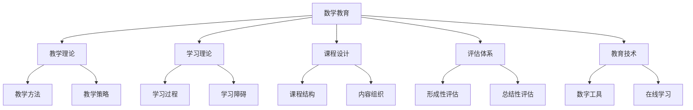

# 03-数学教育

## 目录

1. [概述](#1-概述)
2. [数学教育理论](#2-数学教育理论)
3. [数学教学方法](#3-数学教学方法)
4. [数学学习理论](#4-数学学习理论)
5. [数学课程设计](#5-数学课程设计)
6. [数学评估体系](#6-数学评估体系)
7. [数学教育技术](#7-数学教育技术)
8. [数学教师发展](#8-数学教师发展)
9. [数学教育研究](#9-数学教育研究)
10. [数学教育未来](#10-数学教育未来)

---

## 1. 概述

### 1.1 数学教育的定义

**数学教育**是研究数学教学、学习和评估的教育学分支，它探讨如何有效地传授数学知识、培养数学能力和发展数学思维。

**核心问题**：
- 如何有效地教授数学概念和方法？
- 学生如何学习和理解数学？
- 如何评估数学学习的效果？
- 如何培养数学思维和创新能力？

### 1.2 数学教育的研究范围

### 1.3 数学教育的重要性

1. **基础素养**：培养公民的数学素养
2. **思维能力**：发展逻辑思维和创造性思维
3. **学科基础**：为其他学科提供数学基础
4. **创新能力**：培养创新思维和问题解决能力

---

## 2. 数学教育理论

### 2.1 行为主义教育理论

#### 2.1.1 斯金纳的操作性条件反射

**主要观点**：
- 学习是刺激-反应-强化的过程
- 通过强化建立数学行为
- 强调练习和反馈的重要性
- 数学技能通过训练获得

**教学方法**：
1. **程序教学**：将数学内容分解为小步骤
2. **即时反馈**：对每个反应提供即时反馈
3. **强化练习**：通过重复练习强化技能
4. **行为塑造**：逐步塑造复杂的数学行为

**应用**：
- 基本运算技能训练
- 数学公式记忆
- 解题步骤练习
- 数学概念应用

#### 2.1.2 桑代克的试误学习

**主要观点**：
- 学习通过试误过程进行
- 成功的行为被保留，失败的行为被消除
- 强调练习和重复的重要性
- 数学学习是渐进的过程

**教学方法**：
1. **问题解决**：通过解决问题学习
2. **试误法**：允许学生尝试和犯错
3. **经验积累**：通过经验积累数学知识
4. **规律发现**：通过试误发现数学规律

### 2.2 认知主义教育理论

#### 2.2.1 皮亚杰的认知发展理论

**认知发展阶段**：

1. **感知运动期**（0-2岁）
   - 通过感官和动作认识世界
   - 发展对象永久性概念
   - 开始理解数量关系

2. **前运算期**（2-7岁）
   - 开始使用符号和语言
   - 发展数量守恒概念
   - 能够进行简单计数

3. **具体运算期**（7-11岁）
   - 能够进行逻辑推理
   - 掌握基本的数学运算
   - 理解数学概念

4. **形式运算期**（11岁以上）
   - 能够进行抽象推理
   - 掌握复杂的数学概念
   - 能够进行数学证明

**教学方法**：
1. **适应发展水平**：根据认知发展阶段设计教学
2. **促进认知冲突**：通过认知冲突促进发展
3. **提供具体经验**：从具体到抽象
4. **鼓励主动探索**：让学生主动探索数学

#### 2.2.2 布鲁纳的发现学习

**主要观点**：
- 学习是主动发现的过程
- 强调直觉思维的重要性
- 数学知识应该通过发现获得
- 重视数学结构的学习

**教学方法**：
1. **发现法**：让学生发现数学规律
2. **直觉教学**：培养数学直觉
3. **结构教学**：教授数学结构
4. **螺旋式教学**：螺旋式地教授概念

### 2.3 建构主义教育理论

#### 2.3.1 维果茨基的社会建构主义

**主要观点**：
- 学习是社会建构的过程
- 强调社会互动的重要性
- 最近发展区的概念
- 语言在数学学习中的作用

**教学方法**：
1. **合作学习**：通过合作学习数学
2. **支架式教学**：提供适当的支架支持
3. **社会互动**：促进师生和生生互动
4. **语言发展**：发展数学语言能力

#### 2.3.2 皮亚杰的个体建构主义

**主要观点**：
- 学习是个体主动建构的过程
- 强调同化和顺应的作用
- 数学知识是建构的结果
- 重视学生的主动参与

**教学方法**：
1. **主动建构**：让学生主动建构知识
2. **情境教学**：在真实情境中学习
3. **探究学习**：通过探究学习数学
4. **反思学习**：鼓励学生反思学习过程

### 2.4 人本主义教育理论

#### 2.4.1 罗杰斯的学生中心教学

**主要观点**：
- 以学生为中心的教学
- 强调学生的情感和动机
- 重视学生的自我实现
- 教师是学习的促进者

**教学方法**：
1. **学生中心**：以学生为中心设计教学
2. **情感支持**：提供情感支持
3. **自主学习**：鼓励自主学习
4. **个性化教学**：根据学生特点教学

---

## 3. 数学教学方法

### 3.1 传统教学方法

#### 3.1.1 讲授法

**讲授法**是教师通过语言向学生传授数学知识的方法。

**特点**：
- 教师主导，学生被动接受
- 信息传递效率高
- 适合大班教学
- 学生参与度低

**适用情况**：
1. **概念介绍**：介绍新的数学概念
2. **理论讲解**：讲解数学理论
3. **方法演示**：演示解题方法
4. **知识总结**：总结数学知识

**改进策略**：
- 增加互动环节
- 使用多媒体辅助
- 结合具体例子
- 鼓励学生提问

#### 3.1.2 练习法

**练习法**是通过反复练习掌握数学技能的方法。

**特点**：
- 强调技能训练
- 通过重复提高熟练度
- 适合技能性内容
- 可能产生机械学习

**练习类型**：
1. **基础练习**：基本技能练习
2. **应用练习**：应用技能练习
3. **综合练习**：综合技能练习
4. **创新练习**：创新性练习

**设计原则**：
- 循序渐进
- 多样化
- 有针对性
- 适度重复

### 3.2 现代教学方法

#### 3.2.1 问题解决教学

**问题解决教学**是通过解决数学问题来学习数学的方法。

**特点**：
- 以问题为中心
- 强调思维过程
- 培养问题解决能力
- 促进深度学习

**问题类型**：
1. **开放性问题**：有多种解法的问题
2. **探究性问题**：需要探究的问题
3. **应用性问题**：实际应用问题
4. **创新性问题**：需要创新思维的问题

**教学步骤**：
1. **问题呈现**：呈现数学问题
2. **问题分析**：分析问题特征
3. **策略选择**：选择解决策略
4. **方案实施**：实施解决方案
5. **结果验证**：验证解决结果
6. **反思总结**：反思解决过程

#### 3.2.2 探究式教学

**探究式教学**是让学生通过探究活动学习数学的方法。

**特点**：
- 学生主动探究
- 强调发现过程
- 培养探究能力
- 促进创新思维

**探究模式**：
1. **观察模式**：通过观察发现规律
2. **实验模式**：通过实验验证假设
3. **推理模式**：通过推理得出结论
4. **建模模式**：通过建模解决问题

**教学步骤**：
1. **情境创设**：创设探究情境
2. **问题提出**：提出探究问题
3. **假设形成**：形成探究假设
4. **方案设计**：设计探究方案
5. **数据收集**：收集探究数据
6. **结果分析**：分析探究结果
7. **结论得出**：得出探究结论

#### 3.2.3 合作学习

**合作学习**是学生通过合作活动学习数学的方法。

**特点**：
- 学生相互合作
- 强调团队精神
- 促进交流沟通
- 培养合作能力

**合作模式**：
1. **小组讨论**：小组内讨论问题
2. **同伴教学**：同伴间相互教学
3. **项目合作**：合作完成项目
4. **竞赛合作**：合作参加竞赛

**组织策略**：
1. **合理分组**：根据学生特点分组
2. **明确任务**：明确合作任务
3. **角色分工**：合理分工角色
4. **过程监控**：监控合作过程
5. **结果评价**：评价合作结果

### 3.3 技术辅助教学

#### 3.3.1 多媒体教学

**多媒体教学**是使用多媒体技术辅助数学教学的方法。

**技术工具**：
1. **计算机软件**：数学软件和工具
2. **投影设备**：投影仪和电子白板
3. **网络资源**：在线数学资源
4. **移动设备**：平板电脑和手机

**应用方式**：
1. **概念演示**：演示数学概念
2. **过程展示**：展示解题过程
3. **互动练习**：进行互动练习
4. **资源分享**：分享学习资源

#### 3.3.2 在线教学

**在线教学**是通过网络进行数学教学的方法。

**平台类型**：
1. **学习管理系统**：如Moodle、Canvas
2. **视频会议平台**：如Zoom、Teams
3. **数学学习平台**：如Khan Academy
4. **社交媒体**：如微信、QQ

**教学模式**：
1. **同步教学**：实时在线教学
2. **异步教学**：非实时在线教学
3. **混合教学**：线上线下结合
4. **翻转课堂**：课前学习，课堂讨论

---

## 4. 数学学习理论

### 4.1 数学学习过程

#### 4.1.1 数学概念学习

**概念学习过程**：

1. **感知阶段**：感知数学对象
   - 观察数学对象
   - 识别对象特征
   - 形成初步印象

2. **分析阶段**：分析对象特征
   - 识别关键特征
   - 区分本质和非本质特征
   - 建立特征联系

3. **抽象阶段**：抽象概念本质
   - 提取本质特征
   - 形成概念定义
   - 建立概念结构

4. **应用阶段**：应用概念解决问题
   - 识别概念实例
   - 应用概念推理
   - 解决相关问题

**概念学习策略**：
1. **多表征策略**：使用多种表征方式
2. **对比策略**：通过对比理解概念
3. **分类策略**：通过分类组织概念
4. **应用策略**：通过应用巩固概念

#### 4.1.2 数学技能学习

**技能学习过程**：

1. **认知阶段**：理解技能要求
   - 理解技能目标
   - 分析技能步骤
   - 制定执行计划

2. **联系阶段**：练习技能操作
   - 模仿技能操作
   - 练习基本步骤
   - 建立操作联系

3. **自动化阶段**：技能自动化
   - 熟练技能操作
   - 减少认知负荷
   - 提高操作效率

**技能学习策略**：
1. **分解策略**：将复杂技能分解
2. **练习策略**：通过练习提高熟练度
3. **反馈策略**：及时提供反馈
4. **迁移策略**：促进技能迁移

### 4.2 数学学习障碍

#### 4.2.1 认知障碍

**认知障碍类型**：

1. **注意力障碍**：难以集中注意力
   - 注意力分散
   - 注意力持续时间短
   - 注意力转移困难

2. **记忆障碍**：数学记忆困难
   - 工作记忆容量小
   - 长时记忆存储困难
   - 记忆提取困难

3. **思维障碍**：数学思维困难
   - 抽象思维困难
   - 逻辑推理困难
   - 空间思维困难

**干预策略**：
1. **注意力训练**：训练注意力能力
2. **记忆策略**：教授记忆策略
3. **思维训练**：训练思维能力
4. **个性化教学**：根据特点教学

#### 4.2.2 情感障碍

**情感障碍类型**：

1. **数学焦虑**：对数学的恐惧和焦虑
   - 考试焦虑
   - 学习焦虑
   - 应用焦虑

2. **数学动机**：数学学习动机不足
   - 内在动机缺乏
   - 外在动机不足
   - 成就动机低

3. **数学自信**：数学自信心不足
   - 自我效能感低
   - 归因偏差
   - 自我概念消极

**干预策略**：
1. **情感支持**：提供情感支持
2. **成功体验**：创造成功体验
3. **动机激发**：激发学习动机
4. **自信培养**：培养数学自信

### 4.3 数学学习策略

#### 4.3.1 认知策略

**认知策略类型**：

1. **复述策略**：重复练习和复习
   - 机械复述
   - 意义复述
   - 精细复述

2. **精加工策略**：对信息进行深度加工
   - 联想加工
   - 类比加工
   - 推理加工

3. **组织策略**：将信息组织成有意义的单元
   - 分类组织
   - 层次组织
   - 网络组织

**策略训练**：
1. **策略介绍**：介绍学习策略
2. **策略示范**：示范策略使用
3. **策略练习**：练习策略使用
4. **策略迁移**：迁移策略应用

#### 4.3.2 元认知策略

**元认知策略类型**：

1. **计划策略**：制定学习计划
   - 目标设定
   - 时间安排
   - 资源分配

2. **监控策略**：监控学习过程
   - 过程监控
   - 进度监控
   - 效果监控

3. **调节策略**：调节学习策略
   - 策略调整
   - 方法改进
   - 计划修改

**元认知培养**：
1. **元认知意识**：培养元认知意识
2. **元认知知识**：教授元认知知识
3. **元认知技能**：训练元认知技能
4. **元认知体验**：创造元认知体验

---

## 5. 数学课程设计

### 5.1 课程设计原则

#### 5.1.1 发展性原则

**发展性原则**：课程设计要促进学生的发展。

**具体要求**：
1. **认知发展**：促进认知能力发展
2. **情感发展**：促进情感态度发展
3. **社会性发展**：促进社会性发展
4. **创造性发展**：促进创造性发展

**设计策略**：
- 根据学生发展水平设计
- 提供发展机会
- 创造发展环境
- 评价发展效果

#### 5.1.2 系统性原则

**系统性原则**：课程设计要具有系统性。

**具体要求**：
1. **内容系统**：内容组织系统化
2. **结构系统**：课程结构系统化
3. **方法系统**：教学方法系统化
4. **评价系统**：评价体系系统化

**设计策略**：
- 建立知识体系
- 设计学习序列
- 安排教学进度
- 制定评价标准

#### 5.1.3 实用性原则

**实用性原则**：课程设计要注重实用性。

**具体要求**：
1. **生活实用**：与生活实际联系
2. **职业实用**：与职业发展相关
3. **社会实用**：与社会需求结合
4. **个人实用**：与个人发展相关

**设计策略**：
- 选择实用内容
- 设计实用活动
- 联系实际应用
- 培养实用能力

### 5.2 课程内容组织

#### 5.2.1 内容结构设计

**内容结构类型**：

1. **线性结构**：按逻辑顺序组织内容
   - 从简单到复杂
   - 从具体到抽象
   - 从基础到应用

2. **螺旋结构**：螺旋式地组织内容
   - 重复出现核心概念
   - 逐步深化理解
   - 不断扩大应用

3. **网络结构**：网络式地组织内容
   - 概念间相互联系
   - 多角度理解概念
   - 建立知识网络

**设计原则**：
- 符合认知规律
- 便于理解掌握
- 促进知识迁移
- 支持能力发展

#### 5.2.2 内容难度设计

**难度设计原则**：

1. **适中性原则**：难度要适中
   - 符合学生水平
   - 具有挑战性
   - 能够完成

2. **渐进性原则**：难度要渐进
   - 逐步提高难度
   - 避免跳跃过大
   - 保持连续性

3. **个性化原则**：难度要个性化
   - 考虑个体差异
   - 提供选择机会
   - 支持个性化学习

**设计策略**：
- 分析学生水平
- 设计难度梯度
- 提供支持策略
- 监控学习效果

### 5.3 课程实施策略

#### 5.3.1 教学策略

**教学策略类型**：

1. **直接教学**：教师直接传授知识
   - 讲授法
   - 演示法
   - 指导法

2. **间接教学**：学生主动学习
   - 发现法
   - 探究法
   - 合作法

3. **混合教学**：直接和间接结合
   - 讲授与讨论结合
   - 演示与练习结合
   - 指导与探究结合

**选择原则**：
- 根据内容特点选择
- 根据学生特点选择
- 根据教学目标选择
- 根据教学条件选择

#### 5.3.2 学习策略

**学习策略类型**：

1. **接受学习**：接受教师传授的知识
   - 听讲
   - 阅读
   - 观察

2. **发现学习**：主动发现知识
   - 探究
   - 实验
   - 推理

3. **合作学习**：与他人合作学习
   - 讨论
   - 合作
   - 交流

**指导原则**：
- 培养学习能力
- 提高学习效率
- 促进深度学习
- 支持终身学习

---

## 6. 数学评估体系

### 6.1 评估类型

#### 6.1.1 形成性评估

**形成性评估**是在教学过程中进行的评估。

**目的**：
- 了解学习进展
- 诊断学习问题
- 调整教学策略
- 促进学习改进

**方法**：
1. **课堂观察**：观察学生学习行为
2. **作业检查**：检查学生作业完成情况
3. **课堂提问**：通过提问了解理解情况
4. **小测验**：进行小规模测验

**特点**：
- 过程性
- 诊断性
- 指导性
- 发展性

#### 6.1.2 总结性评估

**总结性评估**是在教学结束后进行的评估。

**目的**：
- 评价学习成果
- 判断学习水平
- 提供学习证明
- 支持决策制定

**方法**：
1. **期末考试**：学期末的考试
2. **标准化测验**：标准化的数学测验
3. **项目评估**：项目完成情况评估
4. **综合评估**：综合性的学习评估

**特点**：
- 结果性
- 判断性
- 证明性
- 决策性

### 6.2 评估内容

#### 6.2.1 知识评估

**知识评估内容**：

1. **概念理解**：对数学概念的理解
   - 概念定义
   - 概念性质
   - 概念关系
   - 概念应用

2. **技能掌握**：对数学技能的掌握
   - 计算技能
   - 推理技能
   - 证明技能
   - 应用技能

3. **方法运用**：对数学方法的运用
   - 解题方法
   - 证明方法
   - 建模方法
   - 分析方法

**评估方法**：
- 选择题
- 填空题
- 计算题
- 证明题
- 应用题

#### 6.2.2 能力评估

**能力评估内容**：

1. **思维能力**：数学思维能力
   - 逻辑思维
   - 抽象思维
   - 空间思维
   - 创造性思维

2. **问题解决能力**：数学问题解决能力
   - 问题理解
   - 策略选择
   - 方案实施
   - 结果验证

3. **交流能力**：数学交流能力
   - 数学表达
   - 数学阅读
   - 数学讨论
   - 数学写作

**评估方法**：
- 开放性问题
- 探究性问题
- 项目作业
- 口头报告
- 书面报告

### 6.3 评估方法

#### 6.3.1 传统评估方法

**传统评估方法**：

1. **纸笔测验**：传统的纸笔测验
   - 标准化测验
   - 教师自编测验
   - 作业检查
   - 课堂测验

2. **口头评估**：口头形式的评估
   - 课堂提问
   - 口头报告
   - 面试
   - 讨论

3. **观察评估**：通过观察进行评估
   - 课堂观察
   - 行为观察
   - 过程观察
   - 表现观察

**特点**：
- 操作简单
- 成本较低
- 效率较高
- 标准化程度高

#### 6.3.2 现代评估方法

**现代评估方法**：

1. **表现性评估**：评估学生的表现
   - 项目评估
   - 作品评估
   - 表演评估
   - 展示评估

2. **档案袋评估**：收集学生学习档案
   - 学习记录
   - 作品收集
   - 反思记录
   - 成长记录

3. **同伴评估**：学生相互评估
   - 小组评估
   - 同伴互评
   - 自我评估
   - 合作评估

**特点**：
- 真实性高
- 综合性强
- 发展性好
- 个性化强

---

## 7. 数学教育技术

### 7.1 数字技术应用

#### 7.1.1 数学软件

**数学软件类型**：

1. **计算软件**：进行数学计算
   - MATLAB
   - Mathematica
   - Maple
   - Python

2. **几何软件**：进行几何作图
   - GeoGebra
   - Cabri Geometry
   - Sketchpad
   - Desmos

3. **统计软件**：进行统计分析
   - SPSS
   - R
   - Excel
   - Minitab

**应用方式**：
- 概念演示
- 计算辅助
- 图形绘制
- 数据分析

#### 7.1.2 在线平台

**在线平台类型**：

1. **学习管理系统**：管理学习过程
   - Moodle
   - Canvas
   - Blackboard
   - Sakai

2. **数学学习平台**：专门学习数学
   - Khan Academy
   - IXL Math
   - Prodigy
   - DreamBox

3. **协作平台**：支持协作学习
   - Google Classroom
   - Microsoft Teams
   - Zoom
   - WeChat

**功能特点**：
- 内容丰富
- 互动性强
- 个性化好
- 可访问性高

### 7.2 人工智能应用

#### 7.2.1 智能辅导系统

**智能辅导系统功能**：

1. **个性化学习**：根据学生特点提供个性化学习
   - 学习路径个性化
   - 内容难度个性化
   - 学习速度个性化
   - 反馈方式个性化

2. **智能诊断**：智能诊断学习问题
   - 错误诊断
   - 困难识别
   - 能力评估
   - 建议提供

3. **自适应学习**：根据学习情况自适应调整
   - 内容自适应
   - 难度自适应
   - 策略自适应
   - 支持自适应

**技术特点**：
- 数据驱动
- 算法支持
- 实时调整
- 持续优化

#### 7.2.2 智能评估系统

**智能评估系统功能**：

1. **自动评分**：自动评分学生作业
   - 选择题评分
   - 填空题评分
   - 计算题评分
   - 证明题评分

2. **智能分析**：智能分析学习数据
   - 学习行为分析
   - 学习效果分析
   - 学习趋势分析
   - 学习预测分析

3. **个性化反馈**：提供个性化反馈
   - 错误分析反馈
   - 改进建议反馈
   - 学习策略反馈
   - 激励性反馈

**应用优势**：
- 效率高
- 客观性强
- 个性化好
- 可扩展性强

### 7.3 虚拟现实技术

#### 7.3.1 VR数学学习

**VR数学学习应用**：

1. **三维几何**：三维几何概念学习
   - 空间几何
   - 立体几何
   - 解析几何
   - 拓扑几何

2. **数学建模**：数学建模过程
   - 物理模型
   - 经济模型
   - 生物模型
   - 社会模型

3. **数学游戏**：数学游戏化学习
   - 数学竞赛
   - 数学拼图
   - 数学迷宫
   - 数学冒险

**技术优势**：
- 沉浸感强
- 交互性好
- 可视化强
- 体验性好

#### 7.3.2 AR数学学习

**AR数学学习应用**：

1. **增强现实**：增强现实数学学习
   - 数学公式显示
   - 数学图形叠加
   - 数学概念标注
   - 数学过程演示

2. **情境学习**：真实情境中的数学学习
   - 生活数学
   - 工作数学
   - 社会数学
   - 自然数学

3. **协作学习**：增强现实协作学习
   - 远程协作
   - 实时交流
   - 共享空间
   - 协同操作

**应用特点**：
- 真实性强
- 互动性好
- 便携性强
- 成本较低

---

## 8. 数学教师发展

### 8.1 教师专业发展

#### 8.1.1 专业知识发展

**专业知识结构**：

1. **数学知识**：数学学科知识
   - 基础数学知识
   - 高等数学知识
   - 数学史知识
   - 数学前沿知识

2. **教育学知识**：教育理论知识
   - 学习理论
   - 教学理论
   - 课程理论
   - 评价理论

3. **心理学知识**：心理学知识
   - 认知心理学
   - 发展心理学
   - 教育心理学
   - 学习心理学

4. **技术知识**：教育技术知识
   - 数字技术
   - 多媒体技术
   - 网络技术
   - 人工智能技术

**发展途径**：
- 学历教育
- 在职培训
- 自我学习
- 实践反思

#### 8.1.2 专业技能发展

**专业技能类型**：

1. **教学设计技能**：设计教学的能力
   - 目标设计
   - 内容设计
   - 方法设计
   - 评价设计

2. **教学实施技能**：实施教学的能力
   - 课堂管理
   - 教学组织
   - 师生互动
   - 教学调控

3. **教学评价技能**：评价教学的能力
   - 学习评价
   - 教学评价
   - 自我评价
   - 同行评价

4. **教学研究技能**：研究教学的能力
   - 问题发现
   - 方案设计
   - 数据收集
   - 结果分析

**发展方法**：
- 观摩学习
- 实践练习
- 反思总结
- 研究探索

### 8.2 教师培训体系

#### 8.2.1 职前培训

**职前培训内容**：

1. **理论培训**：教育理论培训
   - 教育学理论
   - 心理学理论
   - 数学教育理论
   - 教育技术理论

2. **技能培训**：教学技能培训
   - 教学设计
   - 教学实施
   - 教学评价
   - 教学研究

3. **实践培训**：教学实践培训
   - 教育实习
   - 教学观摩
   - 教学实践
   - 教学反思

**培训方式**：
- 课堂讲授
- 案例分析
- 模拟教学
- 实地实习

#### 8.2.2 在职培训

**在职培训内容**：

1. **更新培训**：知识更新培训
   - 新知识学习
   - 新方法学习
   - 新技术学习
   - 新理念学习

2. **提高培训**：能力提高培训
   - 教学能力提高
   - 研究能力提高
   - 创新能力提高
   - 领导能力提高

3. **专项培训**：专项技能培训
   - 特殊教育
   - 信息技术
   - 课程开发
   - 评价改革

**培训方式**：
- 集中培训
- 分散培训
- 网络培训
- 校本培训

### 8.3 教师评价体系

#### 8.3.1 评价内容

**评价内容维度**：

1. **师德师风**：教师的道德品质
   - 职业道德
   - 行为规范
   - 师生关系
   - 社会影响

2. **专业能力**：教师的专业能力
   - 教学能力
   - 研究能力
   - 创新能力
   - 领导能力

3. **工作业绩**：教师的工作成果
   - 教学效果
   - 科研成果
   - 社会贡献
   - 专业影响

4. **发展潜力**：教师的发展潜力
   - 学习能力
   - 适应能力
   - 创新能力
   - 发展前景

**评价方法**：
- 自我评价
- 同行评价
- 学生评价
- 专家评价

#### 8.3.2 评价机制

**评价机制设计**：

1. **评价标准**：制定评价标准
   - 明确标准
   - 量化指标
   - 权重分配
   - 等级划分

2. **评价程序**：设计评价程序
   - 评价准备
   - 评价实施
   - 结果处理
   - 反馈改进

3. **评价工具**：开发评价工具
   - 评价量表
   - 评价问卷
   - 评价软件
   - 评价平台

4. **评价保障**：建立评价保障
   - 制度保障
   - 组织保障
   - 技术保障
   - 监督保障

**评价原则**：
- 客观公正
- 全面系统
- 发展导向
- 激励为主

---

## 9. 数学教育研究

### 9.1 研究方法

#### 9.1.1 定量研究

**定量研究方法**：

1. **实验研究**：通过实验进行研究
   - 随机对照实验
   - 准实验设计
   - 单组实验
   - 多组实验

2. **调查研究**：通过调查进行研究
   - 问卷调查
   - 访谈调查
   - 观察调查
   - 文献调查

3. **相关研究**：研究变量间关系
   - 相关分析
   - 回归分析
   - 路径分析
   - 结构方程模型

**研究特点**：
- 数据客观
- 结果量化
- 可重复性
- 统计推断

#### 9.1.2 定性研究

**定性研究方法**：

1. **案例研究**：深入研究个别案例
   - 单案例研究
   - 多案例研究
   - 比较案例研究
   - 纵向案例研究

2. **行动研究**：在实践中进行研究
   - 计划
   - 行动
   - 观察
   - 反思

3. **民族志研究**：参与观察文化现象
   - 参与观察
   - 深度访谈
   - 文献分析
   - 文化解释

**研究特点**：
- 深度理解
- 情境相关
- 过程导向
- 意义建构

### 9.2 研究领域

#### 9.2.1 学习研究

**学习研究领域**：

1. **学习过程研究**：研究学习过程
   - 认知过程
   - 情感过程
   - 社会过程
   - 元认知过程

2. **学习结果研究**：研究学习结果
   - 知识掌握
   - 技能发展
   - 能力培养
   - 态度形成

3. **学习环境研究**：研究学习环境
   - 物理环境
   - 心理环境
   - 社会环境
   - 技术环境

4. **学习策略研究**：研究学习策略
   - 认知策略
   - 元认知策略
   - 资源管理策略
   - 情感策略

**研究重点**：
- 学习机制
- 影响因素
- 干预效果
- 发展规律

#### 9.2.2 教学研究

**教学研究领域**：

1. **教学设计研究**：研究教学设计
   - 目标设计
   - 内容设计
   - 方法设计
   - 评价设计

2. **教学实施研究**：研究教学实施
   - 课堂管理
   - 教学组织
   - 师生互动
   - 教学调控

3. **教学评价研究**：研究教学评价
   - 评价方法
   - 评价工具
   - 评价标准
   - 评价效果

4. **教学技术研究**：研究教学技术
   - 传统技术
   - 现代技术
   - 混合技术
   - 智能技术

**研究重点**：
- 教学效果
- 影响因素
- 改进策略
- 创新方法

### 9.3 研究趋势

#### 9.3.1 技术融合

**技术融合趋势**：

1. **人工智能融合**：人工智能与数学教育融合
   - 智能辅导
   - 智能评估
   - 智能推荐
   - 智能分析

2. **大数据融合**：大数据与数学教育融合
   - 学习分析
   - 行为分析
   - 效果分析
   - 预测分析

3. **虚拟现实融合**：虚拟现实与数学教育融合
   - 虚拟实验室
   - 虚拟课堂
   - 虚拟游戏
   - 虚拟协作

**融合特点**：
- 技术驱动
- 数据支持
- 个性化强
- 智能化高

#### 9.3.2 跨学科研究

**跨学科研究趋势**：

1. **认知科学**：与认知科学结合
   - 认知机制
   - 学习过程
   - 思维发展
   - 能力培养

2. **神经科学**：与神经科学结合
   - 脑机制
   - 神经发展
   - 学习障碍
   - 干预效果

3. **计算机科学**：与计算机科学结合
   - 算法设计
   - 系统开发
   - 数据分析
   - 智能应用

**研究特点**：
- 多学科交叉
- 方法整合
- 理论融合
- 应用创新

---

## 10. 数学教育未来

### 10.1 发展趋势

#### 10.1.1 个性化教育

**个性化教育趋势**：

1. **学习个性化**：学习过程个性化
   - 学习路径个性化
   - 学习内容个性化
   - 学习速度个性化
   - 学习方式个性化

2. **教学个性化**：教学过程个性化
   - 教学目标个性化
   - 教学方法个性化
   - 教学资源个性化
   - 教学评价个性化

3. **支持个性化**：学习支持个性化
   - 诊断个性化
   - 指导个性化
   - 反馈个性化
   - 激励个性化

**实现方式**：
- 人工智能技术
- 大数据分析
- 自适应系统
- 智能推荐

#### 10.1.2 智能化教育

**智能化教育趋势**：

1. **智能教学**：教学过程智能化
   - 智能备课
   - 智能授课
   - 智能辅导
   - 智能评价

2. **智能学习**：学习过程智能化
   - 智能诊断
   - 智能推荐
   - 智能辅导
   - 智能评价

3. **智能管理**：教育管理智能化
   - 智能决策
   - 智能监控
   - 智能分析
   - 智能预测

**技术支撑**：
- 人工智能
- 机器学习
- 深度学习
- 自然语言处理

### 10.2 挑战与机遇

#### 10.2.1 主要挑战

**技术挑战**：

1. **技术应用**：技术应用的挑战
   - 技术复杂性
   - 成本高昂
   - 维护困难
   - 更新频繁

2. **教师适应**：教师适应的挑战
   - 技能要求高
   - 学习压力大
   - 角色转变
   - 工作负担重

3. **学生适应**：学生适应的挑战
   - 学习方式改变
   - 技术要求高
   - 自律要求强
   - 适应困难

**应对策略**：
- 加强培训
- 提供支持
- 循序渐进
- 持续改进

#### 10.2.2 发展机遇

**发展机遇**：

1. **技术机遇**：技术发展带来的机遇
   - 技术成本降低
   - 技术性能提升
   - 技术应用普及
   - 技术创新加速

2. **政策机遇**：政策支持带来的机遇
   - 教育信息化
   - 教育现代化
   - 教育公平化
   - 教育国际化

3. **社会机遇**：社会需求带来的机遇
   - 人才需求
   - 技能需求
   - 创新需求
   - 发展需求

**把握策略**：
- 积极应对
- 主动适应
- 创新发展
- 合作共赢

### 10.3 未来展望

#### 10.3.1 教育模式

**未来教育模式**：

1. **混合模式**：线上线下混合
   - 课堂学习
   - 在线学习
   - 自主学习
   - 协作学习

2. **智能模式**：人工智能支持
   - 智能诊断
   - 智能推荐
   - 智能辅导
   - 智能评价

3. **个性化模式**：个性化学习
   - 个性化路径
   - 个性化内容
   - 个性化方法
   - 个性化评价

**模式特点**：
- 灵活性高
- 个性化强
- 效率高
- 效果好

#### 10.3.2 教育目标

**未来教育目标**：

1. **知识目标**：数学知识掌握
   - 基础扎实
   - 结构清晰
   - 应用灵活
   - 创新运用

2. **能力目标**：数学能力培养
   - 思维能力
   - 问题解决能力
   - 创新能力
   - 交流能力

3. **素养目标**：数学素养发展
   - 数学思维
   - 数学方法
   - 数学精神
   - 数学文化

**目标特点**：
- 全面性
- 发展性
- 创新性
- 实用性

---

## 总结

数学教育作为一门重要的教育学科，为我们理解数学教学、学习和评估提供了重要的理论框架。通过深入研究数学教育理论、教学方法、学习理论和评估体系，我们能够更好地指导数学教育实践，促进数学教育的发展。

未来的数学教育将继续探索新技术、新方法的应用，推动数学教育的个性化、智能化和现代化发展。这将为培养具有数学素养的创新型人才提供重要的教育支撑。

---

**参考文献**

1. National Council of Teachers of Mathematics. (2000). *Principles and Standards for School Mathematics*. NCTM.
2. Kilpatrick, J., Swafford, J., & Findell, B. (2001). *Adding It Up: Helping Children Learn Mathematics*. National Academy Press.
3. Hiebert, J., & Grouws, D. A. (2007). *The Effects of Classroom Mathematics Teaching on Students' Learning*. Lawrence Erlbaum Associates.
4. Schoenfeld, A. H. (2016). *Learning to Think Mathematically: Problem Solving, Metacognition, and Sense Making in Mathematics*. Routledge.
5. Boaler, J. (2016). *Mathematical Mindsets: Unleashing Students' Potential through Creative Math, Inspiring Messages and Innovative Teaching*. Jossey-Bass. 