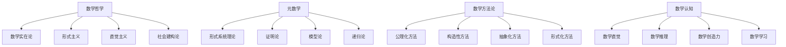

# 哲学与元数学基础

## 目录

- [哲学与元数学基础](#哲学与元数学基础)
  - [目录](#目录)
  - [1. 主题概述](#1-主题概述)
    - [1.1 核心问题](#11-核心问题)
    - [1.2 研究意义](#12-研究意义)
  - [2. 学习路径](#2-学习路径)
    - [2.1 基础阶段](#21-基础阶段)
    - [2.2 进阶阶段](#22-进阶阶段)
    - [2.3 高级阶段](#23-高级阶段)
  - [3. 核心内容](#3-核心内容)
    - [3.1 数学哲学](#31-数学哲学)
      - [3.1.1 数学实在论](#311-数学实在论)
      - [3.1.2 形式主义](#312-形式主义)
      - [3.1.3 直觉主义](#313-直觉主义)
    - [3.2 元数学理论](#32-元数学理论)
      - [3.2.1 形式系统理论](#321-形式系统理论)
      - [3.2.2 证明论](#322-证明论)
      - [3.2.3 模型论](#323-模型论)
  - [4. 知识体系](#4-知识体系)
    - [4.1 概念层次](#41-概念层次)
    - [4.2 理论关系](#42-理论关系)
  - [5. 应用与联系](#5-应用与联系)
    - [5.1 与逻辑学的联系](#51-与逻辑学的联系)
    - [5.2 与计算机科学的联系](#52-与计算机科学的联系)
    - [5.3 与认知科学的联系](#53-与认知科学的联系)
  - [6. 历史发展](#6-历史发展)
    - [6.1 古代数学哲学](#61-古代数学哲学)
    - [6.2 近代数学哲学](#62-近代数学哲学)
    - [6.3 现代数学哲学](#63-现代数学哲学)
  - [7. 哲学思考](#7-哲学思考)
    - [7.1 数学的本质](#71-数学的本质)
    - [7.2 数学真理](#72-数学真理)
    - [7.3 数学认知](#73-数学认知)
  - [8. 学习资源](#8-学习资源)
    - [8.1 经典文献](#81-经典文献)
    - [8.2 现代教材](#82-现代教材)
    - [8.3 在线资源](#83-在线资源)
  - [总结](#总结)

---

## 1. 主题概述

哲学与元数学基础是数学知识体系的根基，它探讨数学的本质、数学真理的性质、数学知识的认知基础以及数学理论的形式化结构。本主题从哲学高度审视数学，从元数学角度分析数学理论本身的性质。

### 1.1 核心问题

- **数学的本质**：数学是发现还是发明？数学对象是否存在？
- **数学真理**：数学命题的真理性如何确立？数学证明的本质是什么？
- **数学认知**：人类如何认识数学？数学直觉与形式推理的关系？
- **数学基础**：数学理论的逻辑基础是什么？如何保证数学的一致性？

### 1.2 研究意义

- **理论意义**：为数学提供哲学基础和认识论支撑
- **实践意义**：指导数学研究和数学教育
- **方法意义**：提供数学思维的方法论指导
- **文化意义**：理解数学在人类文化中的地位

---

## 2. 学习路径

### 2.1 基础阶段

1. **数学哲学入门**
   - 数学哲学的基本问题
   - 主要哲学流派概述
   - 数学实在论与形式主义

2. **元数学基础**
   - 形式系统的基本概念
   - 公理化方法
   - 证明与推理

### 2.2 进阶阶段

1. **深入哲学分析**
   - 直觉主义与构造性数学
   - 社会建构论
   - 数学美学

2. **元数学理论**
   - 证明论
   - 模型论
   - 递归论

### 2.3 高级阶段

1. **前沿问题**
   - 哥德尔不完备性定理的哲学意义
   - 数学基础的新发展
   - 人工智能与数学认知

2. **跨学科联系**
   - 数学与逻辑学
   - 数学与认知科学
   - 数学与计算机科学

---

## 3. 核心内容

### 3.1 数学哲学

#### 3.1.1 数学实在论

**定义**：数学实在论认为数学对象（如数、集合、函数等）是独立于人类思维而存在的抽象实体。

**核心观点**：

- 数学对象具有客观存在性
- 数学真理是发现的而非发明的
- 数学知识具有普遍性和必然性

**论证**：

1. **不可约性论证**：数学在科学中的成功应用表明数学对象是真实的
2. **认识论论证**：我们能够可靠地获得数学知识，这表明数学对象存在
3. **本体论论证**：数学对象具有独特的性质，不能还原为其他实体

**批判**：

- 如何解释抽象实体的存在？
- 如何解释我们与抽象实体的认知关系？
- 如何解释数学知识的可错性？

#### 3.1.2 形式主义

**定义**：形式主义认为数学是关于形式符号系统的研究，数学对象是符号，数学真理是形式系统的定理。

**核心观点**：

- 数学是符号游戏
- 数学真理是相对于公理系统的
- 数学对象没有独立的存在性

**论证**：

1. **一致性论证**：形式系统的一致性保证了数学的可靠性
2. **实用性论证**：形式化方法在数学研究中非常有效
3. **本体论简洁性**：不需要假设抽象实体的存在

**批判**：

- 如何解释数学的应用性？
- 如何解释数学直觉？
- 如何解释数学的美感？

#### 3.1.3 直觉主义

**定义**：直觉主义认为数学是人类心智的构造，数学对象通过心智活动而存在，数学真理建立在直觉基础上。

**核心观点**：

- 数学是心智构造
- 存在性需要构造性证明
- 排中律不总是有效

**论证**：

1. **构造性论证**：只有能构造的对象才是真实的
2. **认识论论证**：直觉是数学知识的基础
3. **实践论证**：构造性方法在计算机科学中很有用

**批判**：

- 如何解释经典数学的成功？
- 如何解释数学的客观性？
- 构造性证明的限制？

### 3.2 元数学理论

#### 3.2.1 形式系统理论

**定义**：形式系统是由符号、公式、公理和推理规则组成的严格系统。

**基本要素**：

1. **符号**：系统的基本符号
2. **公式**：符号的组合规则
3. **公理**：作为出发点的公式
4. **推理规则**：从已知公式推导新公式的规则

**重要性质**：

- **一致性**：不能同时证明A和¬A
- **完备性**：所有真命题都可证明
- **可判定性**：存在算法判定任意公式是否为定理

#### 3.2.2 证明论

**定义**：证明论研究形式系统中的证明结构、证明复杂性以及证明的构造性。

**核心概念**：

- **证明长度**：证明中公式的数量
- **证明深度**：证明树的高度
- **证明复杂度**：证明的算法复杂度

**重要结果**：

- **Gentzen的相继式演算**：提供了自然的证明系统
- **Herbrand定理**：将一阶逻辑证明转化为命题逻辑
- **证明论强度**：比较不同证明系统的能力

#### 3.2.3 模型论

**定义**：模型论研究形式语言与其解释之间的关系，特别是语义与语法的关系。

**核心概念**：

- **模型**：语言的一个解释
- **满足关系**：模型与公式之间的关系
- **理论**：一组公式的集合

**重要结果**：

- **紧致性定理**：理论有模型当且仅当其有限子集都有模型
- **Löwenheim-Skolem定理**：可数理论有可数模型
- **完全性定理**：语法可证性与语义有效性等价

---

## 4. 知识体系

### 4.1 概念层次

### 4.2 理论关系

- **哲学基础** → **元数学理论** → **具体数学**
- **认识论** → **方法论** → **实践应用**
- **本体论** → **逻辑学** → **形式系统**

---

## 5. 应用与联系

### 5.1 与逻辑学的联系

- 形式逻辑是元数学的基础
- 逻辑系统是数学理论的模型
- 逻辑推理是数学证明的核心

### 5.2 与计算机科学的联系

- 形式化验证
- 自动定理证明
- 程序语义学

### 5.3 与认知科学的联系

- 数学认知过程
- 数学思维发展
- 数学学习机制

---

## 6. 历史发展

### 6.1 古代数学哲学

- **毕达哥拉斯学派**：万物皆数
- **柏拉图**：数学对象的理念世界
- **亚里士多德**：数学的抽象性质

### 6.2 近代数学哲学

- **笛卡尔**：数学的确定性
- **康德**：数学的综合先验判断
- **弗雷格**：数学的逻辑基础

### 6.3 现代数学哲学

- **希尔伯特**：形式主义纲领
- **布劳威尔**：直觉主义
- **哥德尔**：不完备性定理

---

## 7. 哲学思考

### 7.1 数学的本质

数学既不是纯粹的经验科学，也不是纯粹的逻辑学。它是一门独特的学科，具有自己的研究对象和方法。

### 7.2 数学真理

数学真理具有客观性，但这种客观性不同于物理世界的客观性。数学真理是概念性的客观性。

### 7.3 数学认知

数学认知既需要直觉，也需要推理。直觉提供洞察，推理提供严格性。

---

## 8. 学习资源

### 8.1 经典文献

- **《数学哲学》** - 保罗·贝纳塞拉夫
- **《数学基础》** - 希尔伯特
- **《直觉主义导论》** - 布劳威尔

### 8.2 现代教材

- **《数学哲学》** - 斯图尔特·夏皮罗
- **《元数学导论》** - 克莱因
- **《证明论》** - 根岑

### 8.3 在线资源

- Stanford Encyclopedia of Philosophy
- Internet Encyclopedia of Philosophy
- 数学哲学研究网站

---

## 总结

哲学与元数学基础为整个数学知识体系提供了理论基础和方法论指导。它不仅帮助我们理解数学的本质，也为数学研究提供了重要的工具和视角。通过深入理解这些基础理论，我们能够更好地把握数学的整体结构和发展方向。
