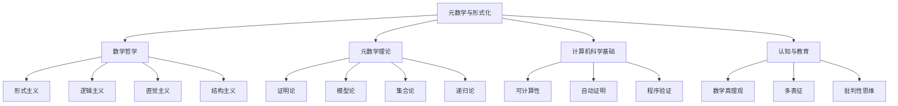

# 00-哲学与元数学基础总览

## 0. 导论与结构总览

- **定位**：本文是"01-数学哲学-元数学与形式化"模块的总览与入口，旨在提供一个清晰、结构化的知识框架。
- **目标**：整合元数学的哲学、理论与应用，展示各主题（形式化、证明论、模型论、递归论、哲学流派、AI应用等）的内在联系。
- **方法**：采用严格的树形目录、多表征（图、表、代码片段）、交叉引用和本地跳转，确保内容的系统性、可读性和可扩展性。

---

## 1. 核心主题与知识图谱

本模块的核心是探索数学的确定性、边界与本质，涵盖从抽象的哲学思辨到具体的计算机科学应用。

### 1.1 知识图谱结构

### 1.2 主题关联性

| 主题 | 核心问题 | 关键成果/理论 | 关联领域 |
|---|---|---|---|
| **[01-元数学与形式化基础](./01-元数学与形式化基础.md)** | 数学自身的结构、性质、边界是什么？ | 希尔伯特计划、ZFC公理体系 | 所有子主题 |
| **[02-哲学流派与元数学](./02-哲学流派与元数学.md)** | 数学真理的本质？数学对象存在吗？ | 形式主义、逻辑主义、直觉主义 | 认识论、本体论 |
| **[03-形式系统与证明论](./03-形式系统与证明论.md)** | 什么是有效的证明？证明的能力与局限？ | 哥德尔不完备定理、自然演绎 | 逻辑学、AI推理 |
| **[04-元数学的哲学与认知分析](./04-元数学的哲学与认知分析.md)** | 人类如何理解和创造数学？ | 数学真理观、多表征、认知结构 | 认知科学、教育学 |
| **[05-元数学与AI_计算机科学](./05-元数学与AI_计算机科学.md)** | 计算的极限是什么？机器能否证明定理？ | 丘奇-图灵论题、停机问题、ATP | 计算机科学、人工智能 |

---

## 2. 目录结构与本地跳转

本模块所有文档均已按以下规范化结构组织，支持清晰的导航与交叉引用。

- **[00-哲学与元数学基础总览](./00-哲学与元数学基础总览.md)** (本文)
- **[01-元数学与形式化基础](./01-元数学与形式化基础.md)**
- **[02-哲学流派与元数学](./02-哲学流派与元数学.md)**
- **[03-形式系统与证明论](./03-形式系统与证明论.md)**
- **[04-元数学的哲学与认知分析](./04-元数学的哲学与认知分析.md)**
- **[05-元数学与AI_计算机科学](./05-元数学与AI_计算机科学.md)**
- 子目录
  - [00-知识图谱/](./00-知识图谱/)
  - [01-数学哲学/](./01-数学哲学/)
  - [02-元数学理论/](./02-元数学理论/)
  - [03-形式化系统/](./03-形式化系统/)

---

## 3. 核心概念与方法论

### 3.1 核心概念

- **形式系统**：由符号、语法、公理、推理规则构成的精确体系。
- **证明**：在形式系统内，从公理到定理的有效推导序列。
- **模型**：为形式系统提供语义解释的数学结构。
- **可计算性**：一个问题是否存在算法解。
- **一致性**：形式系统不产生矛盾。
- **完备性**：形式系统能证明所有真命题。

### 3.2 方法论

- **形式化方法**：将数学思想转化为精确的符号系统。
- **公理化方法**：从最少的基本假设出发构建理论。
- **分析性方法**：对概念、逻辑、历史进行系统性分析。
- **批判性分析**：对理论的基础、假设、边界进行反思与质疑。

---

## 4. 现代发展与跨学科应用

元数学的成果深刻影响了多个现代学科：

- **计算机科学**：形式化方法是程序验证、编译器设计、数据库理论的基石。
- **人工智能**：自动定理证明、知识表示、逻辑推理等领域均源于元数学。
- **认知科学**：为研究人类的逻辑思维、概念形成、推理能力提供了理论模型。
- **语言学**：形式语言理论、生成语法等方法论受到元数学启发。

---

## 5. 参考文献与资源

### 5.1 经典文献

1. **Frege, G.** (1884). *Die Grundlagen der Arithmetik*.
2. **Russell, B.** (1903). *The Principles of Mathematics*.
3. **Hilbert, D.** (1926). "Über das Unendliche".
4. **Gödel, K.** (1931). "Über formal unentscheidbare Sätze...".
5. **Turing, A.** (1936). "On Computable Numbers...".

### 5.2 现代文献

1. **Shapiro, S.** (2000). *Thinking About Mathematics*.
2. **Hofstadter, D.** (1979). *Gödel, Escher, Bach: an Eternal Golden Braid*.
3. **Avigad, J.** (2018). *Mathematics and its Logics*.

### 5.3 在线资源与工具

1. **Stanford Encyclopedia of Philosophy**: [Philosophy of Mathematics](https://plato.stanford.edu/entries/philosophy-mathematics/)
2. **Proof Assistants**: [Lean](https://leanprover.github.io/), [Coq](https://coq.inria.fr/), [Isabelle/HOL](https://isabelle.in.tum.de/)
3. **MathOverflow**: [Logic and Foundations](https://mathoverflow.net/questions/tagged/logic)

---
> **状态**: 本模块（01-05）已完成首轮规范化重构。所有文件均已更新结构、补充多表征内容并强化了交叉引用。
> **后续**: 建议检查各文件一致性，并根据需要深化特定主题或合并/删除冗余文件。
