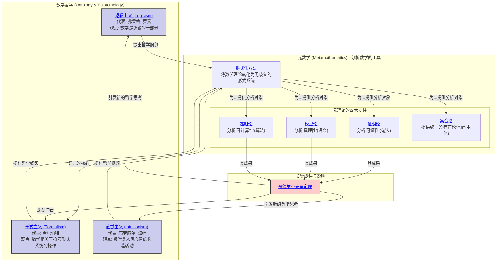

# 1. 数学哲学与元数学总览

**版本**: 1.0
**日期**: 2025-07-02

---

## 1.1. 引言：追问数学的根基

本模块位于我们知识体系的最高层级，它不研究任何具体的数学问题，而是 **将数学本身作为研究对象**。我们在此探讨两个根本性问题：

1. **数学的本质是什么？(What is mathematics?)**
    * 数学真理是"被发现的"客观实在，还是"被发明"的心智构造？
    * 数字、集合、群这些数学对象，它们"存在"于何处？
    * 这是 **数学哲学 (Philosophy of Mathematics)** 的核心关切。

2. **我们如何科学地研究数学本身？(How can we rigorously study mathematics?)**
    * 我们能否用数学的方法，来分析数学推理的有效性、局限性和能力范围？
    * 这是 **元数学 (Metamathematics)** 的核心任务。

本模块将首先梳理数学哲学中最重要的思想流派，然后阐明元数学是如何为这些哲学思辨提供严格的分析工具。

## 1.2. 知识地图 (Mermaid)

## 1.3. 探索路径

1. **[01-数学哲学的三大主义.md](./01-数学哲学的三大主义.md)**: 我们将首先深入探讨20世纪初塑造了现代数学面貌的三大哲学流派。
    * **逻辑主义**: 试图将整个数学大厦建立在纯粹的逻辑之上，但罗素悖论的发现宣告了其朴素形式的失败。
    * **形式主义**: 为了挽救数学的确定性，希尔伯特提出将数学视为无矛盾的、纯形式的符号游戏。其核心是著名的"希尔伯特纲领"。
    * **直觉主义**: 作为对前两者的反叛，认为数学真理必须通过有限的、可构造的步骤来获得，并因此拒绝排中律和非构造性证明。

2. **[02-形式化方法与公理系统.md](./02-形式化方法与公理系统.md)**: 这是连接哲学思辨与严格分析的桥梁。
    * **形式化方法**: 学习如何将一个数学理论（如欧氏几何）从一堆直观的陈述，转变为一个由精确的符号、公理和推理规则构成的 **形式系统**。
    * **公理系统**: 探讨一个"好"的公理系统应该具备哪些性质，如 **一致性 (Consistency)**、**完备性 (Completeness)** 和 **独立性 (Independence)**。

3. **[03-哥德尔不完备定理的哲学意涵.md](./03-哥德尔不完备定理的哲学意涵.md)**:
    * 在元数学的框架下，我们将重新审视哥德尔不完备定理。这次我们不关注其技术细节，而是聚焦其颠覆性的 **哲学结论**：
        * **第一不完备定理**: 任何一个足够强大（能表达初等算术）且自洽的形式系统，都必然存在一个它既不能证明也不能证伪的命题（"真而不可证"）。
        * **第二不完备定理**: 任何一个足够强大且自洽的形式系统，都无法在系统内部证明其自身的自洽性。
    * 我们将分析这个定理如何宣判了希尔伯特纲领的死刑，并对逻辑主义和直觉主义产生了深远影响，从根本上改变了我们对数学确定性的认知。

---
[返回项目总览](../09-项目总览/00-项目总览.md)
