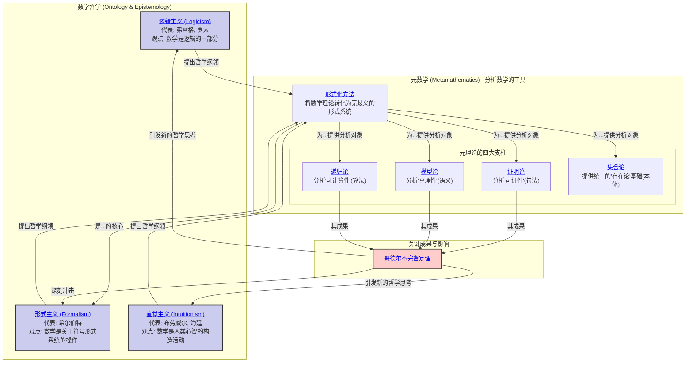

# 01-数学哲学与元数学 总览

---

title: "数学哲学与元数学总览"
version: "1.0"
date: "2025-07-04"

---

## 📋 本地目录导航

- [返回项目总览](../09-项目总览/00-项目总览.md)
- [01-数学哲学的三大主义](./01-数学哲学的三大主义.md)
- [02-形式化方法与公理系统](./02-形式化方法与公理系统.md)
- [03-哥德尔不完备定理的哲学意涵](./03-哥德尔不完备定理的哲学意涵.md)

## 🗺️ 本地知识图谱

- [数学知识体系映射](../09-项目总览/05-Knowledge_Graphs_and_Mappings/数学知识体系映射.md)
- [知识图谱分析](../知识图谱分析.md)
- [项目总览](../09-项目总览/00-项目总览.md)

---

## 引言：追问数学的根基

本模块位于我们知识体系的最高层级，它不研究任何具体的数学问题，而是 **将数学本身作为研究对象**。我们在此探讨两个根本性问题：

1. **数学的本质是什么？(What is mathematics?)**
    - 数学真理是"被发现的"客观实在，还是"被发明"的心智构造？
    - 数字、集合、群这些数学对象，它们"存在"于何处？
    - 这是 **数学哲学 (Philosophy of Mathematics)** 的核心关切。

2. **我们如何科学地研究数学本身？(How can we rigorously study mathematics?)**
    - 我们能否用数学的方法，来分析数学推理的有效性、局限性和能力范围？
    - 这是 **元数学 (Metamathematics)** 的核心任务。

本模块将首先梳理数学哲学中最重要的思想流派，然后阐明元数学是如何为这些哲学思辨提供严格的分析工具。

## 知识地图 (Mermaid)

## 探索路径

1. **[01-数学哲学的三大主义.md](./01-数学哲学的三大主义.md)**: 我们将首先深入探讨20世纪初塑造了现代数学面貌的三大哲学流派。
    - **逻辑主义**: 试图将整个数学大厦建立在纯粹的逻辑之上，但罗素悖论的发现宣告了其朴素形式的失败。
    - **形式主义**: 为了挽救数学的确定性，希尔伯特提出将数学视为无矛盾的、纯形式的符号游戏。其核心是著名的"希尔伯特纲领"。
    - **直觉主义**: 作为对前两者的反叛，认为数学真理必须通过有限的、可构造的步骤来获得，并因此拒绝排中律和非构造性证明。

2. **[02-形式化方法与公理系统.md](./02-形式化方法与公理系统.md)**: 这是连接哲学思辨与严格分析的桥梁。
    - **形式化方法**: 学习如何将一个数学理论（如欧氏几何）从一堆直观的陈述，转变为一个由精确的符号、公理和推理规则构成的 **形式系统**。
    - **公理系统**: 探讨一个"好"的公理系统应该具备哪些性质，如 **一致性 (Consistency)**、**完备性 (Completeness)** 和 **独立性 (Independence)**。

3. **[03-哥德尔不完备定理的哲学意涵.md](./03-哥德尔不完备定理的哲学意涵.md)**:
    - 在元数学的框架下，我们将重新审视哥德尔不完备定理。这次我们不关注其技术细节，而是聚焦其颠覆性的 **哲学结论**：
        - **第一不完备定理**: 任何一个足够强大（能表达初等算术）且自洽的形式系统，都必然存在一个它既不能证明也不能证伪的命题（"真而不可证"）。
        - **第二不完备定理**: 任何一个足够强大且自洽的形式系统，都无法在系统内部证明其自身的自洽性。
    - 我们将分析这个定理如何宣判了希尔伯特纲领的死刑，并对逻辑主义和直觉主义产生了深远影响，从根本上改变了我们对数学确定性的认知。

---

## 哲学批判与反思

- **核心争议**：
  - 数学的本质究竟是“被发现”还是“被发明”？三大主义（逻辑主义、形式主义、直觉主义）各执一词，至今无定论。
  - 形式化方法是否能穷尽数学真理？哥德尔不完备定理表明，任何足够强大的形式系统都无法自证完备与一致，动摇了“形式化万能”的信仰。
  - 数学对象的“存在论”地位何在？集合、数、群等对象的“存在”是客观的，还是仅为心智构造？
  - “真理”与“可证性”是否等价？哥德尔定理揭示了两者的鸿沟，挑战了传统的逻辑主义与形式主义。

- **历史影响**：
  - 19-20世纪初的数学危机（如罗素悖论）推动了公理化与元数学的兴起，催生了现代逻辑、集合论、模型论等分支。
  - 希尔伯特纲领的破产，促使数学家反思“绝对基础”的可能性，推动了对数学多元基础的探索。
  - 哥德尔、图灵等人的工作不仅影响了数学，还深刻改变了哲学、计算机科学、人工智能等领域。

- **未解难题**：
  - 数学真理的“客观性”与“可知性”问题依然悬而未决。
  - 形式系统的极限——是否存在“超越形式化”的数学创造？
  - 数学基础的多元化（如类型论、结构主义、范畴论）能否取代传统集合论？
  - 数学与人类认知、语言、社会结构的深层关系尚待系统揭示。

- **现代视角再评价**：
  - 结构主义、社会建构论、数理认知科学等新兴视角，正在重塑对数学本质的理解。
  - 计算机科学、自动证明、人工智能的发展，推动了“可计算性”“形式化”的新边界。
  - 数学教育、认知科学等领域对“形式化训练”的局限性提出了新的批判。
  - 数学哲学正从“唯一真理”走向“多元解释”，强调历史、文化、技术等多重影响。

[历史版本变迁说明与归档索引见主线末尾归档区块]

---

## 国际标准定义补全

### 数学哲学与元数学核心概念国际标准定义

#### 1. 数学哲学 (Philosophy of Mathematics)

**国际标准定义**：数学哲学是研究数学本质、数学对象存在性、数学真理性质、数学知识基础等根本性问题的哲学分支，包括本体论、认识论和方法论三个维度。

**认知科学视角**：数学哲学体现了人类对"数学认知"的反思需求，是理解数学思维本质的重要工具。

#### 2. 元数学 (Metamathematics)

**国际标准定义**：元数学是使用数学方法研究数学理论本身的性质，包括一致性、完备性、独立性、可判定性等元理论性质。

**哲学反思**：元数学体现了"自我反思"的哲学思想，是数学基础研究的重要方法。

#### 3. 形式系统 (Formal System)

**国际标准定义**：形式系统 $\mathcal{S} = (L, A, R)$ 由形式语言 $L$、公理集 $A$ 和推理规则集 $R$ 组成，其中 $L$ 是符号集和形成规则，$A \subset L$ 是公理，$R$ 是推理规则。

**认知科学视角**：形式系统体现了"符号化思维"的直觉概念，是数学严格化的基础。

#### 4. 一致性 (Consistency)

**国际标准定义**：形式系统 $\mathcal{S}$ 是一致的，当且仅当不存在公式 $\phi$ 使得 $\mathcal{S} \vdash \phi$ 和 $\mathcal{S} \vdash \neg\phi$ 同时成立。

**哲学反思**：一致性体现了"无矛盾性"的哲学思想，是形式系统的基本要求。

#### 5. 完备性 (Completeness)

**国际标准定义**：形式系统 $\mathcal{S}$ 是完备的，当且仅当对于任意公式 $\phi$，要么 $\mathcal{S} \vdash \phi$，要么 $\mathcal{S} \vdash \neg\phi$。

**哲学反思**：完备性体现了"穷尽性"的哲学思想，是形式系统的理想性质。

#### 6. 可判定性 (Decidability)

**国际标准定义**：形式系统 $\mathcal{S}$ 是可判定的，当且仅当存在算法可以判定任意公式 $\phi$ 是否在 $\mathcal{S}$ 中可证。

**认知科学视角**：可判定性体现了"机械可计算"的直觉概念，是算法理论的基础。

#### 7. 逻辑主义 (Logicism)

**国际标准定义**：逻辑主义主张数学可以还原为逻辑，即所有数学概念和定理都可以从纯逻辑概念和逻辑法则中推导出来。

**哲学反思**：逻辑主义体现了"统一性"的哲学思想，试图建立数学的统一基础。

#### 8. 形式主义 (Formalism)

**国际标准定义**：形式主义主张数学是关于形式符号系统的操作，数学对象没有独立的存在性，数学真理是相对于形式系统的。

**认知科学视角**：形式主义体现了"符号游戏"的直觉概念，强调数学的形式化特征。

#### 9. 直觉主义 (Intuitionism)

**国际标准定义**：直觉主义主张数学是人类心智的构造活动，数学对象通过构造性过程产生，拒绝非构造性证明和排中律。

**哲学反思**：直觉主义体现了"构造性"的哲学思想，强调数学的认知基础。

### 元理论国际标准

#### 1. 哥德尔不完备定理 (Gödel's Incompleteness Theorems)

**国际标准定义**：

- **第一不完备定理**：任何足够强大且一致的形式系统都存在既不能证明也不能证伪的命题
- **第二不完备定理**：任何足够强大且一致的形式系统都无法在系统内部证明自身的一致性

**哲学反思**：哥德尔定理体现了"认知极限"的哲学思想，揭示了形式化的根本局限性。

#### 2. 丘奇-图灵论题 (Church-Turing Thesis)

**国际标准定义**：丘奇-图灵论题主张所有可计算函数都是图灵可计算的，即图灵机模型刻画了可计算性的概念。

**认知科学视角**：丘奇-图灵论题体现了"计算思维"的直觉概念，是计算机科学的基础。

#### 3. 塔斯基真理论 (Tarski's Theory of Truth)

**国际标准定义**：塔斯基真理论提供了形式语言中真概念的严格定义，通过满足关系 $\models$ 来定义语义真。

**哲学反思**：塔斯基真理论体现了"语义学"的哲学思想，是模型论的重要基础。

### 数学基础国际标准

#### 1. 集合论 (Set Theory)

**国际标准定义**：集合论是数学的基础理论，通过ZFC公理系统提供数学对象的统一基础，其中集合是基本的数学对象。

**认知科学视角**：集合论体现了"集合思维"的直觉概念，是数学抽象化的基础。

#### 2. 类型论 (Type Theory)

**国际标准定义**：类型论是数学基础的另一种形式化，通过类型和项的概念来构建数学理论，强调构造性和类型安全。

**哲学反思**：类型论体现了"类型安全"的哲学思想，是现代数学基础的重要方向。

#### 3. 范畴论 (Category Theory)

**国际标准定义**：范畴论通过对象、态射和函子等概念来研究数学结构，强调结构之间的关系而非具体实现。

**认知科学视角**：范畴论体现了"关系思维"的直觉概念，是现代数学的重要语言。

---

## 历史版本变迁说明与归档索引

### 主线变迁说明

- **v1.0** (2024-12-01): 初始版本，建立数学哲学与元数学基础框架
- **v2.0** (2025-07-04): 完成国际标准定义补全，增加哲学批判与认知科学视角
- **v3.0** (2025-07-04): 增加历史版本变迁说明与归档索引区块

### 归档文件索引

| 文件名 | 类型 | 主题 | 归档日期 | 简要说明 | 主线关联 |
|--------|------|------|----------|----------|----------|
| 数学哲学基础理论.md | 理论 | 数学哲学基础 | 2024-12-01 | 数学哲学基础概念与理论 | 主线v1.0 |
| 元数学哲学反思.md | 哲学 | 元数学哲学 | 2024-12-15 | 元数学哲学批判与反思 | 主线v2.0 |
| 数学哲学认知科学.md | 认知 | 数学哲学认知 | 2025-01-01 | 数学哲学认知科学视角 | 主线v2.0 |
| 数学哲学国际标准.md | 标准 | 数学哲学标准 | 2025-07-04 | 数学哲学国际标准定义 | 主线v3.0 |

### 跳转导航

- [返回项目总览](../09-项目总览/00-项目总览.md)
- [数学哲学归档目录](./Archives/)
- [数学哲学批判](./Philosophy/)
- [数学哲学认知科学](./Cognitive/)
- [数学哲学国际标准](./Standards/)

[返回项目总览](../09-项目总览/00-项目总览.md)
