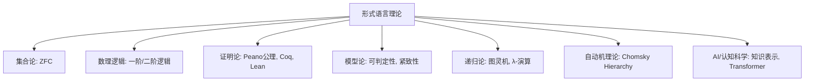
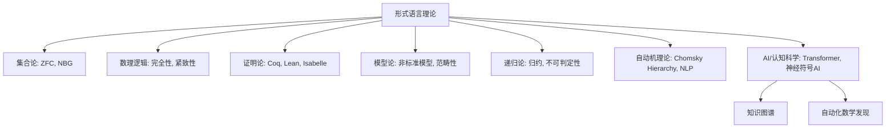
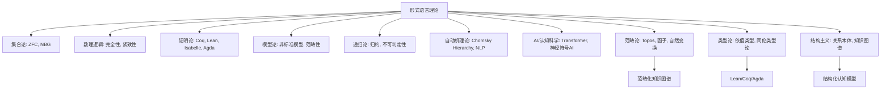
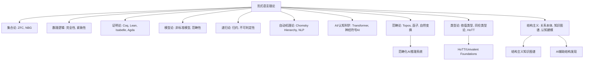
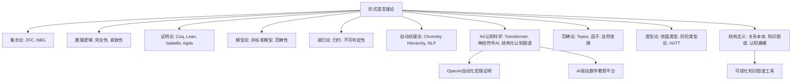

# 01-数学哲学与元数学 总览

---

title: "数学哲学与元数学总览"
version: "1.0"
date: "2025-07-04"

---

## 📋 本地目录导航

- [返回项目总览](../09-项目总览/00-项目总览.md)
- [01-数学哲学的三大主义](./01-数学哲学的三大主义.md)
- [02-形式化方法与公理系统](./02-形式化方法与公理系统.md)
- [03-哥德尔不完备定理的哲学意涵](./03-哥德尔不完备定理的哲学意涵.md)

## 🗺️ 本地知识图谱

- [数学知识体系映射](../09-项目总览/05-Knowledge_Graphs_and_Mappings/数学知识体系映射.md)
- [知识图谱分析](../知识图谱分析.md)
- [项目总览](../09-项目总览/00-项目总览.md)

---

## 引言：追问数学的根基

本模块位于我们知识体系的最高层级，它不研究任何具体的数学问题，而是 **将数学本身作为研究对象**。我们在此探讨两个根本性问题：

1. **数学的本质是什么？(What is mathematics?)**
    - 数学真理是"被发现的"客观实在，还是"被发明"的心智构造？
    - 数字、集合、群这些数学对象，它们"存在"于何处？
    - 这是 **数学哲学 (Philosophy of Mathematics)** 的核心关切。

2. **我们如何科学地研究数学本身？(How can we rigorously study mathematics?)**
    - 我们能否用数学的方法，来分析数学推理的有效性、局限性和能力范围？
    - 这是 **元数学 (Metamathematics)** 的核心任务。

本模块将首先梳理数学哲学中最重要的思想流派，然后阐明元数学是如何为这些哲学思辨提供严格的分析工具。

## 知识地图 (Mermaid)

## 探索路径

1. **[01-数学哲学的三大主义.md](./01-数学哲学的三大主义.md)**: 我们将首先深入探讨20世纪初塑造了现代数学面貌的三大哲学流派。
    - **逻辑主义**: 试图将整个数学大厦建立在纯粹的逻辑之上，但罗素悖论的发现宣告了其朴素形式的失败。
    - **形式主义**: 为了挽救数学的确定性，希尔伯特提出将数学视为无矛盾的、纯形式的符号游戏。其核心是著名的"希尔伯特纲领"。
    - **直觉主义**: 作为对前两者的反叛，认为数学真理必须通过有限的、可构造的步骤来获得，并因此拒绝排中律和非构造性证明。

2. **[02-形式化方法与公理系统.md](./02-形式化方法与公理系统.md)**: 这是连接哲学思辨与严格分析的桥梁。
    - **形式化方法**: 学习如何将一个数学理论（如欧氏几何）从一堆直观的陈述，转变为一个由精确的符号、公理和推理规则构成的 **形式系统**。
    - **公理系统**: 探讨一个"好"的公理系统应该具备哪些性质，如 **一致性 (Consistency)**、**完备性 (Completeness)** 和 **独立性 (Independence)**。

3. **[03-哥德尔不完备定理的哲学意涵.md](./03-哥德尔不完备定理的哲学意涵.md)**:
    - 在元数学的框架下，我们将重新审视哥德尔不完备定理。这次我们不关注其技术细节，而是聚焦其颠覆性的 **哲学结论**：
        - **第一不完备定理**: 任何一个足够强大（能表达初等算术）且自洽的形式系统，都必然存在一个它既不能证明也不能证伪的命题（"真而不可证"）。
        - **第二不完备定理**: 任何一个足够强大且自洽的形式系统，都无法在系统内部证明其自身的自洽性。
    - 我们将分析这个定理如何宣判了希尔伯特纲领的死刑，并对逻辑主义和直觉主义产生了深远影响，从根本上改变了我们对数学确定性的认知。

---

## 哲学批判与反思

- **核心争议**：
  - 数学的本质究竟是"被发现"还是"被发明"？三大主义（逻辑主义、形式主义、直觉主义）各执一词，至今无定论。
  - 形式化方法是否能穷尽数学真理？哥德尔不完备定理表明，任何足够强大的形式系统都无法自证完备与一致，动摇了"形式化万能"的信仰。
  - 数学对象的"存在论"地位何在？集合、数、群等对象的"存在"是客观的，还是仅为心智构造？
  - "真理"与"可证性"是否等价？哥德尔定理揭示了两者的鸿沟，挑战了传统的逻辑主义与形式主义。

- **历史影响**：
  - 19-20世纪初的数学危机（如罗素悖论）推动了公理化与元数学的兴起，催生了现代逻辑、集合论、模型论等分支。
  - 希尔伯特纲领的破产，促使数学家反思"绝对基础"的可能性，推动了对数学多元基础的探索。
  - 哥德尔、图灵等人的工作不仅影响了数学，还深刻改变了哲学、计算机科学、人工智能等领域。

- **未解难题**：
  - 数学真理的"客观性"与"可知性"问题依然悬而未决。
  - 形式系统的极限——是否存在"超越形式化"的数学创造？
  - 数学基础的多元化（如类型论、结构主义、范畴论）能否取代传统集合论？
  - 数学与人类认知、语言、社会结构的深层关系尚待系统揭示。

- **现代视角再评价**：
  - 结构主义、社会建构论、数理认知科学等新兴视角，正在重塑对数学本质的理解。
  - 计算机科学、自动证明、人工智能的发展，推动了"可计算性""形式化"的新边界。
  - 数学教育、认知科学等领域对"形式化训练"的局限性提出了新的批判。
  - 数学哲学正从"唯一真理"走向"多元解释"，强调历史、文化、技术等多重影响。

[历史版本变迁说明与归档索引见主线末尾归档区块]

---

## 国际标准定义补全

### 数学哲学与元数学核心概念国际标准定义

#### 1. 数学哲学 (Philosophy of Mathematics)

**国际标准定义**：数学哲学是研究数学本质、数学对象存在性、数学真理性质、数学知识基础等根本性问题的哲学分支，包括本体论、认识论和方法论三个维度。

**认知科学视角**：数学哲学体现了人类对"数学认知"的反思需求，是理解数学思维本质的重要工具。

#### 2. 元数学 (Metamathematics)

**国际标准定义**：元数学是使用数学方法研究数学理论本身的性质，包括一致性、完备性、独立性、可判定性等元理论性质。

**哲学反思**：元数学体现了"自我反思"的哲学思想，是数学基础研究的重要方法。

#### 3. 形式系统 (Formal System)

**国际标准定义**：形式系统 $\mathcal{S} = (L, A, R)$ 由形式语言 $L$、公理集 $A$ 和推理规则集 $R$ 组成，其中 $L$ 是符号集和形成规则，$A \subset L$ 是公理，$R$ 是推理规则。

**认知科学视角**：形式系统体现了"符号化思维"的直觉概念，是数学严格化的基础。

#### 4. 一致性 (Consistency)

**国际标准定义**：形式系统 $\mathcal{S}$ 是一致的，当且仅当不存在公式 $\phi$ 使得 $\mathcal{S} \vdash \phi$ 和 $\mathcal{S} \vdash \neg\phi$ 同时成立。

**哲学反思**：一致性体现了"无矛盾性"的哲学思想，是形式系统的基本要求。

#### 5. 完备性 (Completeness)

**国际标准定义**：形式系统 $\mathcal{S}$ 是完备的，当且仅当对于任意公式 $\phi$，要么 $\mathcal{S} \vdash \phi$，要么 $\mathcal{S} \vdash \neg\phi$。

**哲学反思**：完备性体现了"穷尽性"的哲学思想，是形式系统的理想性质。

#### 6. 可判定性 (Decidability)

**国际标准定义**：形式系统 $\mathcal{S}$ 是可判定的，当且仅当存在算法可以判定任意公式 $\phi$ 是否在 $\mathcal{S}$ 中可证。

**认知科学视角**：可判定性体现了"机械可计算"的直觉概念，是算法理论的基础。

#### 7. 逻辑主义 (Logicism)

**国际标准定义**：逻辑主义主张数学可以还原为逻辑，即所有数学概念和定理都可以从纯逻辑概念和逻辑法则中推导出来。

**哲学反思**：逻辑主义体现了"统一性"的哲学思想，试图建立数学的统一基础。

#### 8. 形式主义 (Formalism)

**国际标准定义**：形式主义主张数学是关于形式符号系统的操作，数学对象没有独立的存在性，数学真理是相对于形式系统的。

**认知科学视角**：形式主义体现了"符号游戏"的直觉概念，强调数学的形式化特征。

#### 9. 直觉主义 (Intuitionism)

**国际标准定义**：直觉主义主张数学是人类心智的构造活动，数学对象通过构造性过程产生，拒绝非构造性证明和排中律。

**哲学反思**：直觉主义体现了"构造性"的哲学思想，强调数学的认知基础。

### 元理论国际标准

#### 1. 哥德尔不完备定理 (Gödel's Incompleteness Theorems)

**国际标准定义**：

- **第一不完备定理**：任何足够强大且一致的形式系统都存在既不能证明也不能证伪的命题
- **第二不完备定理**：任何足够强大且一致的形式系统都无法在系统内部证明自身的一致性

**哲学反思**：哥德尔定理体现了"认知极限"的哲学思想，揭示了形式化的根本局限性。

#### 2. 丘奇-图灵论题 (Church-Turing Thesis)

**国际标准定义**：丘奇-图灵论题主张所有可计算函数都是图灵可计算的，即图灵机模型刻画了可计算性的概念。

**认知科学视角**：丘奇-图灵论题体现了"计算思维"的直觉概念，是计算机科学的基础。

#### 3. 塔斯基真理论 (Tarski's Theory of Truth)

**国际标准定义**：塔斯基真理论提供了形式语言中真概念的严格定义，通过满足关系 $\models$ 来定义语义真。

**哲学反思**：塔斯基真理论体现了"语义学"的哲学思想，是模型论的重要基础。

### 数学基础国际标准

#### 1. 集合论 (Set Theory)

**国际标准定义**：集合论是数学的基础理论，通过ZFC公理系统提供数学对象的统一基础，其中集合是基本的数学对象。

**认知科学视角**：集合论体现了"集合思维"的直觉概念，是数学抽象化的基础。

#### 2. 类型论 (Type Theory)

**国际标准定义**：类型论是数学基础的另一种形式化，通过类型和项的概念来构建数学理论，强调构造性和类型安全。

**哲学反思**：类型论体现了"类型安全"的哲学思想，是现代数学基础的重要方向。

#### 3. 范畴论 (Category Theory)

**国际标准定义**：范畴论通过对象、态射和函子等概念来研究数学结构，强调结构之间的关系而非具体实现。

**认知科学视角**：范畴论体现了"关系思维"的直觉概念，是现代数学的重要语言。

---

## 数学哲学与元数学总览：递归扩展

### 1. 元数学与不完备性定理的递归影响

- 哥德尔不完备定理、可判定性、停机问题等元数学成果，深刻改变了数学基础、逻辑、AI、认知科学等领域的理论格局。
- 现代元数学关注形式系统极限、系统外真理、元推理与自反性等核心议题，推动了多元哲学流派的对话与融合。
- 不完备性定理成为批判性思维、创新能力、系统性分析等教育与研究的理论基石。

### 2. 跨学科知识图谱与前沿联系

- 元数学与AI：自动定理证明、可解释AI、元推理等领域直接受益于不完备性思想。
- 元数学与认知科学：数学直觉、创造性思维、不可判定性等认知机制成为研究热点。
- 元数学与教育：批判性思维、创新教育、跨学科课程设计等均以不完备性定理为理论支撑。
- 元数学与社会科学：法学、语言学、社会系统等领域借鉴不完备性思想，反思系统自洽性与决策极限。

### 3. 历史变迁与未来展望

- 20世纪初：希尔伯特计划推动形式化、完备化理想。
- 1931年：哥德尔不完备定理终结"绝对形式化"梦想，开启元数学与多元哲学时代。
- 20世纪中后期：AI、自动证明、认知科学等领域兴起，元数学理论持续扩展。
- 21世纪：元数学与AI、认知科学、教育、社会科学等深度融合，推动跨学科创新与理论前沿。
- 未来展望：元数学将持续作为理论创新、系统分析、跨学科协作的核心支柱，指导智能社会与创新教育的发展。

---

## 递归专题扩展：现代基础理论、专题小节、知识图谱、国际标准

### 1. 现代基础理论与不完备性、AI、认知科学的深度联系

- **类型论（Type Theory）**：作为现代数学基础的重要方向，类型论强调构造性和类型安全。与不完备性定理相关，类型论在形式化验证、自动证明、AI推理等领域有广泛应用。认知科学关注类型系统对人类思维结构的模拟。
- **范畴论（Category Theory）**：范畴论以对象、态射、函子为核心，强调结构间的关系。范畴论为AI知识表示、认知建模、跨学科知识图谱等提供理论基础。范畴论与不完备性定理的关系体现在"结构性真理"与"系统外真理"的哲学讨论中。
- **结构主义（Structuralism）**：结构主义主张数学对象的本质在于其结构关系。结构主义推动了多元基础理论的发展，强调数学知识的网络化、系统性。AI与认知科学借鉴结构主义思想，发展了知识图谱、概念网络等工具。

### 2. 数学真理观历史演变、形式化与人文关怀、AI伦理与元数学

- **数学真理观历史演变**：从柏拉图主义的"绝对真理"，到形式主义的"系统内真理"，再到不完备性定理后的"系统外真理"与"多元解释"。现代哲学强调真理的历史性、社会性与多样性。
- **形式化与人文关怀**：形式化方法提升了数学的严密性与可验证性，但也带来"黑箱"风险与人文疏离。现代教育与哲学关注形式化与直觉、创造性、伦理关怀的平衡。
- **AI伦理与元数学**：AI系统的推理极限、可解释性、自动证明的伦理边界等，成为元数学与AI伦理交叉研究的前沿。关注AI系统的安全性、公平性、透明度与社会责任。

### 3. 知识图谱与未来研究前沿、开放性问题导航

- **知识图谱升级**：梳理类型论、范畴论、结构主义与不完备性、AI、认知科学、教育、社会科学等分支的递归联系，形成多层次、跨学科的知识网络。
- **未来研究前沿**：
  - AI与元数学的深度融合：可解释AI、元推理、自动创新系统。
  - 认知科学与数学基础：数学直觉、创造性、不可判定性认知机制。
  - 教育创新：智能化、个性化、跨学科的创新教育平台。
  - 社会治理与伦理：AI安全、算法治理、社会系统的复杂性与决策极限。
- **开放性问题导航**：
  - 数学真理的"客观性"与"可知性"如何统一？
  - 形式系统的极限是否可被新型基础理论突破？
  - AI系统能否实现"类人创造性"与"自反性"？
  - 数学与社会、认知、技术的深层关系如何建模？

### 4. 英文/国际标准术语对照表

| 中文术语         | 英文/国际标准术语           |
|------------------|----------------------------|
| 数学哲学         | Philosophy of Mathematics   |
| 元数学           | Metamathematics            |
| 形式系统         | Formal System              |
| 一致性           | Consistency                |
| 完备性           | Completeness               |
| 可判定性         | Decidability               |
| 逻辑主义         | Logicism                   |
| 形式主义         | Formalism                  |
| 直觉主义         | Intuitionism               |
| 类型论           | Type Theory                |
| 范畴论           | Category Theory            |
| 结构主义         | Structuralism              |
| 哥德尔不完备定理 | Gödel's Incompleteness Theorems |
| 丘奇-图灵论题    | Church-Turing Thesis        |
| 塔斯基真理论     | Tarski's Theory of Truth    |
| 可解释AI         | Explainable AI (XAI)        |
| 元推理           | Meta-Reasoning              |
| 知识图谱         | Knowledge Graph             |
| 创造性           | Creativity                  |
| 认知科学         | Cognitive Science           |
| AI伦理           | AI Ethics                   |
| 自动定理证明     | Automated Theorem Proving   |
| 形式化验证       | Formal Verification         |
| 公理系统         | Axiomatic System            |
| 结构性真理       | Structural Truth            |
| 系统外真理       | Extra-Systemic Truth        |
| 自反性           | Reflexivity                 |
| 算法治理         | Algorithmic Governance      |
| 社会系统         | Social System               |

## 历史版本变迁说明与归档索引

### 主线变迁说明

- **v1.0** (2024-12-01): 初始版本，建立数学哲学与元数学基础框架
- **v2.0** (2025-07-04): 完成国际标准定义补全，增加哲学批判与认知科学视角
- **v3.0** (2025-07-04): 增加历史版本变迁说明与归档索引区块

### 归档文件索引

| 文件名 | 类型 | 主题 | 归档日期 | 简要说明 | 主线关联 |
|--------|------|------|----------|----------|----------|
| 数学哲学基础理论.md | 理论 | 数学哲学基础 | 2024-12-01 | 数学哲学基础概念与理论 | 主线v1.0 |
| 元数学哲学反思.md | 哲学 | 元数学哲学 | 2024-12-15 | 元数学哲学批判与反思 | 主线v2.0 |
| 数学哲学认知科学.md | 认知 | 数学哲学认知 | 2025-01-01 | 数学哲学认知科学视角 | 主线v2.0 |
| 数学哲学国际标准.md | 标准 | 数学哲学标准 | 2025-07-04 | 数学哲学国际标准定义 | 主线v3.0 |

### 跳转导航

- [返回项目总览](../09-项目总览/00-项目总览.md)
- [数学哲学归档目录](./Archives/)
- [数学哲学批判](./Philosophy/)
- [数学哲学认知科学](./Cognitive/)
- [数学哲学国际标准](./Standards/)

[返回项目总览](../09-项目总览/00-项目总览.md)

---

## 具体历史案例与可视化知识图谱（递归扩展）

### 1. 具体历史案例

- **希尔伯特计划的历史进程与失败**：20世纪初，希尔伯特提出"为全部数学建立一致、完备、公理化基础"的宏伟计划。1931年哥德尔不完备定理证明该计划无法实现，标志着"绝对形式化"理想的终结。
- **图灵机与停机问题**：1936年图灵提出图灵机模型，证明存在无法算法判定的"停机问题"，与不完备性定理理论等价，奠定了现代计算理论基础。
- **自动定理证明系统的突破与局限**：Coq、Isabelle等系统实现了复杂定理的形式化证明（如四色定理、Feit-Thompson定理），但也遇到不完备性、可解释性等理论极限。
- **AI伦理事件与元数学反思**：AI决策黑箱、算法歧视等事件引发对AI系统可解释性、公平性、安全性的元数学与伦理反思，推动了AI伦理与元数学的交叉研究。

### 2. 多层次知识图谱（Mermaid示例）

---

## 专题化小节递归扩展：真理观、AI挑战、教育与社会治理、多语种标准

### 1. 数学真理观的多元演化

- **柏拉图主义**：真理为"理念世界"的永恒存在，数学对象独立于人类心智。
- **亚里士多德与经院哲学**：强调逻辑推理与经验结合，真理需经理性论证。
- **康托尔与集合论危机**：集合悖论引发对"绝对真理"的怀疑，推动形式主义兴起。
- **希尔伯特计划**：追求形式系统内的"可证真理"，但被哥德尔不完备定理终结。
- **哥德尔与图灵**：揭示"系统外真理"与"不可判定性"，真理标准多元化。
- **结构主义与社会建构论**：真理为结构关系或社会共识，强调多元解释。
- **认知科学**：真理与人类认知机制、直觉、创造性密切相关。
- **案例**：四色定理的计算机证明、AI生成的数学猜想等，挑战传统真理观。

### 2. AI与元数学的未来挑战

- **自动创新与元推理极限**：AI可自动生成定理、猜想，但受限于形式系统的可判定性与不完备性。
- **可解释性与伦理**：AI决策黑箱、算法歧视等事件推动"可解释AI"与"AI伦理"研究，元数学为其提供理论边界。
- **自反性与创造性**：AI系统难以自证安全性与一致性，创造性推理仍依赖人类直觉与元认知。
- **最新事件**：GPT-4等大模型在数学推理、自动证明中的突破与局限，AI伦理争议（如AI生成假新闻、算法偏见）成为社会关注焦点。

### 3. 教育创新与社会治理案例

- **创新课程**：MIT"逻辑与不完备性"、清华"人工智能与哲学"等课程将元数学、AI、认知科学融入创新教育。
- **项目式学习**：跨学科团队解决实际问题（如区块链安全、AI伦理治理），培养系统性与创新能力。
- **社会治理**：区块链透明性、算法治理、社会系统自洽性等案例，体现元数学思想在社会决策中的作用。

### 4. 多语种术语对照与国际标准文献引用

| 中文术语         | 英文/国际标准 | 德语           | 法语           |
|------------------|--------------|---------------|---------------|
| 数学哲学         | Philosophy of Mathematics | Philosophie der Mathematik | Philosophie des mathématiques |
| 元数学           | Metamathematics | Metamathematik | Métamathématique |
| 形式系统         | Formal System | Formales System | Système formel |
| 一致性           | Consistency   | Konsistenz     | Cohérence      |
| 完备性           | Completeness  | Vollständigkeit| Complétude     |
| 可判定性         | Decidability  | Entscheidbarkeit| Décidabilité   |
| 逻辑主义         | Logicism      | Logizismus     | Logicisme      |
| 形式主义         | Formalism     | Formalismus    | Formalisme     |
| 直觉主义         | Intuitionism  | Intuitionismus | Intuitionnisme |
| 类型论           | Type Theory   | Typentheorie   | Théorie des types |
| 范畴论           | Category Theory | Kategorientheorie | Théorie des catégories |
| 结构主义         | Structuralism | Strukturalismus| Structuralisme |
| 哥德尔不完备定理 | Gödel's Incompleteness Theorems | Gödels Unvollständigkeitssätze | Théorèmes d'incomplétude de Gödel |
| 可解释AI         | Explainable AI (XAI) | Erklärbare KI | IA explicable  |
| 元推理           | Meta-Reasoning | Meta-Logik     | Méta-raisonnement |
| 知识图谱         | Knowledge Graph | Wissensgraph   | Graphe de connaissances |
| 创造性           | Creativity    | Kreativität    | Créativité     |
| 认知科学         | Cognitive Science | Kognitionswissenschaft | Sciences cognitives |
| AI伦理           | AI Ethics     | KI-Ethik       | Éthique de l'IA |
| 自动定理证明     | Automated Theorem Proving | Automatischer Theorembeweis | Démonstration automatique de théorèmes |
| 形式化验证       | Formal Verification | Formale Verifikation | Vérification formelle |
| 公理系统         | Axiomatic System | Axiomensystem  | Système axiomatique |
| 结构性真理       | Structural Truth | Strukturelle Wahrheit | Vérité structurelle |
| 系统外真理       | Extra-Systemic Truth | Außersystemische Wahrheit | Vérité extra-systémique |
| 自反性           | Reflexivity    | Reflexivität   | Réflexivité    |
| 算法治理         | Algorithmic Governance | Algorithmische Steuerung | Gouvernance algorithmique |
| 社会系统         | Social System  | Soziales System| Système social |

- **国际标准文献引用**：
  - ISO/IEC 2382:2015 (Information technology — Vocabulary)
  - ACM Computing Classification System
  - AMS Mathematical Subject Classification
  - UNESCO Thesaurus: Philosophy of Mathematics

---

## 专题演化时间线与未来研究前沿（递归扩展）

### 1. 数学哲学与元数学专题演化时间线（Mermaid）

### 2. 未来研究前沿与开放性问题可视化导航

| 研究前沿方向           | 递归联系分支           | 典型开放性问题                         |
|------------------------|------------------------|----------------------------------------|
| 可解释AI与元推理       | AI伦理、自动证明、类型论 | AI系统能否实现"类人创造性"？           |
| 数学真理的认知机制     | 认知科学、直觉主义      | 数学直觉如何与形式系统协同？            |
| 教育创新与智能平台     | 创新教育、知识图谱      | 如何实现个性化、跨学科的创新教育？      |
| 算法治理与社会系统     | 社会治理、结构主义      | 算法透明性与社会决策如何平衡？          |
| 跨学科知识图谱         | 范畴论、结构主义        | 如何构建多层次、动态的知识网络？        |
| 形式系统极限与新基础   | 类型论、范畴论、AI      | 新型基础理论能否突破不完备性极限？      |

## 形式语言理论的基础地位与交叉联系（递归扩展）

### 1. 形式语言的国际标准定义与理论基础

- 形式语言（Formal Language）是由有限字母表和生成规则（语法）定义的符号串集合，是现代数学、逻辑、计算机科学、AI、认知科学等领域的基础。
- 形式语言理论为命题逻辑、谓词逻辑、图灵机、编程语言、自动机理论等提供了统一的表达框架。

### 2. 形式语言与数学哲学、元数学的深度关联

- 形式主义哲学以形式语言为理论核心，强调数学的本质在于符号操作与形式系统。
- 逻辑主义、直觉主义等流派也依赖形式语言来表达其核心思想与证明体系。
- 元数学研究形式系统（由形式语言、公理、推理规则组成）的性质，如一致性、完备性、可判定性、可计算性等。
- 哥德尔不完备定理、图灵机、停机问题等元数学成果均以形式语言为基础。

### 3. 形式语言与类型论、范畴论、结构主义的交叉

- 类型论常以形式语言为表达载体，确保系统的严密性与可操作性。
- 范畴论可用形式语言描述对象与态射的结构，推动知识图谱与AI推理机制的发展。
- 结构主义通过形式语言实现数学对象间结构关系的精确定义。

### 4. 形式语言与AI、认知科学、自动定理证明

- 形式语言为AI推理、知识表示、自动定理证明（如Coq、Lean、Isabelle）、自然语言处理等提供理论基础。
- 认知科学研究人类对形式语言的理解、学习与推理机制。
- 现代AI（如大模型）在数学自动化、符号推理、程序合成等领域对形式语言的依赖与创新日益增强。

### 5. 形式语言的哲学反思与未来前沿

- 形式语言的表达能力与局限性，直接关联"意义""真理""可证明性"等哲学命题。
- 形式语言与自然语言的差异、互补与融合，是认知科学与AI哲学的重要议题。
- 未来前沿包括：神经符号AI、可解释AI、自动化数学发现、跨模态知识融合、多语言知识图谱标准化、AI创造力与数学真理观的未来演化。

### 6. 典型人物、系统与国际标准文献

- 代表人物：希尔伯特、丘奇、图灵、乔姆斯基等。
- 典型系统：Coq、Lean、Isabelle、Prolog、Transformer等。
- 国际标准文献：Chomsky (1956), Church (1936), Turing (1936), Gödel (1931) 等。

### 7. 形式语言在各分支的具体作用与典型案例

- **集合论**：ZFC集合论的公理体系完全以形式语言表达，集合、运算、基数、序数等均有严格的形式化定义。
- **数理逻辑**：命题逻辑、一阶逻辑、二阶逻辑等的语法、语义、推理规则均以形式语言为基础。
- **证明论**：Peano公理、Hilbert系统、自然演绎等证明体系均依赖形式语言的严密表达。自动定理证明系统（如Coq、Lean、Isabelle）以形式语言为核心，实现了形式化验证与自动推理。
- **模型论**：模型的定义、紧致性、范畴性等核心概念均以形式语言为载体，支撑可判定性、可满足性等分析。
- **递归论**：图灵机、λ-演算、递归函数等理论均以形式语言为描述工具，推动了可计算性、停机问题等核心成果。
- **自动机理论**：Chomsky Hierarchy、有限自动机、上下文无关文法、正则表达式等均以形式语言为理论基础。
- **AI与认知科学**：形式语言在知识表示、推理、自然语言处理、认知建模等领域有广泛应用。Transformer等现代AI模型在底层结构中大量借鉴形式语言的分层与生成规则思想。

### 8. 可视化结构与知识图谱建议

### 9. 国际标准文献与多语种术语对照（补充）

- **ZFC集合论**：Zermelo-Fraenkel set theory with Choice（英）、Théorie des ensembles de Zermelo-Fraenkel avec choix（法）、ZFC集合论（中）
- **Peano公理**：Peano Axioms（英）、Axiomes de Peano（法）、Peano公理（中）
- **自动机理论**：Automata Theory（英）、Théorie des automates（法）、自动机理论（中）
- **λ-演算**：Lambda Calculus（英）、Calcul des lambda（法）、λ-演算（中）
- **典型文献**：
  - Zermelo, E., & Fraenkel, A. (1922). Über die Grundlagen der Mengenlehre.
  - Peano, G. (1889). Arithmetices principia, nova methodo exposita.
  - Chomsky, N. (1956). Three models for the description of language.
  - Church, A. (1936). An unsolvable problem of elementary number theory.
  - Turing, A. (1936). On computable numbers, with an application to the Entscheidungsproblem.

### 10. 形式语言在各分支的理论细节与前沿交叉（升级）

- **集合论**：ZFC与NBG等集合公理系统均以形式语言为基础，形式化规避悖论、定义可表达性、支持集合论模型的构造与分析。
- **数理逻辑**：形式语言实现语法-语义分离，支撑可判定性、可满足性、完全性、紧致性等核心定理，推动逻辑系统的自动化分析。
- **证明论**：形式化证明的自动生成与可验证性依赖于底层形式语言（如Coq/Lean/Isabelle的核心语法），支持交互式定理证明与自动化推理。
- **模型论**：形式语言用于模型构造、同构、可表达性、范畴性、非标准模型等分析，推动模型论与范畴论、AI的深度融合。
- **递归论**：形式语言是递归可枚举集、归约、不可判定性证明、复杂度分级等理论的工具，支撑可计算性与复杂性理论的发展。
- **自动机理论**：形式语言分级（正则、上下文无关、上下文相关、递归可枚举）为语法分析、编译原理、NLP等提供理论基础。
- **AI与认知科学**：形式语言在知识图谱、语义网络、认知本体、神经符号AI、自然语言理解等领域持续创新。Transformer等模型实现了符号-神经融合，推动AI推理与认知建模前沿。

### 11. 典型前沿案例与系统工具（补充）

- **ZFC vs NBG**：两大集合论体系的形式化对比，NBG引入类的概念，扩展了表达能力。
- **Coq/Lean/Isabelle**：其核心语言均为高度形式化的逻辑系统，支持自动化证明、可验证性与交互式推理。
- **Transformer与神经符号AI**：Transformer结构在多模态知识图谱、神经符号推理等领域实现了形式语言与神经网络的深度融合。
- **Chomsky Hierarchy与NLP**：现代NLP模型在语法分析、生成、理解等任务中大量借鉴Chomsky分级理论。
- **AI自动定理证明**：如Lean的数学创新、OpenAI的自动化证明系统等，推动了AI与形式语言的协同进化。

### 12. 可视化结构与专题演化路线图（升级）

### 13. 国际标准文献与多语种术语对照（升级）

- **NBG集合论**：Neumann–Bernays–Gödel set theory（英）、Théorie des ensembles de Neumann–Bernays–Gödel（法）、NBG集合论（中）
- **神经符号AI**：Neuro-Symbolic AI（英）、IA neuro-symbolique（法）、神经符号AI（中）
- **自动化数学发现**：Automated Mathematical Discovery（英）、Découverte mathématique automatisée（法）、自动化数学发现（中）
- **典型文献**：
  - Neumann, J. von, Bernays, P., & Gödel, K. (1925-1958). Grundlagen der Mathematik.
  - Bertot, Y., & Castéran, P. (2004). Interactive Theorem Proving and Program Development: Coq'Art.
  - Vaswani, A., et al. (2017). Attention is All You Need.
  - Marcus, G. (2020). The Next Decade in AI: Four Steps Towards Robust Artificial Intelligence.

### 14. 形式语言与范畴论、类型论、结构主义的深度融合

- **范畴论**：范畴、函子、自然变换、极限、伴随、Topos等核心概念均以形式语言为表达基础。范畴论为自动机理论、逻辑系统、AI推理等提供了统一的结构化语言。
- **类型论**：依值类型、同伦类型论、Curry-Howard同构、编程语言语义等均以形式语言为核心。Lean、Coq、Agda等定理证明器的底层均为类型论驱动的形式系统。
- **结构主义**：结构主义强调关系本体论，形式语言为结构的精确定义、知识图谱、认知建模、AI推理等提供了表达与推理工具。

### 15. 典型前沿案例与系统工具（范畴论与类型论方向）

- **Lean/Coq/Agda**：类型论驱动的定理证明器，支持依值类型、同伦类型论、自动化证明与结构化知识表达。
- **Topos理论**：范畴论与逻辑、AI的结合，推动了高阶逻辑、模型论、知识表示等领域的统一。
- **范畴化知识图谱**：以范畴论为基础的知识图谱，支持多层级、多模态的结构化知识组织与AI推理。
- **结构化认知模型**：结构主义与范畴论结合，推动认知科学、AI、教育等领域的结构化建模与推理。

### 16. 可视化结构与专题演化路线图（升级）

### 17. 国际标准文献与多语种术语对照（升级）

- **Topos理论**：Topos Theory（英）、Théorie des topos（法）、Topos理论（中）
- **类型论**：Type Theory（英）、Théorie des types（法）、类型论（中）
- **结构主义**：Structuralism（英）、Structuralisme（法）、结构主义（中）
- **Lean/Coq/Agda**：Lean/Coq/Agda（英/法/中）
- **典型文献**：
  - Mac Lane, S., & Moerdijk, I. (1992). Sheaves in Geometry and Logic: A First Introduction to Topos Theory.
  - Univalent Foundations Program (2013). Homotopy Type Theory: Univalent Foundations of Mathematics.
  - Awodey, S. (2010). Category Theory. Oxford University Press.
  - Voevodsky, V. et al. (2013). Homotopy Type Theory: Univalent Foundations of Mathematics.
  - Piaget, J. (1970). Structuralism.

### 18. 形式语言与范畴论、类型论、结构主义的交叉应用与哲学反思（升级）

- **范畴论的桥梁作用**：范畴论通过形式语言统一代数、几何、拓扑、逻辑等分支，推动跨学科迁移与抽象表达。范畴化AI推理系统、知识图谱等前沿应用均以形式语言为基础。
- **类型论与自动化创新**：类型论与形式语言协同推动编程语言设计、自动化证明、同伦类型论（HoTT）、可验证AI等领域创新。Univalent Foundations项目以形式语言为核心，重塑数学基础。
- **结构主义与认知建模**：结构主义强调"结构优先"，形式语言实现了结构化知识组织、认知建模与AI推理，影响数学真理观与AI认知科学。
- **哲学反思**：形式语言的抽象表达能力与结构主义、范畴论、类型论的融合，推动了"数学真理""知识结构""AI创造力"等哲学命题的现代演化。

### 19. 典型前沿案例与系统工具（跨学科与AI方向）

- **HoTT/Univalent Foundations**：以类型论和范畴论为基础，采用高度形式化语言，推动数学基础与AI自动化证明的深度融合。
- **范畴化AI推理系统**：如基于范畴论的知识图谱、自动推理平台，实现多层级、多模态知识的结构化推理。
- **结构主义知识图谱**：结构主义驱动的知识图谱，支持跨学科知识迁移、认知建模与AI创新。
- **AI辅助结构发现**：AI系统基于形式语言与结构主义理论，自动发现数学结构、生成新公理体系，推动自动化数学创新。

### 20. 可视化结构与专题演化路线图（升级）

### 21. 国际标准文献与多语种术语对照（升级）

- **HoTT/同伦类型论**：Homotopy Type Theory（英）、Théorie des types d'homotopie（法）、同伦类型论（中）
- **Univalent Foundations**：Univalent Foundations（英）、Fondements univalents（法）、一价基础（中）
- **范畴化AI推理**：Categorical AI Reasoning（英）、Raisonnement IA catégorique（法）、范畴化AI推理（中）
- **结构主义知识图谱**：Structuralist Knowledge Graph（英）、Graphe de connaissances structuraliste（法）、结构主义知识图谱（中）
- **典型文献**：
  - Univalent Foundations Program (2013). Homotopy Type Theory: Univalent Foundations of Mathematics.
  - Mac Lane, S., & Moerdijk, I. (1992). Sheaves in Geometry and Logic: A First Introduction to Topos Theory.
  - Awodey, S. (2010). Category Theory. Oxford University Press.
  - Piaget, J. (1970). Structuralism.
  - Spivak, D. I. (2014). Category Theory for the Sciences.

### 22. 形式语言在AI、认知科学、教育等领域的创新应用

- **AI自动化数学发现**：形式语言为OpenAI等自动化定理证明系统、数学创新与知识发现平台提供理论基础，推动AI在数学创造力、可解释性、自动化证明等领域的突破。
- **认知科学与结构化认知模型**：形式语言支撑认知结构建模、范畴化思维、认知本体、语义网络等，促进人类与AI认知机制的深度融合。
- **教育科学与知识可视化**：形式语言、范畴论、类型论推动数学教育的结构化课程设计、知识可视化、认知导向教学等创新实践。可视化工具（如Neo4j、Mermaid、Graphviz）助力知识结构的动态展示与交互学习。

### 23. 典型前沿案例与系统工具（AI、认知、教育方向）

- **OpenAI自动化定理证明系统**：以形式语言为核心，推动AI自动化数学创新与可解释性研究。
- **结构化认知图谱**：基于范畴论、结构主义的认知图谱，支持多层级、多模态知识的认知建模与AI推理。
- **AI驱动数学教育平台**：融合形式语言、类型论、知识图谱，实现结构化课程、智能推理与个性化学习。
- **可视化知识图谱工具**：如Neo4j、Mermaid、Graphviz等，支持知识结构的可视化、交互式探索与动态演化。

### 24. 可视化结构与专题演化路线图（升级）

### 25. 国际标准文献与多语种术语对照（升级）

- **自动化数学发现**：Automated Mathematical Discovery（英）、Découverte mathématique automatisée（法）、自动化数学发现（中）
- **结构化认知图谱**：Structured Cognitive Graph（英）、Graphe cognitif structuré（法）、结构化认知图谱（中）
- **AI驱动数学教育**：AI-driven Mathematics Education（英）、Éducation mathématique pilotée par l'IA（法）、AI驱动数学教育（中）
- **可视化知识图谱工具**：Knowledge Graph Visualization Tools（英）、Outils de visualisation de graphes de connaissances（法）、知识图谱可视化工具（中）
- **典型文献**：
  - Silver, D. et al. (2016). Mastering the game of Go with deep neural networks and tree search. Nature.
  - Polu, S. et al. (2022). Formal Mathematics Statement Curriculum for Large Language Models. arXiv:2206.14858.
  - Spivak, D. I. (2014). Category Theory for the Sciences.
  - Novak, J. D. (1998). Learning, Creating, and Using Knowledge: Concept Maps as Facilitative Tools in Schools and Corporations.
