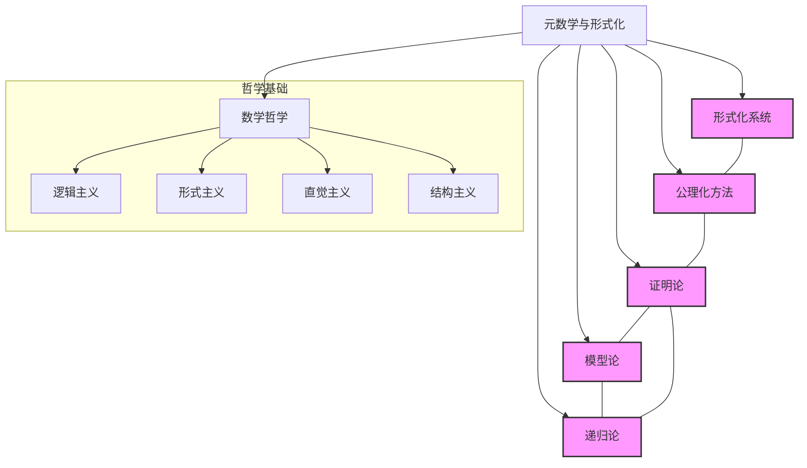
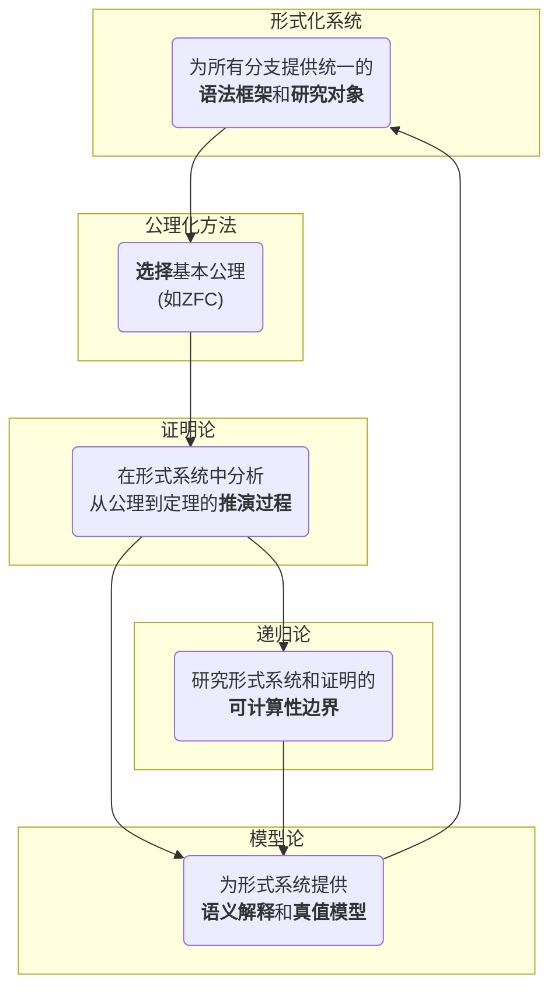
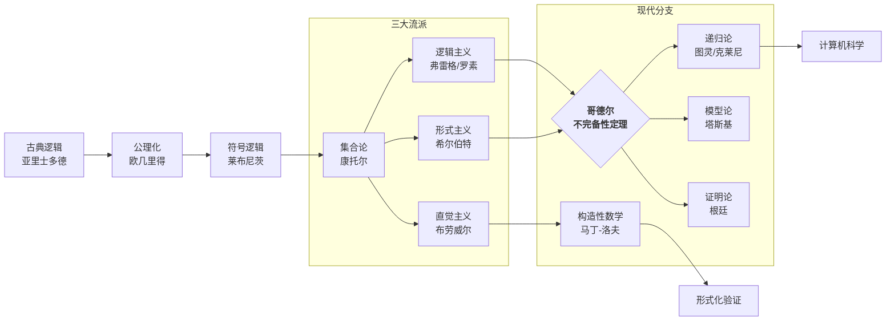

# 00-知识图谱总览：元数学与形式化

## 1. 引言：为何构建知识图谱

元数学与形式化领域是一个由深刻概念、历史线索和复杂联系交织而成的网络。传统的线性文档难以充分展现其丰富的内在结构。本知识图谱旨在：

- **系统化组织**：将核心概念、主要分支、哲学流派和应用领域组织成一个连贯的整体。
- **可视化关系**：通过图谱清晰地揭示不同知识单元之间的**蕴含、影响、对立和协同**关系。
- **促进导航与探索**：为学习者和研究者提供一个可探索的、多维度的知识地图，帮助建立全局观念。

---

## 2. 全局知识图谱：核心框架

本图谱的核心框架展现了元数学的几大支柱及其相互关系。



---

## 3. 关键联系分析：思想的交织

各分支并非孤立存在，它们的定义和发展相互依赖。下表和图示揭示了这些深刻的联系。

### 3.1 形式化方法与哲学流派的互动

不同的数学哲学学派对形式化方法的发展产生了深远影响，同时也从形式化研究中获得支持或挑战。

| 哲学学派 | 与形式化的核心关系 | 形式化贡献 | 面临的挑战 |
| :--- | :--- | :--- | :--- |
| **逻辑主义** | 试图将数学归约为逻辑，推动了形式逻辑系统的发展。 | 促进了符号逻辑的严格化和形式语言的发展。 | 罗素悖论；哥德尔不完备性定理。 |
| **形式主义** | 将数学视为符号游戏，直接催生了元数学和形式系统理论。 | 建立了严格的形式系统定义和证明论。 | 哥德尔第二定理粉碎了其核心纲领。 |
| **直觉主义** | 批判经典形式化，强调构造性，发展了新的形式系统。 | 发展了构造性逻辑、类型论和"证明即程序"的思想。 | 拒绝排中律，导致部分经典数学结论失效。 |
| **结构主义** | 认为数学研究的是抽象结构，形式化是捕捉结构的语言。 | 推动了抽象代数、模型论和范畴论的发展。 | 如何解释结构本身的本体论地位。 |

### 3.2 分支间的相互定义与支撑



---

## 4. 历史发展图谱：思想的演进

元数学与形式化的历史是一部充满危机、竞争和突破的壮丽史诗。



---

## 5. 应用领域图谱

元数学与形式化的思想和工具深刻地影响了众多学科，尤其是在计算机科学领域。

```mermaid
graph TD
    A[元数学与形式化] --> B[数学基础]
    A --> C[计算机科学]
    A --> D[人工智能]
    A --> E[哲学研究]

    subgraph B
        B1[数学理论的形式化]
        B2[一致性与独立性证明]
    end

    subgraph C
        C1[编程语言理论<br>(类型系统, 语义)]
        C2[计算复杂性理论]
        C3[算法的可计算性分析]
        C4[形式化验证]
    end

    subgraph D
        D1[自动定理证明]
        D2[知识表示与推理]
        D3[机器学习的逻辑基础]
    end

    subgraph E
        E1[数学哲学]
        E2[认知科学]
        E3[科学哲学]
    end
```

这个知识图谱是一个动态的、持续演进的项目。它将随着我们对元数学与形式化理解的深化而不断完善和扩展。
