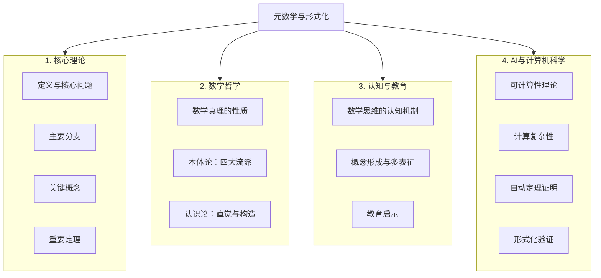
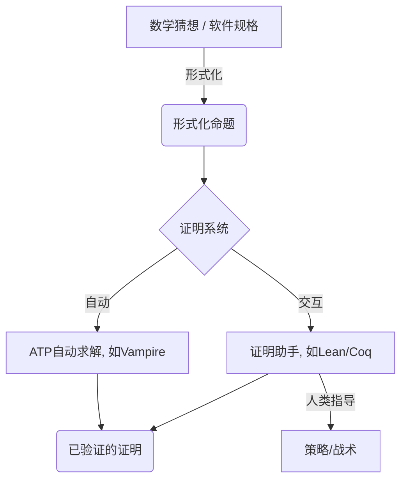

# 00-元数学与形式化基础总览

## 0. 导论

### 0.1 本文定位与目标

- **定位**：本文是"数学哲学-元数学与形式化"模块的核心文档，旨在对元数学与形式化的基础理论、哲学思辨、认知维度及前沿应用进行一次全面、系统和高质量的重构与整合。
- **目标**：
  1. **结构化整合**：将分散于多个文件中的相关内容（基础理论、哲学分析、AI应用、多表征案例等）统一到一个逻辑清晰、结构严谨的文档中。
  2. **内容深化**：不仅是内容的简单合并，更是在整合过程中进行提炼、补充和深化，提升内容的理论高度和可读性。
  3. **多维视角呈现**：系统性地展示元数学的**理论-哲学-认知-应用**四个核心维度，并揭示它们之间的内在联系。
  4. **建立权威入口**：使本文成为学习和探索该主题的权威性、一站式入口。

### 0.2 知识图谱

本模块的核心是探索数学的确定性、边界与本质，涵盖从抽象的哲学思辨到具体的计算机科学应用。



---

## 1. 核心理论：数学的自我审视

### 1.1 定义与核心问题

> **元数学（Metamathematics）** 是用数学方法研究数学理论本身结构、性质、方法和局限性的学科。它将数学理论（如皮亚诺算术）作为其研究的"数学对象"，从而在更高层次上进行反思与分析，常被称为"数学的数学"。

元数学主要关注以下核心问题：

| 核心问题 | 关键提问 | 形式化定义/例子 |
| :--- | :--- | :--- |
| **一致性 (Consistency)** | 一个形式系统能否避免推出矛盾？ | 系统 $S$ 是一致的，当且仅当不存在公式 $\phi$ 使得 $S \vdash \phi$ 且 $S \vdash \neg\phi$。 |
| **完备性 (Completeness)** | 系统中所有语义上为真的命题都能被证明吗？ | 哥德尔第一不完备定理指出，任何足够强的相容系统都是不完备的。 |
| **可判定性 (Decidability)** | 是否存在一个通用算法，能判定系统中任意命题的真伪？ | 图灵证明了停机问题的不可判定性，一阶逻辑是半可判定的。 |
| **独立性 (Independence)** | 某条公理（如选择公理）能否由其他公理推出？ | 选择公理、连续统假设独立于ZFC集合论。 |
| **可靠性 (Soundness)** | 系统中所有可被证明的命题是否在语义上都为真？ | 若 $S \vdash \phi$，则 $S \models \phi$。 |

### 1.2 主要分支

元数学主要通过以下四个分支展开其研究：

| 分支 | 研究对象与内容 | 代表性定理/成果 | 代表人物 |
| :--- | :--- | :--- | :--- |
| **证明论 (Proof Theory)** | 形式证明的结构、能力与局限。 | 哥德尔不完备定理、根岑一致性证明 | 希尔伯特、根岑、哥德尔 |
| **模型论 (Model Theory)** | 形式语言的语义解释、理论与模型的关系。 | 勒文海姆-斯科伦定理、紧致性定理 | 塔斯基、丘奇 |
| **集合论 (Set Theory)** | 作为数学基础的公理系统、无穷与独立性问题。 | 选择公理与连续统假设的独立性 | 康托尔、策梅洛、哥德尔、科恩 |
| **递归/可计算性理论** | 算法的本质、能力与极限。 | 停机问题不可判定、丘奇-图灵论题 | 图灵、丘奇、波斯特 |

### 1.3 关键概念：形式化、公理化、抽象化

这三个概念是元数学研究的基石，共同构成了现代数学的严谨性基础。

- **形式化 (Formalization)**：将数学思想精确地翻译成一个形式系统（由符号、语法、公理、推理规则构成）的过程。
  - **作用**：消除自然语言的歧义，使推理过程可以被机械地检验。
  - **例子**：将欧氏几何的公理和定理用一阶逻辑语言写出。
- **公理化 (Axiomatization)**：为某个数学分支选定一组最基本、最不证自明的命题（公理），并以此为逻辑起点，推导出该分支的所有其他定理。
  - **作用**：为复杂的理论提供一个坚实的逻辑基础，并便于研究理论之间的关系。
  - **例子**：皮亚诺算术公理、ZFC集合论公理。
- **抽象化 (Abstraction)**：从具体的数学对象或结构中抽取出共同的、本质的属性，并将其定义为一个新的、更普适的数学概念。
  - **作用**：极大地提升了数学的普适性和威力，使得一个定理可以应用于许多表面上不同的领域。
  - **例子**：从整数加法、矩阵乘法等运算中抽象出"群"的概念。

---

## 2. 数学哲学视角：真理与存在

元数学的成果深刻地影响了我们对"数学是什么"这一根本问题的回答。不同的哲学流派对数学对象的存在方式（本体论）和我们认识数学真理的方式（认识论）提出了不同的看法。

### 2.1 数学真理的性质

数学真理通常被认为具有**必然性**、**先验性**、**客观性**和**普遍性**。而对于"数学陈述为何为真"，主要有三种解释：

- **符合论 (Correspondence)**：真理是命题与客观存在的数学事实（一个柏拉图式的理念世界）相符合。
- **融贯论 (Coherence)**：真理是命题与所在公理系统内部的逻辑一致性。
- **实用/建构论 (Pragmatism/Constructivism)**：真理在于其有效性或可构造性。

### 2.2 本体论核心：四大哲学流派

数学对象的本质是什么？它们是独立于人类心智的客观实在，还是我们思维的自由创造？

| 哲学流派 | 核心观点 | 对"圆周率π"的看法 | 代表人物 | 元数学关联 |
| :--- | :--- | :--- | :--- | :--- |
| **柏拉图主义 / 实在论** | 数学对象是客观、抽象、永恒的实体，数学家是**发现者**。 | π是一个客观存在的、具有特定值的抽象实体，独立于我们的计算和定义。 | 柏拉图、哥德尔 | 哥德尔认为他的不完备定理揭示了数学真理的客观性超越了形式证明。 |
| **形式主义** | 数学是操作符号的形式**游戏**，真理即系统内部的无矛盾性。 | π是在特定公理系统（如实数公理）中定义的一个符号，其性质由公理决定。 | 希尔伯特 | 希尔伯特计划是形式主义的顶峰，但被哥德尔定理根本性地动摇。 |
| **直觉主义 / 建构主义** | 数学是人类心智的**构造**活动，只承认可被构造的对象和证明。 | 我们只能谈论π的某个具体构造过程（如无穷级数），而不是一个"已完成的"实体。 | 布劳威尔、海廷 | 拒绝排中律和非构造性证明，对证明论和可计算性理论有深远影响。 |
| **结构主义** | 数学研究的是**结构**和**模式**，对象的意义在于其在结构中的位置。 | π的本质不在于它自身，而在于它在实数这一结构中与其他数（如1, 2）的关系。 | 戴德金、布尔巴基学派 | 范畴论被认为是结构主义思想的极致体现。 |

---

## 3. 认知与教育视角

### 3.1 数学思维的认知机制

- **数学直觉**：对数学结论的快速、直接的把握，是数学发现的源泉。它包括**数量直觉**、**空间直觉**、**逻辑直觉**和**模式直觉**。
- **认知基础**：数学思维与大脑的特定区域（如顶叶、额叶）紧密相关，长期的数学训练能显著塑造大脑的神经连接。
- **认知障碍**：形式化与直觉的割裂、过高的认知负荷、对符号的恐惧是学习元数学的主要障碍。

### 3.2 教育启示

- **平衡形式化与直觉**：教学中应避免纯粹的符号操演，需通过可视化、类比等方式建立符号与直觉概念的联系。
- **拥抱多表征**：综合使用**文本、图表、代码、动画**等多种方式呈现同一数学概念，有助于从不同维度加深理解。
- **融入批判性思维**：引导学生思考不同哲学流派的观点，理解数学知识的边界和假设，培养批判性思维能力。
- **结合现代工具**：利用**证明助手（Lean, Coq）**、**知识图谱**等现代AI工具辅助教学，降低认知门槛，提升学习兴趣。

---

## 4. 与AI及计算机科学的联系

元数学的四大分支为计算机科学提供了坚实的理论基石。

| 元数学领域 | 计算机科学对应领域 | 核心联系与贡献 |
| :--- | :--- | :--- |
| **可计算性理论** | **算法理论、AI边界** | **定义了什么是"可计算的"**。图灵停机问题划定了算法能力的绝对边界，也定义了AI能力的理论天花板。 |
| **证明论** | **自动定理证明 (ATP)、交互式证明助手** | 形式化的证明系统（如自然演绎）是ATP和Coq, Lean等工具的底层逻辑框架。 |
| **模型论** | **数据库理论、形式化验证** | 模型论中的"可满足性"概念是SAT/SMT求解器的核心，这些求解器被广泛用于软硬件验证和AI安全。 |
| **集合论** | **数据结构、类型论** | 集合论的基本概念（集合、关系、函数）是构建复杂数据结构和类型系统的基础。 |

### 4.1 自动证明与形式化验证



- **自动定理证明 (ATP)**：旨在完全自动地寻找证明，在特定领域（如布尔代数）非常成功。
- **交互式证明助手**：人与机器协作完成证明，已成功用于验证四色定理、开普勒猜想和CompCert（一个经过完全验证的C语言编译器）等复杂系统。

### 4.2 计算复杂性

- **P vs NP 问题**：是理论计算机科学的核心难题，它关心的是那些"容易验证答案"的问题是否也"容易找到答案"。
- **对AI的影响**：许多AI问题（如下棋、路径规划）都是NP-hard问题，这意味着找到最优解在最坏情况下需要指数级时间。这迫使AI研究者开发启发式算法和近似算法。

---

## 5. 多表征范例

使用不同范式或语言来表达同一概念，可以极大地加深对其本质的理解。以皮亚诺公理定义的自然数为例：

### 5.1 Lean (依赖类型语言)

```lean
-- Lean中的归纳类型定义
inductive Nat where
  | zero : Nat
  | succ : Nat → Nat
```

*这一定义不仅给出了构造规则，其类型系统还允许我们在其上进行复杂的性质证明。*

### 5.2 Haskell (纯函数式语言)

```haskell
-- Haskell中的代数数据类型定义
data Nat = Zero | Succ Nat
```

*这强调了数据的不变性和递归结构，便于通过模式匹配进行函数定义。*

### 5.3 Rust (系统编程语言)

```rust
// Rust中的枚举类型与堆分配
enum Nat {
    Zero,
    Succ(Box<Nat>),
}
```

*这里的`Box<T>`体现了Rust对内存所有权的精确控制，即便是对一个理论上的无穷结构。*

---

## 6. 批判性评价与未来展望

- **局限性**：
  - **哥德尔的阴影**：不完备定理表明，任何足够丰富的数学系统都存在"可知但不可证"的真理，这为数学的完全形式化设下了根本障碍。
  - **实践的鸿沟**：形式化证明虽然严谨，但其过程往往冗长、繁琐，与人类数学家充满直觉和跳跃的思维方式存在巨大差异。
  - **复杂性的挑战**：许多理论上可判定的问题在实践中是计算不可行的（计算爆炸）。
- **未来展望**：
  - **AI与数学的深度融合**：AI不仅能作为证明助手，更有潜力通过大型语言模型和神经符号系统来发现新的数学猜想和证明思路。
  - **认知科学的启发**：对数学家认知过程的深入研究，可能会启发新的、更符合人类思维习惯的形式化系统和证明工具。
  - **统一性的探索**：范畴论、同伦类型论等前沿理论，正在尝试为数学提供一个更加统一和灵活的新基础，这可能引发元数学的新一轮革命。

---

## 7. 参考文献与资源

### 7.1 经典文献

1. **Gödel, K.** (1931). "Über formal unentscheidbare Sätze...".
2. **Turing, A.** (1936). "On Computable Numbers...".
3. **Hofstadter, D.** (1979). *Gödel, Escher, Bach: an Eternal Golden Braid*.

### 7.2 现代文献与在线资源

1. **Shapiro, S.** (2000). *Thinking About Mathematics*.
2. **Avigad, J.** (2018). *Mathematics and its Logics*.
3. **Stanford Encyclopedia of Philosophy**: [Philosophy of Mathematics](https://plato.stanford.edu/entries/philosophy-mathematics/)
4. **Proof Assistants**: [Lean](https://leanprover.github.io/), [Coq](https://coq.inria.fr/), [Isabelle/HOL](https://isabelle.in.tum.de/)
