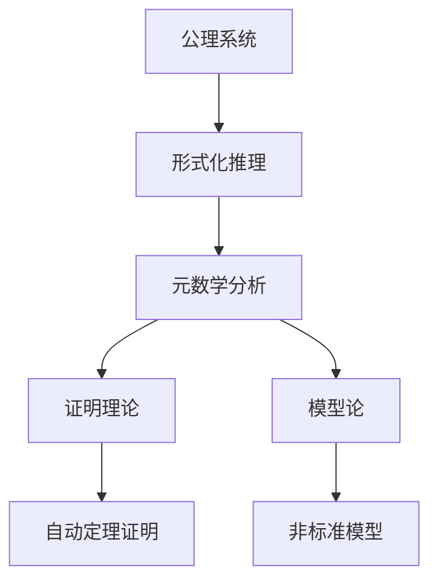

# 元数学与形式化的多表征

## 1. 图示表达



## 2. 表格对比

| 主题         | 形式化系统           | 元数学理论         |
|--------------|----------------------|--------------------|
| 研究对象     | 公理、符号、推理规则 | 形式系统的性质与极限 |
| 主要方法     | 逻辑推理、符号操作   | 证明、模型、元定理   |
| 典型成果     | 皮亚诺公理、ZF集合论 | 哥德尔定理、停机问题 |
| 应用         | 证明助手、编程语言   | 自动证明、复杂性理论 |

## 3. 代码与形式化示例

### Lean 示例

```lean
axiom PeanoZero : ℕ
axiom PeanoSucc : ℕ → ℕ
-- 皮亚诺公理部分形式化
```

### Haskell 示例

```haskell
data Nat = Zero | Succ Nat
-- 皮亚诺自然数的Haskell定义
```

### Rust 示例

```rust
enum Nat {
    Zero,
    Succ(Box<Nat>),
}
// 皮亚诺自然数的Rust定义
```

## 4. 多模态与批判性分析

- 多表征有助于揭示元数学与形式化的本质联系
- 图、表、代码等多模态表达促进理解与跨学科应用
- 形式化语言虽严谨，但需警惕其与直觉、认知的距离

## 5. 结构化导图与本地跳转

- [元数学与形式化基础总览](./00-元数学与形式化基础总览.md)
- [元数学与形式化基础](./01-元数学与形式化基础.md)
- [元数学与形式化的多表征](./03-元数学与形式化的多表征.md)

---

> 本文档内容参考并整合自 Math/Matter/views/math_view02.md、view_math01.md、数学概念分析和综合.md 等，后续将持续补充交叉引用与多表征内容。
