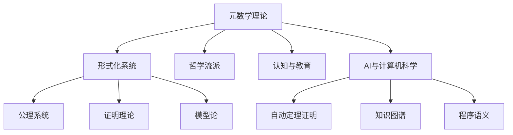

# 元数学与形式化的知识图谱

## 1. 主题映射与结构化节点

- 元数学理论（定义、意义、成果、局限）
- 形式化系统（公理、推理规则、模型、证明）
- 哲学流派（逻辑主义、形式主义、直觉主义、结构主义等）
- 认知与教育（认知结构、教育建议、创新障碍）
- AI与计算机科学（自动定理证明、知识图谱、程序语义等）

## 2. 结构化知识图谱（Mermaid）

## 3. 交叉引用与本地跳转

- [元数学与形式化基础总览](./00-元数学与形式化基础总览.md)
- [元数学与形式化基础](./01-元数学与形式化基础.md)
- [元数学与形式化的知识图谱](./06-元数学与形式化的知识图谱.md)

## 4. 可视化与多表征建议

- 推荐结合Mermaid、表格、代码等多模态表达
- 可扩展为交互式知识图谱或主题映射工具

---

> 本文档内容参考并整合自 Math/Matter/views/math_view02.md、view_math01.md、数学概念分析和综合.md 等，后续将持续补充交叉引用与多表征内容。
