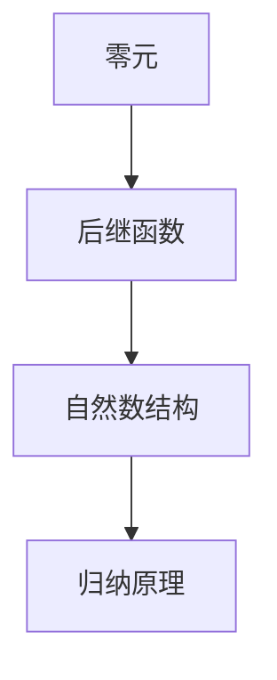

# 元数学与形式化的多表征案例集

## 1. 图示案例

### 皮亚诺公理系统结构



## 2. 表格案例

| 案例主题         | 形式化表达         | 元数学分析         |
|------------------|--------------------|--------------------|
| 皮亚诺公理       | Lean/Haskell/Rust  | 一致性、独立性     |
| ZF集合论         | Lean/Coq           | 不完备性、模型多样性|
| 自动定理证明     | Coq/Lean           | 可构造性、复杂性   |

## 3. 代码案例

### Lean 形式化皮亚诺公理

```lean
axiom PeanoZero : ℕ
axiom PeanoSucc : ℕ → ℕ
-- 皮亚诺公理部分Lean形式化
```

### Haskell 皮亚诺自然数

```haskell
data Nat = Zero | Succ Nat
-- Haskell定义皮亚诺自然数
```

### Rust 皮亚诺自然数

```rust
enum Nat {
    Zero,
    Succ(Box<Nat>),
}
// Rust定义皮亚诺自然数
```

## 4. AI工具与教育应用案例

- 利用Lean/Coq等证明助手辅助元数学教学
- 通过知识图谱、结构化导图提升理解
- 设计交互式学习平台，降低认知负荷

## 5. 结构化导图与本地跳转

- [元数学与形式化基础总览](./00-元数学与形式化基础总览.md)
- [元数学与形式化基础](./01-元数学与形式化基础.md)
- [元数学与形式化的多表征案例集](./08-元数学与形式化的多表征案例集.md)

---

> 本文档内容参考并整合自 Math/Matter/views/math_view02.md、view_math01.md、数学概念分析和综合.md 等，后续将持续补充交叉引用与多表征内容。
