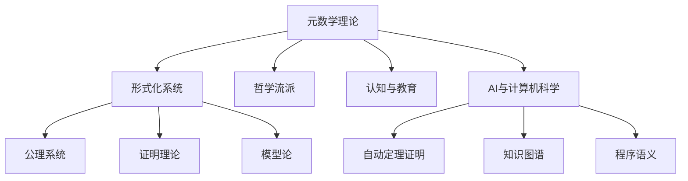

# 元数学与形式化的多模态知识结构

## 1. 多模态结构概述

- 结合文本、图、表、代码等多种表征方式
- 支持主题映射、交互式导航、知识可视化

## 2. 结构化主题映射

- 元数学理论
- 形式化系统
- 哲学流派
- 认知与教育
- AI与计算机科学

## 3. 图示表达（Mermaid）



## 4. 表格与代码示例

| 主题         | 形式化系统           | 元数学理论         |
|--------------|----------------------|--------------------|
| 研究对象     | 公理、符号、推理规则 | 形式系统的性质与极限 |
| 主要方法     | 逻辑推理、符号操作   | 证明、模型、元定理   |

### Lean 示例

```lean
axiom PeanoZero : ℕ
axiom PeanoSucc : ℕ → ℕ
```

### Haskell 示例

```haskell
data Nat = Zero | Succ Nat
```

### Rust 示例

```rust
enum Nat {
    Zero,
    Succ(Box<Nat>),
}
```

## 5. 交互式结构建议

- 推荐开发交互式知识图谱、主题导航工具
- 支持多层级跳转与多模态内容展示

## 6. 结构化导图与本地跳转

- [元数学与形式化基础总览](./00-元数学与形式化基础总览.md)
- [元数学与形式化基础](./01-元数学与形式化基础.md)
- [元数学与形式化的多模态知识结构](./10-元数学与形式化的多模态知识结构.md)

---

> 本文档内容参考并整合自 Math/Matter/views/math_view02.md、view_math01.md、数学概念分析和综合.md 等，后续将持续补充交叉引用与多表征内容。
