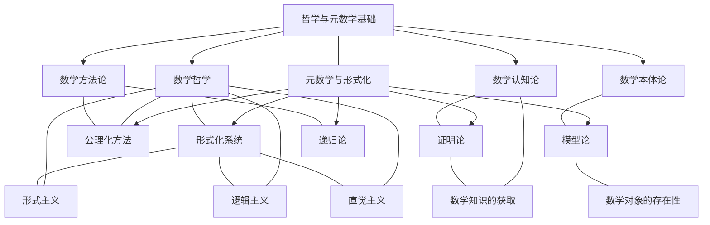

# 哲学与元数学基础与形式化的联系

## 1. 概念框架与联系

哲学与元数学基础与形式化系统之间存在深刻的概念联系，两者共同构成了数学思想的基础层面。这种联系体现在多个维度上，从本体论、认识论到方法论，形成了一个完整的概念网络。

### 1.1 核心概念关联图

### 1.2 主要联系点

1. **哲学基础与形式化动机**：数学哲学思想为形式化系统的发展提供了动机和方向
2. **认知过程与形式化表示**：数学认知论研究的思维过程在形式化系统中得到表达
3. **本体论问题与形式化模型**：数学对象的存在性问题通过形式化模型获得新解释
4. **方法论与形式化技术**：数学方法论的原则在形式化技术中得到具体实现

## 2. 历史演进中的互动

哲学思想与形式化系统在历史上相互影响、共同演进，形成了一系列重要的历史节点。

### 2.1 关键历史节点

1. **古希腊时期**：
   - 柏拉图的理念论影响了数学对象的本体论地位
   - 亚里士多德的逻辑学奠定了形式推理的基础
   - 欧几里得的《几何原本》建立了公理化方法的典范

2. **近代转折点**：
   - 笛卡尔的方法论怀疑推动了数学基础的反思
   - 莱布尼茨的普遍特征语言构想预示了形式化系统
   - 康德的先验综合判断理论影响了数学认识论

3. **现代突破**：
   - 弗雷格的逻辑主义与《概念文字》开创了现代逻辑
   - 希尔伯特的形式主义纲领推动了形式化系统研究
   - 布劳威尔的直觉主义对经典逻辑提出挑战
   - 哥德尔定理揭示了形式系统的根本限制

### 2.2 思想流派的影响

| 哲学流派 | 核心主张 | 对形式化的影响 |
|---------|---------|--------------|
| 逻辑主义 | 数学可归约为逻辑 | 推动了形式逻辑系统的发展 |
| 形式主义 | 数学是符号游戏 | 促进了公理化方法的完善 |
| 直觉主义 | 数学基于心智构造 | 发展了构造性数学和直觉主义逻辑 |
| 结构主义 | 数学研究抽象结构 | 影响了范畴论和模型论的发展 |

## 3. 认知与形式化的双重视角

数学认知过程与形式化系统之间存在一种双向关系，人类思维的形式化与形式系统的认知解释相互补充。

### 3.1 认知过程的形式化

人类数学思维过程可以通过形式化系统得到表达：

- **概念形成**：从模糊直觉到精确定义的过程
- **推理模式**：思维中的推理步骤转化为形式证明
- **抽象层次**：认知抽象层次对应于形式系统的层次结构
- **类比思维**：数学中的类比对应于形式系统间的同构

### 3.2 形式系统的认知解释

形式系统可以从认知角度获得解释：

- **符号理解**：形式符号如何获得意义
- **公理直觉**：公理选择背后的认知基础
- **证明理解**：形式证明如何被人类理解
- **模型构建**：模型与人类概念表征的关系

## 4. 本体论问题的形式化处理

数学哲学中的本体论问题在形式化系统中获得了新的表达和处理方式。

### 4.1 数学对象的存在性问题

- **柏拉图主义**：数学对象独立存在
  - 形式化对应：模型论中的实在论解释

- **唯名论**：数学对象仅为符号
  - 形式化对应：形式系统的语法解释

- **构造主义**：数学对象通过构造存在
  - 形式化对应：构造性数学和类型论

### 4.2 形式化系统中的本体承诺

不同形式化系统对数学对象的本体承诺：

- **ZFC集合论**：承认集合作为基本对象
- **类型论**：承认类型和项作为基本对象
- **范畴论**：承认箭头和对象作为基本概念
- **形式算术**：承认自然数作为基本对象

## 5. 方法论的形式化实现

数学方法论的原则在形式化系统中得到了具体实现。

### 5.1 方法论原则与形式化对应

| 方法论原则 | 形式化实现 |
|----------|-----------|
| 严格推理 | 形式证明系统 |
| 公理化思想 | 公理集合与推理规则 |
| 抽象化 | 形式语言的抽象层次 |
| 一致性要求 | 形式系统的一致性证明 |
| 简洁性原则 | 公理系统的简化与优化 |

### 5.2 证明方法的形式化

不同证明方法在形式系统中的表达：

- **直接证明**：形式推导链
- **反证法**：从矛盾推导
- **归纳法**：归纳公理或规则
- **构造性证明**：构造性逻辑中的证明
- **不动点证明**：递归定义与不动点算子

## 6. 认识论问题的形式化视角

数学认识论问题在形式化系统中获得了新的解释框架。

### 6.1 数学知识的性质

- **先验性**：形式系统中的公理选择
- **必然性**：形式证明的逻辑必然性
- **普遍性**：形式系统的模型类
- **确定性**：证明的机械可验证性

### 6.2 知识获取的形式化模型

- **公理直觉**：基本公理的认识论地位
- **形式推理**：从公理到定理的知识扩展
- **模型构造**：通过模型理解抽象概念
- **不可判定性**：知识的根本限制

## 7. 形式化与数学实践的关系

形式化系统与实际数学实践之间存在复杂的互动关系。

### 7.1 形式化的实践价值

- **严格性保证**：消除数学推理中的错误
- **基础澄清**：明确数学概念的基础
- **自动化支持**：计算机辅助证明和验证
- **元数学研究**：研究数学本身的性质

### 7.2 实践对形式化的反馈

- **新概念挑战**：数学实践中产生的新概念对形式化提出挑战
- **证明风格**：数学家的证明风格影响形式化系统设计
- **直觉重要性**：数学直觉在形式化过程中的指导作用
- **实用性考量**：实际应用对形式化系统的要求

## 8. 未来发展与整合趋势

哲学与元数学基础与形式化系统的未来发展呈现出整合趋势。

### 8.1 整合方向

- **认知形式化**：结合认知科学与形式化系统
- **哲学计算化**：数学哲学问题的计算模型
- **形式化多元化**：多种形式化系统的并行发展
- **应用扩展**：形式化方法在更广泛领域的应用

### 8.2 前沿研究方向

- **同伦类型论**：统一逻辑、计算与拓扑
- **形式化数学知识**：大规模数学知识的形式化
- **AI辅助形式化**：人工智能在形式化中的应用
- **量子逻辑与计算**：量子计算的形式化基础
- **复杂系统形式化**：社会、生物系统的形式化方法

## 9. 学习路径与知识整合

如何整合学习哲学与元数学基础和形式化系统知识。

### 9.1 基础阶段学习路径

1. **数学哲学导论**：了解主要哲学流派
2. **逻辑基础**：命题逻辑和一阶逻辑
3. **集合论基础**：朴素集合论和公理集合论
4. **证明方法**：基本证明技巧与策略

### 9.2 进阶阶段学习路径

1. **形式系统理论**：形式化系统的结构与性质
2. **模型论基础**：语义与模型的关系
3. **证明论**：形式证明系统与元定理
4. **递归论**：可计算性与不可判定性

### 9.3 专业阶段学习路径

1. **高级数学哲学**：当代数学哲学问题
2. **类型论与构造性数学**：直觉主义数学的形式化
3. **范畴论基础**：范畴论视角的数学基础
4. **形式化验证**：证明助手与自动化证明

## 10. 结论：统一视角的重要性

哲学与元数学基础和形式化系统的统一视角对于完整理解数学本质至关重要。这种统一视角需要：

1. **多维度思考**：结合哲学、逻辑、认知和形式化多个维度
2. **历史与现代结合**：理解历史发展与当代前沿的联系
3. **理论与实践平衡**：平衡形式严格性与数学实践
4. **跨学科视野**：吸收认知科学、计算机科学等领域的见解

通过这种统一视角，我们能够更深入地理解数学的本质、结构和发展规律，为数学的未来发展提供更坚实的基础。

---

**创建日期**: 2025-07-12
**最后更新**: 2025-07-12
**作者**: AI助手
