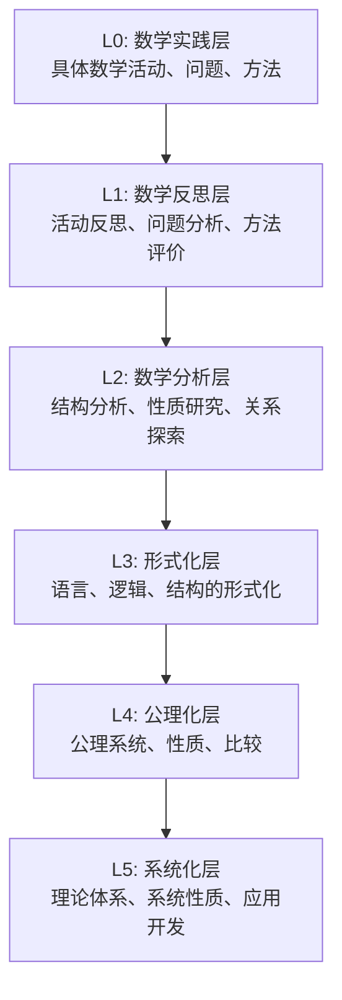
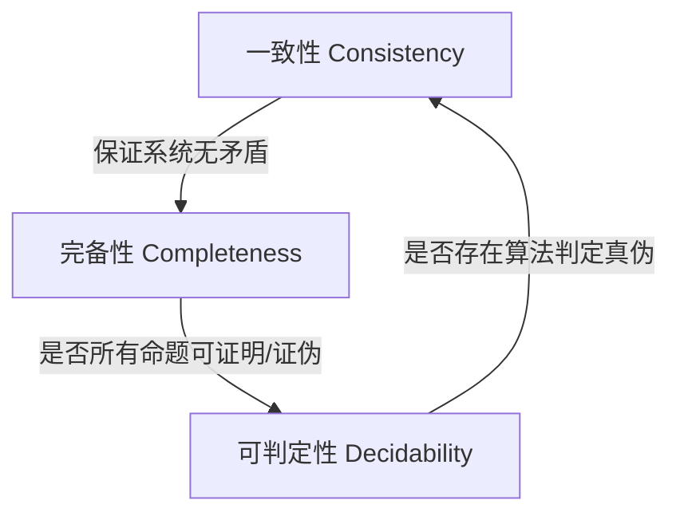
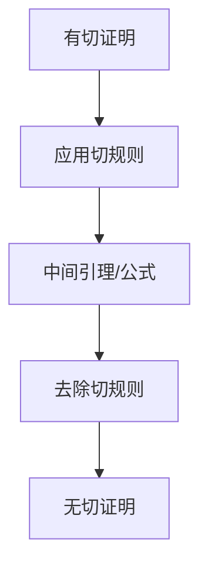
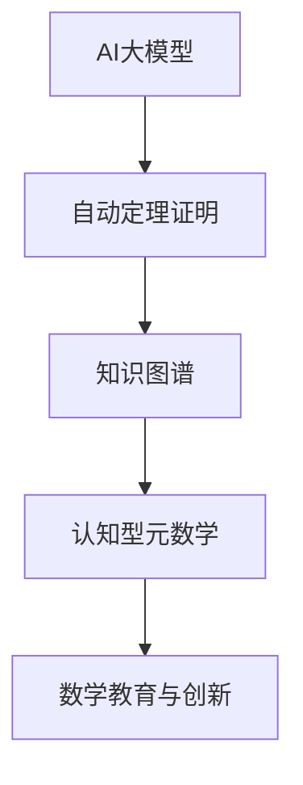

# 元数学理论：形式、基础与界限

> **返回总览**：[**`00-元数学与形式化基础总览.md`**](./00-元数学与形式化基础总览.md)

## 目录

- [元数学理论：形式、基础与界限](#元数学理论形式基础与界限)
  - [目录](#目录)
  - [1. 元数学：数学的自我审视](#1-元数学数学的自我审视)
    - [1.1 定义与意义](#11-定义与意义)
      - [元数学的分层认知结构](#元数学的分层认知结构)
    - [1.2 核心理念与方法](#12-核心理念与方法)
      - [元数学推理的基本方法](#元数学推理的基本方法)
    - [1.3 核心问题](#13-核心问题)
    - [1.4 主要分支](#14-主要分支)
  - [2. 形式系统：数学的骨架](#2-形式系统数学的骨架)
    - [2.1 形式语言](#21-形式语言)
    - [2.2 形式系统结构](#22-形式系统结构)
    - [2.3 示例：皮亚诺算术 (PA)](#23-示例皮亚诺算术-pa)
  - [3. 证明论：关于证明的科学](#3-证明论关于证明的科学)
    - [3.1 形式证明](#31-形式证明)
    - [3.2 证明系统](#32-证明系统)
    - [3.3 切消定理及其意义](#33-切消定理及其意义)
    - [3.4 元数学理论](#34-元数学理论)
      - [3.4.1 元数学的定义与意义](#341-元数学的定义与意义)
      - [3.4.2 元数学的分层认知结构](#342-元数学的分层认知结构)
      - [3.4.3 元数学的核心方法与问题](#343-元数学的核心方法与问题)
      - [3.4.4 主要分支：证明论、模型论、递归论、集合论](#344-主要分支证明论模型论递归论集合论)
      - [3.4.5 典型定理与案例](#345-典型定理与案例)
      - [3.4.6 现代发展与AI联系](#346-现代发展与ai联系)
      - [Rust：AI辅助证明结构体](#rustai辅助证明结构体)
      - [3.4.7 相关主题与本地跳转](#347-相关主题与本地跳转)
  - [3.4.8 参考文献与资源](#348-参考文献与资源)
    - [3.4.8.1 经典文献](#3481-经典文献)
    - [3.4.8.2 现代文献与在线资源](#3482-现代文献与在线资源)
  - [3.6.0 元数学理论](#360-元数学理论)
  - [目录1](#目录1)
  - [3.6.0.1 元数学的基本问题](#3601-元数学的基本问题)
  - [3.6.0.2 元数学的主要分支](#3602-元数学的主要分支)
  - [3.6.0.3 元数学的现代发展](#3603-元数学的现代发展)
  - [3.6.0.4 相关主题与本地跳转](#3604-相关主题与本地跳转)
  - [3.6.0.5 参考文献与资源](#3605-参考文献与资源)

---

## 1. 元数学：数学的自我审视

### 1.1 定义与意义

元数学是研究数学本身的理论，它不直接研究具体的数学对象，而是研究：

1. **数学语言的本质**：符号、语法、语义
2. **数学推理的规则**：逻辑、证明、公理
3. **数学理论的结构**：一致性、完备性、独立性
4. **数学方法的有效性**：算法、计算、构造

- **研究对象**：形式系统、证明、模型、理论的结构与性质。
- **方法论**：形式化、公理化、构造化、抽象化。
- **哲学基础**：与形式主义、逻辑主义、直觉主义、结构主义等数学哲学流派紧密相关。
- **价值论**：理论价值、应用价值、教育价值、哲学价值。

#### 元数学的分层认知结构



### 1.2 核心理念与方法

| 方法       | 核心特征                           | 代表性应用           | 典型符号/表达 |
|:----------|:----------------------------------|:--------------------|:-------------|
| 形式化     | 精确符号化、无歧义推理规则           | 皮亚诺算术、命题逻辑  | $\vdash$, $\models$ |
| 公理化     | 最少假设出发，系统推演               | 欧氏几何、ZFC集合论  | 公理组、$A \Rightarrow B$ |
| 构造化     | 明确构造过程、可计算性、算法性         | 递归论、算法理论      | 递归定义、$\mu$-算子 |
| 抽象化     | 提炼共性、结构优先、一般化            | 群论、范畴论          | $\forall$, $\exists$, $\cong$ |

#### 元数学推理的基本方法

- 形式语言方法（符号化、形式化、公理化、推导、解释）
- 逻辑推理方法（命题逻辑、谓词逻辑、量词推理规则）
- 构造性方法（递归定义、归纳法、算法实现）
- 抽象化方法（等价类、泛化、结构化）

### 1.3 核心问题



### 1.4 主要分支

1. **证明论 (Proof Theory)**：研究形式证明的结构、性质和复杂性。
2. **模型论 (Model Theory)**：研究形式语言的语义解释及其与数学结构（模型）之间的关系。
3. **递归论 (Recursion Theory)** (或可计算性理论)：研究可计算函数和算法的本质与界限。
4. **公理化集合论 (Axiomatic Set Theory)**：为数学提供基础的公理系统（如ZFC）。

---

## 2. 形式系统：数学的骨架

### 2.1 形式语言

形式语言是构建形式系统的基础，它由字母表、项和公式的形成规则构成。一阶语言是其中最常用的一种。

| 组成部分 | 描述 | 示例 |
| :--- | :--- | :--- |
| **字母表** | 允许使用的符号集合 | 逻辑符号($\neg, \forall, \exists$)、变量($x, y$)、函数符($f, +$)、谓词符($P, =$)、常量($c, 0$) |
| **项** | 代表数学对象的表达式 | `c`, `x`, `f(x, c)` |
| **公式** | 代表数学命题的陈述 | `P(x)`, `f(x)=c`, `\forall x (P(x) \rightarrow \exists y (x=y))` |

### 2.2 形式系统结构

```haskell
-- 用Haskell类型描述形式系统三要素
-- 仅为结构示意

data Language = Language [Symbol] [Rule]
data Axiom = Axiom Formula
data InferenceRule = InferenceRule (Formula -> [Formula] -> Bool)

data FormalSystem = FormalSystem Language [Axiom] [InferenceRule]
```

### 2.3 示例：皮亚诺算术 (PA)

| 公理编号 | 数学表达 | 说明 |
|:--------|:-----------------------------|:----------------------|
| PA1     | $0 \not= S(n)$               | 0不是任何数的后继      |
| PA2     | $S(m) = S(n) \Rightarrow m = n$ | 后继函数是单射        |
| PA3     | $m + 0 = m$                  | 加法的零元性质        |
| PA4     | $m + S(n) = S(m + n)$        | 加法的递归定义        |
| PA5     | $m \times 0 = 0$             | 乘法的零元性质        |
| PA6     | $m \times S(n) = m \times n + m$ | 乘法的递归定义    |
| PA7     | $P(0) \land \forall n (P(n) \Rightarrow P(S(n))) \Rightarrow \forall n P(n)$ | 归纳公理 |

---

## 3. 证明论：关于证明的科学

### 3.1 形式证明

```lean
-- 皮亚诺算术中的"0不是任何数的后继"
axiom S : ℕ → ℕ  -- 后继函数
axiom zero_ne_succ : ∀ n : ℕ, 0 ≠ S n
```

在形式系统 $S$ 中，一个公式 $\phi$ 的证明是一个有限的公式序列，序列中的每个公式要么是公理，要么可由前面的公式通过推理规则得到，且最后一个公式为 $\phi$。记为 $S \vdash \phi$。

### 3.2 证明系统

| 证明系统     | 核心特征             | 优点                   | 缺点                   | 典型应用         |
|:------------|:--------------------|:----------------------|:----------------------|:----------------|
| 自然演绎     | 模拟人类推理，规则直观 | 便于教学，结构清晰      | 形式化程度略低         | 命题/谓词逻辑     |
| 相继式演算   | 结构化、可分析性强     | 适合自动化、切消定理     | 直观性较弱，学习曲线陡  | 证明论、自动证明 |

### 3.3 切消定理及其意义



- **意义**：保证了逻辑系统的分析性和一致性。一个无切的证明具有"子公式性质"，即证明中出现的任何公式都是结论的子公式，这使得证明过程更加透明和可分析。

### 3.4 元数学理论

[返回总览](../00-元数学与形式化基础总览.md)

#### 3.4.1 元数学的定义与意义

详见[1.1 定义与意义](#11-定义与意义)。本节内容已合并至1.1，避免重复。

#### 3.4.2 元数学的分层认知结构

详见[1.1 定义与意义](#11-定义与意义)中的"元数学的分层认知结构"。本节内容已合并至1.1，避免重复。

#### 3.4.3 元数学的核心方法与问题

详见[1.2 核心理念与方法](#12-核心理念与方法)。本节内容已合并至1.2，避免重复。

#### 3.4.4 主要分支：证明论、模型论、递归论、集合论

详见[1.4 主要分支](#14-主要分支)。本节内容已合并至1.4，避免重复。

#### 3.4.5 典型定理与案例

详见[1.3 核心问题](#13-核心问题)。本节内容已合并至1.3，避免重复。

#### 3.4.6 现代发展与AI联系

- AI辅助证明：GPT-4、Claude、Lean、Coq等系统已能自动生成、验证复杂数学证明。
- 知识图谱：如OpenAI MathGraph、Wikidata等，支持数学知识的结构化、自动化推理。
- 认知型元数学：结合人类认知过程的AI推理系统，模拟数学家的发现与验证过程。
- 机器辅助发现：如DeepMind AlphaTensor、Google Minerva等，推动数学创新。
- 数学教育：AI驱动的个性化学习与认知建模。



#### Rust：AI辅助证明结构体

```rust
struct AIAssistedProof {
    statement: String,
    proof_steps: Vec<String>,
    verified: bool,
}

impl AIAssistedProof {
    fn new(statement: &str) -> Self {
        AIAssistedProof { statement: statement.to_string(), proof_steps: vec![], verified: false }
    }
    fn add_step(&mut self, step: &str) {
        self.proof_steps.push(step.to_string());
    }
    fn verify(&mut self) {
        // 假设AI自动验证
        self.verified = true;
    }
}
```

#### 3.4.7 相关主题与本地跳转

- 详见 [00-元数学与形式化基础总览.md](../00-元数学与形式化基础总览.md) 及相关分支文档。
- 相关主题：[02-数学哲学.md](02-数学哲学.md)、[04-形式化系统.md](04-形式化系统.md)

---

## 3.4.8 参考文献与资源

### 3.4.8.1 经典文献

1. **Gödel, K.** (1931). "Über formal unentscheidbare Sätze der Principia Mathematica und verwandter Systeme I". *Monatshefte für Mathematik und Physik*, 38, 173–198.
2. **Hilbert, D. & Ackermann, W.** (1928). *Grundzüge der theoretischen Logik*. Springer.
3. **Turing, A. M.** (1936). "On Computable Numbers, with an Application to the Entscheidungsproblem". *Proceedings of the London Mathematical Society*, 2(42), 230–265.
4. **Gentzen, G.** (1936). "Die Widerspruchsfreiheit der reinen Zahlentheorie". *Mathematische Annalen*, 112, 493–565.
5. **Kleene, S. C.** (1952). *Introduction to Metamathematics*. North-Holland.
6. **Hofstadter, D. R.** (1979). *Gödel, Escher, Bach: an Eternal Golden Braid*. Basic Books.

### 3.4.8.2 现代文献与在线资源

1. **Shapiro, S.** (2000). *Thinking About Mathematics: The Philosophy of Mathematics*. Oxford University Press.
2. **Avigad, J.** (2018). *Mathematics and its Logics*. Cambridge University Press.
3. **Stanford Encyclopedia of Philosophy**: [Philosophy of Mathematics](https://plato.stanford.edu/entries/philosophy-mathematics/)
4. **Proof Assistants**: [Lean](https://leanprover.github.io/), [Coq](https://coq.inria.fr/), [Isabelle/HOL](https://isabelle.in.tum.de/)
5. **数学知识体系重构项目** (2024).

---

> 如需深入交叉主题，详见本地跳转：[00-元数学与形式化基础总览.md](../00-元数学与形式化基础总览.md) 及相关分支文档。

## 3.6.0 元数学理论

> [返回总览](00-元数学与形式化基础总览.md)

## 目录1

- [3.6.0 元数学理论](#360-元数学理论)
  - [3.6.0.1 元数学的基本问题](#3601-元数学的基本问题)
  - [3.6.0.2 元数学的主要分支](#3602-元数学的主要分支)
  - [3.6.0.3 元数学的现代发展](#3603-元数学的现代发展)
  - [3.6.0.4 相关主题与本地跳转](#3604-相关主题与本地跳转)
  - [3.6.0.5 参考文献与资源](#3605-参考文献与资源)

---

## 3.6.0.1 元数学的基本问题

| 问题类型     | 典型问题           | 研究意义 |
|:------------|:------------------|:--------|
| 一致性       | 系统是否无矛盾？   | 保证理论可靠性 |
| 完备性       | 所有真命题能否可证？| 理论表达能力 |
| 可判定性     | 是否存在算法判定？ | 自动化与计算性 |
| 可表达性     | 能否表达所有结构？ | 理论适用范围 |

---

## 3.6.0.2 元数学的主要分支

| 分支     | 研究对象         | 典型问题         | 代表性成果 |
|:--------|:----------------|:----------------|:----------|
| 证明论   | 形式证明、推理   | 一致性、切消定理 | Gentzen切消定理 |
| 模型论   | 结构与解释       | 完备性、紧致性   | Gödel完备性定理 |
| 递归论   | 可计算性         | 可判定性、停机问题| 图灵机、停机问题 |
| 集合论   | 集合结构         | 基础公理、悖论   | ZFC、Russell悖论 |
| 类型论   | 类型与构造       | 一致性、表达能力 | Martin-Löf类型论 |

---

## 3.6.0.3 元数学的现代发展

- AI与自动化证明推动元数学理论应用于实际。
- 形式化验证、自动定理证明、知识图谱等成为研究热点。
- 元数学与计算机科学、人工智能深度融合。

---

## 3.6.0.4 相关主题与本地跳转

- 详见 [00-元数学与形式化基础总览.md](00-元数学与形式化基础总览.md) 3.1 元数学理论
- 相关主题：[03-证明论.md](03-证明论.md)、[04-形式化系统.md](04-形式化系统.md)

---

## 3.6.0.5 参考文献与资源

- Hilbert, D. (1928). "Die Grundlagen der Mathematik".
- 数学知识体系重构项目 (2024).
