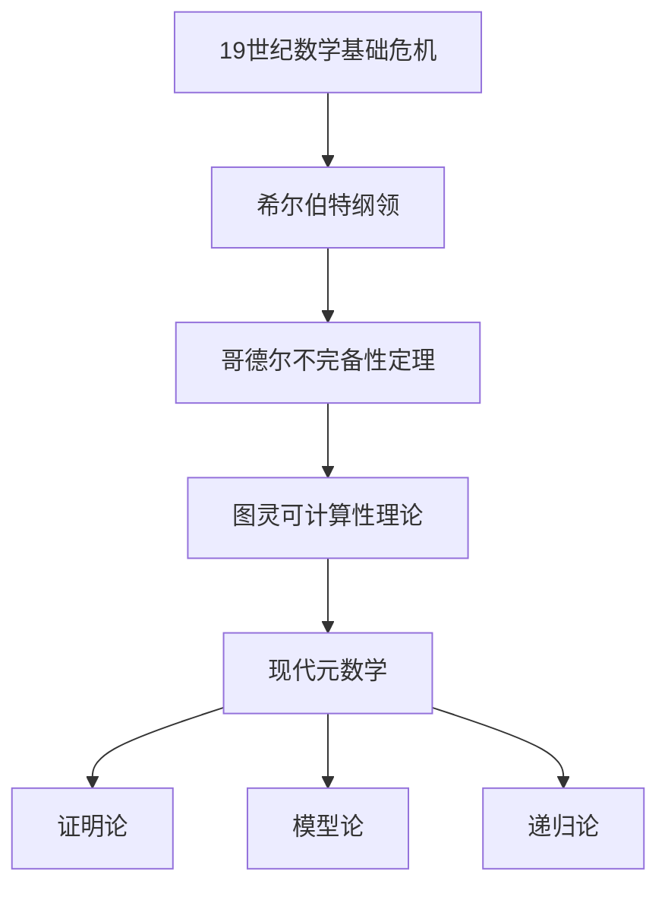

# 02-元数学理论

## 目录

1. [元数学概述](#1-元数学概述)
2. [形式系统理论](#2-形式系统理论)
3. [证明论基础](#3-证明论基础)
4. [模型论基础](#4-模型论基础)
5. [递归论基础](#5-递归论基础)
6. [哥德尔不完备性定理](#6-哥德尔不完备性定理)
7. [计算理论](#7-计算理论)
8. [形式化验证](#8-形式化验证)
9. [相关链接](#9-相关链接)

---

## 1. 元数学概述

### 1.1 元数学的定义与范围

**定义 1.1** (元数学)
元数学是研究数学理论本身的数学分支，关注数学理论的形式性质、结构特征和逻辑关系。

**元数学的研究对象：**

1. **形式系统**：公理系统、推理规则、形式语言
2. **证明理论**：证明的结构、长度、复杂性
3. **模型理论**：理论的解释、模型的性质
4. **递归理论**：可计算性、算法复杂性
5. **集合论**：数学基础、无穷理论

### 1.2 元数学的历史发展



### 1.3 元数学与数学哲学的关系

**关系分析：**

1. **元数学提供工具**：为数学哲学研究提供形式化工具
2. **哲学指导元数学**：哲学观点指导元数学研究方向
3. **相互促进**：元数学发现促进哲学思考，哲学思考指导元数学发展

---

## 2. 形式系统理论

### 2.1 形式语言

#### 2.1.1 形式语言的定义

**定义 2.1** (形式语言)
形式语言是由符号集和形成规则构成的系统，用于表达数学理论。

**形式语言的组成部分：**

1. **符号集**：包括逻辑符号、非逻辑符号、辅助符号
2. **项的形成规则**：定义如何构造项
3. **公式的形成规则**：定义如何构造公式

#### 2.1.2 一阶逻辑语言

**一阶逻辑语言的符号集：**

```latex
\text{逻辑符号：} \\
\text{连接词：} \neg, \wedge, \vee, \rightarrow, \leftrightarrow \\
\text{量词：} \forall, \exists \\
\text{等号：} = \\
\text{辅助符号：} (, ), , \\
\\
\text{非逻辑符号：} \\
\text{个体常项：} c_1, c_2, \ldots \\
\text{函数符号：} f_1, f_2, \ldots \\
\text{谓词符号：} P_1, P_2, \ldots \\
\text{变量：} x, y, z, \ldots
```

**项的形成规则：**

```latex
\text{基础：变量和常项是项} \\
\text{归纳：如果 } t_1, \ldots, t_n \text{ 是项，} f \text{ 是 } n \text{ 元函数符号，则 } f(t_1, \ldots, t_n) \text{ 是项}
```

**公式的形成规则：**

```latex
\text{原子公式：如果 } t_1, \ldots, t_n \text{ 是项，} P \text{ 是 } n \text{ 元谓词符号，则 } P(t_1, \ldots, t_n) \text{ 是公式} \\
\text{复合公式：如果 } \phi, \psi \text{ 是公式，则 } \neg\phi, \phi \wedge \psi, \phi \vee \psi, \phi \rightarrow \psi, \phi \leftrightarrow \psi \text{ 是公式} \\
\text{量化公式：如果 } \phi \text{ 是公式，} x \text{ 是变量，则 } \forall x \phi, \exists x \phi \text{ 是公式}
```

### 2.2 公理系统

#### 2.2.1 公理系统的定义

**定义 2.2** (公理系统)
公理系统是由一组公理和推理规则构成的形式系统。

**公理系统的组成部分：**

1. **公理**：作为推理起点的公式
2. **推理规则**：从已知公式推导新公式的规则
3. **定理**：通过推理规则从公理推导出的公式

#### 2.2.2 一阶逻辑公理系统

**逻辑公理：**

```latex
\text{命题公理：} \\
1. \phi \rightarrow (\psi \rightarrow \phi) \\
2. (\phi \rightarrow (\psi \rightarrow \chi)) \rightarrow ((\phi \rightarrow \psi) \rightarrow (\phi \rightarrow \chi)) \\
3. (\neg\phi \rightarrow \neg\psi) \rightarrow (\psi \rightarrow \phi) \\
\\
\text{量词公理：} \\
4. \forall x \phi(x) \rightarrow \phi(t) \text{ （其中 } t \text{ 对 } x \text{ 在 } \phi \text{ 中自由）} \\
5. \phi \rightarrow \forall x \phi \text{ （其中 } x \text{ 不在 } \phi \text{ 中自由出现）}
```

**推理规则：**

```latex
\text{分离规则：} \frac{\phi \quad \phi \rightarrow \psi}{\psi} \\
\text{概括规则：} \frac{\phi}{\forall x \phi} \text{ （其中 } x \text{ 不在 } \phi \text{ 中自由出现）}
```

### 2.3 形式系统的性质

#### 2.3.1 一致性

**定义 2.3** (一致性)
形式系统是一致的，如果不存在公式 $\phi$ 使得 $\phi$ 和 $\neg\phi$ 都是定理。

**一致性的重要性：**

- 保证理论不会产生矛盾
- 是理论可靠性的基本要求
- 是数学推理的基础

#### 2.3.2 完备性

**定义 2.4** (完备性)
形式系统是完备的，如果对于任意公式 $\phi$，要么 $\phi$ 是定理，要么 $\neg\phi$ 是定理。

**哥德尔第一不完备性定理：**
任何足够强的形式系统，如果是一致的，则是不完备的。

#### 2.3.3 独立性

**定义 2.5** (独立性)
公理 $\phi$ 在公理系统中是独立的，如果 $\phi$ 不能从其他公理推导出来。

**独立性的验证方法：**
通过构造模型验证公理的独立性。

---

## 3. 证明论基础

### 3.1 证明的概念

#### 3.1.1 形式证明

**定义 3.1** (形式证明)
形式证明是从公理出发，通过推理规则逐步推导出定理的有限序列。它是一个纯粹的语法对象，其有效性不依赖于符号的意义，只依赖于形式系统的规则。

**证明的结构：**

```latex
\text{证明序列：} \phi_1, \phi_2, \ldots, \phi_n \\
\text{其中每个 } \phi_i \text{ 要么是公理，要么是通过推理规则从前面的公式推导得出}
```

#### 3.1.2 证明的性质

**证明的基本性质：**

1. **有限性**：证明是有限长度的序列
2. **有效性**：每个步骤都符合推理规则
3. **目标性**：证明有明确的目标公式（定理）
4. **可验证性**：证明可以被机械地、算法化地验证其正确性。这是证明论与非形式数学推理的关键区别。

### 3.2 证明系统

证明论的核心研究对象是各种形式化的证明系统。

#### 3.2.1 自然演绎系统 (Natural Deduction)

由Gentzen和Jaśkowski在1930年代独立提出，旨在更紧密地模拟人类的逻辑推理过程。

**自然演绎系统的特点：**

1. **引入规则 (Introduction Rules)**：引入逻辑连接词的规则。例如，从 $\phi$ 和 $\psi$ 可以推导出 $\phi \wedge \psi$ (合取引入)。
2. **消去规则 (Elimination Rules)**：消去逻辑连接词的规则。例如，从 $\phi \wedge \psi$ 可以推导出 $\phi$ (合取消去)。
3. **假设 (Assumptions)**：允许在证明中引入临时假设，并在后续步骤中消除它们。

**示例：合取引入与消去**:

```text
  A         B
------- (∧I)
 A ∧ B
------- (∧E)
   A
```

#### 3.2.2 相继式演算 (Sequent Calculus)

同样由Gentzen提出，是更具对称性和技术性的证明系统，特别适用于元数学分析。

**核心概念：相继式 (Sequent)**:

一个相继式形如 $\Gamma \vdash \Delta$，其中 $\Gamma$ (前提) 和 $\Delta$ (结论) 都是公式的有限集。
其直观意义是："如果 $\Gamma$ 中的所有公式都为真，那么 $\Delta$ 中至少有一个公式为真"。

**推理规则示例：**

- **公理 (Axiom)**: $A \vdash A$
- **右合取规则 (∧-Right)**:
  $$
  \frac{\Gamma \vdash \Delta, A \quad \Gamma \vdash \Delta, B}{\Gamma \vdash \Delta, A \wedge B}
  $$
- **左合取规则 (∧-Left)**:
  $$
  \frac{\Gamma, A, B \vdash \Delta}{\Gamma, A \wedge B \vdash \Delta}
  $$

#### 3.2.3 希尔伯特系统 (Hilbert Systems)

特点是拥有大量的公理（或公理模式）和极少的推理规则（通常只有分离规则）。虽然在理论上重要，但在实际构造证明时非常繁琐。

### 3.3 核心定理与概念

#### 3.3.1 切消定理 (Cut-Elimination Theorem)

这是Gentzen对相继式演算的主要贡献，也是证明论的基石之一。

**切规则 (Cut Rule):**
$$
\frac{\Gamma \vdash \Delta, A \quad \Gamma, A \vdash \Delta}{\Gamma \vdash \Delta}
$$
这个规则类似于在证明中引入和使用引理 $A$。

**切消定理**：在相继式演算中，任何使用切规则的证明，都可以被转换为一个不使用切规则的等价证明。

**意义：**

1. **分析性 (Analyticity)**：无切证明具有子公式性质，即证明中出现的所有公式都是最终结论的子公式。这使得证明的结构变得透明。
2. **一致性证明**：切消定理是证明算术系统（如皮亚诺算术）一致性的关键工具。
3. **计算意义**：无切证明的构造过程与函数式编程中的求值过程（范畴论中的态射复合）有深刻联系。

#### 3.3.2 一致性证明 (Consistency Proofs)

证明论的一个核心目标是为数学理论提供一致性证明，即证明一个理论中不可能推导出矛盾（$A \land \neg A$）。

- **哥德尔第二不完备性定理** 指出，一个足够强的、一致的形式系统无法在自身内部证明其自身的一致性。
- **Gentzen的工作**：他成功地使用超越皮亚诺算术的有限方法（具体来说，是良序于 $\epsilon_0$ 的超限归纳法）证明了皮亚诺算术的一致性。这开创了通过元理论分析来研究系统强度的"序数分析"领域。

#### 3.3.3 证明的计算内容 (Computational Content of Proofs)

**BHK 释义 (Brouwer-Heyting-Kolmogorov interpretation)**：将命题解释为问题的规约，证明解释为解决问题的程序。

- 证明 $A \rightarrow B$ 就是一个将 $A$ 的证明转换为 $B$ 的证明的程序。
- 证明 $A \wedge B$ 就是一对，包含一个 $A$ 的证明和一个 $B$ 的证明。

**柯里-霍华德同构 (Curry-Howard Isomorphism)**：揭示了证明系统（特别是自然演绎）与计算模型（特别是带类型的Lambda演算）之间的深刻对应关系。

- **命题 ↔ 类型**
- **证明 ↔ 程序**
- **证明的规范化 (如切消) ↔ 程序的求值**

**代码示例：**
在像Coq或Agda这样的证明助手中，这种同构是其核心。编写一个类型为 `P` 的函数，就等价于构造了一个命题 `P` 的证明。

```coq
(* 在 Coq 中，(A -> B) -> (B -> C) -> (A -> C) 的证明 *)
(* 这同时也是一个接受三个函数并复合它们的程序 *)
Theorem transitivity : forall A B C : Prop, (A -> B) -> (B -> C) -> (A -> C).
Proof.
  intros A B C f g a.  (* a 是 A 的证明 *)
  apply g.             (* 目标是 C，g 是 B -> C，所以新目标是 B *)
  apply f.             (* 目标是 B，f 是 A -> B，所以新目标是 A *)
  exact a.             (* a 就是 A 的证明 *)
Qed.
```

### 3.4 哲学意涵

1. **形式主义的实现与局限**：证明论在很大程度上实现了希尔伯特纲领的一部分，即用有限的、组合的方法来分析无限的数学结构。然而，哥德尔不完备性定理也揭示了这一纲领的内在局限。
2. **构造主义的基石**：通过BHK释义和柯里-霍华德同构，证明论为构造主义数学和直觉主义逻辑提供了坚实的形式化基础。
3. **证明的本质**：证明论将"证明"从一个模糊的、心理学的概念，转变为一个可以被精确分析、操作和理解的数学对象，揭示了其丰富的计算和哲学内涵。

---

## 4. 模型论基础

模型论是研究形式语言的语义解释的数学分支。它在语法（公式集合）和语义（数学结构）之间建立了桥梁。

### 4.1 核心概念

#### 4.1.1 结构与模型

**定义 4.1 (结构/模型)**
一个 L-结构 (或 L-模型) $\mathcal{M}$ 是一个由论域 (universe) $M$ 和一组对 L 中符号的解释组成的集合。

- **论域 (Universe)**: 一个非空集合 $M$。
- **解释 (Interpretation)**:
  - 对于每个常数符号 $c$，一个元素 $c^\mathcal{M} \in M$。
  - 对于每个 $n$ 元函数符号 $f$，一个函数 $f^\mathcal{M}: M^n \to M$。
  - 对于每个 $n$ 元关系符号 $P$，一个关系 $P^\mathcal{M} \subseteq M^n$。

**示例：群论的模型**
群论的语言 $L_G = \{ \cdot, e \}$ 有一个二元函数符号 $\cdot$ 和一个常数符号 $e$。一个群 $(G, *, 1)$ 就是一个 $L_G$-结构，其中：

- 论域是集合 $G$。
- $\cdot$ 的解释是群运算 $*$。
- $e$ 的解释是单位元 $1$。

#### 4.1.2 满足 (Satisfaction)

**定义 4.2 (满足)**
满足关系 $\mathcal{M} \models \phi$ 表示公式 $\phi$ 在结构 $\mathcal{M}$ 中为"真"。这个概念由塔斯基通过递归定义精确化：

- **原子公式**: $\mathcal{M} \models P(t_1, \dots, t_n)$ 当且仅当 $(t_1^\mathcal{M}, \dots, t_n^\mathcal{M}) \in P^\mathcal{M}$。
- **逻辑连接词**:
  - $\mathcal{M} \models \neg \phi$ 当且仅当 $\mathcal{M} \not\models \phi$。
  - $\mathcal{M} \models \phi \wedge \psi$ 当且仅当 $\mathcal{M} \models \phi$ 并且 $\mathcal{M} \models \psi$。
- **量词**: $\mathcal{M} \models \forall x \phi(x)$ 当且仅当对于所有 $a \in M$，都有 $\mathcal{M} \models \phi(a)$。

如果一个理论（一组语句）$T$ 的所有语句都在模型 $\mathcal{M}$ 中为真，我们称 $\mathcal{M}$ 是 $T$ 的一个模型，记为 $\mathcal{M} \models T$。

### 4.2 核心定理

模型论中有几个奠基性的定理，深刻地揭示了语法和语义之间的关系。

#### 4.2.1 紧致性定理 (Compactness Theorem)

**定理 4.1 (紧致性定理)**
一个理论 $T$ 有模型，当且仅当它的任何有限子集 $T_0 \subseteq T$ 都有模型。

**意义：**
这是一个从"局部"（有限可满足性）到"全局"（整个理论可满足性）的桥梁。它允许我们通过研究理论的有限部分来推断整个无限理论的性质。

**应用示例：非标准分析**
我们可以用紧致性定理构造一个包含无穷小量的实数域模型。考虑标准实数理论 $Th(\mathbb{R})$，并加入一个新的常数符号 $\epsilon$ 和一组无限的公理：
$T = Th(\mathbb{R}) \cup \{ \epsilon > 0 \} \cup \{ \epsilon < 1/n \mid n \in \mathbb{N}, n > 0 \}$
这个理论的任何有限子集都在标准实数 $\mathbb{R}$ 中有模型（只需将 $\epsilon$ 解释为一个足够小的正实数）。因此，根据紧致性定理，$T$ 本身也有一个模型，这个模型就是非标准实数域 $^*\mathbb{R}$，其中 $\epsilon$ 就是一个正的无穷小量。

#### 4.2.2 勒文海姆-斯科伦定理 (Löwenheim-Skolem Theorem)

**定理 4.2 (向下)**
如果一个可数语言中的理论 $T$ 有一个无限模型，那么它对任意无限基数 $\kappa$ 都有一个基数为 $\kappa$ 的模型。

**定理 4.3 (向上)**
如果一个可数语言中的理论 $T$ 有一个无限模型，那么它对任意基数 $\kappa > |M|$ 都有一个基数为 $\kappa$ 的模型。

**斯科伦悖论 (Skolem's Paradox):**
ZFC 集合论是可数的理论，并且（假设它是一致的）有一个模型。根据向下的 L-S 定理，ZFC 必然有一个可数模型 $\mathcal{M}$。但是 ZFC 内部可以证明存在不可数集合（例如实数集）。这意味着在可数的模型 $\mathcal{M}$ 中，存在一个元素 $r$，使得 $\mathcal{M} \models$ "$r$ 是不可数集"。这并不矛盾，因为 $\mathcal{M}$ 的"可数性"是从外部看的，而 $r$ 的"不可数性"是从模型 $\mathcal{M}$ 内部看的——模型内部缺少一个将 $r$ 与自然数集一一对应的函数。

#### 4.2.3 Vaught 测试

**定理 4.4 (Vaught's Test)**
如果一个可数完备理论 $T$ 没有有限模型，并且在某个无限基数 $\kappa$ 上是 $\kappa$-范畴的（即所有基数为 $\kappa$ 的模型都是同构的），那么这个理论是完备的。

### 4.3 应用与联系

#### 4.3.1 代数中的应用

模型论方法被广泛应用于代数领域，例如 Ax-Grothendieck 定理的证明就利用了模型论的工具。

#### 4.3.2 模型检查 (Model Checking)

在计算机科学中，模型检查是一种自动化的验证技术，用于检查一个有限状态系统（模型）是否满足某个给定的形式化规约（公式）。

**代码示例：简单的模型检查器 (Python)**:

```python
# 定义一个简单的命题逻辑语言
class Prop:
    def __init__(self, name):
        self.name = name
    def __repr__(self):
        return self.name

class And:
    def __init__(self, left, right):
        self.left, self.right = left, right
    def __repr__(self):
        return f"({self.left} ∧ {self.right})"

class Not:
    def __init__(self, formula):
        self.formula = formula
    def __repr__(self):
        return f"¬{self.formula}"

# 定义一个模型（状态的真值指派）
model = {'p': True, 'q': False}

# 定义模型检查函数
def check(model, formula):
    if isinstance(formula, Prop):
        return model.get(formula.name, False)
    elif isinstance(formula, And):
        return check(model, formula.left) and check(model, formula.right)
    elif isinstance(formula, Not):
        return not check(model, formula.formula)
    return False

# 检查模型是否满足公式
p = Prop('p')
q = Prop('q')
formula = And(p, Not(q)) # p ∧ ¬q

print(f"Model: {model}")
print(f"Formula: {formula}")
print(f"Satisfaction (M |= f): {check(model, formula)}") # 输出 True
```

---

## 5. 递归论基础

递归论，现在更常被称为**可计算性理论** (Computability Theory)，是研究计算的本质、能力和极限的数学分支。它精确地回答了"什么问题是可以用算法解决的？"这一基本问题。

### 5.1 算法与可计算性

#### 5.1.1 算法的直观概念

算法是一个有效、明确、有限的指令序列，用于解决特定问题。

- **有效性**: 每一步操作都必须是足够基本的，可以被精确执行。
- **明确性**: 每一步操作都必须是无歧义的。
- **有限性**: 对于任何输入，算法必须在有限步骤后终止。

#### 5.1.2 可计算函数

一个函数 $f: \mathbb{N}^k \to \mathbb{N}$ 被认为是**可计算的**，如果存在一个算法，对于任何输入元组 $(n_1, \dots, n_k)$，该算法能在有限步骤内停止并输出结果 $f(n_1, \dots, n_k)$。

### 5.2 形式计算模型

为了精确化"算法"的直观概念，逻辑学家们提出了几个等价的形式计算模型。

#### 5.2.1 图灵机 (Turing Machine)

一个抽象的计算设备，由一条无限长的纸带、一个可移动的读写头和一个有限状态控制器组成。它通过一系列简单的规则（转移函数）来操作纸带上的符号。尽管简单，图灵机被证明能够模拟任何已知的算法过程。

**Rust 实现图灵机模拟器核心逻辑**:

```rust
enum Direction { Left, Right }

struct TuringMachine {
    tape: std::collections::HashMap<i64, char>,
    head: i64,
    state: String,
    // transition_function: (state, char) -> (new_state, new_char, direction)
    // ...
}

impl TuringMachine {
    fn step(&mut self) {
        let current_char = self.tape.get(&self.head).copied().unwrap_or(' ');
        // 根据转移函数查找下一个状态、写入的字符和移动方向
        // let (new_state, new_char, direction) = self.transition_function.get(&(self.state.clone(), current_char)).unwrap();
        // self.state = new_state.clone();
        // self.tape.insert(self.head, *new_char);
        // match direction {
        //     Direction::Left => self.head -= 1,
        //     Direction::Right => self.head += 1,
        // }
    }
}
```

#### 5.2.2 λ-演算 (Lambda Calculus)

由阿隆佐·丘奇提出，是一个基于函数抽象和应用的极简形式系统。它构成了现代函数式编程语言（如Haskell, Lisp）的理论基础。其核心操作是 **β-归约**: $(\lambda x.M)N \to M[x := N]$，代表了函数应用。

**Haskell 实现 λ-表达式求值**:

```haskell
-- 定义 Lambda 表达式的数据类型
data Lambda = Var String | App Lambda Lambda | Abs String Lambda

-- β-归约的简单实现
eval :: Lambda -> Lambda
eval (App (Abs x body) arg) = substitute x arg body -- 应用β-归约
eval (App f arg) = App (eval f) (eval arg)
eval l = l -- 变量和抽象是范式

-- 变量替换
substitute :: String -> Lambda -> Lambda -> Lambda
substitute _ _ (Var y) = Var y -- 省略实现细节
-- ...
```

#### 5.2.3 递归函数 (Recursive Functions)

由哥德尔和克莱尼发展，通过一组初始函数（零函数、后继函数、投影函数）和构造规则（复合、原始递归、μ-递归/最小化）来定义所有可计算函数。

### 5.3 丘奇-图灵论题 (Church-Turing Thesis)

**论题**：所有直观上可计算的函数，都可以被图灵机（或等价地，λ-演算、递归函数）计算。

这是一个无法被数学证明的"论题"，因为它联系了直观的、非形式化的"算法"概念和形式化的计算模型。然而，所有已知的、被认为是"算法"的计算模型都被证明与图灵机等价，这为该论题提供了强有力的证据。它构成了计算机科学的理论基石。

### 5.4 不可判定性 (Undecidability)

递归论最深刻的结果之一是证明了存在定义良好但无法用算法解决的问题。

#### 5.4.1 停机问题 (The Halting Problem)

**问题描述**：是否存在一个算法（图灵机）`H`，对于任意给定的图灵机 `M` 的描述和输入 `w`，`H(M, w)` 可以在有限时间内判定 `M` 在输入 `w` 上是否会停止。

**定理 5.1 (图灵, 1936)**：停机问题是**不可判定**的。

**证明思路 (对角线法)**：

1. 假设存在这样一个判定算法 `H`。
2. 构造一个新的图灵机 `D`，它以一个图灵机 `M` 的描述为输入：
    - `D(M)` 调用 `H(M, M)`。
    - 如果 `H` 输出"是"（即 `M` 在输入 `M` 上停机），`D` 就进入一个无限循环。
    - 如果 `H` 输出"否"（即 `M` 在输入 `M` 上不停机），`D` 就停止并输出结果。
3. 现在考虑 `D` 如何处理自身的描述 `D`，即 `D(D)`：
    - 如果 `D(D)` 停机，那么根据 `D` 的定义，`H(D, D)` 必须返回"否"。但这与 `H` 的定义（它能正确判定停机）矛盾。
    - 如果 `D(D)` 不停机，那么根据 `D` 的定义，`H(D, D)` 必须返回"是"。这同样导致矛盾。
4. 由于无论哪种情况都导致矛盾，所以最初的假设——存在一个能解决停机问题的算法 `H`——必定是错误的。

#### 5.4.2 莱斯定理 (Rice's Theorem)

一个更一般的结果：任何关于图灵机所计算的函数（而非图灵机本身）的非平凡性质都是不可判定的。"非平凡"意味着该性质对某些可计算函数成立，而对另一些不成立。例如，"图灵机 `M` 计算的函数是否恒为零？"就是不可判定的。

---

## 6. 哥德尔不完备性定理

### 6.1 第一不完备性定理

#### 6.1.1 定理的陈述

**定理 6.1** (哥德尔第一不完备性定理)
任何足够强的形式系统，如果是一致的，则是不完备的。即存在一个句子 $\phi$，使得 $\phi$ 和 $\neg\phi$ 都不是定理。

**定理的条件：**

1. **足够强**：系统能够表达基本的算术
2. **一致性**：系统不会产生矛盾
3. **递归可公理化**：公理集是递归可枚举的

#### 6.1.2 定理的证明思路

**证明的关键步骤：**

1. **编码**：将公式和证明编码为自然数
2. **自指**：构造自指的句子
3. **对角线**：使用对角线方法构造矛盾

**哥德尔句子的构造：**

```latex
G = \text{"这个句子在系统中不可证明"}
```

### 6.2 第二不完备性定理

#### 6.2.1 定理的陈述

**定理 6.2** (哥德尔第二不完备性定理)
任何足够强的一致形式系统，不能证明自身的一致性。

**定理的含义：**
如果形式系统是一致的，那么它不能证明自己的一致性。这意味着数学系统的基础存在根本性的限制。

#### 6.2.2 定理的哲学意义

**哲学意义：**

1. **数学基础的局限性**：数学系统存在根本性的局限性
2. **形式化的限制**：完全形式化是不可能的
3. **直觉的重要性**：数学直觉在数学发展中起重要作用
4. **真理与可证明性**：数学真理与可证明性是不同的概念

### 6.3 不完备性定理的影响

#### 6.3.1 对数学基础的影响

**影响分析：**

1. **希尔伯特纲领的失败**：证明了完全形式化数学的不可能性
2. **数学哲学的转向**：促使数学哲学从形式主义转向其他立场
3. **数学实践的改变**：影响数学研究的方法和方向

#### 6.3.2 对计算机科学的影响

**影响分析：**

1. **算法理论**：影响可计算性理论的发展
2. **人工智能**：影响AI的理论基础
3. **程序验证**：影响形式化验证方法

---

## 7. 计算理论

### 7.1 计算复杂性理论

#### 7.1.1 时间复杂性

**定义 7.1** (时间复杂性)
算法的时间复杂性是算法执行所需的时间与输入大小的关系。

**常见的时间复杂性类：**

1. **P类**：多项式时间可解的问题
2. **NP类**：非确定性多项式时间可验证的问题
3. **EXP类**：指数时间可解的问题

**时间复杂性的表示：**

```latex
O(f(n)) \text{ 表示上界} \\
\Omega(f(n)) \text{ 表示下界} \\
\Theta(f(n)) \text{ 表示紧界}
```

#### 7.1.2 空间复杂性

**定义 7.2** (空间复杂性)
算法的空间复杂性是算法执行所需的存储空间与输入大小的关系。

**空间复杂性的重要性：**

- 反映算法的存储需求
- 影响算法的实际可行性
- 与时间复杂性相关但不相同

### 7.2 可计算性理论

#### 7.2.1 丘奇-图灵论题

**丘奇-图灵论题：**
任何可计算的函数都可以被图灵机计算。

**论题的意义：**

- 为可计算性提供了形式化定义
- 是计算理论的基础
- 至今未被证明，但被广泛接受

#### 7.2.2 计算模型

**不同的计算模型：**

1. **图灵机**：标准计算模型
2. **λ演算**：函数式计算模型
3. **递归函数**：数学函数计算模型
4. **量子计算**：基于量子力学的计算模型

**λ演算示例：**

```haskell
-- λ演算的Haskell实现示例
-- 基本λ项
data LambdaTerm = 
    Var String           -- 变量
  | App LambdaTerm LambdaTerm  -- 应用
  | Lam String LambdaTerm      -- 抽象

-- β归约
betaReduce :: LambdaTerm -> LambdaTerm
betaReduce (App (Lam x body) arg) = substitute x arg body
betaReduce (App t1 t2) = App (betaReduce t1) (betaReduce t2)
betaReduce (Lam x body) = Lam x (betaReduce body)
betaReduce (Var x) = Var x

-- 替换操作
substitute :: String -> LambdaTerm -> LambdaTerm -> LambdaTerm
substitute x new (Var y) 
  | x == y = new
  | otherwise = Var y
substitute x new (App t1 t2) = 
  App (substitute x new t1) (substitute x new t2)
substitute x new (Lam y body)
  | x == y = Lam y body
  | otherwise = Lam y (substitute x new body)
```

---

## 8. 形式化验证

### 8.1 形式化验证的概念

#### 8.1.1 验证的定义

**定义 8.1** (形式化验证)
形式化验证是使用数学方法证明系统满足其规范的过程。

**验证的类型：**

1. **模型检查**：通过穷举搜索验证有限状态系统
2. **定理证明**：通过逻辑推理证明系统性质
3. **抽象解释**：通过抽象分析系统性质

#### 8.1.2 验证的重要性

**验证的意义：**

1. **可靠性保证**：确保系统满足安全要求
2. **错误预防**：在系统部署前发现错误
3. **质量保证**：提高系统的质量和可信度
4. **成本降低**：减少后期维护和修复成本

### 8.2 形式化验证方法

#### 8.2.1 模型检查

**模型检查的原理：**
通过穷举搜索系统的所有可能状态，验证系统是否满足给定的性质。

**模型检查的优缺点：**

**优点：**

- 自动化程度高
- 能够发现反例
- 适用于有限状态系统

**缺点：**

- 状态空间爆炸问题
- 不适用于无限状态系统
- 计算复杂度高

#### 8.2.2 定理证明

**定理证明的原理：**
通过逻辑推理证明系统满足给定的性质。

**定理证明的优缺点：**

**优点：**

- 适用于无限状态系统
- 能够处理复杂的数学性质
- 证明结果可靠

**缺点：**

- 需要人工指导
- 证明过程复杂
- 自动化程度低

### 8.3 形式化验证工具

#### 8.3.1 模型检查工具

**常用模型检查工具：**

1. **SPIN**：用于并发系统验证
2. **NuSMV**：符号模型检查器
3. **PRISM**：概率模型检查器

#### 8.3.2 定理证明工具

**常用定理证明工具：**

1. **Coq**：基于构造演算的证明助手
2. **Isabelle**：通用证明助手
3. **HOL**：高阶逻辑证明系统

**Coq示例：**

```coq
(* Coq中的形式化证明示例 *)
Theorem plus_O_n : forall n : nat, 0 + n = n.
Proof.
  intros n.
  simpl.
  reflexivity.
Qed.

(* 归纳证明示例 *)
Theorem plus_n_O : forall n : nat, n + 0 = n.
Proof.
  intros n.
  induction n as [| n' IHn'].
  - (* n = 0 *)
    simpl.
    reflexivity.
  - (* n = S n' *)
    simpl.
    rewrite IHn'.
    reflexivity.
Qed.
```

---

## 9. 相关链接

### 9.1 内部链接

- [01-数学哲学基础](./01-数学哲学基础.md)
- [03-批判性分析](./03-批判性分析.md)
- [02-数学基础与逻辑/02-数理逻辑基础](../02-数学基础与逻辑/02-数理逻辑基础.md)
- [02-数学基础与逻辑/03-模型论基础](../02-数学基础与逻辑/03-模型论基础.md)
- [02-数学基础与逻辑/04-递归论基础](../02-数学基础与逻辑/04-递归论基础.md)
- [02-数学基础与逻辑/05-证明论基础](../02-数学基础与逻辑/05-证明论基础.md)

### 9.2 外部链接

- [元数学 - 维基百科](https://en.wikipedia.org/wiki/Metamathematics)
- [哥德尔不完备性定理](https://en.wikipedia.org/wiki/G%C3%B6del%27s_incompleteness_theorems)
- [图灵机](https://en.wikipedia.org/wiki/Turing_machine)
- [λ演算](https://en.wikipedia.org/wiki/Lambda_calculus)

---

**参考文献：**

1. Shoenfield, J. R. (1967). *Mathematical Logic*. Addison-Wesley.
2. Enderton, H. B. (2001). *A Mathematical Introduction to Logic*. Academic Press.
3. Boolos, G. S., Burgess, J. P., & Jeffrey, R. C. (2007). *Computability and Logic*. Cambridge University Press.
4. Smullyan, R. M. (1992). *Gödel's Incompleteness Theorems*. Oxford University Press.
5. Davis, M. (1958). *Computability and Unsolvability*. McGraw-Hill.
