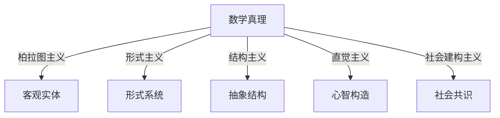

# 02-数学哲学

> **返回总览**：[**`00-元数学与形式化基础总览.md`**](./00-元数学与形式化基础总览.md)

## 目录

- [02-数学哲学](#02-数学哲学)
  - [目录](#目录)
  - [1. 数学哲学的定义与意义](#1-数学哲学的定义与意义)
  - [2. 主要哲学流派](#2-主要哲学流派)
    - [2.1 柏拉图主义（Platonism）](#21-柏拉图主义platonism)
    - [2.2 形式主义（Formalism）](#22-形式主义formalism)
    - [2.3 直觉主义（Intuitionism）/建构主义（Constructivism）](#23-直觉主义intuitionism建构主义constructivism)
    - [2.4 逻辑主义（Logicism）](#24-逻辑主义logicism)
    - [2.5 结构主义（Structuralism）](#25-结构主义structuralism)
    - [2.6 现代多元视角](#26-现代多元视角)
  - [3. 数学哲学的核心问题](#3-数学哲学的核心问题)
  - [4. 数学真理观与多元理论](#4-数学真理观与多元理论)
    - [4.1 数学真理的基本特征](#41-数学真理的基本特征)
    - [4.2 主要真理理论](#42-主要真理理论)
    - [4.3 多元哲学视角表格](#43-多元哲学视角表格)
    - [4.4 Mermaid结构图：多元哲学视角](#44-mermaid结构图多元哲学视角)
    - [4.5 Lean代码片段：形式化证明](#45-lean代码片段形式化证明)
  - [5. 数学认知与结构](#5-数学认知与结构)
    - [5.1 哲学流派与认知机制的互动](#51-哲学流派与认知机制的互动)
    - [5.2 认知对数学哲学的影响](#52-认知对数学哲学的影响)
    - [5.3 数学哲学的核心问题（本体论、认识论、真理观）](#53-数学哲学的核心问题本体论认识论真理观)
  - [6. 批判性分析与多表征](#6-批判性分析与多表征)
  - [7. 与元数学、形式化的关系](#7-与元数学形式化的关系)
  - [9. 内容来源与合并说明](#9-内容来源与合并说明)
  - [10. 思维导图（结构化梳理）](#10-思维导图结构化梳理)

---

## 1. 数学哲学的定义与意义

- 数学哲学是研究数学的本质、基础、方法和意义的哲学分支。
- 探讨数学对象的存在性、数学真理的本质、知识的来源、方法论等根本问题。

## 2. 主要哲学流派

### 2.1 柏拉图主义（Platonism）

- 数学对象是独立存在的抽象实体，数学发现是"发现"客观真理。
- 代表人物：柏拉图、哥德尔。
- 形式化表述：`"发现" ⇔ ∃一个独立的数学世界M, 使得数学命题S的真值由其在M中的状态决定。`

### 2.2 形式主义（Formalism）

- 数学是符号和规则的游戏，真理等同于系统内部的形式一致性。
- 代表人物：希尔伯特。
- 形式化表述：`"发明"(形式) ⇔ 数学真理S为真，当且仅当S是从公理集A经由规则R可证的 (A ⊢ S)。`

### 2.3 直觉主义（Intuitionism）/建构主义（Constructivism）

- 数学是心智构造的产物，强调构造性证明，排斥排中律的普遍有效性。
- 形式化表述：只有可构造的命题才有真值。

### 2.4 逻辑主义（Logicism）

- 数学可还原为逻辑，数学真理是逻辑真理。

### 2.5 结构主义（Structuralism）

- 数学对象由其结构关系定义，关注结构的普遍性。
- 真理存在于结构关系中，强调对象间的映射与结构同构。

### 2.6 现代多元视角

- 社会建构主义、后现代哲学、认知哲学等，强调数学的社会性、多样性、认知基础。

## 3. 数学哲学的核心问题

- 数学对象的本体论：存在性、类型、与物理世界的关系
- 数学知识的认识论：知识来源、先验性、直觉作用
- 数学真理的本质：绝对性/相对性、确定性基础、与逻辑真理的关系
- 数学方法论：归纳、演绎、类比、证明

## 4. 数学真理观与多元理论

### 4.1 数学真理的基本特征

- 必然性、先验性、客观性、普遍性

### 4.2 主要真理理论

- **符合论**：真理是命题与客观事实的对应（柏拉图主义）
- **融贯论**：真理是理论系统内部的逻辑一致性（形式主义）
- **实用论/建构主义**：真理在于可构造性或实践有效性（直觉主义/建构主义）
- **结构主义**：真理存在于结构关系和同构中
- **社会建构主义**：真理是社会共识的产物

### 4.3 多元哲学视角表格

| 流派 | 真理观 | 代表观点 |
|------|--------|----------|
| 柏拉图主义 | 数学真理是客观存在的抽象实体 | 真理独立于人类心智，由发现获得 |
| 形式主义 | 真理是形式系统内的可证性 | 真理依赖于公理和推理规则 |
| 结构主义 | 真理存在于结构关系中 | 真理源于结构的同构与映射 |
| 直觉主义 | 真理是心智的构造 | 只有可构造的命题才有真值 |
| 社会建构主义 | 真理是社会共识的产物 | 真理依赖于社会实践和协商 |

### 4.4 Mermaid结构图：多元哲学视角



### 4.5 Lean代码片段：形式化证明

```lean
theorem and_comm (p q : Prop) : p ∧ q ↔ q ∧ p :=
iff.intro
  (assume h : p ∧ q,
    show q ∧ p, from and.intro h.right h.left)
  (assume h : q ∧ p,
    show p ∧ q, from and.intro h.right h.left)
```

## 5. 数学认知与结构

- 数学认知是人类获取、处理、存储和使用抽象数学信息（如结构、关系、模式）的过程。
- 特点：高度抽象性、精确性与逻辑性、符号依赖性、创造性。
- 认知结构决定了数学知识的层次性和可迁移性。
- 典型案例：从具体实例中提炼共性，形成一般规律（如从自然数加法到群的抽象）。

### 5.1 哲学流派与认知机制的互动

- 不同数学哲学流派（如形式主义、直觉主义、结构主义等）对认知过程有不同解释。
- 形式主义强调符号操作与规则，关注形式系统的认知表征。
- 直觉主义强调心智构造、直觉与构造性证明的认知基础。
- 结构主义关注认知对结构关系的把握与抽象能力。

### 5.2 认知对数学哲学的影响

- 人类认知资源有限，影响形式化推理的可行性与接受度。
- 直觉、图示、解释性在数学理解和哲学反思中的作用。
- 认知偏差、经验依赖对数学真理观的影响。
- 认知科学揭示数学活动中的非形式化因素。

### 5.3 数学哲学的核心问题（本体论、认识论、真理观）

- 数学对象是否存在？如果存在，它们是什么类型的存在？与物理世界的关系如何？
- 我们如何获得数学知识？数学知识是先验的还是经验的？数学直觉在数学发现中的作用是什么？
- 数学真理是绝对的还是相对的？数学真理的确定性基础是什么？数学真理与逻辑真理的关系如何？

## 6. 批判性分析与多表征

- 形式化与直觉的张力：过度形式化可能压抑创造性，直觉又难以完全形式化。
- 多元数学观：不同文化、认知背景下的数学多样性。
- 认知偏差与数学客观性：即使高度形式化领域也难以完全消除主观影响。
- 哲学与认知的交互推动数学理论与教育的创新。
- 批判性分析方法：多维度（本体论、认识论、方法论、社会性等）交叉分析。
- 多表征：结构图、表格、代码、案例、哲学论证等。
- 典型问题：
  - 哥德尔不完备定理对形式主义的冲击
  - 选择公理与连续统假设的独立性
  - 直觉主义对排中律的批判
- 教育启示：多表征有助于数学理解和创新。

## 7. 与元数学、形式化的关系

- 哲学流派影响元数学和形式化的取向（如形式主义推动公理化、直觉主义强调构造性）
- 哥德尔不完备定理等元数学成果对哲学基础的冲击
- 形式化为哲学分析提供工具，哲学反思推动形式化方法的发展

## 9. 内容来源与合并说明

本文件内容已合并自 04-元数学的哲学与认知分析.md、01-数学哲学基础.md 及原有数学哲学总览，去除冗余，统一表达，完善编号与本地跳转，补充多表征内容。后续将持续补充交叉引用与批判性分析。

---

## 10. 思维导图（结构化梳理）

```text
+ 数学哲学总览
    + 1. 定义与意义
    + 2. 主要哲学流派
    + 3. 核心问题
    + 4. 与元数学、形式化的关系
    + 5. 结构化导图与本地跳转
```

---

> 本文档内容参考并整合自 Math/Matter/views/math_view02.md、view_math01.md 等，后续将持续补充交叉引用与多表征内容。
