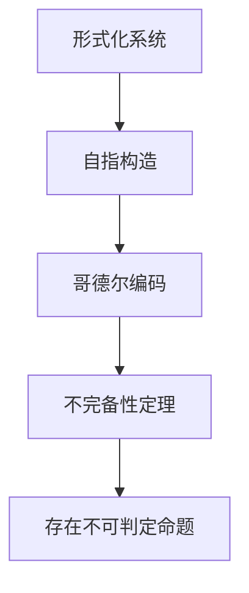

# 3.6.2 形式化系统

> [返回总览](../00-元数学与形式化基础总览.md)

## 目录
- [3.6.2 形式化系统](#362-形式化系统)
  - [3.6.2.1 形式化系统的基本结构](#3621-形式化系统的基本结构)
  - [3.6.2.2 典型形式化系统](#3622-典型形式化系统)
  - [3.6.2.3 形式化系统的局限与挑战](#3623-形式化系统的局限与挑战)
  - [3.6.2.4 AI与自动化形式化](#3624-ai与自动化形式化)
  - [3.6.2.5 相关主题与本地跳转](#3625-相关主题与本地跳转)
  - [3.6.2.6 参考文献与资源](#3626-参考文献与资源)

---

## 3.6.2.1 形式化系统的基本结构

| 组成部分 | 说明 |
|:--------|:-----|
| 字母表   | 基本符号集合 |
| 语法规则 | 合法表达式的生成规则 |
| 公理     | 无需证明的基本命题 |
| 推理规则 | 从公理和已知命题推出新命题的方法 |

---

## 3.6.2.2 典型形式化系统

| 系统         | 语言特征         | 典型公理/规则         | 适用领域         |
|:------------|:----------------|:----------------------|:----------------|
| 一阶逻辑     | 谓词、量词       | 公理化推理规则         | 数学基础         |
| Peano公理    | 自然数、递归定义 | 五条基本公理           | 算术             |
| ZFC集合论    | 集合、成员关系   | 九条ZFC公理            | 集合论、基础数学 |

---

## 3.6.2.3 形式化系统的局限与挑战



---

## 3.6.2.4 AI与自动化形式化

- 现代证明助手（如Lean、Coq）可形式化复杂数学理论。
- 典型Lean代码示例：

```lean
theorem add_zero (n : ℕ) : n + 0 = n :=
begin
  induction n,
  { refl },
  { simp [nat.succ_add] }
end
```

- 典型Coq代码示例：

```coq
Theorem add_0_r : forall n : nat, n + 0 = n.
Proof.
  induction n as [| n' IHn].
  - reflexivity.
  - simpl. rewrite -> IHn. reflexivity.
Qed.
```

---

## 3.6.2.5 相关主题与本地跳转
- 详见 [00-元数学与形式化基础总览.md](../00-元数学与形式化基础总览.md) 3.4 形式化系统
- 相关主题：[01-元数学理论.md](01-元数学理论.md)、[03-证明论.md](03-证明论.md)

---

## 3.6.2.6 参考文献与资源
- Hilbert, D. (1931). "Die Grundlagen der Mathematik".
- 数学知识体系重构项目 (2024).
