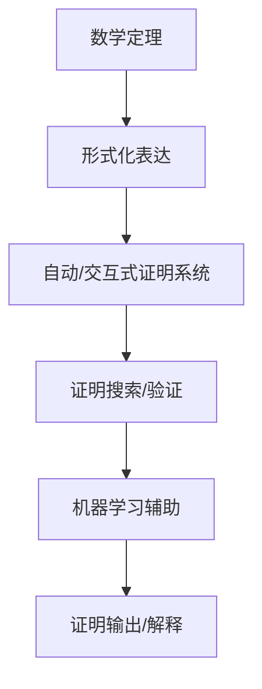
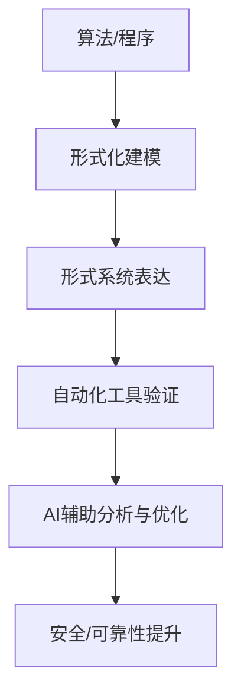

# 05-元数学与AI_计算机科学

## 目录

- [05-元数学与AI\_计算机科学](#05-元数学与ai_计算机科学)
  - [目录](#目录)
  - [0. 导论与结构总览](#0-导论与结构总览)
  - [1. 自动证明与AI](#1-自动证明与ai)
    - [1.1 自动定理证明（ATP）](#11-自动定理证明atp)
    - [1.2 交互式证明助手](#12-交互式证明助手)
    - [1.3 AI与符号推理的结合](#13-ai与符号推理的结合)
    - [1.4 典型案例与流程](#14-典型案例与流程)
      - [相关本地跳转](#相关本地跳转)
  - [2. 可计算性理论与递归论](#2-可计算性理论与递归论)
    - [2.1 可计算性模型](#21-可计算性模型)
    - [2.2 停机问题与不可判定性](#22-停机问题与不可判定性)
    - [2.3 计算复杂性理论](#23-计算复杂性理论)
    - [2.4 丘奇-图灵论题与AI边界](#24-丘奇-图灵论题与ai边界)
    - [2.5 典型案例与应用](#25-典型案例与应用)
      - [相关本地跳转1](#相关本地跳转1)
  - [3. 形式系统与算法](#3-形式系统与算法)
    - [3.1 形式系统的基本结构](#31-形式系统的基本结构)
    - [3.2 算法设计与程序验证](#32-算法设计与程序验证)
    - [3.3 自动化工具与AI结合](#33-自动化工具与ai结合)
    - [3.4 典型案例与流程](#34-典型案例与流程)
      - [相关本地跳转2](#相关本地跳转2)
  - [4. 本地跳转与引用](#4-本地跳转与引用)

---

## 0. 导论与结构总览

- 本文系统梳理了元数学与AI、计算机科学的交叉关系，重点关注自动证明、可计算性理论、形式系统与算法等核心主题。
- 强调元数学为AI、计算机科学提供了理论基础与边界，而AI、计算机科学则为元数学提供了新的工具、应用和挑战。
- 补充多表征（如流程图、表格、代码片段等），并强化本地跳转与交叉引用。

## 1. 自动证明与AI

### 1.1 自动定理证明（ATP）

- **定义**：自动定理证明（Automated Theorem Proving, ATP）是利用计算机自动寻找数学定理证明的过程。
- **主要方法**：
  - 归结法、自然演绎、相继式演算、表列法等。
  - 典型系统：Prover9、E、Vampire。
- **应用**：
  - 数学定理证明、程序验证、硬件验证、知识推理等。

### 1.2 交互式证明助手

- **定义**：证明助手（Proof Assistant）是帮助用户构造和验证形式证明的计算机程序。
- **代表系统**：Coq、Lean、Isabelle/HOL、Agda、HOL Light。
- **主要功能**：
  - 语法检查、证明验证、证明搜索、证明优化。
  - 提供战术（tactics）和自动化工具辅助证明。
- **典型应用**：
  - 四色定理、开普勒猜想、编译器正确性、加密协议安全性。

| 系统      | 类型         | 主要特点                   |
|-----------|--------------|----------------------------|
| Coq       | 交互式助手   | 依赖类型理论，支持提取程序 |
| Lean      | 交互式助手   | 依赖类型理论，社区活跃     |
| Isabelle  | 交互式助手   | 支持多种逻辑，自动化强     |
| Prover9   | 自动证明器   | 一阶逻辑归结法             |
| Vampire   | 自动证明器   | 高效一阶逻辑ATP            |

### 1.3 AI与符号推理的结合

- **神经符号方法**：结合机器学习与符号推理，提升自动证明效率与创新能力。
  - 机器学习用于引导证明搜索、自动发现引理、模式识别。
  - 典型项目：DeepMind的AlphaTensor、Meta的Galactica、AI辅助数学猜想生成。
- **AI在证明助手中的应用**：
  - 自动补全证明步骤、推荐证明策略、自然语言生成证明解释。

> **哲学与认知视角**：
>
> - 自动证明的成功挑战了"数学证明必须依赖人类直觉"的传统观念。
> - AI与证明的结合引发了关于数学创造力、可解释性、知识边界的新思考。

### 1.4 典型案例与流程

- **四色定理**：首次大规模依赖计算机验证的数学定理。
- **开普勒猜想**：Hales团队利用证明助手完成全自动验证。
- **AI辅助发现新定理**：AI系统在组合数学、数论等领域辅助发现新猜想。

---

#### 相关本地跳转

- [2. 可计算性理论与递归论](#2-可计算性理论与递归论)
- [01-元数学与形式化基础](./01-元数学与形式化基础.md)
- [03-形式系统与证明论](./03-形式系统与证明论.md)
- [04-元数学的哲学与认知分析](./04-元数学的哲学与认知分析.md)

## 2. 可计算性理论与递归论

### 2.1 可计算性模型

- **图灵机**：最经典的可计算性模型，定义了"算法"与"可计算函数"的严格含义。
- **λ演算**：以函数抽象和应用为核心，奠定了函数式编程和可计算性理论基础。
- **递归函数**：通过基本函数和递归运算定义可计算函数。
- **模型关系**：图灵机、λ演算、递归函数在可计算性上等价。

| 模型     | 主要思想         | 典型符号表达           |
|----------|------------------|------------------------|
| 图灵机   | 状态转移+带操作  | $TM = (Q, \Gamma, b, \Sigma, \delta, q_0, F)$ |
| λ演算    | 函数抽象与应用   | $\lambda x. (E)$      |
| 递归函数 | 基本+递归构造    | $\mu$-recursive       |

### 2.2 停机问题与不可判定性

- **停机问题**：不存在通用算法判断任意程序是否会停机，是最著名的不可判定问题。
- **不可判定性**：许多理论与实际问题（如一阶逻辑有效性、丢番图方程可解性）都不可判定。
- **莱斯定理**：所有非平凡的语义属性均不可判定。

### 2.3 计算复杂性理论

- **P/NP问题**：P类问题可多项式时间内解决，NP类问题可多项式时间内验证，P=NP是计算机科学核心难题。
- **复杂性分层**：P ⊆ NP ⊆ PSPACE ⊆ EXPTIME。
- **AI关联**：AI算法的可行性、效率、可扩展性受限于复杂性理论。

| 复杂性类 | 定义                   | 典型问题           |
|----------|------------------------|--------------------|
| P        | 多项式时间可解         | 排序、最短路径     |
| NP       | 多项式时间可验证       | SAT、旅行商问题   |
| PSPACE   | 多项式空间可解         | QBF、推理游戏     |
| EXPTIME  | 指数时间可解           | 某些博弈问题      |

### 2.4 丘奇-图灵论题与AI边界

- **丘奇-图灵论题**：所有直觉上可计算的函数都可被图灵机计算。
- **AI边界**：AI系统的理论极限受限于可计算性与复杂性，存在不可计算与不可高效计算的问题。

### 2.5 典型案例与应用

- **停机问题**：理论计算机科学的基石，证明了算法能力的极限。
- **SAT问题**：NP完全问题，AI推理与自动证明的核心。
- **AI中的复杂性挑战**：如大规模知识图谱推理、强化学习中的状态爆炸。

---

#### 相关本地跳转1

- [3. 形式系统与算法](#3-形式系统与算法)
- [01-元数学与形式化基础](./01-元数学与形式化基础.md)
- [03-形式系统与证明论](./03-形式系统与证明论.md)
- [04-元数学的哲学与认知分析](./04-元数学的哲学与认知分析.md)

## 3. 形式系统与算法

### 3.1 形式系统的基本结构

- **定义**：形式系统由形式语言、公理、推理规则组成，为算法与程序设计提供理论基础。
- **符号表达**：$\mathcal{S} = (\mathcal{L}, \mathcal{A}, \mathcal{R})$，其中$\mathcal{L}$为语言，$\mathcal{A}$为公理集，$\mathcal{R}$为推理规则。

### 3.2 算法设计与程序验证

- **算法设计**：形式系统为算法的规范化描述、正确性证明提供框架。
- **程序验证**：利用形式化方法证明程序满足规范，提升软件可靠性。
- **应用领域**：安全关键系统、金融、航空航天、加密协议等。

### 3.3 自动化工具与AI结合

- **SAT/SMT求解器**：自动判定逻辑公式可满足性，广泛用于验证与推理。
- **模型检测（Model Checking）**：自动验证有限状态系统是否满足时序逻辑规范。
- **抽象解释**：通过抽象语义分析程序属性，发现潜在错误。
- **AI结合**：AI用于自动生成测试用例、辅助规约提取、提升验证效率。

| 工具/方法      | 主要功能           | 典型应用           |
|----------------|--------------------|--------------------|
| SAT/SMT求解器  | 逻辑可满足性判定   | 程序验证、推理     |
| 模型检测       | 状态空间自动验证   | 协议/硬件/AI安全   |
| 抽象解释       | 静态分析、属性推断 | 缺陷检测、优化     |

### 3.4 典型案例与流程

- **编译器验证**：CompCert项目用Coq形式化验证C编译器的正确性。
- **AI安全验证**：形式化方法用于验证神经网络鲁棒性、自动驾驶系统安全。
- **加密协议分析**：利用模型检测和定理证明器分析协议安全性。

---

#### 相关本地跳转2

- [4. 本地跳转与引用](#4-本地跳转与引用)
- [01-元数学与形式化基础](./01-元数学与形式化基础.md)
- [02-哲学流派与元数学](./02-哲学流派与元数学.md)
- [03-形式系统与证明论](./03-形式系统与证明论.md)
- [04-元数学的哲学与认知分析](./04-元数学的哲学与认知分析.md)

## 4. 本地跳转与引用

- [01-元数学与形式化基础](./01-元数学与形式化基础.md)
- [02-哲学流派与元数学](./02-哲学流派与元数学.md)
- [03-形式系统与证明论](./03-形式系统与证明论.md)
- [04-元数学的哲学与认知分析](./04-元数学的哲学与认知分析.md)

> 本文件系统梳理了元数学与AI/计算机科学的理论基础、关键模型、自动证明、可计算性、复杂性、形式系统与算法等内容，支持本地跳转与交叉引用，便于主题间导航与深入学习。
