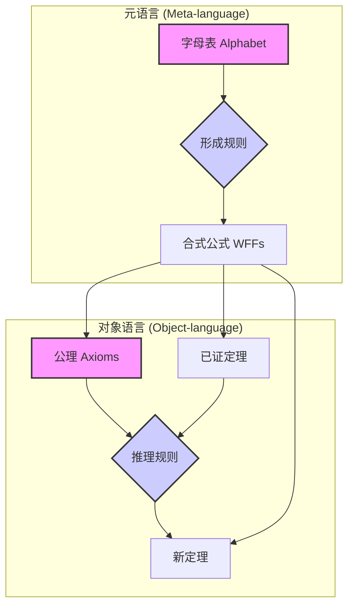

# 03-形式化系统

## 1. 定义与构成

**形式化系统 (Formal System)** 是一个封闭的、自洽的符号操作系统。它由以下四个核心部分组成：

1. **字母表 (Alphabet)**：一套有限的、用于构造公式的基础符号集合。
    * *示例*：在命题逻辑中，字母表包含命题变量 `(P, Q, ...)`、逻辑联结词 `(¬, ∧, ∨, →)` 和括号 `( )`。
2. **形成规则 (Formation Rules)**：一套精确定义如何从字母表中的符号构造出合法的"合式公式"(Well-formed Formulas, WFFs)的元语言规则。
    * *示例*：若 `A` 是合式公式，则 `¬A` 也是合式公式。若 `A` 和 `B` 是合式公式，则 `(A ∧ B)` 也是。
3. **公理 (Axioms)**：一组被预先设定为"真"的合式公式。它们是系统中所有推理的逻辑起点，无需证明。
    * *示例*：`A → (B → A)` 是希尔伯特系统的一条公理。
4. **推理规则 (Rules of Inference)**：一套用于从现有合式公式（公理或其他已证明的定理）推导出新的合式公式的规则。
    * *示例*：**分离规则 (Modus Ponens)** - 若我们有 `A` 和 `A → B`，则我们可以推导出 `B`。

## 2. 形式化系统的核心性质

一个形式化系统 `F` 的研究主要关注其元数学性质，即关于系统本身的性质。

| 性质 | 定义 | 重要性 |
| :--- | :--- | :--- |
| **一致性 (Consistency)** | 系统内不能推导出矛盾。即，不存在一个公式 `P`，使得 `P` 和 `¬P` 同时为系统中的定理。 | **最基本的要求**。一个不一致的系统是无意义的，因为它能证明任何命题。 |
| **完备性 (Completeness)** | 系统中所有在语义上为真的陈述，都可以通过其公理和推理规则被证明。 | 理想的性质。它意味着系统的**证明能力**和**语义真理**范围完全吻合。 |
| **可靠性 (Soundness)** | 系统中所有能被证明的定理，在语义上都为真。 | **基本要求**。它确保了推理规则的正确性，保证系统不会"说谎"。 |
| **可判定性 (Decidability)** | 存在一个算法，能在有限时间内判断任何一个给定的合式公式是否为系统中的定理。 | 理想的性质。它意味着系统的**证明过程是机械的、可计算的**。 |

**哥德尔不完备性定理** 的深刻之处在于，它证明了任何一个足够强大（能表达初等算术）、且一致的形式化系统，必然是不完备的。这意味着系统中存在一些"真"的命题，但你永远无法在系统内部证明它们。

## 3. 示例：一个简单的命题逻辑系统

* **字母表**：`{p, q, r, ...}`, `{~, ->}`, `{(, )}`
* **形成规则**：
  1. 任何命题变量 `p, q, ...` 都是合式公式。
  2. 如果 `A` 是合式公式，那么 `~A` 也是。
  3. 如果 `A` 和 `B` 是合式公式，那么 `(A -> B)` 也是。
* **公理模式**：
  1. `A -> (B -> A)`
  2. `(A -> (B -> C)) -> ((A -> B) -> (A -> C))`
  3. `(~A -> ~B) -> (B -> A)`
* **推理规则**：**分离规则**（Modus Ponens）。

## 4. 与元数学的关系

形式化系统是元数学研究的核心**对象**。元数学从"外部"视角审视这些系统，分析它们的内在局限和潜能。通过将数学理论"形式化"，我们可以：

* **消除歧义**：确保概念和推理的精确性。
* **暴露假设**：明确一个理论所依赖的最底层基石（公理）。
* **实现机械化**：为自动定理证明和计算机验证（如 Lean, Coq）提供理论基础。

形式化系统本身是纯粹的语法游戏，但通过**解释 (Interpretation)**，我们可以将其符号与具体的数学概念（如数、集合）联系起来，从而赋予它**语义 (Semantics)**。一致性、完备性等性质正是连接着一个系统的**语法（可证明性）**和**语义（真理性）**的桥梁。
