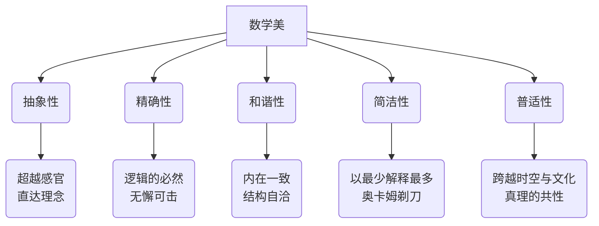
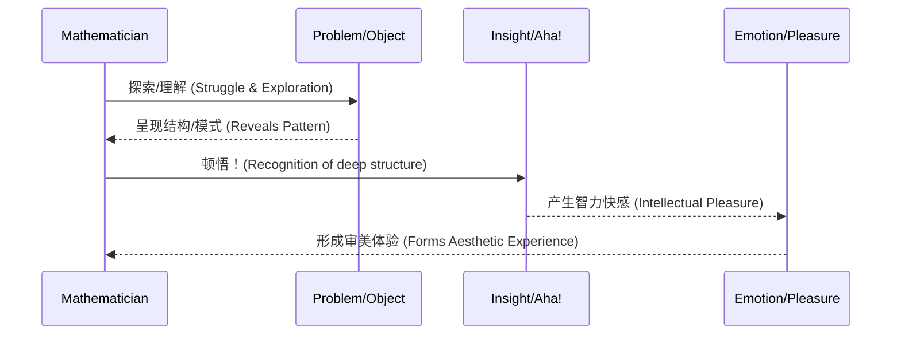

# 04-数学美学：理论、认知与价值

## 目录

- [04-数学美学：理论、认知与价值](#04-数学美学理论认知与价值)
  - [目录](#目录)
  - [1. 引言：数学美学的探索](#1-引言数学美学的探索)
    - [1.1. 研究背景与核心问题](#11-研究背景与核心问题)
    - [1.2. 主题定位与研究方法](#12-主题定位与研究方法)
  - [2. 数学美的本质与层次](#2-数学美的本质与层次)
    - [2.1. 数学美的定义与构成要素](#21-数学美的定义与构成要素)
    - [2.2. 数学美的核心特征](#22-数学美的核心特征)
    - [2.3. 数学美的层次结构](#23-数学美的层次结构)
  - [3. 数学美的类型与范例](#3-数学美的类型与范例)
    - [3.1. 形式美：符号、图形与公式](#31-形式美符号图形与公式)
    - [3.2. 结构美：系统、关系与对称](#32-结构美系统关系与对称)
    - [3.3. 和谐美与简洁美](#33-和谐美与简洁美)
  - [4. 数学美的认知机制](#4-数学美的认知机制)
    - [4.1. 审美感知与判断](#41-审美感知与判断)
    - [4.2. 审美体验的过程](#42-审美体验的过程)
  - [5. 数学美的价值](#5-数学美的价值)
    - [5.1. 在数学创造中的作用](#51-在数学创造中的作用)
    - [5.2. 教育与文化价值](#52-教育与文化价值)
  - [6. 历史、哲学与跨文化视角](#6-历史哲学与跨文化视角)
    - [6.1. 数学美学思想的演进](#61-数学美学思想的演进)
    - [6.2. 数学美的哲学思辨](#62-数学美的哲学思辨)
    - [6.3. 跨文化比较](#63-跨文化比较)
  - [7. 跨主题联系](#7-跨主题联系)
  - [8. 结论与展望](#8-结论与展望)
  - [9. 参考文献](#9-参考文献)

---

## 1. 引言：数学美学的探索

数学美学是研究数学美的本质、特征、认知机制和价值的美学分支。
它探讨数学对象、理论、证明和方法中的美学特征，以及这些特征对人类认知和创造的深刻影响。

### 1.1. 研究背景与核心问题

数学美学的研究源于人类对数学美的直觉认识和哲学思考。
从古希腊的毕达哥拉斯学派到现代的数学家，无不为数学的魅力所折服。
随着认知科学和美学理论的发展，数学美学逐渐成为一个独立的研究领域。

本主题围绕以下**核心问题**展开：

- **本质论**：什么是数学美？其客观基础和主观体验分别是什么？
- **表现论**：数学美如何通过简洁性、对称性、和谐性等形式表现出来？
- **创造论**：数学美如何在数学发现和创造中扮演驱动和评价的角色？
- **价值论**：数学美的内在价值、认知价值、教育价值和文化价值是什么？

### 1.2. 主题定位与研究方法

在我们的知识体系中，数学美学具有以下定位：

- **审美性**：研究数学的审美特征。
- **艺术性**：探讨数学的艺术价值。
- **创造性**：关注数学创造的美学过程。
- **跨学科性**：结合美学、艺术学、心理学、哲学等多学科视角。

研究方法上，我们采用：

- **哲学分析**：分析数学美的形而上学本质和认识论基础。
- **心理学研究**：通过实验和观察研究数学美的认知与神经机制。
- **历史研究**：追溯数学美观念在历史长河中的演变。
- **案例分析**：深入剖析具体的数学定理、公式和理论中的美学元素。

---

## 2. 数学美的本质与层次

### 2.1. 数学美的定义与构成要素

**定义**：数学美是指数学对象（如数、形）、结构（如群、拓扑空间）、理论（如微积分、相对论）、证明和方法所具有的，能够引发智力愉悦和深层共鸣的美学特征。

**核心构成要素**：

| 要素 | 描述 | 示例 |
| :--- | :--- | :--- |
| **形式要素** | 数学对象的外在表现形式。 | `$e^{i\pi} + 1 = 0$` 的符号简洁性；分形的视觉对称性。 |
| **结构要素** | 数学对象内部及对象间的组织方式。 | 群论的封闭性、结合律；数系的层级扩展。 |
| **关系要素** | 不同数学概念和分支间的内在联系。 | 代数与几何的对偶关系（代数几何）；分析与数论的联系。 |
| **过程要素** | 数学思维和证明过程的美学特征。 | 一个证明的巧妙、出人意料或"显然"。 |

### 2.2. 数学美的核心特征

数学之美根植于其最深刻的属性之中：

### 2.3. 数学美的层次结构

数学美并非单一平面，而是呈现出多层次的结构：

1. **感官-形式美 (Aesthetic Beauty)**：
    - **对象**：符号、图形、公式。
    - **特征**：对称、均衡、比例和谐、视觉冲击力。
    - **示例**：黄金分割、正多面体、分形艺术。

2. **理性-结构美 (Intellectual Beauty)**：
    - **对象**：公理系统、理论架构、证明逻辑。
    - **特征**：逻辑清晰、结构对称、内在和谐、完备性。
    - **示例**：欧几里得《几何原本》的公理体系之美；群论对对称性的完美刻画。

3. **哲理-思想美 (Philosophical Beauty)**：
    - **对象**：数学思想、核心概念、理论的统一性。
    - **特征**：深刻、普适、统一、出人意料的联系。
    - **示例**：牛顿-莱布尼茨公式揭示微分与积分的内在联系；范畴论提供的统一语言。

---

## 3. 数学美的类型与范例

### 3.1. 形式美：符号、图形与公式

- **符号美**：数学符号是思想的浓缩。其美在于简洁、表意准确、系统一致。例如，`$\int$` 符号直观地表达了求和的思想。
- **图形美**：数学图形是"无言的证明"。其美在于对称、比例和谐与规律性。例如，曼德博集合的无限复杂与自相似性。
- **公式美**：一个伟大的公式常常被誉为"上帝的诗篇"。其美在于简洁、对称、和谐与深刻。
  
  **范例：欧拉恒等式 `$e^{i\pi} + 1 = 0$`**
  这个公式被誉为最美的数学公式，因为它将数学中最重要的五个常数（`$e, i, \pi, 1, 0$`）以及最基本的运算（加法、乘法、指数）完美地联系在一起。

### 3.2. 结构美：系统、关系与对称

- **系统美**：指数学理论的逻辑完备性与结构和谐性。例如，从自然数到复数的数系扩展，每一步都弥补了前一步的缺陷，展现了完美的层次结构。
- **关系美**：指不同数学对象之间出人意料的深刻联系。例如，伽罗瓦理论通过群论揭示了代数方程可解性背后的对称结构。
- **对称美**：对称是数学中最核心的美学原则之一。从几何图形的轴对称，到物理定律在变换下的不变性，对称无处不在。

### 3.3. 和谐美与简洁美

- **和谐美 (Harmony)**：数学内部各部分之间的无矛盾性和相互支持。一个理论的不同组成部分相互印证，共同构成一个完美的整体。
- **简洁美 (Simplicity/Elegance)**：用最少的假设，得出最深刻的结论。一个简洁的证明或理论，往往能揭示问题的本质。这符合"奥卡姆剃刀"原则。

---

## 4. 数学美的认知机制

### 4.1. 审美感知与判断

- **审美感知 (Aesthetic Perception)**：识别数学对象中美学特征（如对称、简洁）的认知过程。这通常需要专业的知识训练。
- **审美判断 (Aesthetic Judgment)**：对感知到的美学特征进行评价，判断其价值。这是一个主观过程，但受到数学共同体共识的影响。判断标准包括：**客观性、主观性、普遍性、特殊性**。

### 4.2. 审美体验的过程

这种体验通常被描述为一种"高峰体验"，伴随着深刻的满足感和对宇宙秩序的敬畏感。

---

## 5. 数学美的价值

### 5.1. 在数学创造中的作用

- **动机功能**：对美的追求是许多数学家研究的根本动力。哈代在《一个数学家的辩白》中明确指出，他研究数学是因为其"美"。
- **发现功能 (启发式功能)**：美学标准（如简洁性、对称性）可以作为探索的指引，帮助数学家在众多可能性中选择最有前景的方向。
- **评价功能**：一个定理的证明是否"优美"（elegant），是其被数学界接受的重要标准之一。一个笨拙的证明往往被认为未能揭示问题的本质。

### 5.2. 教育与文化价值

- **激发兴趣**：通过展示数学之美，可以有效激发学生的学习兴趣，变被动学习为主动探索。
- **培养能力**：数学美学教育有助于培养学生的抽象思维能力、逻辑推理能力和审美能力。
- **促进理解**：从美学角度理解数学，有助于学生把握数学的整体结构和核心思想，而不仅仅是零散的技巧。
- **文化桥梁**：数学作为人类文化的重要组成部分，其美学价值可以与艺术、音乐、哲学等领域对话，促进科学文化与人文文化的融合。

---

## 6. 历史、哲学与跨文化视角

### 6.1. 数学美学思想的演进

- **古代**：古希腊毕达哥拉斯学派的"万物皆数"，将数与和谐、宇宙秩序联系在一起，是数学美学的源头。
- **近代**：开普勒探索行星运动规律，坚信宇宙是按照美的原则设计的。
- **现代**：庞加莱、哈代、外尔等数学家对数学美进行了系统性阐述，强调其在创造中的核心作用。

### 6.2. 数学美的哲学思辨

- **本体论（美在何处？）**：数学美是客观存在于数学结构之中（柏拉图主义），还是人类心灵的创造和投射（建构主义/形式主义）？
- **认识论（如何认识美？）**：我们是通过逻辑推理，还是通过一种特殊的"数学直觉"来把握数学之美？
- **价值论（美有何用？）**：数学美是纯粹的智力享受，还是具有更深远的实用和认知价值？

### 6.3. 跨文化比较

虽然不同文化在数学风格和侧重点上可能有所不同，但对数学核心美（如简洁、和谐、对称）的追求具有惊人的**普遍性**。这表明数学美可能根植于人类共同的认知结构之中。

---

## 7. 跨主题联系

数学美学并非孤立的学科，它与数学的几乎所有分支以及元数学的各个层面都存在深刻的联系。

| 关联领域 | 联系描述 |
| :--- | :--- |
| **数学哲学** | 探讨数学美的本体论和认识论基础，是数学哲学的重要组成部分。 |
| **元数学理论** | 数学理论的和谐性、一致性和完备性本身就是一种元层次的结构美。 |
| **认知与教育** | 数学美是激发学习动机、促进深度理解和培养审美能力的关键。 |
| **集合论/逻辑** | 公理系统的简洁与强大，集合论构建整个数学大厦的宏伟，本身就是一种基础之美。 |
| **代数** | 对称性、不变量和结构是代数的核心，这些正是美学的重要源泉。 |
| **分析** | 微积分中"无限"的处理，极限理论的严谨，以及连接离散与连续的桥梁，都展现了深刻的分析之美。 |
| **几何/拓扑** | 从欧氏几何的和谐比例到拓扑学的形变不变量，几何是数学美的最直观体现。 |

---

## 8. 结论与展望

数学美学不仅揭示了数学作为"思维的艺术"的独特魅力，也为我们理解人类的认知、创造力和智力愉悦的本质提供了独特的窗口。它告诉我们，数学不仅是工具，更是一种深刻的文化形式和心智探险。

未来的研究将更多地借助神经科学和人工智能，探索数学美的认知神经基础，以及是否可以构建出具有"审美能力"的AI数学家。

---

## 9. 参考文献

1. Hardy, G. H. (1940). *A Mathematician's Apology*. Cambridge University Press.
2. Poincaré, H. (1908). *Science and Method*. Dover Publications.
3. Weyl, H. (1952). *Symmetry*. Princeton University Press.
4. Rota, G. C. (1997). The Phenomenology of Mathematical Beauty. *Synthese*, 111(2), 171-182.
5. Chandrasekhar, S. (1987). *Truth and Beauty: Aesthetics and Motivations in Science*. University of Chicago Press.
6. Penrose, R. (2004). *The Road to Reality: A Complete Guide to the Laws of the Universe*. Alfred A. Knopf.
7. 数学知识体系重构项目. (2024).

---

**激情澎湃，持续前进！<(￣︶￣)↗[GO!]**
