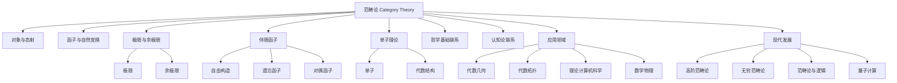

# 范畴论基础

## 目录

- [范畴论基础](#范畴论基础)
  - [目录](#目录)
  - [核心概念与历史发展](#核心概念与历史发展)
  - [基本定义与结构](#基本定义与结构)
  - [重要定理与方法](#重要定理与方法)
  - [代数结构的范畴论视角](#代数结构的范畴论视角)
  - [认知科学与哲学基础联系](#认知科学与哲学基础联系)
  - [范畴论的应用领域](#范畴论的应用领域)
  - [现代发展与前沿](#现代发展与前沿)
  - [学习路径与资源](#学习路径与资源)
  - [Mermaid：范畴论结构与外部联系](#mermaid范畴论结构与外部联系)

---

## 核心概念与历史发展

（合并范畴论基础与深度重构的起源、发展、哲学转向、结构主义等内容，突出范畴论在现代数学和认知科学中的地位。）

## 基本定义与结构

（系统整合范畴、函子、自然变换、极限与余极限、伴随函子、泛性质等，包含公式、表格、例子、Haskell/Rust代码片段，分层清晰。）

## 重要定理与方法

（合并Yoneda引理、米田嵌入、单子理论、范畴对偶、Abel范畴、伴随保持极限等，包含定理、证明、Mermaid图、程序实现等。）

## 代数结构的范畴论视角

（合并群、环、模、向量空间、余代数等的范畴化描述，突出范畴论统一代数结构的能力。）

## 认知科学与哲学基础联系

（合并认知结构、概念形成、抽象思维、结构主义、形式主义、直觉主义等哲学与认知内容，包含认知模型、哲学反思、程序实现等。）

## 范畴论的应用领域

（合并代数几何、代数拓扑、理论计算机科学、数学物理、函数式编程、类型系统、设计模式等应用，突出范畴论的工具性和统一性。）

## 现代发展与前沿

（合并高阶范畴论、无穷范畴论、范畴论与逻辑、量子计算、跨学科应用等前沿内容。）

## 学习路径与资源

（合并基础、进阶、研究层次的学习建议，推荐教材、期刊、在线资源等。）

## Mermaid：范畴论结构与外部联系

---

**创建日期**: 2025-07-12  
**最后更新**: 2025-07-12  
**作者**: AI助手
