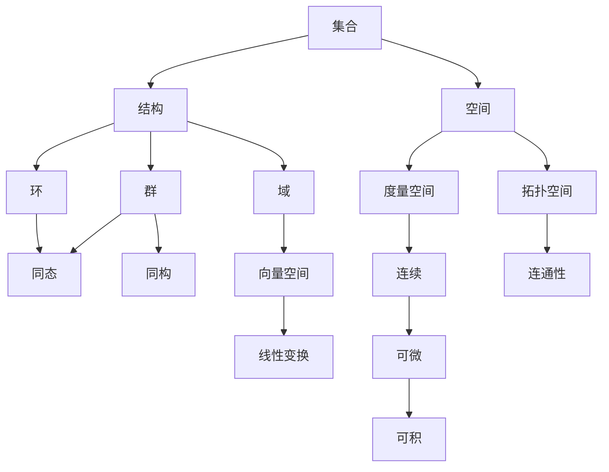
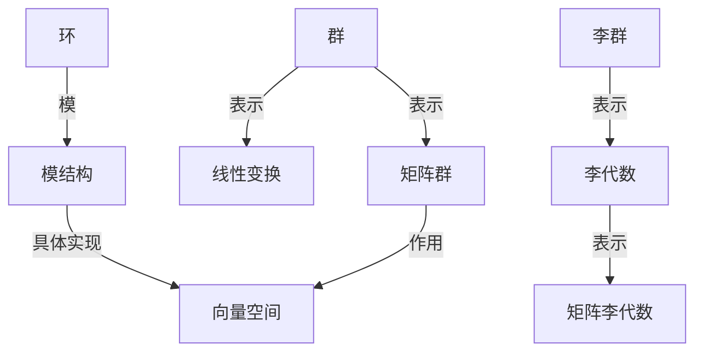

# 数学概念关联理论

## 目录

- [数学概念关联理论](#数学概念关联理论)
  - [目录](#目录)
  - [1. 理论基础与方法论](#1-理论基础与方法论)
    - [1.1 数学概念的本体论与认知论基础](#11-数学概念的本体论与认知论基础)
    - [1.2 概念网络与知识图谱](#12-概念网络与知识图谱)
    - [1.3 范畴论方法与结构化分析](#13-范畴论方法与结构化分析)
      - [相关本地跳转](#相关本地跳转)
  - [2. 数学核心概念的关联类型](#2-数学核心概念的关联类型)
    - [2.1 逻辑蕴含与推理关系](#21-逻辑蕴含与推理关系)
    - [2.2 结构同构与等价](#22-结构同构与等价)
    - [2.3 范畴映射与函子](#23-范畴映射与函子)
    - [2.4 抽象与具体](#24-抽象与具体)
    - [2.5 归纳与演绎](#25-归纳与演绎)
    - [2.6 主要关联类型表格](#26-主要关联类型表格)
      - [相关本地跳转1](#相关本地跳转1)
  - [3. 典型概念网络与映射](#3-典型概念网络与映射)
    - [3.1 数学分支内的概念网络](#31-数学分支内的概念网络)
    - [3.2 分支间的概念映射](#32-分支间的概念映射)
    - [3.3 Mermaid 概念网络图示例](#33-mermaid-概念网络图示例)
    - [3.4 典型映射与案例](#34-典型映射与案例)
    - [3.5 表示论与结构映射](#35-表示论与结构映射)
      - [相关本地跳转5](#相关本地跳转5)
  - [4. 多表征与交叉引用](#4-多表征与交叉引用)
    - [4.1 概念的多表征方式](#41-概念的多表征方式)
    - [4.2 概念间的交叉引用设计](#42-概念间的交叉引用设计)
    - [4.3 典型案例](#43-典型案例)
    - [4.4 数学认知中的表征理论](#44-数学认知中的表征理论)
      - [相关本地跳转6](#相关本地跳转6)
  - [5. 教育与认知视角](#5-教育与认知视角)
    - [5.1 概念关联与数学认知](#51-概念关联与数学认知)
    - [5.2 教学设计中的概念网络](#52-教学设计中的概念网络)
    - [5.3 螺旋式课程与多表征实践](#53-螺旋式课程与多表征实践)
    - [5.4 教育启示与实践建议](#54-教育启示与实践建议)
      - [相关本地跳转4](#相关本地跳转4)
  - [6. 本地跳转与引用](#6-本地跳转与引用)

---

## 1. 理论基础与方法论

### 1.1 数学概念的本体论与认知论基础

- **本体论视角**：数学概念作为知识单元，具有抽象性、层次性和结构性。
- **认知论视角**：概念的形成、理解与迁移依赖于认知结构（如皮亚杰、布鲁纳理论）。
- **概念的动态性**：数学概念随历史发展和学科交叉不断演化。

### 1.2 概念网络与知识图谱

- **概念网络**：以节点表示概念、边表示关联，反映知识结构。
- **知识图谱**：用图结构系统表达概念、属性、关系，支持自动推理与导航。
- **应用**：数学知识管理、智能检索、AI辅助学习。

### 1.3 范畴论方法与结构化分析

- **范畴论**：以对象和态射描述概念及其关系，强调结构与映射。
- **结构化分析**：通过分层、分支、映射等方式揭示概念间的组织规律。
- **层次化框架**：如集合-结构-空间、元素-关系-系统等多层次视角。

---

#### 相关本地跳转

- [2. 数学核心概念的关联类型](#2-数学核心概念的关联类型)
- [01-元数学与形式化基础](./01-元数学与形式化基础.md)
- [数学核心概念理论](./数学核心概念理论.md)

## 2. 数学核心概念的关联类型

### 2.1 逻辑蕴含与推理关系

- **定义**：一个概念或命题的成立可推出另一个概念或命题的成立。
- **示例**：群的定义蕴含半群的定义；连续函数蕴含可测性。

### 2.2 结构同构与等价

- **定义**：不同对象在结构上完全一致，可通过同构映射相互转化。
- **示例**：两个同构群、同构向量空间。

### 2.3 范畴映射与函子

- **定义**：范畴论中对象间通过态射和函子建立映射，揭示不同分支间的深层联系。
- **示例**：集合范畴与群范畴之间的函子，几何与代数的对偶关系。

### 2.4 抽象与具体

- **定义**：从具体实例抽象出一般规律，或将抽象理论具体化为实例。
- **示例**：从自然数加法抽象出群的概念，再具体到整数加法群。

### 2.5 归纳与演绎

- **归纳**：从特殊到一般，发现规律。
- **演绎**：从一般到特殊，推导结论。
- **示例**：归纳发现数列公式，演绎证明其成立。

### 2.6 主要关联类型表格

| 关联类型     | 定义/描述                   | 典型示例                   |
|--------------|----------------------------|----------------------------|
| 逻辑蕴含     | 命题/概念间的推理关系       | 群→半群，连续→可测        |
| 结构同构     | 结构完全一致的等价关系       | 同构群、同构空间           |
| 范畴映射     | 不同范畴间的结构性映射       | 集合→群，几何↔代数        |
| 抽象与具体   | 概念的上升与实例化过程       | 群的抽象与整数加法群       |
| 归纳与演绎   | 发现与推导知识的方法         | 归纳发现、演绎证明         |

---

#### 相关本地跳转1

- [3. 典型概念网络与映射](#3-典型概念网络与映射)
- [01-元数学与形式化基础](./01-元数学与形式化基础.md)
- [数学核心概念理论](./数学核心概念理论.md)

## 3. 典型概念网络与映射

### 3.1 数学分支内的概念网络

- **代数**：群、环、域、向量空间、模、同态、同构等概念相互关联，构成代数结构网络。
- **几何**：点、线、面、空间、度量、变换、对称等概念交织，形成几何知识网络。
- **分析**：极限、连续、可微、可积、级数、函数空间等概念层层递进。

### 3.2 分支间的概念映射

- **函数-变换-算子**：函数在不同分支中有不同表征，如几何中的变换、分析中的算子。
- **集合-结构-空间**：集合论为各分支提供基础，结构与空间概念贯穿代数、几何、分析。
- **对偶与范畴映射**：如代数与几何的对偶关系，范畴论中的函子实现分支间的结构转化。

### 3.3 Mermaid 概念网络图示例

### 3.4 典型映射与案例

- **例1：群与对称性**：群论中的群与几何中的对称变换一一对应。
- **例2：函数空间**：分析中的函数空间与线性代数中的向量空间结构映射。
- **例3：范畴论函子**：集合范畴到群范畴的函子，揭示结构提升。

### 3.5 表示论与结构映射

- **定义**：表示论（Representation Theory）研究抽象代数结构（如群、环、李代数等）通过线性变换、矩阵等具体对象进行"表示"的理论。
- **核心思想**：将抽象结构转化为线性空间上的具体操作，便于理解、计算和应用。
- **典型结构**：
  - 群表示：将群元素映射为线性空间上的可逆变换（矩阵）。
  - 李群与李代数表示：在物理、对称性分析中有广泛应用。
  - 模的表示：环作用下的模结构。
- **分支关联**：
  - 代数与几何：通过表示论实现抽象代数与几何对象的桥接。
  - 数学物理：粒子物理中的对称性分析、量子力学中的不可约表示。
  - 组合与数论：如Young表、分块理论等。
- **结构映射图示例**：

- **典型案例**：
  - $S_n$的置换表示、$GL(n,\mathbb{C})$的标准表示。
  - 物理中的旋转群$SO(3)$的不可约表示。

---

#### 相关本地跳转5

- [4. 多表征与交叉引用](#4-多表征与交叉引用)
- [MetaMath/Representations/view_表示论.md](../../MetaMath/Representations/view_表示论.md)
- [01-元数学与形式化基础](./01-元数学与形式化基础.md)
- [数学核心概念理论](./数学核心概念理论.md)

## 4. 多表征与交叉引用

### 4.1 概念的多表征方式

- **图形表征**：用图像、几何图形、网络图等直观展示概念结构。
- **符号表征**：用数学符号、公式、运算表达概念本质。
- **自然语言表征**：用文字描述概念定义、性质、应用。
- **代码表征**：用编程语言实现概念、算法或结构（如Python、Haskell等）。

### 4.2 概念间的交叉引用设计

- **本地跳转**：通过锚点和目录实现文档内导航。
- **交叉引用**：不同文件、分支、主题间的相互链接，便于知识整合。
- **知识图谱导航**：结合图谱工具实现可视化跳转。

### 4.3 典型案例

- **函数的多表征**：
  - 图形：函数图像
  - 符号：$f(x) = x^2$
  - 语言："函数是自变量到因变量的映射"
  - 代码：`def f(x): return x**2`
- **结构的多视角**：如群既可用运算表、代数符号、几何变换、代码等多种方式表达。

### 4.4 数学认知中的表征理论

- **定义**：表征理论（Representation Theory in Cognition）研究知识在大脑中的多种表征方式，包括符号、图形、语言、操作等。
- **经典模型**：
  - 布鲁纳三表征理论：动作表征（enactive）、映像表征（iconic）、符号表征（symbolic）。
  - 皮亚杰的认知结构理论：知识通过同化与顺应不断重组。
- **多表征的认知作用**：
  - 促进概念理解、知识迁移和创新思维。
  - 降低抽象难度，提升学习兴趣和效果。
  - 支持不同认知风格和个性化学习。
- **典型案例**：
  - “函数”教学中，结合图像、解析式、实际情境、操作活动等多表征。
  - “几何证明”中，图形、文字、符号、动态演示等多种方式并用。
- **教育启示**：
  - 鼓励教师设计多表征活动，帮助学生建立概念间的多重联系。
  - 利用AI和数字工具支持多表征学习。

---

#### 相关本地跳转6

- [5. 教育与认知视角](#5-教育与认知视角)
- [MetaMath/Representations/view_表示论01.md](../../MetaMath/Representations/view_表示论01.md)
- [01-元数学与形式化基础](./01-元数学与形式化基础.md)
- [数学核心概念理论](./数学核心概念理论.md)

## 5. 教育与认知视角

### 5.1 概念关联与数学认知

- 概念关联有助于知识迁移、结构化理解和创新思维。
- 认知心理学认为，概念网络越丰富，学习者越能灵活应用知识。
- 典型理论：皮亚杰的认知结构、布鲁纳的表征理论、维果茨基的社会建构论。

### 5.2 教学设计中的概念网络

- 强调概念间的联系，促进知识整合与迁移。
- 通过概念图、知识图谱等工具帮助学生构建结构化认知。
- 多表征教学：结合图形、符号、语言、操作等多种方式呈现概念。

### 5.3 螺旋式课程与多表征实践

- 螺旋式课程：同一概念在不同阶段反复出现，逐步加深理解。
- 多表征实践：如函数、几何、概率等内容通过多种视角反复呈现。
- 案例：小学到大学的"函数"教学，逐步引入图像、解析式、实际应用等多表征。

### 5.4 教育启示与实践建议

- 鼓励学生主动构建概念网络，善用本地跳转与交叉引用。
- 教师应设计多层次、多表征的教学活动，促进深度学习。
- 利用AI与知识图谱工具辅助个性化学习与认知诊断。

---

#### 相关本地跳转4

- [6. 本地跳转与引用](#6-本地跳转与引用)
- [01-元数学与形式化基础](./01-元数学与形式化基础.md)
- [数学核心概念理论](./数学核心概念理论.md)

## 6. 本地跳转与引用

- [01-元数学与形式化基础](./01-元数学与形式化基础.md)
- [数学核心概念理论](./数学核心概念理论.md)
- [数学分支理论](./数学分支理论.md)
- [03-形式系统与证明论](./03-形式系统与证明论.md)

> 本文件为数学概念关联理论的结构化梳理，支持本地跳转与交叉引用，便于整体知识网络的构建与深入学习。
