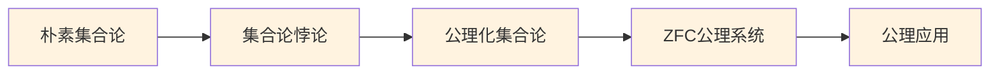
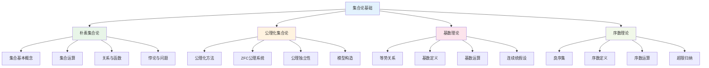

# 集合论基础

## 目录

- [集合论基础](#集合论基础)
  - [目录](#目录)
  - [1. 概述](#1-概述)
    - [1.1 主题定位](#11-主题定位)
    - [1.2 学习目标](#12-学习目标)
  - [2. 学习路径](#2-学习路径)
    - [2.1 初级路径（基础概念）](#21-初级路径基础概念)
    - [2.2 中级路径（公理化理论）](#22-中级路径公理化理论)
    - [2.3 高级路径（基数与序数）](#23-高级路径基数与序数)
  - [3. 知识体系](#3-知识体系)
    - [3.1 概念层次结构](#31-概念层次结构)
    - [3.2 依赖关系](#32-依赖关系)
    - [3.3 学习资源](#33-学习资源)
  - [4. 核心概念](#4-核心概念)
    - [4.1 基础概念](#41-基础概念)
    - [4.2 运算概念](#42-运算概念)
    - [4.3 关系概念](#43-关系概念)
  - [5. 重要定理](#5-重要定理)
    - [5.1 基础定理](#51-基础定理)
    - [5.2 基数定理](#52-基数定理)
    - [5.3 序数定理](#53-序数定理)
  - [6. 应用领域](#6-应用领域)
    - [6.1 数学内部应用](#61-数学内部应用)
    - [6.2 计算机科学应用](#62-计算机科学应用)
    - [6.3 其他学科应用](#63-其他学科应用)
  - [7. 历史发展](#7-历史发展)
    - [7.1 早期发展](#71-早期发展)
    - [7.2 公理化时期](#72-公理化时期)
    - [7.3 重要人物](#73-重要人物)
  - [8. 参考文献](#8-参考文献)
    - [8.1 经典教材](#81-经典教材)
    - [8.2 中文教材](#82-中文教材)
    - [8.3 在线资源](#83-在线资源)
    - [8.4 研究论文](#84-研究论文)
  - [9. 学习建议](#9-学习建议)
    - [9.1 学习方法](#91-学习方法)
    - [9.2 常见误区](#92-常见误区)
    - [9.3 进阶方向](#93-进阶方向)

---

## 1. 概述

集合论是现代数学的基础语言和理论框架，为几乎所有数学分支提供了统一的表达方式和理论基础。本主题涵盖从朴素集合论到公理化集合论的完整体系，包括基数理论、序数理论等高级内容。

### 1.1 主题定位

- **学科地位**：数学基础理论的核心
- **应用范围**：所有数学分支的基础
- **学习难度**：初级到高级
- **前置知识**：基本逻辑概念

### 1.2 学习目标

通过本主题的学习，您将能够：

1. **理解集合论的基本概念**：集合、元素、子集、运算等
2. **掌握公理化集合论**：ZFC公理系统及其应用
3. **运用基数理论**：理解无穷集合的大小比较
4. **应用序数理论**：理解良序集合的结构
5. **建立数学思维**：培养严格的逻辑推理能力

---

## 2. 学习路径

### 2.1 初级路径（基础概念）


**学习内容**：

1. **集合基本概念** (2-3小时)
   - 集合与元素
   - 集合的表示方法
   - 空集与全集

2. **集合运算** (3-4小时)
   - 并集、交集、差集
   - 补集与对称差
   - 德摩根定律

3. **关系与函数** (4-5小时)
   - 笛卡尔积
   - 二元关系
   - 函数定义

4. **等价关系** (2-3小时)
   - 等价关系性质
   - 等价类与商集
   - 划分

5. **序关系** (3-4小时)
   - 偏序关系
   - 全序关系
   - 良序关系

### 2.2 中级路径（公理化理论）



**学习内容**：

1. **朴素集合论** (3-4小时)
   - 康托尔的贡献
   - 朴素集合论的问题

2. **集合论悖论** (2-3小时)
   - 罗素悖论
   - 其他悖论
   - 悖论的意义

3. **公理化集合论** (4-5小时)
   - 公理化方法
   - 形式化语言
   - 公理系统设计

4. **ZFC公理系统** (6-8小时)
   - 外延公理
   - 空集公理
   - 偶集公理
   - 并集公理
   - 幂集公理
   - 无穷公理
   - 替换公理
   - 正则公理
   - 选择公理

5. **公理应用** (4-5小时)
   - 自然数构造
   - 有理数构造
   - 实数构造

### 2.3 高级路径（基数与序数）


**学习内容**：

1. **基数理论** (8-10小时)
   - 等势关系
   - 基数定义
   - 基数运算
   - 阿列夫数

2. **序数理论** (6-8小时)
   - 良序集
   - 序数定义
   - 序数运算
   - 超限序数

3. **超限归纳** (4-5小时)
   - 超限归纳原理
   - 超限递归
   - 应用实例

4. **选择公理** (3-4小时)
   - 选择公理等价形式
   - 选择公理应用
   - 选择公理争议

5. **大基数理论** (6-8小时)
   - 不可达基数
   - 马洛基数
   - 大基数公理

---

## 3. 知识体系

### 3.1 概念层次结构



### 3.2 依赖关系

**基础依赖**：

- 逻辑基础 → 集合论
- 朴素集合论 → 公理化集合论
- 公理化集合论 → 基数理论
- 公理化集合论 → 序数理论

**交叉依赖**：

- 基数理论 ↔ 序数理论
- 选择公理 ↔ 基数理论
- 大基数理论 ↔ 序数理论

### 3.3 学习资源

**核心文档**：

- [集合论基础概念](./01-集合论基础概念.md)
- [集合运算与关系](./02-集合运算与关系.md)
- [公理化集合论](./03-公理化集合论.md)
- [基数理论](./04-基数理论.md)
- [序数理论](./05-序数理论.md)
- [选择公理与大基数](./06-选择公理与大基数.md)

**补充资源**：

- [集合论历史发展](./07-历史发展.md)
- [集合论应用实例](./08-应用实例.md)
- [集合论哲学思考](./09-哲学思考.md)

---

## 4. 核心概念

### 4.1 基础概念

| 概念 | 定义 | 重要性 | 应用 |
|------|------|--------|------|
| 集合 | 具有某种共同性质的事物的总体 | 基础概念 | 所有数学对象的基础 |
| 元素 | 集合中的个体 | 基本单位 | 集合的构成要素 |
| 子集 | 包含在另一个集合中的集合 | 包含关系 | 分类与比较 |
| 空集 | 不包含任何元素的集合 | 特殊集合 | 逻辑推理基础 |
| 幂集 | 集合的所有子集构成的集合 | 结构概念 | 拓扑学基础 |

### 4.2 运算概念

| 运算 | 定义 | 性质 | 应用 |
|------|------|------|------|
| 并集 | 两个集合中所有元素的集合 | 交换律、结合律 | 逻辑或运算 |
| 交集 | 两个集合中共同元素的集合 | 交换律、结合律 | 逻辑与运算 |
| 差集 | 属于第一个集合但不属于第二个集合的元素 | 非对称性 | 集合减法 |
| 补集 | 全集中不属于给定集合的元素 | 对合性 | 逻辑非运算 |
| 笛卡尔积 | 两个集合元素的所有有序对 | 非交换性 | 关系与函数基础 |

### 4.3 关系概念

| 关系 | 定义 | 性质 | 应用 |
|------|------|------|------|
| 等价关系 | 自反、对称、传递的二元关系 | 划分性质 | 分类与抽象 |
| 偏序关系 | 自反、反对称、传递的二元关系 | 层次结构 | 排序与比较 |
| 全序关系 | 完全的偏序关系 | 线性结构 | 数系构造 |
| 良序关系 | 每个非空子集都有最小元的全序关系 | 归纳性质 | 序数理论 |

---

## 5. 重要定理

### 5.1 基础定理

**德摩根定律**

```
(A ∪ B)^c = A^c ∩ B^c
(A ∩ B)^c = A^c ∪ B^c
```

**分配律**

```
A ∩ (B ∪ C) = (A ∩ B) ∪ (A ∩ C)
A ∪ (B ∩ C) = (A ∪ B) ∩ (A ∪ C)
```

**幂集性质**

```
|P(A)| = 2^|A|
```

### 5.2 基数定理

**康托尔定理**

```
对于任意集合A，|A| < |P(A)|
```

**施罗德-伯恩斯坦定理**

```
如果|A| ≤ |B|且|B| ≤ |A|，则|A| = |B|
```

**基数运算**

```
|A × B| = |A| × |B|
|A^B| = |A|^|B|
```

### 5.3 序数定理

**超限归纳原理**

```
如果对于所有序数α，当P(β)对所有β < α成立时P(α)也成立，
那么P(α)对所有序数α成立。
```

**序数良序定理**

```
每个集合都可以良序化（等价于选择公理）
```

---

## 6. 应用领域

### 6.1 数学内部应用

**数系构造**

- 自然数：冯·诺依曼构造
- 整数：等价类构造
- 有理数：分数构造
- 实数：戴德金分割

**代数结构**

- 群、环、域的定义
- 向量空间构造
- 代数系统分类

**拓扑学**

- 拓扑空间定义
- 连续映射
- 紧致性概念

### 6.2 计算机科学应用

**数据结构**

- 集合数据结构
- 关系数据库
- 图论基础

**算法理论**

- 计算复杂性
- 递归理论
- 自动机理论

**编程语言**

- 类型论基础
- 函数式编程
- 逻辑编程

### 6.3 其他学科应用

**物理学**

- 量子力学基础
- 相对论时空
- 统计力学

**经济学**

- 偏好关系
- 效用理论
- 博弈论

**哲学**

- 逻辑学基础
- 认识论
- 形而上学

---

## 7. 历史发展

### 7.1 早期发展

**康托尔时代 (1874-1897)**

- 1874年：康托尔发表第一篇集合论论文
- 1878年：提出连续统假设
- 1891年：对角线方法
- 1895年：基数理论

**悖论时期 (1897-1908)**

- 1897年：布拉利-福尔蒂悖论
- 1901年：罗素悖论
- 1903年：理查德悖论

### 7.2 公理化时期

**策梅洛时代 (1908-1920)**

- 1908年：策梅洛公理系统
- 1915年：弗兰克尔改进
- 1922年：斯科伦形式化

**现代发展 (1920-至今)**

- 1925年：冯·诺依曼序数
- 1938年：哥德尔一致性
- 1963年：科恩独立性
- 1970年：大基数理论

### 7.3 重要人物

| 数学家 | 贡献 | 时期 |
|--------|------|------|
| 康托尔 | 集合论创立 | 1874-1897 |
| 策梅洛 | 公理化集合论 | 1908-1920 |
| 弗兰克尔 | ZF公理系统 | 1915-1922 |
| 冯·诺依曼 | 序数理论 | 1925-1928 |
| 哥德尔 | 一致性证明 | 1938-1940 |
| 科恩 | 独立性证明 | 1963-1966 |

---

## 8. 参考文献

### 8.1 经典教材

1. **Halmos, P. R.** (1960). *Naive Set Theory*. Springer-Verlag.
2. **Enderton, H. B.** (1977). *Elements of Set Theory*. Academic Press.
3. **Jech, T.** (2003). *Set Theory*. Springer-Verlag.
4. **Kunen, K.** (1980). *Set Theory: An Introduction to Independence Proofs*. North-Holland.

### 8.2 中文教材

1. **张锦文** (1991). *公理集合论导引*. 科学出版社.
2. **王世强** (1997). *模型论基础*. 科学出版社.
3. **胡世华** (1981). *数理逻辑基础*. 科学出版社.

### 8.3 在线资源

1. **Stanford Encyclopedia of Philosophy**: Set Theory
2. **Wikipedia**: Set Theory
3. **MathWorld**: Set Theory
4. **Wolfram MathWorld**: Cardinal Number

### 8.4 研究论文

1. **Cantor, G.** (1874). "Über eine Eigenschaft des Inbegriffes aller reellen algebraischen Zahlen"
2. **Zermelo, E.** (1908). "Untersuchungen über die Grundlagen der Mengenlehre"
3. **Gödel, K.** (1938). "The Consistency of the Axiom of Choice and of the Generalized Continuum-Hypothesis"
4. **Cohen, P. J.** (1963). "The Independence of the Continuum Hypothesis"

---

## 9. 学习建议

### 9.1 学习方法

1. **循序渐进**：从朴素集合论开始，逐步深入公理化理论
2. **多做练习**：通过具体例子理解抽象概念
3. **建立联系**：将集合论与其他数学分支联系起来
4. **思考哲学**：思考集合论的哲学基础和意义

### 9.2 常见误区

1. **混淆集合与元素**：注意集合的层次结构
2. **忽视悖论**：理解悖论对公理化的重要性
3. **轻视选择公理**：认识选择公理在数学中的核心地位
4. **忽略历史**：了解历史发展有助于理解概念

### 9.3 进阶方向

1. **模型论**：研究形式理论与数学结构的关系
2. **证明论**：研究形式证明系统的性质
3. **递归论**：研究可计算性和可判定性
4. **描述集合论**：研究实数集的可定义子集

---

*本主题是数学基础与逻辑体系的重要组成部分，为后续学习其他数学分支奠定坚实基础。*
