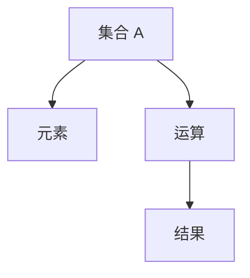

# 1.1 集合与运算（Sets and Operations）

## 1.1.1 形式化定义

- **集合（Set）**：一些对象的无序聚集，每个对象称为集合的元素。
- **形式化表达**：\( A = \{x \mid P(x)\} \) 或 \( A = \{a, b, c, ...\} \)
- **运算（Operation）**：从集合的元素到集合元素的映射。
- **二元运算**：\( *: A \times A \to A \)，如加法、乘法。

## 1.1.2 基本集合运算

| 运算类型   | 符号表示           | 定义                                    |
|------------|-------------------|----------------------------------------|
| 并集       | \( A \cup B \)    | \( \{x \mid x \in A \text{ 或 } x \in B\} \) |
| 交集       | \( A \cap B \)    | \( \{x \mid x \in A \text{ 且 } x \in B\} \) |
| 差集       | \( A \setminus B \) | \( \{x \mid x \in A \text{ 且 } x \notin B\} \) |
| 补集       | \( A^c \)         | \( \{x \mid x \notin A\} \)            |
| 笛卡尔积   | \( A \times B \)  | \( \{(a,b) \mid a \in A, b \in B\} \)  |

## 1.1.3 多表征

### 1.1.3.1 图示

### 1.1.3.2 表格

| 概念       | 定义/表征                      |
|------------|-------------------------------|
| 集合       | 对象的无序聚集                 |
| 元素       | 集合中的个体对象               |
| 子集       | \( A \subseteq B \)           |
| 真子集     | \( A \subset B \)             |
| 空集       | \( \emptyset \)               |

### 1.1.3.3 公式

- 集合定义：\( A = \{x \mid P(x)\} \)
- 二元运算：\( *: A \times A \to A \)
- 并集：\( A \cup B = \{x \mid x \in A \text{ 或 } x \in B\} \)
- 交集：\( A \cap B = \{x \mid x \in A \text{ 且 } x \in B\} \)

## 1.1.4 哲学与认知分析

- **抽象化过程**：
  - 集合概念是对具体对象的抽象，忽略个体差异，关注共同属性。
- **认知发展**：
  - 从具体对象到抽象集合，从有限到无限，体现认知的层次性。
- **哲学反思**：
  - 集合的"存在"问题，罗素悖论对集合论的挑战。

## 1.1.5 相关引用

- 康托尔《集合论》
- 策梅洛-弗兰克尔公理系统
- 现代集合论、抽象代数教材

---

> 本节内容严格编号，便于后续扩展与交叉引用。下节将处理"1.2 群论基础"。 