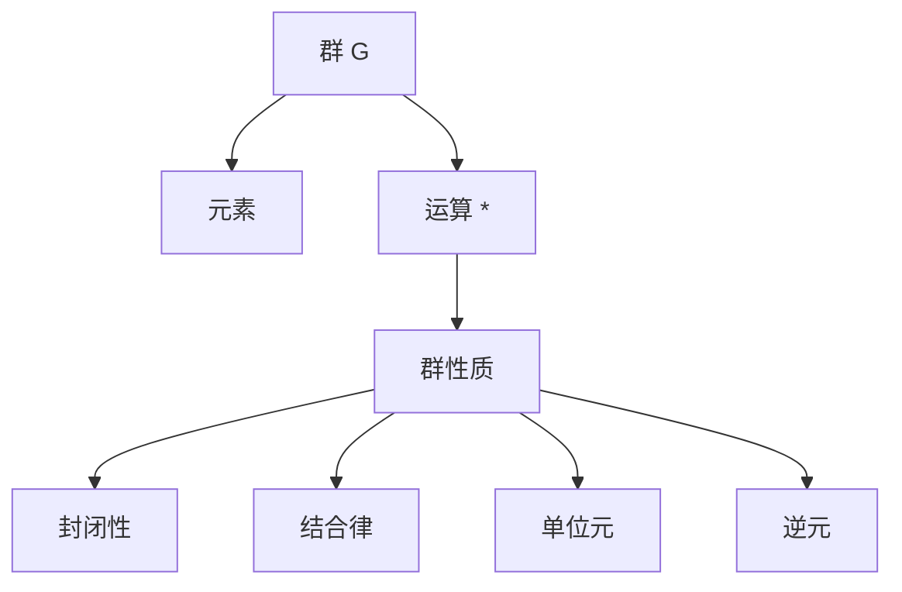

# 1.2 群论基础（Group Theory Fundamentals）

## 1.2.1 形式化定义

- **群（Group）**：一个集合G配备一个二元运算*，满足以下四条公理：
  1. **封闭性**：\( \forall a, b \in G, a * b \in G \)
  2. **结合律**：\( \forall a, b, c \in G, (a * b) * c = a * (b * c) \)
  3. **单位元**：\( \exists e \in G, \forall a \in G, e * a = a * e = a \)
  4. **逆元**：\( \forall a \in G, \exists a^{-1} \in G, a * a^{-1} = a^{-1} * a = e \)

## 1.2.2 群的基本性质

| 性质       | 说明与举例                                 |
|------------|-------------------------------------------|
| 单位元唯一 | 群的单位元是唯一的                         |
| 逆元唯一   | 每个元素的逆元是唯一的                     |
| 消去律     | \( a * b = a * c \Rightarrow b = c \)     |
| 阶         | 有限群中元素的阶是使\( a^n = e \)的最小正整数 |

## 1.2.3 典型群例

| 群类型     | 说明与举例                                 |
|------------|-------------------------------------------|
| 整数加法群 | \( (\mathbb{Z}, +) \)                     |
| 模n剩余类群 | \( (\mathbb{Z}_n, +) \)                   |
| 对称群     | \( S_n \)（n个元素的置换群）               |
| 循环群     | 由单个元素生成的群                         |
| 阿贝尔群   | 满足交换律的群                             |

## 1.2.4 多表征

### 1.2.4.1 图示

### 1.2.4.2 表格

| 概念       | 定义/表征                      |
|------------|-------------------------------|
| 群         | 满足四公理的代数结构           |
| 子群       | 群的子集，本身构成群           |
| 同态       | 保持群结构的映射               |
| 同构       | 双射同态                       |
| 正规子群   | 在共轭下不变的子群             |

### 1.2.4.3 公式

- 群公理：\( (G, *) \) 满足四公理
- 拉格朗日定理：\( |H| \) 整除 \( |G| \)
- 同态：\( \phi(a * b) = \phi(a) * \phi(b) \)

## 1.2.5 哲学与认知分析

- **对称性本质**：
  - 群论是研究对称性的数学语言，揭示自然界的深层结构。
- **抽象化层次**：
  - 从具体运算到抽象群结构，体现数学的普适性。
- **认知发展**：
  - 群的概念需要从具体到抽象，从有限到无限的认知跃迁。

## 1.2.6 相关引用

- 伽罗瓦《群论》
- 现代抽象代数、群论教材
- 对称性、数学史相关文献

---

> 本节内容严格编号，便于后续扩展与交叉引用。下节将处理"1.3 环论基础"。 