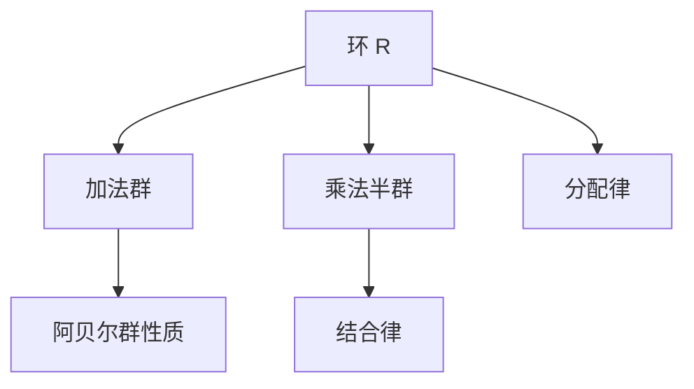

# 1.3 环论基础（Ring Theory Fundamentals）

## 1.3.1 形式化定义

- **环（Ring）**：一个集合R配备两个二元运算+和·，满足以下公理：
  1. **(R, +)** 是阿贝尔群
  2. **(R, ·)** 满足结合律
  3. **分配律**：\( a \cdot (b + c) = a \cdot b + a \cdot c \) 和 \( (a + b) \cdot c = a \cdot c + b \cdot c \)

## 1.3.2 环的基本性质

| 性质       | 说明与举例                                 |
|------------|-------------------------------------------|
| 零元       | 加法群的单位元，满足 \( 0 \cdot a = a \cdot 0 = 0 \) |
| 负元       | 每个元素在加法下的逆元                     |
| 幂零元     | 存在正整数n使 \( a^n = 0 \) 的元素         |
| 幂等元     | 满足 \( a^2 = a \) 的元素                  |
| 单位       | 乘法下有逆元的元素                         |

## 1.3.3 典型环例

| 环类型     | 说明与举例                                 |
|------------|-------------------------------------------|
| 整数环     | \( (\mathbb{Z}, +, \cdot) \)              |
| 多项式环   | \( R[x] \)（系数在环R中的多项式）          |
| 矩阵环     | \( M_n(R) \)（n×n矩阵环）                 |
| 模n剩余类环 | \( \mathbb{Z}_n \)                        |
| 布尔环     | 满足 \( a^2 = a \) 的环                   |

## 1.3.4 多表征

### 1.3.4.1 图示

### 1.3.4.2 表格

| 概念       | 定义/表征                      |
|------------|-------------------------------|
| 环         | 满足环公理的代数结构           |
| 子环       | 环的子集，本身构成环           |
| 理想       | 在环运算下封闭的子集           |
| 商环       | 环模理想的商结构               |
| 整环       | 无零因子的交换环               |

### 1.3.4.3 公式

- 环公理：\( (R, +, \cdot) \) 满足环公理
- 分配律：\( a \cdot (b + c) = a \cdot b + a \cdot c \)
- 零元性质：\( 0 \cdot a = a \cdot 0 = 0 \)

## 1.3.5 哲学与认知分析

- **运算的复合**：
  - 环论研究两种运算的相互作用，体现数学结构的复杂性。
- **抽象化层次**：
  - 从具体数系到抽象环结构，推广了算术的基本性质。
- **认知发展**：
  - 理解环需要掌握两种运算及其关系，体现认知的层次性。

## 1.3.6 相关引用

- 现代抽象代数、环论教材
- 代数几何、交换代数相关文献

---

> 本节内容严格编号，便于后续扩展与交叉引用。下节将处理"1.4 域论基础"。
