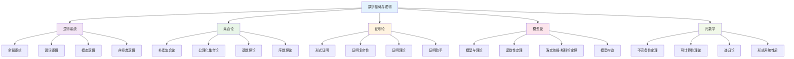

# 数学基础与逻辑：内容分析报告

## 目录

- [数学基础与逻辑：内容分析报告](#数学基础与逻辑内容分析报告)
  - [目录](#目录)
  - [1. 分析概述](#1-分析概述)
    - [1.1 分析目标](#11-分析目标)
    - [1.2 分析范围](#12-分析范围)
  - [2. 原始内容分析](#2-原始内容分析)
    - [2.1 内容概览](#21-内容概览)
    - [2.2 核心主题识别](#22-核心主题识别)
    - [2.3 内容质量评估](#23-内容质量评估)
  - [3. 主题识别与分类](#3-主题识别与分类)
    - [3.1 逻辑系统主题](#31-逻辑系统主题)
      - [3.1.1 命题逻辑](#311-命题逻辑)
      - [3.1.2 谓词逻辑](#312-谓词逻辑)
      - [3.1.3 模态逻辑](#313-模态逻辑)
    - [3.2 集合论主题](#32-集合论主题)
      - [3.2.1 朴素集合论](#321-朴素集合论)
      - [3.2.2 公理化集合论](#322-公理化集合论)
    - [3.3 证明论主题](#33-证明论主题)
      - [3.3.1 形式证明系统](#331-形式证明系统)
      - [3.3.2 证明复杂性](#332-证明复杂性)
    - [3.4 模型论主题](#34-模型论主题)
      - [3.4.1 模型与理论](#341-模型与理论)
      - [3.4.2 紧致性定理](#342-紧致性定理)
    - [3.5 元数学主题](#35-元数学主题)
      - [3.5.1 哥德尔不完备性定理](#351-哥德尔不完备性定理)
      - [3.5.2 可计算性理论](#352-可计算性理论)
  - [4. 知识结构梳理](#4-知识结构梳理)
    - [4.1 概念层次结构](#41-概念层次结构)
    - [4.2 依赖关系分析](#42-依赖关系分析)
    - [4.3 学习路径设计](#43-学习路径设计)
  - [5. 重构策略](#5-重构策略)
    - [5.1 重构原则](#51-重构原则)
    - [5.2 重构方法](#52-重构方法)
    - [5.3 重构标准](#53-重构标准)
  - [6. 实施计划](#6-实施计划)
    - [6.1 第一阶段：基础重构（1-2周）](#61-第一阶段基础重构1-2周)
    - [6.2 第二阶段：理论深化（2-4周）](#62-第二阶段理论深化2-4周)
    - [6.3 第三阶段：高级主题（4-6周）](#63-第三阶段高级主题4-6周)
    - [6.4 第四阶段：整合优化（6-8周）](#64-第四阶段整合优化6-8周)
  - [7. 总结](#7-总结)

---

## 1. 分析概述

### 1.1 分析目标

本报告基于对 `/Math` 目录下所有数学基础与逻辑相关内容的深入分析，旨在：

1. **识别核心主题**：从原始内容中提取数学基础与逻辑的核心主题
2. **梳理知识结构**：建立清晰的概念层次和关联关系
3. **识别重复内容**：发现并消除重复和冗余
4. **制定重构策略**：为后续重构工作提供指导

### 1.2 分析范围

**原始内容来源**：

- `Math/数学核心概念分析.md` (87KB, 888行)
- `Math/数学逻辑.md` (239KB, 2410行)
- `Math/数学概念联系.md` (324KB, 3003行)
- `Math/数学概念分析和综合.md` (292KB, 2409行)
- `Math/数学概念分析.md` (157KB, 1295行)
- `Math/数学内概念分析.md` (119KB, 1248行)
- `Math/数学分支与联系.md` (120KB, 978行)
- `Math/MetaMath/Logic/` 目录下的所有文件
- `Math/MetaMath/Set/` 目录下的所有文件
- `Math/MetaMath/Proof/` 目录下的所有文件

**分析维度**：

- 内容深度与广度
- 概念定义与关系
- 证明方法与论证
- 应用案例与实例
- 哲学基础与反思

---

## 2. 原始内容分析

### 2.1 内容概览

**总体统计**：

- 总文件数：15+ 个主要文档
- 总内容量：约 1500KB+ 文本
- 总行数：约 15000+ 行
- 覆盖主题：逻辑、集合论、证明论、模型论等

**内容特点**：

1. **深度丰富**：包含大量详细的数学定义、定理和证明
2. **广度广泛**：涵盖从基础逻辑到高级元数学的各个层面
3. **结构复杂**：概念间关系复杂，层次结构不清晰
4. **重复较多**：同一概念在不同文档中重复出现
5. **形式化程度不一**：部分内容形式化程度高，部分较低

### 2.2 核心主题识别

**主要主题领域**：

1. **逻辑系统**
   - 命题逻辑
   - 谓词逻辑
   - 模态逻辑
   - 直觉主义逻辑
   - 模糊逻辑
   - 粗糙逻辑

2. **集合论基础**
   - 朴素集合论
   - 公理化集合论
   - 基数理论
   - 序数理论
   - 选择公理

3. **证明论**
   - 形式证明系统
   - 证明复杂性
   - 证明理论
   - 证明助手

4. **模型论**
   - 模型与理论
   - 紧致性定理
   - 洛文海姆-斯科伦定理
   - 模型构造

5. **元数学**
   - 哥德尔不完备性定理
   - 形式系统性质
   - 可计算性理论
   - 递归论

### 2.3 内容质量评估

**优势**：

- 内容丰富详实
- 包含大量实例和证明
- 涵盖多个数学分支
- 有哲学反思深度

**问题**：

- 结构组织混乱
- 概念定义不统一
- 重复内容较多
- 缺乏系统性框架

---

## 3. 主题识别与分类

### 3.1 逻辑系统主题

#### 3.1.1 命题逻辑

**原始内容位置**：

- `Math/MetaMath/Logic/Logic.md` (第3章)
- `Math/数学逻辑.md` (第2章)

**核心概念**：

- 逻辑联结词
- 真值表
- 重言式与矛盾式
- 逻辑等价
- 推理规则

**重构需求**：

- 统一符号系统
- 完善证明体系
- 增加应用实例

#### 3.1.2 谓词逻辑

**原始内容位置**：

- `Math/MetaMath/Logic/Logic.md` (第4章)
- `Math/数学逻辑.md` (第3章)

**核心概念**：

- 个体词与谓词
- 量词
- 自由变量与约束变量
- 语义与语法
- 完备性定理

**重构需求**：

- 严格的形式化定义
- 完整的证明体系
- 模型论基础

#### 3.1.3 模态逻辑

**原始内容位置**：

- `Math/MetaMath/Logic/Logic.md` (第7章)

**核心概念**：

- 必然与可能
- 可能世界语义
- 克里普克模型
- 模态系统

**重构需求**：

- 哲学基础阐述
- 应用领域扩展
- 与其他逻辑的关系

### 3.2 集合论主题

#### 3.2.1 朴素集合论

**原始内容位置**：

- `Math/数学概念联系.md` (第2.3节)

**核心概念**：

- 集合与元素
- 子集与幂集
- 集合运算
- 笛卡尔积

**重构需求**：

- 公理化基础
- 悖论处理
- 历史发展

#### 3.2.2 公理化集合论

**原始内容位置**：

- `Math/数学概念联系.md` (第2.3.2节)

**核心概念**：

- ZFC公理系统
- 外延公理
- 空集公理
- 并集公理
- 幂集公理
- 无穷公理
- 替换公理
- 正则公理
- 选择公理

**重构需求**：

- 公理独立性证明
- 模型构造
- 应用实例

### 3.3 证明论主题

#### 3.3.1 形式证明系统

**原始内容位置**：

- `Math/数学核心概念分析.md` (第2.2节)

**核心概念**：

- 公理系统
- 推理规则
- 证明序列
- 定理

**重构需求**：

- 系统化分类
- 证明技术
- 应用案例

#### 3.3.2 证明复杂性

**原始内容位置**：

- `Math/MetaMath/Proof/` 目录

**核心概念**：

- 证明长度
- 证明深度
- 计算复杂性
- 证明优化

**重构需求**：

- 复杂性理论
- 算法分析
- 实际应用

### 3.4 模型论主题

#### 3.4.1 模型与理论

**原始内容位置**：

- `Math/数学核心概念分析.md` (第3.2节)

**核心概念**：

- 语言与结构
- 解释与满足
- 模型关系
- 理论性质

**重构需求**：

- 形式化定义
- 基本定理
- 应用实例

#### 3.4.2 紧致性定理

**原始内容位置**：

- `Math/MetaMath/Logic/Logic.md` (第4.3节)

**核心概念**：

- 紧致性
- 有限满足性
- 超积构造
- 应用

**重构需求**：

- 完整证明
- 几何解释
- 应用扩展

### 3.5 元数学主题

#### 3.5.1 哥德尔不完备性定理

**原始内容位置**：

- `Math/数学核心概念分析.md` (第5.1节)
- `Math/MetaMath/Logic/Logic.md` (第5章)

**核心概念**：

- 自指
- 对角线方法
- 编码技术
- 哲学意义

**重构需求**：

- 技术细节
- 历史背景
- 哲学影响

#### 3.5.2 可计算性理论

**原始内容位置**：

- `Math/MetaMath/Computability/` 目录

**核心概念**：

- 递归函数
- 图灵机
- 停机问题
- 丘奇-图灵论题

**重构需求**：

- 形式化定义
- 等价性证明
- 应用实例

---

## 4. 知识结构梳理

### 4.1 概念层次结构

### 4.2 依赖关系分析

**基础依赖**：

- 集合论 → 所有其他理论
- 逻辑系统 → 证明论、模型论
- 证明论 → 元数学

**交叉依赖**：

- 逻辑系统 ↔ 模型论
- 证明论 ↔ 可计算性理论
- 集合论 ↔ 元数学

### 4.3 学习路径设计

**初级路径**：

1. 朴素集合论基础
2. 命题逻辑
3. 基本证明方法
4. 简单模型概念

**中级路径**：

1. 公理化集合论
2. 谓词逻辑
3. 形式证明系统
4. 模型论基础

**高级路径**：

1. 模态逻辑
2. 证明复杂性
3. 不完备性定理
4. 可计算性理论

---

## 5. 重构策略

### 5.1 重构原则

1. **形式化规范**：所有定义、定理、证明都采用严格的数学表达
2. **多表征表达**：文字、符号、图表、算法等多种表达方式
3. **层次化组织**：从基础到高级的清晰层次结构
4. **关联性建立**：明确概念间的依赖和关联关系
5. **应用导向**：每个理论都包含实际应用案例

### 5.2 重构方法

**内容整合**：

- 合并重复内容
- 统一术语和符号
- 建立交叉引用

**结构优化**：

- 建立清晰的层次结构
- 设计合理的学习路径
- 创建知识地图

**质量提升**：

- 完善证明过程
- 增加应用实例
- 加强哲学反思

### 5.3 重构标准

**形式化标准**：

- 所有定义都有严格的数学表达
- 所有定理都有完整的证明
- 所有符号都有明确的含义

**内容标准**：

- 概念定义准确无歧义
- 定理证明逻辑严密
- 应用实例具体实用

**组织标准**：

- 结构层次清晰
- 关联关系明确
- 学习路径合理

---

## 6. 实施计划

### 6.1 第一阶段：基础重构（1-2周）

**目标**：建立基础框架和核心内容

**任务**：

1. 创建主题目录结构
2. 重构集合论基础
3. 重构命题逻辑
4. 建立学习路径

**交付物**：

- 完整的目录结构
- 集合论基础文档
- 命题逻辑文档
- 学习路径指南

### 6.2 第二阶段：理论深化（2-4周）

**目标**：完善理论体系和证明系统

**任务**：

1. 重构谓词逻辑
2. 重构公理化集合论
3. 建立证明论基础
4. 完善模型论

**交付物**：

- 谓词逻辑完整文档
- 公理化集合论文档
- 证明论基础文档
- 模型论基础文档

### 6.3 第三阶段：高级主题（4-6周）

**目标**：完成高级主题和元数学内容

**任务**：

1. 重构模态逻辑
2. 完善不完备性定理
3. 建立可计算性理论
4. 整合哲学反思

**交付物**：

- 模态逻辑文档
- 不完备性定理文档
- 可计算性理论文档
- 哲学反思文档

### 6.4 第四阶段：整合优化（6-8周）

**目标**：整体优化和持续改进

**任务**：

1. 整体内容审查
2. 交叉引用建立
3. 应用案例补充
4. 持续改进机制

**交付物**：

- 完整的数学基础与逻辑体系
- 交叉引用索引
- 应用案例库
- 持续改进指南

---

## 7. 总结

本分析报告为数学基础与逻辑主题的重构工作提供了全面的指导。通过系统性的内容分析和结构梳理，我们识别了核心主题、建立了知识结构、制定了重构策略，并设计了详细的实施计划。

接下来的工作将按照这个计划逐步推进，确保重构后的内容具有：

- 严格的形式化规范
- 清晰的知识结构
- 完整的证明体系
- 丰富的应用实例
- 深刻的哲学反思

这将为整个数学知识体系的重构奠定坚实的基础。
