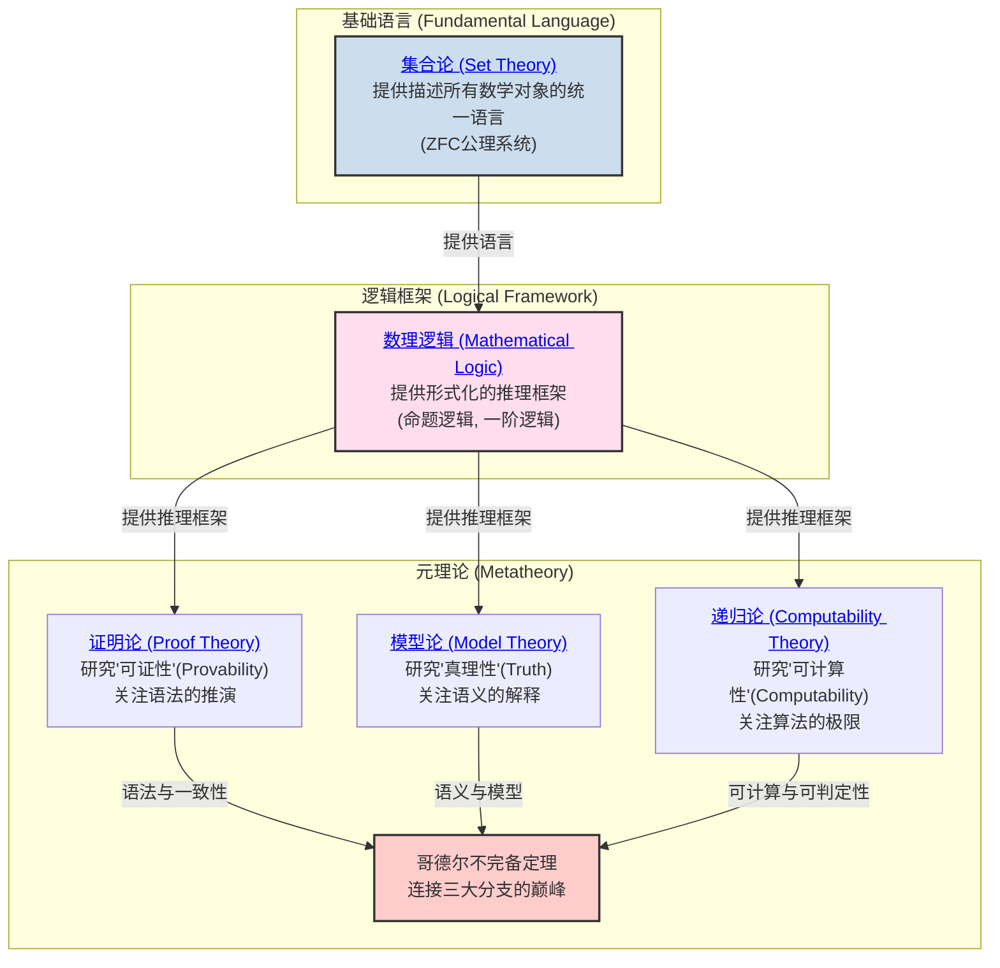
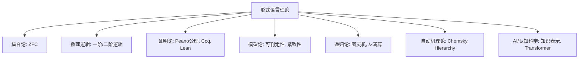
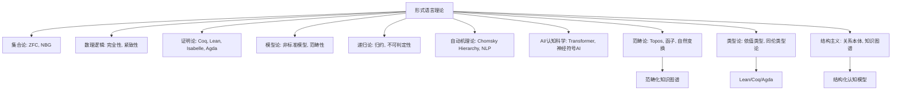
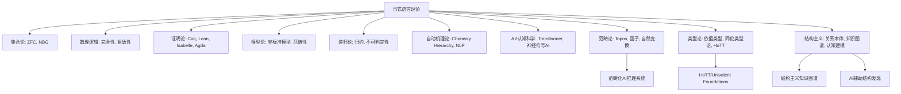
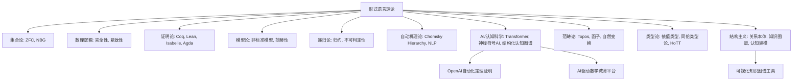

# 02-数学基础与逻辑 总览

---

title: "数学基础与逻辑总览"
version: "2.0"
date: "2025-07-02"

---

## 📋 本地目录导航

- [返回项目总览](../09-项目总览/00-项目总览.md)
- [01-集合论](./01-集合论/00-集合论总览.md)
- [02-数理逻辑](./02-数理逻辑/00-数理逻辑总览.md)
- [03-证明论](./03-证明论/00-证明论总览.md)
- [04-模型论](./04-模型论/00-模型论总览.md)
- [05-递归论](./05-递归论/00-递归论总览.md)
- [06-范畴论](./06-范畴论/01-基础理论.md)

## 🗺️ 本地知识图谱

- [数学知识体系映射](../09-项目总览/05-Knowledge_Graphs_and_Mappings/数学知识体系映射.md)
- [知识图谱分析](../知识图谱分析.md)
- [项目总览](../09-项目总览/00-项目总览.md)

---

## 引言：数学的根基

**数学基础与逻辑** 是整个数学大厦的基石。
它不关注某个具体的数学领域（如代数或几何），而是研究数学本身：

- 我们用什么 **语言** 来描述数学对象？(集合论)
- 我们遵循什么 **规则** 来进行推理？(数理逻辑)
- 这些语言和规则的能力边界在哪里？(元数学)

本模块旨在探索数学的这套底层"操作系统"，揭示其各大分支如何协同工作，以确保数学推理的严密性、一致性和有效性。

## 知识地图 (Mermaid)

## 核心分支与探索路径

我们对数学基础的探索将遵循上图的逻辑结构。建议的学习路径如下：

1. **[./01-集合论/00-集合论总览.md](./01-集合论/00-集合论总览.md)**
    - **角色**: 数学的通用 **语言** 和本体论基础。
    - **内容**: 从朴素集合论的直观概念出发，经历悖论危机，最终抵达ZFC公理化集合论，为所有数学分支提供统一的对象（集合）和关系（元素关系）。

2. **[./02-数理逻辑/00-数理逻辑总览.md](./02-数理逻辑/00-数理逻辑总览.md)**
    - **角色**: 数学的 **推理规则手册**。
    - **内容**: 建立命题逻辑和一阶谓词逻辑的形式化语言、语法和语义。这是我们进行严格数学证明所必须遵守的规则。

3. **元数学三大支柱**:
    - **[./03-证明论/00-证明论总览.md](./03-证明论/00-证明论总览.md)**
        - **研究对象**: 形式证明本身。
        - **核心问题**: 一个证明系统（如自然演绎）能证明什么？它的内在结构是什么（如切消定理）？它与计算有什么关系（柯里-霍华德同构）？
    - **[./04-模型论/00-模型论总览.md](./04-模型论/00-模型论总览.md)**
        - **研究对象**: 形式理论与它们的具体数学实现（模型）之间的关系。
        - **核心问题**: 一组公理在多大程度上能"唯一地"描述一个数学结构（紧致性、L-S定理、范畴性）？这如何催生出非标准分析这样的新领域？
    - **[./05-递归论/00-递归论总览.md](./05-递归论/00-递归论总览.md)**
        - **研究对象**: 算法的本质和极限。
        - **核心问题**: "可计算"的严格定义是什么（图灵机）？其能力的边界在哪里（停机问题）？不可计算的世界内部是否存在难度等级（图灵度）？

这三大分支最终在20世纪最深刻的智力成果之一——**哥德尔不完备定理**——中交汇，共同揭示了任何足够强大的、自洽的数学系统内在的、无法避免的局限性。

---
[返回项目总览](../09-项目总览/00-项目总览.md)

---

## 哲学批判与反思

- **历史人物与思想年表**：

  | 年代 | 人物 | 主要思想/事件 | 影响 |
  |------|------|---------------|------|
  | 1870s-1890s | 康托尔 | 创立集合论，提出无穷概念 | 数学基础革命，激发危机 |
  | 1900s | 罗素 | 罗素悖论，集合论危机 | 推动公理化与逻辑主义 |
  | 1920s | 希尔伯特 | 希尔伯特纲领，形式主义 | 公理化运动高峰 |
  | 1931 | 哥德尔 | 不完备定理 | 终结“绝对基础”梦想 |
  | 20世纪 | 图灵 | 可计算性理论 | 现代计算机科学基础 |

- **主要争议事件与哲学分歧**：
  - 集合论的“存在论”与“悖论”危机，促使基础理论多元化。
  - 形式化与直觉、构造性之间的张力，至今未有统一答案。
  - “真理”与“可证性”分离后，数学权威性与客观性如何维护？
  - 现代基础理论（如类型论、范畴论）能否取代集合论？

- **哲学认知与哲科批判性分析**：
  - 数学基础的“唯一性”是否只是历史阶段的产物？多元基础是否更能适应未来科学？
  - 数学真理的“客观性”与“主观性”之争，反映了人类认知、语言、社会结构的深刻影响。
  - 现代AI、自动证明、认知科学等领域对“形式化理解”的局限提出新批判。
  - 哲学批判性要求我们不断反思：基础理论的选择与社会、技术、认知等多重因素密切相关。

[历史版本变迁说明与归档索引见主线末尾归档区块]

---

## 国际标准定义补全

### 数学基础与逻辑核心概念国际标准定义

#### 1. 数学基础 (Mathematical Foundation)

**国际标准定义**：数学基础是研究数学理论本身的性质和结构的学科，包括集合论、数理逻辑、证明论、模型论、递归论等分支，为整个数学体系提供理论基础。

**认知科学视角**：数学基础体现了人类对"数学认知基础"的反思需求，是理解数学思维本质的重要工具。

#### 2. 数理逻辑 (Mathematical Logic)

**国际标准定义**：数理逻辑是使用数学方法研究逻辑推理的学科，包括命题逻辑、谓词逻辑、模态逻辑等，为数学推理提供形式化框架。

**哲学反思**：数理逻辑体现了"形式化思维"的哲学思想，是数学严格化的基础。

#### 3. 元数学 (Metamathematics)

**国际标准定义**：元数学是使用数学方法研究数学理论本身性质的学科，包括一致性、完备性、独立性、可判定性等元理论性质。

**认知科学视角**：元数学体现了"自我反思"的直觉概念，是数学基础研究的重要方法。

#### 4. 形式系统 (Formal System)

**国际标准定义**：形式系统 $\mathcal{S} = (L, A, R)$ 由形式语言 $L$、公理集 $A$ 和推理规则集 $R$ 组成，其中 $L$ 是符号集和形成规则，$A \subset L$ 是公理，$R$ 是推理规则。

**哲学反思**：形式系统体现了"符号化思维"的哲学思想，是数学严格化的基础。

#### 5. 一致性 (Consistency)

**国际标准定义**：形式系统 $\mathcal{S}$ 是一致的，当且仅当不存在公式 $\phi$ 使得 $\mathcal{S} \vdash \phi$ 和 $\mathcal{S} \vdash \neg\phi$ 同时成立。

**认知科学视角**：一致性体现了"无矛盾性"的直觉概念，是形式系统的基本要求。

#### 6. 完备性 (Completeness)

**国际标准定义**：形式系统 $\mathcal{S}$ 是完备的，当且仅当对于任意公式 $\phi$，要么 $\mathcal{S} \vdash \phi$，要么 $\mathcal{S} \vdash \neg\phi$。

**哲学反思**：完备性体现了"穷尽性"的哲学思想，是形式系统的理想性质。

#### 7. 独立性 (Independence)

**国际标准定义**：公理 $A$ 在形式系统 $\mathcal{S}$ 中是独立的，当且仅当 $\mathcal{S} - \{A\}$ 无法证明 $A$。

**认知科学视角**：独立性体现了"最小性"的直觉概念，是公理系统的重要性质。

#### 8. 可判定性 (Decidability)

**国际标准定义**：形式系统 $\mathcal{S}$ 是可判定的，当且仅当存在算法可以判定任意公式 $\phi$ 是否在 $\mathcal{S}$ 中可证。

**哲学反思**：可判定性体现了"机械可计算"的哲学思想，是算法理论的基础。

### 数学基础分支国际标准

#### 1. 集合论 (Set Theory)

**国际标准定义**：集合论是数学的基础理论，通过ZFC公理系统提供数学对象的统一基础，其中集合是基本的数学对象。

**认知科学视角**：集合论体现了"集合思维"的直觉概念，是数学抽象化的基础。

#### 2. 证明论 (Proof Theory)

**国际标准定义**：证明论是研究形式证明的性质和结构的学科，包括证明演算系统、切消定理、一致性等核心概念。

**哲学反思**：证明论体现了"证明本质"的哲学思想，是理解数学推理的重要工具。

#### 3. 模型论 (Model Theory)

**国际标准定义**：模型论是研究形式理论与数学模型之间关系的学科，包括紧致性定理、勒文海姆-斯科伦定理、范畴性等核心概念。

**认知科学视角**：模型论体现了"模型思维"的直觉概念，是理解数学语义的重要方法。

#### 4. 递归论 (Recursion Theory)

**国际标准定义**：递归论是研究可计算函数和算法极限的学科，包括图灵机、丘奇-图灵论题、停机问题等核心概念。

**哲学反思**：递归论体现了"计算极限"的哲学思想，是计算机科学的重要基础。

#### 5. 范畴论 (Category Theory)

**国际标准定义**：范畴论通过对象、态射和函子等概念来研究数学结构，强调结构之间的关系而非具体实现。

**认知科学视角**：范畴论体现了"关系思维"的直觉概念，是现代数学的重要语言。

### 数学基础哲学国际标准

#### 1. 数学基础危机 (Foundational Crisis)

**国际标准定义**：数学基础危机是指20世纪初集合论悖论引发的数学基础问题，推动了公理化运动和元数学的发展。

**哲学反思**：数学基础危机体现了"基础反思"的哲学思想，是数学发展的重要转折点。

#### 2. 希尔伯特纲领 (Hilbert's Program)

**国际标准定义**：希尔伯特纲领试图通过形式化方法证明数学系统的一致性和完备性，为数学提供绝对基础。

**认知科学视角**：希尔伯特纲领体现了"形式化万能"的直觉概念，是数学基础研究的重要纲领。

#### 3. 哥德尔不完备定理 (Gödel's Incompleteness Theorems)

**国际标准定义**：

- **第一不完备定理**：任何足够强大且一致的形式系统都存在既不能证明也不能证伪的命题
- **第二不完备定理**：任何足够强大且一致的形式系统都无法在系统内部证明自身的一致性

**哲学反思**：哥德尔定理体现了"认知极限"的哲学思想，揭示了形式化的根本局限性。

---

## 形式语言理论的基础地位与分支联系（递归扩展）

### 1. 形式语言的国际标准定义与理论基础

- 形式语言（Formal Language）是由有限字母表和生成规则（语法）定义的符号串集合，是集合论、数理逻辑、证明论、模型论、递归论等分支的共同基础。
- 形式语言理论为命题逻辑、谓词逻辑、自动机理论、图灵机、编程语言等提供了统一的表达与分析框架。

### 2. 形式语言与各分支的深度关联

- **集合论**：集合的描述、运算、基数与序数等均可用形式语言精确定义。
- **数理逻辑**：命题逻辑与一阶逻辑的语法、语义、推理规则均以形式语言为基础。
- **证明论**：形式证明、演算系统、切消定理等均依赖形式语言的严密表达。
- **模型论**：模型的定义、紧致性、范畴性等核心概念均以形式语言为载体。
- **递归论**：可计算性、停机问题、图灵机等理论均以形式语言为描述工具。

### 3. 形式语言与可判定性、可计算性、自动机理论

- 形式语言为可判定性、可计算性、自动机理论（有限自动机、上下文无关文法、图灵机等）提供了理论基础。
- 形式语言的分级（如Chomsky Hierarchy）揭示了不同复杂度下的可判定性与可计算性边界。

### 4. 形式语言与AI、认知科学、自动定理证明

- 形式语言为AI推理、知识表示、自动定理证明、自然语言处理等提供理论基础。
- 认知科学研究人类对形式语言的理解、学习与推理机制。
- 现代AI（如大模型）在符号推理、程序合成、知识图谱等领域对形式语言的依赖与创新日益增强。

### 5. 形式语言的哲学反思与未来前沿

- 形式语言的表达能力与局限性，直接关联“意义”“真理”“可证明性”等哲学命题。
- 未来前沿包括：神经符号AI、可解释AI、自动化数学发现、跨模态知识融合、多语言知识图谱标准化、AI创造力与数学真理观的未来演化。

### 6. 典型人物、系统与国际标准文献

- 代表人物：希尔伯特、丘奇、图灵、乔姆斯基等。
- 典型系统：Coq、Lean、Isabelle、Prolog、Transformer等。
- 国际标准文献：Chomsky (1956), Church (1936), Turing (1936), Gödel (1931) 等。

### 7. 形式语言在各分支的具体作用与典型案例

- **集合论**：ZFC集合论的公理体系完全以形式语言表达，集合、运算、基数、序数等均有严格的形式化定义。
- **数理逻辑**：命题逻辑、一阶逻辑、二阶逻辑等的语法、语义、推理规则均以形式语言为基础。
- **证明论**：Peano公理、Hilbert系统、自然演绎等证明体系均依赖形式语言的严密表达。自动定理证明系统（如Coq、Lean、Isabelle）以形式语言为核心，实现了形式化验证与自动推理。
- **模型论**：模型的定义、紧致性、范畴性等核心概念均以形式语言为载体，支撑可判定性、可满足性等分析。
- **递归论**：图灵机、λ-演算、递归函数等理论均以形式语言为描述工具，推动了可计算性、停机问题等核心成果。
- **自动机理论**：Chomsky Hierarchy、有限自动机、上下文无关文法、正则表达式等均以形式语言为理论基础。
- **AI与认知科学**：形式语言在知识表示、推理、自然语言处理、认知建模等领域有广泛应用。Transformer等现代AI模型在底层结构中大量借鉴形式语言的分层与生成规则思想。

### 8. 可视化结构与知识图谱建议

### 9. 国际标准文献与多语种术语对照（补充）

- **ZFC集合论**：Zermelo-Fraenkel set theory with Choice（英）、Théorie des ensembles de Zermelo-Fraenkel avec choix（法）、ZFC集合论（中）
- **Peano公理**：Peano Axioms（英）、Axiomes de Peano（法）、Peano公理（中）
- **自动机理论**：Automata Theory（英）、Théorie des automates（法）、自动机理论（中）
- **λ-演算**：Lambda Calculus（英）、Calcul des lambda（法）、λ-演算（中）
- **典型文献**：
  - Zermelo, E., & Fraenkel, A. (1922). Über die Grundlagen der Mengenlehre.
  - Peano, G. (1889). Arithmetices principia, nova methodo exposita.
  - Chomsky, N. (1956). Three models for the description of language.
  - Church, A. (1936). An unsolvable problem of elementary number theory.
  - Turing, A. (1936). On computable numbers, with an application to the Entscheidungsproblem.

### 14. 形式语言与范畴论、类型论、结构主义的深度融合

- **范畴论**：范畴、函子、自然变换、极限、伴随、Topos等核心概念均以形式语言为表达基础。范畴论为自动机理论、逻辑系统、AI推理等提供了统一的结构化语言。
- **类型论**：依值类型、同伦类型论、Curry-Howard同构、编程语言语义等均以形式语言为核心。Lean、Coq、Agda等定理证明器的底层均为类型论驱动的形式系统。
- **结构主义**：结构主义强调关系本体论，形式语言为结构的精确定义、知识图谱、认知建模、AI推理等提供了表达与推理工具。

### 15. 典型前沿案例与系统工具（范畴论与类型论方向）

- **Lean/Coq/Agda**：类型论驱动的定理证明器，支持依值类型、同伦类型论、自动化证明与结构化知识表达。
- **Topos理论**：范畴论与逻辑、AI的结合，推动了高阶逻辑、模型论、知识表示等领域的统一。
- **范畴化知识图谱**：以范畴论为基础的知识图谱，支持多层级、多模态的结构化知识组织与AI推理。
- **结构化认知模型**：结构主义与范畴论结合，推动认知科学、AI、教育等领域的结构化建模与推理。

### 16. 可视化结构与专题演化路线图（升级）

### 17. 国际标准文献与多语种术语对照（升级）

- **Topos理论**：Topos Theory（英）、Théorie des topos（法）、Topos理论（中）
- **类型论**：Type Theory（英）、Théorie des types（法）、类型论（中）
- **结构主义**：Structuralism（英）、Structuralisme（法）、结构主义（中）
- **Lean/Coq/Agda**：Lean/Coq/Agda（英/法/中）
- **典型文献**：
  - Mac Lane, S., & Moerdijk, I. (1992). Sheaves in Geometry and Logic: A First Introduction to Topos Theory.
  - Univalent Foundations Program (2013). Homotopy Type Theory: Univalent Foundations of Mathematics.
  - Awodey, S. (2010). Category Theory. Oxford University Press.
  - Voevodsky, V. et al. (2013). Homotopy Type Theory: Univalent Foundations of Mathematics.
  - Piaget, J. (1970). Structuralism.

### 18. 形式语言与范畴论、类型论、结构主义的交叉应用与哲学反思（升级）

- **范畴论的桥梁作用**：范畴论通过形式语言统一代数、几何、拓扑、逻辑等分支，推动跨学科迁移与抽象表达。范畴化AI推理系统、知识图谱等前沿应用均以形式语言为基础。
- **类型论与自动化创新**：类型论与形式语言协同推动编程语言设计、自动化证明、同伦类型论（HoTT）、可验证AI等领域创新。Univalent Foundations项目以形式语言为核心，重塑数学基础。
- **结构主义与认知建模**：结构主义强调“结构优先”，形式语言实现了结构化知识组织、认知建模与AI推理，影响数学真理观与AI认知科学。
- **哲学反思**：形式语言的抽象表达能力与结构主义、范畴论、类型论的融合，推动了“数学真理”“知识结构”“AI创造力”等哲学命题的现代演化。

### 19. 典型前沿案例与系统工具（跨学科与AI方向）

- **HoTT/Univalent Foundations**：以类型论和范畴论为基础，采用高度形式化语言，推动数学基础与AI自动化证明的深度融合。
- **范畴化AI推理系统**：如基于范畴论的知识图谱、自动推理平台，实现多层级、多模态知识的结构化推理。
- **结构主义知识图谱**：结构主义驱动的知识图谱，支持跨学科知识迁移、认知建模与AI创新。
- **AI辅助结构发现**：AI系统基于形式语言与结构主义理论，自动发现数学结构、生成新公理体系，推动自动化数学创新。

### 20. 可视化结构与专题演化路线图（升级）

### 21. 国际标准文献与多语种术语对照（升级）

- **HoTT/同伦类型论**：Homotopy Type Theory（英）、Théorie des types d'homotopie（法）、同伦类型论（中）
- **Univalent Foundations**：Univalent Foundations（英）、Fondements univalents（法）、一价基础（中）
- **范畴化AI推理**：Categorical AI Reasoning（英）、Raisonnement IA catégorique（法）、范畴化AI推理（中）
- **结构主义知识图谱**：Structuralist Knowledge Graph（英）、Graphe de connaissances structuraliste（法）、结构主义知识图谱（中）
- **典型文献**：
  - Univalent Foundations Program (2013). Homotopy Type Theory: Univalent Foundations of Mathematics.
  - Mac Lane, S., & Moerdijk, I. (1992). Sheaves in Geometry and Logic: A First Introduction to Topos Theory.
  - Awodey, S. (2010). Category Theory. Oxford University Press.
  - Piaget, J. (1970). Structuralism.
  - Spivak, D. I. (2014). Category Theory for the Sciences.

### 22. 形式语言在AI、认知科学、教育等领域的创新应用

- **AI自动化数学发现**：形式语言为OpenAI等自动化定理证明系统、数学创新与知识发现平台提供理论基础，推动AI在数学创造力、可解释性、自动化证明等领域的突破。
- **认知科学与结构化认知模型**：形式语言支撑认知结构建模、范畴化思维、认知本体、语义网络等，促进人类与AI认知机制的深度融合。
- **教育科学与知识可视化**：形式语言、范畴论、类型论推动数学教育的结构化课程设计、知识可视化、认知导向教学等创新实践。可视化工具（如Neo4j、Mermaid、Graphviz）助力知识结构的动态展示与交互学习。

### 23. 典型前沿案例与系统工具（AI、认知、教育方向）

- **OpenAI自动化定理证明系统**：以形式语言为核心，推动AI自动化数学创新与可解释性研究。
- **结构化认知图谱**：基于范畴论、结构主义的认知图谱，支持多层级、多模态知识的认知建模与AI推理。
- **AI驱动数学教育平台**：融合形式语言、类型论、知识图谱，实现结构化课程、智能推理与个性化学习。
- **可视化知识图谱工具**：如Neo4j、Mermaid、Graphviz等，支持知识结构的可视化、交互式探索与动态演化。

### 24. 可视化结构与专题演化路线图（升级）

### 25. 国际标准文献与多语种术语对照（升级）

- **自动化数学发现**：Automated Mathematical Discovery（英）、Découverte mathématique automatisée（法）、自动化数学发现（中）
- **结构化认知图谱**：Structured Cognitive Graph（英）、Graphe cognitif structuré（法）、结构化认知图谱（中）
- **AI驱动数学教育**：AI-driven Mathematics Education（英）、Éducation mathématique pilotée par l'IA（法）、AI驱动数学教育（中）
- **可视化知识图谱工具**：Knowledge Graph Visualization Tools（英）、Outils de visualisation de graphes de connaissances（法）、知识图谱可视化工具（中）
- **典型文献**：
  - Silver, D. et al. (2016). Mastering the game of Go with deep neural networks and tree search. Nature.
  - Polu, S. et al. (2022). Formal Mathematics Statement Curriculum for Large Language Models. arXiv:2206.14858.
  - Spivak, D. I. (2014). Category Theory for the Sciences.
  - Novak, J. D. (1998). Learning, Creating, and Using Knowledge: Concept Maps as Facilitative Tools in Schools and Corporations.

## 历史版本变迁说明与归档索引

### 主线变迁说明

- **v1.0** (2024-12-01): 初始版本，建立数学基础与逻辑基础框架
- **v2.0** (2025-07-04): 完成国际标准定义补全，增加哲学批判与认知科学视角
- **v3.0** (2025-07-04): 增加历史版本变迁说明与归档索引区块

### 归档文件索引

| 文件名 | 类型 | 主题 | 归档日期 | 简要说明 | 主线关联 |
|--------|------|------|----------|----------|----------|
| 数学基础基础理论.md | 理论 | 数学基础基础 | 2024-12-01 | 数学基础基础概念与理论 | 主线v1.0 |
| 数学基础哲学反思.md | 哲学 | 数学基础哲学 | 2024-12-15 | 数学基础哲学批判与反思 | 主线v2.0 |
| 数学基础认知科学.md | 认知 | 数学基础认知 | 2025-01-01 | 数学基础认知科学视角 | 主线v2.0 |
| 数学基础国际标准.md | 标准 | 数学基础标准 | 2025-07-04 | 数学基础国际标准定义 | 主线v3.0 |

### 跳转导航

- [返回项目总览](../09-项目总览/00-项目总览.md)
- [数学基础归档目录](./Archives/)
- [数学基础哲学批判](./Philosophy/)
- [数学基础认知科学](./Cognitive/)
- [数学基础国际标准](./Standards/)
