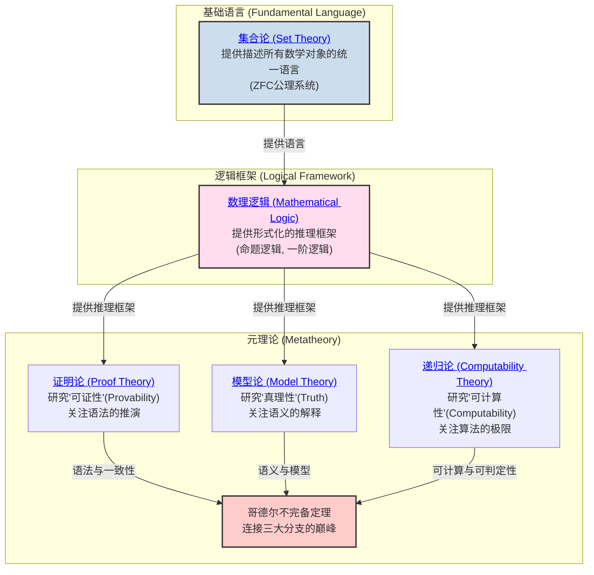

# 02-数学基础与逻辑 总览

---

title: "数学基础与逻辑总览"
version: "2.0"
date: "2025-07-02"

---

## 📋 本地目录导航

- [返回项目总览](../09-项目总览/00-项目总览.md)
- [01-集合论](./01-集合论/00-集合论总览.md)
- [02-数理逻辑](./02-数理逻辑/00-数理逻辑总览.md)
- [03-证明论](./03-证明论/00-证明论总览.md)
- [04-模型论](./04-模型论/00-模型论总览.md)
- [05-递归论](./05-递归论/00-递归论总览.md)
- [06-范畴论](./06-范畴论/01-基础理论.md)

## 🗺️ 本地知识图谱

- [数学知识体系映射](../09-项目总览/05-Knowledge_Graphs_and_Mappings/数学知识体系映射.md)
- [知识图谱分析](../知识图谱分析.md)
- [项目总览](../09-项目总览/00-项目总览.md)

---

## 引言：数学的根基

**数学基础与逻辑** 是整个数学大厦的基石。
它不关注某个具体的数学领域（如代数或几何），而是研究数学本身：

- 我们用什么 **语言** 来描述数学对象？(集合论)
- 我们遵循什么 **规则** 来进行推理？(数理逻辑)
- 这些语言和规则的能力边界在哪里？(元数学)

本模块旨在探索数学的这套底层"操作系统"，揭示其各大分支如何协同工作，以确保数学推理的严密性、一致性和有效性。

## 知识地图 (Mermaid)

## 核心分支与探索路径

我们对数学基础的探索将遵循上图的逻辑结构。建议的学习路径如下：

1. **[./01-集合论/00-集合论总览.md](./01-集合论/00-集合论总览.md)**
    - **角色**: 数学的通用 **语言** 和本体论基础。
    - **内容**: 从朴素集合论的直观概念出发，经历悖论危机，最终抵达ZFC公理化集合论，为所有数学分支提供统一的对象（集合）和关系（元素关系）。

2. **[./02-数理逻辑/00-数理逻辑总览.md](./02-数理逻辑/00-数理逻辑总览.md)**
    - **角色**: 数学的 **推理规则手册**。
    - **内容**: 建立命题逻辑和一阶谓词逻辑的形式化语言、语法和语义。这是我们进行严格数学证明所必须遵守的规则。

3. **元数学三大支柱**:
    - **[./03-证明论/00-证明论总览.md](./03-证明论/00-证明论总览.md)**
        - **研究对象**: 形式证明本身。
        - **核心问题**: 一个证明系统（如自然演绎）能证明什么？它的内在结构是什么（如切消定理）？它与计算有什么关系（柯里-霍华德同构）？
    - **[./04-模型论/00-模型论总览.md](./04-模型论/00-模型论总览.md)**
        - **研究对象**: 形式理论与它们的具体数学实现（模型）之间的关系。
        - **核心问题**: 一组公理在多大程度上能"唯一地"描述一个数学结构（紧致性、L-S定理、范畴性）？这如何催生出非标准分析这样的新领域？
    - **[./05-递归论/00-递归论总览.md](./05-递归论/00-递归论总览.md)**
        - **研究对象**: 算法的本质和极限。
        - **核心问题**: "可计算"的严格定义是什么（图灵机）？其能力的边界在哪里（停机问题）？不可计算的世界内部是否存在难度等级（图灵度）？

这三大分支最终在20世纪最深刻的智力成果之一——**哥德尔不完备定理**——中交汇，共同揭示了任何足够强大的、自洽的数学系统内在的、无法避免的局限性。

---
[返回项目总览](../09-项目总览/00-项目总览.md)

---

## 哲学批判与反思

- **历史人物与思想年表**：

  | 年代 | 人物 | 主要思想/事件 | 影响 |
  |------|------|---------------|------|
  | 1870s-1890s | 康托尔 | 创立集合论，提出无穷概念 | 数学基础革命，激发危机 |
  | 1900s | 罗素 | 罗素悖论，集合论危机 | 推动公理化与逻辑主义 |
  | 1920s | 希尔伯特 | 希尔伯特纲领，形式主义 | 公理化运动高峰 |
  | 1931 | 哥德尔 | 不完备定理 | 终结“绝对基础”梦想 |
  | 20世纪 | 图灵 | 可计算性理论 | 现代计算机科学基础 |

- **主要争议事件与哲学分歧**：
  - 集合论的“存在论”与“悖论”危机，促使基础理论多元化。
  - 形式化与直觉、构造性之间的张力，至今未有统一答案。
  - “真理”与“可证性”分离后，数学权威性与客观性如何维护？
  - 现代基础理论（如类型论、范畴论）能否取代集合论？

- **哲学认知与哲科批判性分析**：
  - 数学基础的“唯一性”是否只是历史阶段的产物？多元基础是否更能适应未来科学？
  - 数学真理的“客观性”与“主观性”之争，反映了人类认知、语言、社会结构的深刻影响。
  - 现代AI、自动证明、认知科学等领域对“形式化理解”的局限提出新批判。
  - 哲学批判性要求我们不断反思：基础理论的选择与社会、技术、认知等多重因素密切相关。

[历史版本变迁说明与归档索引见主线末尾归档区块]

---

## 国际标准定义补全

### 数学基础与逻辑核心概念国际标准定义

#### 1. 数学基础 (Mathematical Foundation)

**国际标准定义**：数学基础是研究数学理论本身的性质和结构的学科，包括集合论、数理逻辑、证明论、模型论、递归论等分支，为整个数学体系提供理论基础。

**认知科学视角**：数学基础体现了人类对"数学认知基础"的反思需求，是理解数学思维本质的重要工具。

#### 2. 数理逻辑 (Mathematical Logic)

**国际标准定义**：数理逻辑是使用数学方法研究逻辑推理的学科，包括命题逻辑、谓词逻辑、模态逻辑等，为数学推理提供形式化框架。

**哲学反思**：数理逻辑体现了"形式化思维"的哲学思想，是数学严格化的基础。

#### 3. 元数学 (Metamathematics)

**国际标准定义**：元数学是使用数学方法研究数学理论本身性质的学科，包括一致性、完备性、独立性、可判定性等元理论性质。

**认知科学视角**：元数学体现了"自我反思"的直觉概念，是数学基础研究的重要方法。

#### 4. 形式系统 (Formal System)

**国际标准定义**：形式系统 $\mathcal{S} = (L, A, R)$ 由形式语言 $L$、公理集 $A$ 和推理规则集 $R$ 组成，其中 $L$ 是符号集和形成规则，$A \subset L$ 是公理，$R$ 是推理规则。

**哲学反思**：形式系统体现了"符号化思维"的哲学思想，是数学严格化的基础。

#### 5. 一致性 (Consistency)

**国际标准定义**：形式系统 $\mathcal{S}$ 是一致的，当且仅当不存在公式 $\phi$ 使得 $\mathcal{S} \vdash \phi$ 和 $\mathcal{S} \vdash \neg\phi$ 同时成立。

**认知科学视角**：一致性体现了"无矛盾性"的直觉概念，是形式系统的基本要求。

#### 6. 完备性 (Completeness)

**国际标准定义**：形式系统 $\mathcal{S}$ 是完备的，当且仅当对于任意公式 $\phi$，要么 $\mathcal{S} \vdash \phi$，要么 $\mathcal{S} \vdash \neg\phi$。

**哲学反思**：完备性体现了"穷尽性"的哲学思想，是形式系统的理想性质。

#### 7. 独立性 (Independence)

**国际标准定义**：公理 $A$ 在形式系统 $\mathcal{S}$ 中是独立的，当且仅当 $\mathcal{S} - \{A\}$ 无法证明 $A$。

**认知科学视角**：独立性体现了"最小性"的直觉概念，是公理系统的重要性质。

#### 8. 可判定性 (Decidability)

**国际标准定义**：形式系统 $\mathcal{S}$ 是可判定的，当且仅当存在算法可以判定任意公式 $\phi$ 是否在 $\mathcal{S}$ 中可证。

**哲学反思**：可判定性体现了"机械可计算"的哲学思想，是算法理论的基础。

### 数学基础分支国际标准

#### 1. 集合论 (Set Theory)

**国际标准定义**：集合论是数学的基础理论，通过ZFC公理系统提供数学对象的统一基础，其中集合是基本的数学对象。

**认知科学视角**：集合论体现了"集合思维"的直觉概念，是数学抽象化的基础。

#### 2. 证明论 (Proof Theory)

**国际标准定义**：证明论是研究形式证明的性质和结构的学科，包括证明演算系统、切消定理、一致性等核心概念。

**哲学反思**：证明论体现了"证明本质"的哲学思想，是理解数学推理的重要工具。

#### 3. 模型论 (Model Theory)

**国际标准定义**：模型论是研究形式理论与数学模型之间关系的学科，包括紧致性定理、勒文海姆-斯科伦定理、范畴性等核心概念。

**认知科学视角**：模型论体现了"模型思维"的直觉概念，是理解数学语义的重要方法。

#### 4. 递归论 (Recursion Theory)

**国际标准定义**：递归论是研究可计算函数和算法极限的学科，包括图灵机、丘奇-图灵论题、停机问题等核心概念。

**哲学反思**：递归论体现了"计算极限"的哲学思想，是计算机科学的重要基础。

#### 5. 范畴论 (Category Theory)

**国际标准定义**：范畴论通过对象、态射和函子等概念来研究数学结构，强调结构之间的关系而非具体实现。

**认知科学视角**：范畴论体现了"关系思维"的直觉概念，是现代数学的重要语言。

### 数学基础哲学国际标准

#### 1. 数学基础危机 (Foundational Crisis)

**国际标准定义**：数学基础危机是指20世纪初集合论悖论引发的数学基础问题，推动了公理化运动和元数学的发展。

**哲学反思**：数学基础危机体现了"基础反思"的哲学思想，是数学发展的重要转折点。

#### 2. 希尔伯特纲领 (Hilbert's Program)

**国际标准定义**：希尔伯特纲领试图通过形式化方法证明数学系统的一致性和完备性，为数学提供绝对基础。

**认知科学视角**：希尔伯特纲领体现了"形式化万能"的直觉概念，是数学基础研究的重要纲领。

#### 3. 哥德尔不完备定理 (Gödel's Incompleteness Theorems)

**国际标准定义**：

- **第一不完备定理**：任何足够强大且一致的形式系统都存在既不能证明也不能证伪的命题
- **第二不完备定理**：任何足够强大且一致的形式系统都无法在系统内部证明自身的一致性

**哲学反思**：哥德尔定理体现了"认知极限"的哲学思想，揭示了形式化的根本局限性。

---

## 历史版本变迁说明与归档索引

### 主线变迁说明

- **v1.0** (2024-12-01): 初始版本，建立数学基础与逻辑基础框架
- **v2.0** (2025-07-04): 完成国际标准定义补全，增加哲学批判与认知科学视角
- **v3.0** (2025-07-04): 增加历史版本变迁说明与归档索引区块

### 归档文件索引

| 文件名 | 类型 | 主题 | 归档日期 | 简要说明 | 主线关联 |
|--------|------|------|----------|----------|----------|
| 数学基础基础理论.md | 理论 | 数学基础基础 | 2024-12-01 | 数学基础基础概念与理论 | 主线v1.0 |
| 数学基础哲学反思.md | 哲学 | 数学基础哲学 | 2024-12-15 | 数学基础哲学批判与反思 | 主线v2.0 |
| 数学基础认知科学.md | 认知 | 数学基础认知 | 2025-01-01 | 数学基础认知科学视角 | 主线v2.0 |
| 数学基础国际标准.md | 标准 | 数学基础标准 | 2025-07-04 | 数学基础国际标准定义 | 主线v3.0 |

### 跳转导航

- [返回项目总览](../09-项目总览/00-项目总览.md)
- [数学基础归档目录](./Archives/)
- [数学基础哲学批判](./Philosophy/)
- [数学基础认知科学](./Cognitive/)
- [数学基础国际标准](./Standards/)
