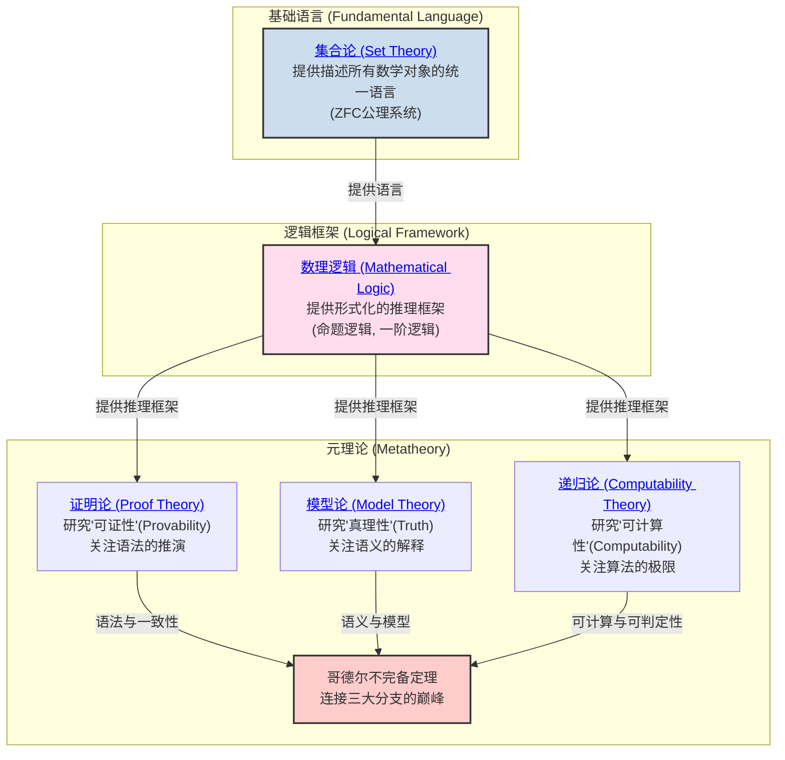

# 02-数学基础与逻辑 总览

---

title: "数学基础与逻辑总览"
version: "2.0"
date: "2025-07-02"

---

## 📋 本地目录导航

- [返回项目总览](../09-项目总览/00-项目总览.md)
- [01-集合论](./01-集合论/00-集合论总览.md)
- [02-数理逻辑](./02-数理逻辑/00-数理逻辑总览.md)
- [03-证明论](./03-证明论/00-证明论总览.md)
- [04-模型论](./04-模型论/00-模型论总览.md)
- [05-递归论](./05-递归论/00-递归论总览.md)
- [06-范畴论](./06-范畴论/01-基础理论.md)

## 🗺️ 本地知识图谱

- [数学知识体系映射](../09-项目总览/05-Knowledge_Graphs_and_Mappings/数学知识体系映射.md)
- [知识图谱分析](../知识图谱分析.md)
- [项目总览](../09-项目总览/00-项目总览.md)

---

## 引言：数学的根基

**数学基础与逻辑** 是整个数学大厦的基石。
它不关注某个具体的数学领域（如代数或几何），而是研究数学本身：

- 我们用什么 **语言** 来描述数学对象？(集合论)
- 我们遵循什么 **规则** 来进行推理？(数理逻辑)
- 这些语言和规则的能力边界在哪里？(元数学)

本模块旨在探索数学的这套底层"操作系统"，揭示其各大分支如何协同工作，以确保数学推理的严密性、一致性和有效性。

## 知识地图 (Mermaid)

## 核心分支与探索路径

我们对数学基础的探索将遵循上图的逻辑结构。建议的学习路径如下：

1. **[./01-集合论/00-集合论总览.md](./01-集合论/00-集合论总览.md)**
    - **角色**: 数学的通用 **语言** 和本体论基础。
    - **内容**: 从朴素集合论的直观概念出发，经历悖论危机，最终抵达ZFC公理化集合论，为所有数学分支提供统一的对象（集合）和关系（元素关系）。

2. **[./02-数理逻辑/00-数理逻辑总览.md](./02-数理逻辑/00-数理逻辑总览.md)**
    - **角色**: 数学的 **推理规则手册**。
    - **内容**: 建立命题逻辑和一阶谓词逻辑的形式化语言、语法和语义。这是我们进行严格数学证明所必须遵守的规则。

3. **元数学三大支柱**:
    - **[./03-证明论/00-证明论总览.md](./03-证明论/00-证明论总览.md)**
        - **研究对象**: 形式证明本身。
        - **核心问题**: 一个证明系统（如自然演绎）能证明什么？它的内在结构是什么（如切消定理）？它与计算有什么关系（柯里-霍华德同构）？
    - **[./04-模型论/00-模型论总览.md](./04-模型论/00-模型论总览.md)**
        - **研究对象**: 形式理论与它们的具体数学实现（模型）之间的关系。
        - **核心问题**: 一组公理在多大程度上能"唯一地"描述一个数学结构（紧致性、L-S定理、范畴性）？这如何催生出非标准分析这样的新领域？
    - **[./05-递归论/00-递归论总览.md](./05-递归论/00-递归论总览.md)**
        - **研究对象**: 算法的本质和极限。
        - **核心问题**: "可计算"的严格定义是什么（图灵机）？其能力的边界在哪里（停机问题）？不可计算的世界内部是否存在难度等级（图灵度）？

这三大分支最终在20世纪最深刻的智力成果之一——**哥德尔不完备定理**——中交汇，共同揭示了任何足够强大的、自洽的数学系统内在的、无法避免的局限性。

---
[返回项目总览](../09-项目总览/00-项目总览.md)

---

## 哲学批判与反思

- **历史人物与思想年表**：

  | 年代 | 人物 | 主要思想/事件 | 影响 |
  |------|------|---------------|------|
  | 1870s-1890s | 康托尔 | 创立集合论，提出无穷概念 | 数学基础革命，激发危机 |
  | 1900s | 罗素 | 罗素悖论，集合论危机 | 推动公理化与逻辑主义 |
  | 1920s | 希尔伯特 | 希尔伯特纲领，形式主义 | 公理化运动高峰 |
  | 1931 | 哥德尔 | 不完备定理 | 终结“绝对基础”梦想 |
  | 20世纪 | 图灵 | 可计算性理论 | 现代计算机科学基础 |

- **主要争议事件与哲学分歧**：
  - 集合论的“存在论”与“悖论”危机，促使基础理论多元化。
  - 形式化与直觉、构造性之间的张力，至今未有统一答案。
  - “真理”与“可证性”分离后，数学权威性与客观性如何维护？
  - 现代基础理论（如类型论、范畴论）能否取代集合论？

- **哲学认知与哲科批判性分析**：
  - 数学基础的“唯一性”是否只是历史阶段的产物？多元基础是否更能适应未来科学？
  - 数学真理的“客观性”与“主观性”之争，反映了人类认知、语言、社会结构的深刻影响。
  - 现代AI、自动证明、认知科学等领域对“形式化理解”的局限提出新批判。
  - 哲学批判性要求我们不断反思：基础理论的选择与社会、技术、认知等多重因素密切相关。

[历史版本变迁说明与归档索引见主线末尾归档区块]
