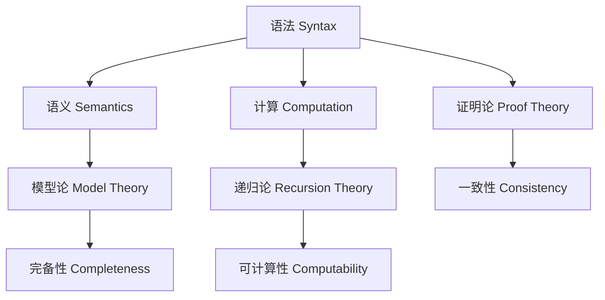

# 数理逻辑基础：模型论、递归论与证明论

## 目录

- [数理逻辑基础：模型论、递归论与证明论](#数理逻辑基础模型论递归论与证明论)
  - [目录](#目录)
  - [1. 引言](#1-引言)
    - [1.1 历史背景](#11-历史背景)
    - [1.2 核心思想](#12-核心思想)
    - [1.3 现代意义](#13-现代意义)
  - [2. 模型论基础](#2-模型论基础)
    - [2.1 形式语言与结构](#21-形式语言与结构)
    - [2.2 模型与满足关系](#22-模型与满足关系)
    - [2.3 主要定理](#23-主要定理)
  - [3. 递归论基础](#3-递归论基础)
    - [3.1 算法与可计算性](#31-算法与可计算性)
    - [3.2 计算模型](#32-计算模型)
    - [3.3 主要成果](#33-主要成果)
  - [4. 证明论基础](#4-证明论基础)
    - [4.1 形式证明系统](#41-形式证明系统)
    - [4.2 证明演算](#42-证明演算)
    - [4.3 主要成果](#43-主要成果)
  - [5. 逻辑分支间的关联](#5-逻辑分支间的关联)
  - [6. 应用与示例](#6-应用与示例)
  - [7. 历史发展](#7-历史发展)
  - [8. 现代发展](#8-现代发展)
  - [9. 参考文献](#9-参考文献)

---

## 1. 引言

### 1.1 历史背景

数理逻辑，也称为符号逻辑，是数学的一个分支，它利用形式化的方法研究数学推理的有效性、数学理论的基础和数学证明的性质。

**发展历程**：

1. **古典逻辑** (亚里士多德时代)
   - 三段论推理
   - 形式逻辑的萌芽

2. **现代逻辑** (19-20世纪)
   - 布尔代数
   - 弗雷格的逻辑主义
   - 罗素的类型论

3. **当代逻辑** (20世纪至今)
   - 模型论的发展
   - 递归论的建立
   - 证明论的完善

### 1.2 核心思想

数理逻辑的核心思想包括：

1. **形式化**：将推理过程转化为精确的符号操作
2. **语义解释**：为形式语言提供数学意义
3. **元数学研究**：研究形式系统本身的性质
4. **计算理论**：研究算法的本质和极限

### 1.3 现代意义

数理逻辑在现代具有重要应用：

1. **计算机科学**：程序验证、类型理论
2. **人工智能**：知识表示、自动推理
3. **数学基础**：集合论、范畴论
4. **哲学**：语言哲学、认知科学

## 2. 模型论基础

### 2.1 形式语言与结构

#### 2.1.1 形式语言

**定义 2.1** (一阶语言)
一阶语言 $\mathcal{L}$ 由以下部分组成：
- **逻辑符号**：$\neg, \land, \lor, \rightarrow, \leftrightarrow, \forall, \exists, =$
- **变量符号**：$x, y, z, \ldots$
- **常量符号**：$c_1, c_2, \ldots$
- **函数符号**：$f_1, f_2, \ldots$
- **关系符号**：$R_1, R_2, \ldots$

**定义 2.2** (项)
项的定义如下：
1. 变量和常量是项
2. 如果 $t_1, \ldots, t_n$ 是项，$f$ 是 $n$ 元函数符号，则 $f(t_1, \ldots, t_n)$ 是项

**定义 2.3** (公式)
公式的定义如下：
1. 如果 $t_1, \ldots, t_n$ 是项，$R$ 是 $n$ 元关系符号，则 $R(t_1, \ldots, t_n)$ 是原子公式
2. 如果 $\phi, \psi$ 是公式，则 $\neg \phi, \phi \land \psi, \phi \lor \psi, \phi \rightarrow \psi$ 是公式
3. 如果 $\phi$ 是公式，$x$ 是变量，则 $\forall x \phi, \exists x \phi$ 是公式

#### 2.1.2 结构

**定义 2.4** (结构)
语言 $\mathcal{L}$ 的结构 $\mathcal{M}$ 由以下部分组成：
- **论域**：非空集合 $M$
- **解释函数**：为每个符号提供解释
  - 常量 $c$ 解释为 $c^{\mathcal{M}} \in M$
  - 函数符号 $f$ 解释为 $f^{\mathcal{M}}: M^n \rightarrow M$
  - 关系符号 $R$ 解释为 $R^{\mathcal{M}} \subseteq M^n$

**示例**：群的结构

```haskell
-- Haskell中的群结构定义
data Group a = Group {
    carrier :: Set a,
    operation :: a -> a -> a,
    identity :: a,
    inverse :: a -> a
}

-- 群公理的验证
isGroup :: (Eq a, Show a) => Group a -> Bool
isGroup g = 
    associativity g &&
    identity_law g &&
    inverse_law g
  where
    associativity g = 
        all (\x y z -> 
            operation g (operation g x y) z == 
            operation g x (operation g y z)) 
        (carrier g)
    
    identity_law g = 
        all (\x -> 
            operation g (identity g) x == x &&
            operation g x (identity g) == x) 
        (carrier g)
    
    inverse_law g = 
        all (\x -> 
            operation g x (inverse g x) == identity g &&
            operation g (inverse g x) x == identity g) 
        (carrier g)
```

### 2.2 模型与满足关系

#### 2.2.1 赋值与满足

**定义 2.5** (赋值)
在结构 $\mathcal{M}$ 中的赋值是一个函数 $s: \text{Var} \rightarrow M$。

**定义 2.6** (项的解释)
项 $t$ 在结构 $\mathcal{M}$ 中关于赋值 $s$ 的解释 $t^{\mathcal{M}}[s]$ 定义如下：
1. 如果 $t$ 是变量 $x$，则 $t^{\mathcal{M}}[s] = s(x)$
2. 如果 $t$ 是常量 $c$，则 $t^{\mathcal{M}}[s] = c^{\mathcal{M}}$
3. 如果 $t = f(t_1, \ldots, t_n)$，则 $t^{\mathcal{M}}[s] = f^{\mathcal{M}}(t_1^{\mathcal{M}}[s], \ldots, t_n^{\mathcal{M}}[s])$

**定义 2.7** (满足关系)
结构 $\mathcal{M}$ 关于赋值 $s$ 满足公式 $\phi$，记作 $\mathcal{M} \models \phi[s]$，定义如下：

1. **原子公式**：$\mathcal{M} \models R(t_1, \ldots, t_n)[s]$ 当且仅当 $(t_1^{\mathcal{M}}[s], \ldots, t_n^{\mathcal{M}}[s]) \in R^{\mathcal{M}}$

2. **逻辑连接词**：
   - $\mathcal{M} \models \neg \phi[s]$ 当且仅当 $\mathcal{M} \not\models \phi[s]$
   - $\mathcal{M} \models \phi \land \psi[s]$ 当且仅当 $\mathcal{M} \models \phi[s]$ 且 $\mathcal{M} \models \psi[s]$
   - $\mathcal{M} \models \phi \lor \psi[s]$ 当且仅当 $\mathcal{M} \models \phi[s]$ 或 $\mathcal{M} \models \psi[s]$
   - $\mathcal{M} \models \phi \rightarrow \psi[s]$ 当且仅当 $\mathcal{M} \not\models \phi[s]$ 或 $\mathcal{M} \models \psi[s]$

3. **量词**：
   - $\mathcal{M} \models \forall x \phi[s]$ 当且仅当对所有 $a \in M$，$\mathcal{M} \models \phi[s(x/a)]$
   - $\mathcal{M} \models \exists x \phi[s]$ 当且仅当存在 $a \in M$，$\mathcal{M} \models \phi[s(x/a)]$

#### 2.2.2 模型

**定义 2.8** (模型)
结构 $\mathcal{M}$ 是理论 $T$ 的模型，如果 $\mathcal{M} \models \phi$ 对所有 $\phi \in T$ 成立。

**示例**：皮亚诺算术的模型

```rust
// Rust中的皮亚诺算术模型
#[derive(Debug, Clone)]
struct PeanoModel {
    domain: Vec<u64>,
    zero: u64,
    successor: fn(u64) -> u64,
    addition: fn(u64, u64) -> u64,
    multiplication: fn(u64, u64) -> u64,
}

impl PeanoModel {
    fn new() -> Self {
        PeanoModel {
            domain: (0..).collect(),
            zero: 0,
            successor: |n| n + 1,
            addition: |a, b| a + b,
            multiplication: |a, b| a * b,
        }
    }
    
    // 验证皮亚诺公理
    fn satisfies_peano_axioms(&self) -> bool {
        // 公理1: 0是自然数
        let axiom1 = self.domain.contains(&self.zero);
        
        // 公理2: 每个自然数都有唯一的后继
        let axiom2 = self.domain.iter().all(|&n| {
            let succ = (self.successor)(n);
            self.domain.contains(&succ)
        });
        
        // 公理3: 0不是任何数的后继
        let axiom3 = !self.domain.iter().any(|&n| (self.successor)(n) == self.zero);
        
        // 公理4: 不同的数有不同的后继
        let axiom4 = self.domain.iter().all(|&n| {
            self.domain.iter().all(|&m| {
                n == m || (self.successor)(n) != (self.successor)(m)
            })
        });
        
        axiom1 && axiom2 && axiom3 && axiom4
    }
}
```

### 2.3 主要定理

#### 2.3.1 哥德尔完备性定理

**定理 2.1** (哥德尔完备性定理)
一阶逻辑是完备的，即如果 $\Gamma \models \phi$，则 $\Gamma \vdash \phi$。

**证明思路**：
1. 如果 $\Gamma \not\vdash \phi$，则 $\Gamma \cup \{\neg \phi\}$ 是一致的
2. 使用Lindenbaum引理扩展为极大一致集
3. 构造Henkin模型
4. 证明该模型满足 $\Gamma \cup \{\neg \phi\}$
5. 因此 $\Gamma \not\models \phi$

#### 2.3.2 紧致性定理

**定理 2.2** (紧致性定理)
如果 $\Gamma$ 的每个有限子集都有模型，则 $\Gamma$ 本身有模型。

**证明**：
使用完备性定理和有限性。

**应用示例**：
证明存在非标准自然数模型。

```lean
-- Lean中的紧致性定理应用
theorem nonstandard_naturals_exist :
  exists (M : Type), 
  exists (f : M -> M),
  exists (zero : M),
  -- 满足皮亚诺公理
  (∀ n : M, f n ≠ zero) ∧
  (∀ n m : M, f n = f m → n = m) ∧
  -- 但包含无限大元素
  (exists (omega : M), ∀ n : M, n ≠ omega) :=
begin
  -- 构造理论T，包含所有标准自然数的性质
  -- 加上新常量c和公理c > n对所有标准n
  -- 使用紧致性定理证明T有模型
  -- 该模型包含非标准元素
end
```

#### 2.3.3 Löwenheim-Skolem定理

**定理 2.3** (Löwenheim-Skolem定理)
如果可数语言的理论有无限模型，则它有任意基数的模型。

**证明**：
使用超积构造。

## 3. 递归论基础

### 3.1 算法与可计算性

#### 3.1.1 可计算函数

**定义 3.1** (可计算函数)
函数 $f: \mathbb{N}^n \rightarrow \mathbb{N}$ 是可计算的，如果存在算法能够计算 $f$ 的值。

**定义 3.2** (部分可计算函数)
函数 $f: \mathbb{N}^n \rightharpoonup \mathbb{N}$ 是部分可计算的，如果存在算法能够计算 $f$ 在其定义域内的值。

#### 3.1.2 递归函数

**定义 3.3** (原始递归函数)
原始递归函数类是最小的函数类，包含：
1. **零函数**：$Z(x) = 0$
2. **后继函数**：$S(x) = x + 1$
3. **投影函数**：$P_i^n(x_1, \ldots, x_n) = x_i$
4. **复合**：如果 $g, h_1, \ldots, h_m$ 是原始递归的，则 $f(x_1, \ldots, x_n) = g(h_1(x_1, \ldots, x_n), \ldots, h_m(x_1, \ldots, x_n))$ 也是
5. **原始递归**：如果 $g, h$ 是原始递归的，则 $f$ 也是，其中：
   - $f(0, x_2, \ldots, x_n) = g(x_2, \ldots, x_n)$
   - $f(x_1 + 1, x_2, \ldots, x_n) = h(x_1, f(x_1, x_2, \ldots, x_n), x_2, \ldots, x_n)$

**示例**：加法函数

```haskell
-- Haskell中的原始递归函数
-- 加法函数
add :: Integer -> Integer -> Integer
add 0 y = y
add (x + 1) y = succ (add x y)

-- 乘法函数
mult :: Integer -> Integer -> Integer
mult 0 y = 0
mult (x + 1) y = add y (mult x y)

-- 指数函数
exp :: Integer -> Integer -> Integer
exp x 0 = 1
exp x (y + 1) = mult x (exp x y)
```

### 3.2 计算模型

#### 3.2.1 图灵机

**定义 3.4** (图灵机)
图灵机是一个七元组 $M = (Q, \Sigma, \Gamma, \delta, q_0, B, F)$，其中：
- $Q$ 是有限状态集
- $\Sigma$ 是输入字母表
- $\Gamma$ 是磁带字母表
- $\delta: Q \times \Gamma \rightarrow Q \times \Gamma \times \{L, R\}$ 是转移函数
- $q_0 \in Q$ 是初始状态
- $B \in \Gamma$ 是空白符号
- $F \subseteq Q$ 是接受状态集

**示例**：图灵机实现

```rust
// Rust中的图灵机实现
#[derive(Debug, Clone)]
enum Direction {
    Left,
    Right,
}

#[derive(Debug, Clone)]
struct Transition {
    next_state: String,
    write_symbol: char,
    direction: Direction,
}

#[derive(Debug)]
struct TuringMachine {
    states: Vec<String>,
    input_alphabet: Vec<char>,
    tape_alphabet: Vec<char>,
    transitions: HashMap<(String, char), Transition>,
    initial_state: String,
    blank_symbol: char,
    accepting_states: HashSet<String>,
}

impl TuringMachine {
    fn new() -> Self {
        TuringMachine {
            states: Vec::new(),
            input_alphabet: Vec::new(),
            tape_alphabet: Vec::new(),
            transitions: HashMap::new(),
            initial_state: String::new(),
            blank_symbol: 'B',
            accepting_states: HashSet::new(),
        }
    }
    
    fn run(&self, input: &str) -> bool {
        let mut tape: Vec<char> = input.chars().collect();
        let mut head = 0;
        let mut current_state = self.initial_state.clone();
        
        loop {
            let current_symbol = tape.get(head).unwrap_or(&self.blank_symbol);
            
            if let Some(transition) = self.transitions.get(&(current_state.clone(), *current_symbol)) {
                // 写入符号
                if head >= tape.len() {
                    tape.push(transition.write_symbol);
                } else {
                    tape[head] = transition.write_symbol;
                }
                
                // 移动头
                match transition.direction {
                    Direction::Left => {
                        if head > 0 {
                            head -= 1;
                        } else {
                            tape.insert(0, self.blank_symbol);
                        }
                    },
                    Direction::Right => {
                        head += 1;
                        if head >= tape.len() {
                            tape.push(self.blank_symbol);
                        }
                    },
                }
                
                current_state = transition.next_state.clone();
            } else {
                break;
            }
        }
        
        self.accepting_states.contains(&current_state)
    }
}
```

#### 3.2.2 λ演算

**定义 3.5** (λ项)
λ项的定义如下：
1. 变量 $x$ 是λ项
2. 如果 $M, N$ 是λ项，则 $(MN)$ 是λ项（应用）
3. 如果 $M$ 是λ项，$x$ 是变量，则 $(\lambda x.M)$ 是λ项（抽象）

**定义 3.6** (β归约)
β归约规则：$(\lambda x.M)N \rightarrow M[x := N]$

**示例**：λ演算实现

```haskell
-- Haskell中的λ演算实现
data LambdaTerm = 
    Variable String |
    Application LambdaTerm LambdaTerm |
    Abstraction String LambdaTerm

-- 自由变量
freeVars :: LambdaTerm -> [String]
freeVars (Variable x) = [x]
freeVars (Application M N) = freeVars M ++ freeVars N
freeVars (Abstraction x M) = filter (/= x) (freeVars M)

-- 替换
substitute :: LambdaTerm -> String -> LambdaTerm -> LambdaTerm
substitute (Variable y) x N 
    | y == x = N
    | otherwise = Variable y
substitute (Application M1 M2) x N = 
    Application (substitute M1 x N) (substitute M2 x N)
substitute (Abstraction y M) x N
    | y == x = Abstraction y M
    | y `notElem` freeVars N = Abstraction y (substitute M x N)
    | otherwise = error "Variable capture would occur"

-- β归约
betaReduce :: LambdaTerm -> Maybe LambdaTerm
betaReduce (Application (Abstraction x M) N) = 
    Just (substitute M x N)
betaReduce (Application M N) = 
    case betaReduce M of
        Just M' -> Just (Application M' N)
        Nothing -> case betaReduce N of
            Just N' -> Just (Application M N')
            Nothing -> Nothing
betaReduce (Abstraction x M) = 
    case betaReduce M of
        Just M' -> Just (Abstraction x M')
        Nothing -> Nothing
betaReduce _ = Nothing
```

### 3.3 主要成果

#### 3.3.1 丘奇-图灵论题

**丘奇-图灵论题**：
任何可计算的函数都可以由图灵机计算。

**意义**：
- 为可计算性提供了形式化定义
- 建立了不同计算模型的等价性
- 为计算复杂性理论奠定基础

#### 3.3.2 不可判定性

**定理 3.1** (停机问题不可判定)
停机问题是不可判定的，即不存在算法能够判定任意图灵机在给定输入上是否停机。

**证明**：
使用对角线法构造矛盾。

```rust
// 停机问题的不可判定性证明
fn halting_problem_undecidable() {
    // 假设存在停机判定器
    fn halts(program: &str, input: &str) -> bool {
        // 假设的实现
        true
    }
    
    // 构造矛盾程序
    fn contradiction_program(input: &str) {
        if halts(input, input) {
            // 如果程序在自身输入上停机，则进入无限循环
            loop {}
        } else {
            // 如果程序在自身输入上不停机，则停机
            return;
        }
    }
    
    let program = "contradiction_program";
    // 矛盾：如果halts(program, program)返回true，
    // 则contradiction_program会进入无限循环
    // 如果返回false，则contradiction_program会停机
}
```

## 4. 证明论基础

### 4.1 形式证明系统

#### 4.1.1 希尔伯特系统

**定义 4.1** (希尔伯特系统)
希尔伯特系统由以下部分组成：
1. **公理模式**：
   - $A \rightarrow (B \rightarrow A)$
   - $(A \rightarrow (B \rightarrow C)) \rightarrow ((A \rightarrow B) \rightarrow (A \rightarrow C))$
   - $(\neg A \rightarrow \neg B) \rightarrow (B \rightarrow A)$

2. **推理规则**：分离规则 (Modus Ponens)

**示例**：希尔伯特系统实现

```haskell
-- Haskell中的希尔伯特系统
data Formula = 
    Var String |
    Implies Formula Formula |
    Not Formula

-- 公理模式
axiom1 :: Formula -> Formula -> Formula
axiom1 A B = Implies A (Implies B A)

axiom2 :: Formula -> Formula -> Formula -> Formula
axiom2 A B C = Implies (Implies A (Implies B C)) 
                       (Implies (Implies A B) (Implies A C))

axiom3 :: Formula -> Formula -> Formula
axiom3 A B = Implies (Implies (Not A) (Not B)) (Implies B A)

-- 分离规则
modusPonens :: Formula -> Formula -> Maybe Formula
modusPonens A (Implies A' B) | A == A' = Just B
modusPonens _ _ = Nothing
```

#### 4.1.2 自然演绎

**定义 4.2** (自然演绎)
自然演绎系统使用引入和消除规则：

**引入规则**：
- $\land$-I：从 $A$ 和 $B$ 推出 $A \land B$
- $\lor$-I：从 $A$ 推出 $A \lor B$ 或 $B \lor A$
- $\rightarrow$-I：从假设 $A$ 推出 $B$，然后推出 $A \rightarrow B$

**消除规则**：
- $\land$-E：从 $A \land B$ 推出 $A$ 或 $B$
- $\lor$-E：从 $A \lor B$ 和 $A \rightarrow C$ 和 $B \rightarrow C$ 推出 $C$
- $\rightarrow$-E：从 $A$ 和 $A \rightarrow B$ 推出 $B$

### 4.2 证明演算

#### 4.2.1 相继式演算

**定义 4.3** (相继式)
相继式是形如 $\Gamma \vdash \Delta$ 的表达式，其中 $\Gamma, \Delta$ 是公式的多重集。

**规则**：
- **左规则**：操作相继式左边的公式
- **右规则**：操作相继式右边的公式
- **结构规则**：弱化、收缩、交换

**示例**：相继式演算实现

```rust
// Rust中的相继式演算
#[derive(Debug, Clone)]
struct Sequent {
    left: Vec<Formula>,
    right: Vec<Formula>,
}

#[derive(Debug, Clone)]
enum Formula {
    Var(String),
    And(Box<Formula>, Box<Formula>),
    Or(Box<Formula>, Box<Formula>),
    Implies(Box<Formula>, Box<Formula>),
    Not(Box<Formula>),
}

impl Sequent {
    fn new() -> Self {
        Sequent {
            left: Vec::new(),
            right: Vec::new(),
        }
    }
    
    // 右∧规则
    fn right_and(&self, f1: Formula, f2: Formula) -> Vec<Sequent> {
        vec![
            Sequent {
                left: self.left.clone(),
                right: vec![f1, f2],
            }
        ]
    }
    
    // 左∧规则
    fn left_and(&self, f1: Formula, f2: Formula) -> Vec<Sequent> {
        vec![
            Sequent {
                left: vec![f1, f2],
                right: self.right.clone(),
            }
        ]
    }
}
```

### 4.3 主要成果

#### 4.3.1 切消定理

**定理 4.1** (切消定理)
在相继式演算中，切消规则是可容许的。

**意义**：
- 保证证明的规范性
- 为证明搜索提供算法
- 建立证明的复杂度理论

#### 4.3.2 一致性证明

**定理 4.2** (一致性)
如果 $\vdash \bot$，则系统不一致。

**证明**：
使用切消定理和子公式性质。

## 5. 逻辑分支间的关联

### 5.1 语法-语义-计算的三角关系



### 5.2 相互促进

1. **模型论与证明论**：完备性定理连接语法和语义
2. **递归论与证明论**：可计算性理论为证明搜索提供算法
3. **模型论与递归论**：递归模型论研究可计算结构

## 6. 应用与示例

### 6.1 计算机科学应用

#### 6.1.1 程序验证

```rust
// Rust中的程序验证示例
#[derive(Debug)]
struct Program {
    preconditions: Vec<Formula>,
    postconditions: Vec<Formula>,
    code: Vec<Statement>,
}

impl Program {
    fn verify(&self) -> bool {
        // 使用霍尔逻辑验证程序
        let mut current_state = self.preconditions.clone();
        
        for statement in &self.code {
            current_state = self.wp(statement, &current_state);
        }
        
        // 检查是否蕴含后条件
        self.entails(&current_state, &self.postconditions)
    }
    
    fn wp(&self, statement: &Statement, post: &[Formula]) -> Vec<Formula> {
        // 计算最弱前置条件
        match statement {
            Statement::Assignment(var, expr) => {
                // 替换变量
                post.iter().map(|f| self.substitute(f, var, expr)).collect()
            },
            Statement::If(cond, then_branch, else_branch) => {
                // 条件语句的最弱前置条件
                let then_wp = self.wp(then_branch, post);
                let else_wp = self.wp(else_branch, post);
                vec![
                    Formula::Implies(Box::new(cond.clone()), Box::new(Formula::And(then_wp))),
                    Formula::Implies(Box::new(Formula::Not(Box::new(cond.clone()))), Box::new(Formula::And(else_wp)))
                ]
            },
        }
    }
}
```

#### 6.1.2 类型系统

```haskell
-- Haskell中的类型系统
data Type = 
    TVar String |
    TInt |
    TBool |
    TArrow Type Type |
    TForall String Type

data Term = 
    Var String |
    Lam String Type Term |
    App Term Term |
    TApp Term Type |
    TLam String Term

-- 类型检查
typeCheck :: Context -> Term -> Maybe Type
typeCheck ctx (Var x) = lookup x ctx
typeCheck ctx (Lam x t body) = do
    bodyType <- typeCheck ((x, t) : ctx) body
    return (TArrow t bodyType)
typeCheck ctx (App f arg) = do
    fType <- typeCheck ctx f
    argType <- typeCheck ctx arg
    case fType of
        TArrow t1 t2 | t1 == argType -> return t2
        _ -> Nothing
```

### 6.2 人工智能应用

#### 6.2.1 知识表示

```prolog
% Prolog中的知识表示
% 公理系统
parent(X, Y) :- father(X, Y).
parent(X, Y) :- mother(X, Y).
ancestor(X, Y) :- parent(X, Y).
ancestor(X, Y) :- parent(X, Z), ancestor(Z, Y).

% 推理规则
sibling(X, Y) :- parent(Z, X), parent(Z, Y), X \= Y.

% 查询
?- ancestor(john, mary).
?- sibling(alice, bob).
```

#### 6.2.2 自动定理证明

```lean
-- Lean中的自动定理证明
theorem add_zero_right (n : ℕ) : n + 0 = n :=
begin
  induction n with n ih,
  { rw add_zero },
  { rw [add_succ, ih] }
end

theorem add_comm (m n : ℕ) : m + n = n + m :=
begin
  induction n with n ih,
  { rw [add_zero, add_zero] },
  { rw [add_succ, add_succ, ih] }
end
```

## 7. 历史发展

### 7.1 早期发展

1. **亚里士多德**：三段论逻辑
2. **布尔**：布尔代数
3. **弗雷格**：概念文字
4. **罗素**：类型论

### 7.2 关键人物

1. **哥德尔**：不完备性定理
2. **图灵**：图灵机和可计算性
3. **丘奇**：λ演算
4. **Gentzen**：自然演绎和相继式演算

### 7.3 重要突破

1. **1931年**：哥德尔不完备性定理
2. **1936年**：图灵机和λ演算
3. **1934年**：Gentzen的证明论
4. **1963年**：Cohen的独立性证明

## 8. 现代发展

### 8.1 当前研究热点

1. **证明助手**：Coq, Isabelle, Lean
2. **类型论**：同伦类型论
3. **计算复杂性**：证明复杂性
4. **模型论**：稳定性理论

### 8.2 开放问题

1. **P vs NP问题**
2. **连续统假设**
3. **大基数公理**
4. **证明复杂性下界**

### 8.3 未来方向

1. **人工智能与逻辑**
2. **量子计算与逻辑**
3. **形式化数学**
4. **逻辑教育**

## 9. 参考文献

### 9.1 经典文献

1. Gödel, K. (1931). "Über formal unentscheidbare Sätze der Principia Mathematica und verwandter Systeme I". *Monatshefte für Mathematik und Physik*.
2. Turing, A. (1936). "On Computable Numbers, with an Application to the Entscheidungsproblem". *Proceedings of the London Mathematical Society*.
3. Church, A. (1936). "An Unsolvable Problem of Elementary Number Theory". *American Journal of Mathematics*.

### 9.2 现代文献

1. Enderton, H. (2001). *A Mathematical Introduction to Logic*. Academic Press.
2. Boolos, G., Burgess, J., & Jeffrey, R. (2007). *Computability and Logic*. Cambridge University Press.
3. Troelstra, A., & Schwichtenberg, H. (2000). *Basic Proof Theory*. Cambridge University Press.

### 9.3 在线资源

1. [Stanford Encyclopedia of Philosophy: Logic](https://plato.stanford.edu/entries/logic/)
2. [Internet Encyclopedia of Philosophy: Computability](https://iep.utm.edu/computability/)
3. [Lean Theorem Prover](https://leanprover.github.io/)

---

**创建时间**: 2024-12-19
**最后更新**: 2024-12-19
**文档状态**: 初版完成
**下一步**: 继续重构其他数学基础文件
