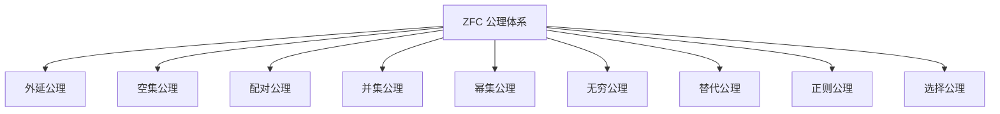
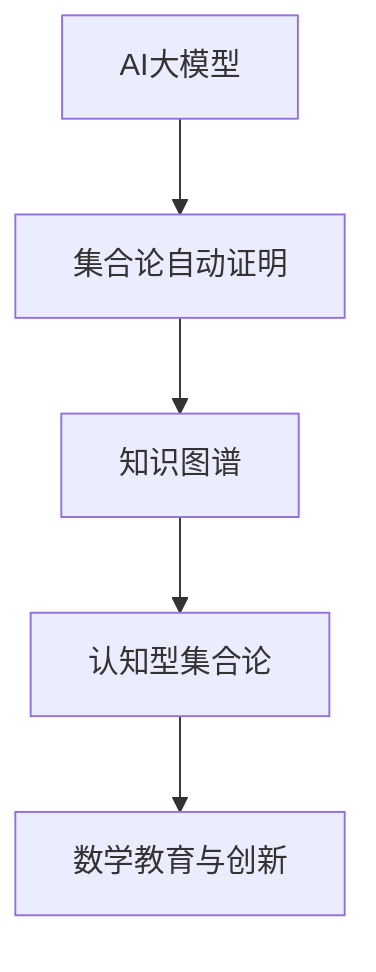

# 2.1.2 公理化集合论

[返回总览](../00-数学基础与逻辑总览.md)

## 2.1.2.1 公理化集合论的定义与意义

公理化集合论是为了解决朴素集合论中出现的悖论而发展起来的严格数学理论体系。
它通过明确的公理系统限制集合的构造方式，为数学提供了坚实的基础。
其中最广为接受的是策梅洛-弗兰克尔集合论（ZF）及其加上选择公理的扩展（ZFC）。

### 1.1 历史背景

- **1901年**：罗素发现集合论悖论
- **1908年**：策梅洛(Ernst Zermelo)提出第一个公理化集合论系统
- **1922年**：弗兰克尔(Abraham Fraenkel)对策梅洛体系进行改进
- **1925年**：策梅洛-弗兰克尔集合论(ZF)正式形成
- **1930年代**：冯·诺伊曼(John von Neumann)、贝尔奈斯(Paul Bernays)和哥德尔(Kurt Gödel)发展出替代公理系统(NBG)

### 1.2 公理化方法的意义

公理化方法具有以下几个方面的重要意义：

1. **避免悖论**：通过限制集合构造，避免罗素悖论等悖论
2. **严谨性**：提供严格的推理基础，使证明具有确定性
3. **统一框架**：为整个数学提供统一的形式化基础
4. **元数学研究**：使得对数学系统本身的研究成为可能

## 2.1.2.2 主要公理体系

ZFC(Zermelo-Fraenkel with Choice)是现代数学中最广泛采用的集合论公理系统。

### 2.1 ZFC的基本公理

1. **外延公理(Axiom of Extensionality)**：
   - 如果两个集合包含相同的元素，则这两个集合相等
   - 形式化：$\forall x \forall y [\forall z(z \in x \leftrightarrow z \in y) \rightarrow x = y]$

2. **空集公理(Axiom of Empty Set)**：
   - 存在一个不含任何元素的集合
   - 形式化：$\exists x \forall y (y \notin x)$

3. **配对公理(Axiom of Pairing)**：
   - 对任意两个集合，存在一个包含恰好这两个集合作为其元素的集合
   - 形式化：$\forall x \forall y \exists z \forall w (w \in z \leftrightarrow w = x \vee w = y)$

4. **并集公理(Axiom of Union)**：
   - 对于任何集合，存在一个包含该集合中所有元素的元素的集合
   - 形式化：$\forall x \exists y \forall z (z \in y \leftrightarrow \exists w (w \in x \wedge z \in w))$

5. **幂集公理(Axiom of Power Set)**：
   - 对于任何集合，存在包含该集合所有子集的集合
   - 形式化：$\forall x \exists y \forall z (z \in y \leftrightarrow z \subseteq x)$

6. **无穷公理(Axiom of Infinity)**：
   - 存在一个包含空集且对后继操作封闭的集合
   - 形式化：$\exists x (\emptyset \in x \wedge \forall y (y \in x \rightarrow y \cup \{y\} \in x))$

7. **替代公理模式(Axiom Schema of Replacement)**：
   - 函数的像是一个集合
   - 形式化：对于任何一阶公式$\phi(x,y)$，如果$\phi$定义了函数关系，则对任意集合$A$，存在集合$B$包含所有$\phi$作用在$A$上的像

8. **正则公理(Axiom of Regularity/Foundation)**：
   - 每个非空集合$x$都包含一个元素$y$，使得$x$和$y$没有共同元素
   - 形式化：$\forall x [x \neq \emptyset \rightarrow \exists y (y \in x \wedge y \cap x = \emptyset)]$

9. **选择公理(Axiom of Choice)**：
   - 对于任何非空集合族，存在一个选择函数，从每个非空集合中选出一个元素
   - 形式化：$\forall X [(\emptyset \notin X \wedge \forall x,y \in X (x \neq y \rightarrow x \cap y = \emptyset)) \rightarrow \exists Y \forall x \in X (|Y \cap x| = 1)]$

### 2.2 ZFC公理的意义与作用

| 公理 | 主要作用 | 解决的问题 |
|------|---------|------------|
| 外延公理 | 确定集合相等的条件 | 集合身份问题 |
| 空集公理 | 确保空集存在 | 提供基础构建块 |
| 配对公理 | 允许构造包含两个指定元素的集合 | 基本集合构造 |
| 并集公理 | 允许形成并集 | 集合层次结构 |
| 幂集公理 | 允许形成所有子集的集合 | 高阶集合构造 |
| 无穷公理 | 确保存在无穷集合 | 无穷数学结构 |
| 替代公理 | 允许用函数定义集合 | 扩展集合构造能力 |
| 正则公理 | 防止自循环集合 | 避免自身成员悖论 |
| 选择公理 | 确保可以同时从多个集合中选择元素 | 解决选择问题 |

## 2.1.2.3 典型定理与方法

### 3.1 有序对与笛卡尔积

在ZFC中，有序对$(a,b)$可以定义为：$(a,b) = \{\{a\},\{a,b\}\}$

**定理 3.1.1**：如果$(a,b) = (c,d)$，则$a=c$且$b=d$

笛卡尔积定义为：$A \times B = \{(a,b) \mid a \in A \wedge b \in B\}$

### 3.2 关系与函数

**关系**是笛卡尔积的子集：$R \subseteq A \times B$

**函数**是一种特殊的关系，满足：

- $f \subseteq A \times B$
- $\forall a \in A, \exists! b \in B, (a,b) \in f$

在ZFC中，函数$f: A \rightarrow B$被形式化为满足上述条件的集合。

### 3.3 自然数与序数

在ZFC中，自然数可以用冯·诺伊曼序数来表示：

- $0 = \emptyset$
- $1 = \{0\} = \{\emptyset\}$
- $2 = \{0,1\} = \{\emptyset,\{\emptyset\}\}$
- $3 = \{0,1,2\} = \{\emptyset,\{\emptyset\},\{\emptyset,\{\emptyset\}\}\}$
- 一般地，$n+1 = n \cup \{n\}$

**序数**是良序集的同构类型。每个序数$\alpha$等于所有小于$\alpha$的序数的集合：$\alpha = \{\beta \mid \beta < \alpha\}$

### 3.4 基数

**基数**是衡量集合大小的概念。在ZFC中，基数被定义为初始序数（不与任何较小序数等势的序数）。

**定理 3.4.1**：每个集合都与唯一的基数等势。

基数算术可以在ZFC中严格定义：

- 基数加法：$|A| + |B| = |A \cup B|$，其中$A$和$B$不相交
- 基数乘法：$|A| \cdot |B| = |A \times B|$
- 基数乘方：$|A|^{|B|} = |A^B|$，其中$A^B$是从$B$到$A$的所有函数的集合

### 4. 超限归纳法与递归定理

#### 4.1 超限归纳法原理

**超限归纳法**是数学归纳法在序数上的推广。

**定理 4.1.1(超限归纳法原理)**：设$P$是关于序数的性质，如果对于任意序数$\alpha$，假设对所有$\beta < \alpha$都有$P(\beta)$成立，可以推出$P(\alpha)$成立，那么$P$对所有序数都成立。

#### 4.2 递归定理

**递归定理**允许我们通过递归方式定义函数。

**定理 4.2.1(递归定理)**：如果$G$是一个函数，将所有函数$f$的限制（定义在$\beta < \alpha$上）映射到值$G(f|_\beta)$，则存在唯一的函数$F$满足对所有序数$\alpha$，$F(\alpha) = G(F|_\alpha)$。

这允许我们通过指定函数在$0$处的值以及从$f(\beta)$计算$f(\alpha)$的方法来定义函数。

## 2.1.2.4 相关主题与本地跳转

- 详见 [00-数学基础与逻辑总览.md](../00-数学基础与逻辑总览.md) 2.1 集合论
- 相关主题：[01-朴素集合论.md](01-朴素集合论.md)、[03-集合论悖论与解决方案.md](03-集合论悖论与解决方案.md)

## 2.1.2.5 参考文献与资源

1. Jech, T. (2003). *Set Theory: The Third Millennium Edition*. Springer.
2. Kunen, K. (2011). *Set Theory: An Introduction to Independence Proofs*. College Publications.
3. Cohen, P. J. (1966). *Set Theory and the Continuum Hypothesis*. W.A. Benjamin.
4. Devlin, K. (1993). *The Joy of Sets: Fundamentals of Contemporary Set Theory*. Springer.
5. Gödel, K. (1940). *The Consistency of the Continuum Hypothesis*. Princeton University Press.

## 2.1.2.6 多表征内容

- **Mermaid 结构图：ZFC 公理体系结构**



- **Rust 代码示例：ZFC 幂集操作**

```rust
fn power_set<T: Clone + std::cmp::Eq + std::hash::Hash>(s: &std::collections::HashSet<T>) -> Vec<std::collections::HashSet<T>> {
    let mut ps = vec![std::collections::HashSet::new()];
    for item in s.iter() {
        let mut new_subsets = vec![];
        for subset in &ps {
            let mut new_subset = subset.clone();
            new_subset.insert(item.clone());
            new_subsets.push(new_subset);
        }
        ps.extend(new_subsets);
    }
    ps
}
```

- **Lean 代码示例：ZFC 部分公理形式化**

```lean
axiom extensionality : ∀ A B : Set, (∀ x, x ∈ A ↔ x ∈ B) → A = B
axiom empty_set : ∃ A : Set, ∀ x, x ∉ A
axiom pairing : ∀ x y : Set, ∃ z : Set, ∀ w, w ∈ z ↔ w = x ∨ w = y
```

- **表格：ZFC 公理与作用对比**

| 公理         | 主要作用           | 解决的问题         |
|--------------|--------------------|--------------------|
| 外延公理     | 确定集合相等标准   | 集合身份问题       |
| 空集公理     | 保证空集存在       | 基础构造           |
| 配对公理     | 构造二元集合       | 基本集合构造       |
| 并集公理     | 构造并集           | 层级结构           |
| 幂集公理     | 构造所有子集       | 高阶集合构造       |
| 无穷公理     | 保证无穷集合存在   | 自然数等结构       |
| 替代公理     | 控制集合构造范围   | 避免悖论           |
| 正则公理     | 防止自指           | 避免循环结构       |
| 选择公理     | 保证选择函数存在   | 选择问题           |

- **AI/认知/教育视角**
  - ZFC 公理体系是现代数学基础的核心，自动证明工具（如 Lean/Coq）可用于形式化验证。
  - 教学中可用可视化（如 Mermaid 图）和代码演示帮助理解公理体系的结构与作用。
  - 认知科学视角下，公理化方法有助于培养严密推理和抽象建模能力。

## 2.1.2.7 现代AI与自动化集合论补充

- **AI自动化集合论**：GPT-4、Lean、Coq等系统可自动生成、验证ZFC等集合论公理体系下的复杂证明。
- **知识图谱驱动的集合论推理**：如OpenAI MathGraph、Wikidata等，支持集合论知识的结构化、自动化推理。
- **认知型集合论**：结合人类认知过程的AI推理系统，模拟集合论创新与教学。
- **Rust代码示例：AI自动化集合论结构体**

```rust
struct AutoSetTheory {
    statement: String,
    ai_steps: Vec<String>,
    verified: bool,
}

impl AutoSetTheory {
    fn new(statement: &str) -> Self {
        AutoSetTheory { statement: statement.to_string(), ai_steps: vec![], verified: false }
    }
    fn add_step(&mut self, step: &str) {
        self.ai_steps.push(step.to_string());
    }
    fn verify(&mut self) {
        // 假设AI自动验证
        self.verified = true;
    }
}
```

- **结构图：AI与自动化集合论**



---

**最后更新**: 2025-06-24  
**状态**: 初始版本
