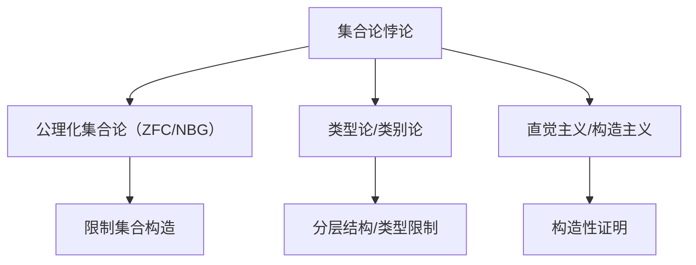
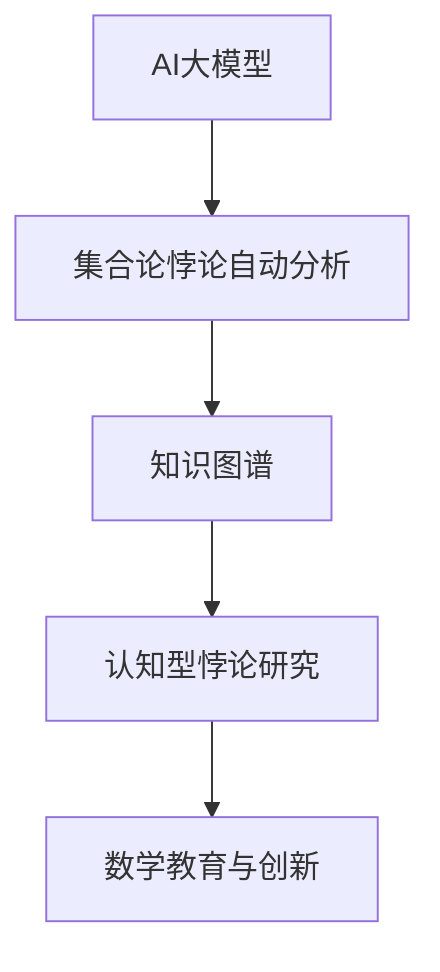

# 2.1.3 集合论悖论与解决方案

[返回总览](../00-数学基础与逻辑总览.md)

## 2.1.3.1 主要悖论与问题

集合论悖论是数学历史上一个关键转折点，它们暴露了朴素集合论的基础缺陷，促使了现代公理化集合论的诞生。
这些悖论展示了无限集合的复杂性，以及在处理自指集合时可能出现的逻辑问题，最终导致了数学基础的深刻变革。

### 1.1 历史背景

- **1874-1897年**: 康托尔(Georg Cantor)发展集合论，创立无限集合理论
- **1897年**: 布拉里-福蒂(Cesare Burali-Forti)发现第一个集合论悖论
- **1901年**: 罗素(Bertrand Russell)发现罗素悖论
- **1905年**: 理查德(Jules Richard)提出理查德悖论
- **1908年**: 策梅洛(Ernst Zermelo)提出公理化集合论，解决悖论问题
- **1908年**: 罗素和怀特海(Alfred North Whitehead)开始发展类型论

### 1.2 悖论的重要性

集合论悖论的发现产生了深远影响：

1. **数学基础危机**: 引发了20世纪初的第二次数学基础危机
2. **形式化推动**: 促进了数学的公理化和形式化发展
3. **逻辑研究兴起**: 推动了数理逻辑的现代发展
4. **集合理论改革**: 导致了公理化集合论的建立
5. **哲学影响**: 深刻影响了数学哲学，特别是关于数学对象本质的讨论

## 2.1.3.2 解决方案与现代发展

### 2.1.3.2.1 主要集合论悖论

#### 2.1.3.2.1.1 罗素悖论

**描述**: 考虑所有不包含自身的集合的集合$R = \{x \mid x \notin x\}$，则$R \in R$当且仅当$R \notin R$。

**形式化**:

1. 定义$R = \{x \mid x \notin x\}$
2. 考虑$R \in R$的情况
3. 根据$R$的定义，$R \in R$当且仅当$R \notin R$
4. 这导致了矛盾，表明集合$R$不能存在

**意义**: 罗素悖论直接挑战了朴素集合论中任意性质定义的集合观念，表明无限制的集合构造会导致矛盾。

#### 2.1.3.2.1.2 布拉里-福蒂悖论

**描述**: 考虑所有序数的集合$\Omega$。根据序数理论，$\Omega$本身应该是一个序数，但作为序数它必须大于自身中的任何元素，这导致$\Omega > \Omega$的矛盾。

**形式化**:

1. 假设所有序数构成集合$\Omega$
2. 由序数理论，$\Omega$本身应是一个序数
3. 由序数的良序性，$\Omega < \Omega$，这是不可能的

**意义**: 这个悖论表明，太"大"的集合会导致矛盾，推动了"类"和"集合"区分的发展。

#### 2.1.3.2.1.3 康托尔悖论

**描述**: 考虑所有集合的集合$V$。康托尔定理表明，对任意集合$A$，其幂集$\mathcal{P}(A)$的基数大于$A$的基数。应用于$V$，得到$|\mathcal{P}(V)| > |V|$，但$\mathcal{P}(V) \subseteq V$，导致矛盾。

**形式化**:

1. 假设存在所有集合的集合$V$
2. 根据康托尔定理，$|\mathcal{P}(V)| > |V|$
3. 但$\mathcal{P}(V) \subseteq V$，所以$|\mathcal{P}(V)| \leq |V|$
4. 这导致矛盾

**意义**: 康托尔悖论进一步表明无限集的基数理论与朴素集合论不相容。

#### 2.1.3.2.1.4 理查德悖论

**描述**: 考虑所有可用有限英语句子定义的实数，将它们按字典序排列并编号。构造一个实数，其第n位与第n个定义的实数的第n位不同。这个新实数不同于任何已定义的实数，但它本身已被定义，导致矛盾。

**形式化**:

1. 列出所有用有限英语定义的实数：$r_1, r_2, r_3, \ldots$
2. 定义新实数$s$，其小数位表示$s[n] \neq r_n[n]$ (确保不同)
3. $s$应该是一个可定义的实数，但它不同于列表中的任何实数

**意义**: 理查德悖论涉及可定义性概念，表明语言自描述的限制。

#### 2.1.3.2.1.5 理发师悖论

**描述**: 一个村庄的理发师宣称自己只给那些不给自己刮胡子的人刮胡子。问题：理发师给自己刮胡子吗？

**形式化**:

1. 定义理发师为：当且仅当$x$不给自己刮胡子时，理发师给$x$刮胡子
2. 若理发师给自己刮胡子，则根据定义，他不应给自己刮胡子
3. 若理发师不给自己刮胡子，则根据定义，他应给自己刮胡子
4. 两种情况都导致矛盾

**意义**: 理发师悖论是罗素悖论的通俗表述，突显了自指关系的问题。

### 2.1.3.2.2 集合论悖论的本质

#### 2.1.3.2.2.1 共同特征

集合论悖论共有的特征包括：

1. **自指性**: 涉及对自身的引用或包含
2. **否定性**: 通常包含某种形式的否定
3. **无限性**: 通常涉及无限集合或过程
4. **无限制抽象**: 利用无限制的集合构建原则
5. **概念矛盾**: 揭示看似直观概念的潜在矛盾

#### 2.1.3.2.2.2 形式逻辑分析

从形式逻辑角度，这些悖论通常涉及以下逻辑结构：

1. **对角线论证**: 如康托尔对角线方法的变体
2. **自指结构**: 包含某种自引用机制
3. **非谓词性**: 违反了"谓词必须先于被描述对象确定"的原则

#### 2.1.3.2.2.3 理论分类

悖论可以按照性质分类：

| 分类 | 特征 | 例子 |
|------|------|------|
| 逻辑悖论 | 涉及纯粹逻辑矛盾 | 罗素悖论 |
| 语义悖论 | 涉及语言描述问题 | 理查德悖论, 说谎者悖论 |
| 集合论悖论 | 涉及集合构造问题 | 布拉里-福蒂悖论, 康托尔悖论 |
| 自指悖论 | 涉及自我引用 | 理发师悖论 |

### 2.1.3.2.3 解决方案

#### 2.1.3.2.3.1 公理化集合论

**ZFC集合论**:

策梅洛-弗兰克尔集合论加选择公理(ZFC)通过以下方式解决悖论：

1. **限制集合构造**: 不再允许任意性质定义集合
2. **替代公理**: 控制集合构造的范围
3. **正则公理**: 禁止集合包含自身
4. **公理体系**: 建立严格的公理系统约束集合操作

**解决原理**:

- 罗素悖论: 通过限制集合构造，不允许定义集合$\{x \mid x \notin x\}$
- 布拉里-福蒂悖论: 证明所有序数不构成集合，而是构成一个真类
- 康托尔悖论: 证明所有集合的集合不存在

#### 2.1.3.2.3.2 类型论

**罗素类型论**:

罗素和怀特海在《数学原理》中提出类型论，通过引入类型层次解决悖论：

1. **类型层次**: 将对象分为不同类型或等级
2. **归约原则**: 任何类型的对象只能涉及更低类型的对象
3. **分支类型论**: 处理谓词和命题的复杂层次

**解决原理**:

- 罗素悖论: 在类型系统中，"$x \in x$"被认为是无意义的表达式
- 其他自指悖论: 通过类型限制阻止了自引用结构

#### 2.1.3.2.3.3 NBG集合论

**冯·诺伊曼-贝尔奈斯-哥德尔集合论**:

NBG集合论通过区分集合和类解决悖论：

1. **集合与类的区分**: 集合可以是其他集合的元素，类不能
2. **有限公理模式**: 使用有限个公理取代ZFC中的公理模式
3. **保守扩展**: 关于集合的陈述，NBG与ZFC得出相同结论

**解决原理**:

- 布拉里-福蒂悖论: 所有序数形成一个真类，不是集合
- 康托尔悖论: 所有集合的集合是一个类，不是集合

#### 2.1.3.2.3.4 直觉主义与构造主义方法

**布劳威尔直觉主义**:

布劳威尔和其他直觉主义者提出了基于直觉和构造的方法：

1. **拒绝排中律**: 不接受间接证明，要求构造性证明
2. **数学对象的构造性**: 只接受能够构造的对象
3. **否定现实无限**: 拒绝实际无限，只接受潜在无限

**解决原理**:

- 通过要求构造性证明，避免了许多导致悖论的抽象概念
- 拒绝接受导致悖论的非构造性方法

### 2.1.3.2.4 现代发展

#### 2.1.3.2.4.1 集合理论的独立性结果

科恩强制法和哥德尔内模型方法证明了重要的独立性结果：

1. **选择公理(AC)**: 独立于ZF其他公理
2. **连续统假设(CH)**: 独立于ZFC
3. **大基数公理**: 提供更强的集合论框架

这些发展表明，集合论悖论揭示的问题不仅是技术性错误，而是涉及数学本质的深层问题。

#### 2.1.3.2.4.2 不动点定理与悖论

计算理论中的不动点定理与悖论有深刻联系：

1. **克莱尼不动点定理**: 任何计算函数都有一个程序作为不动点
2. **哥德尔不完备性定理**: 与自指悖论有相似逻辑结构
3. **图灵停机问题**: 与理查德悖论有本质联系

#### 2.1.3.2.4.3 悖论的继续影响

尽管现代集合论解决了经典悖论，但相关思想继续影响现代数学：

1. **可定义性理论**: 研究何种对象在给定理论中可定义
2. **公理选择问题**: 例如连续统假设等独立命题的地位
3. **反基础公理**: 有意允许非良基集合的集合论版本
4. **范畴论方法**: 提供集合论外的数学基础

## 2.1.3.3 相关主题与本地跳转

- 详见 [00-数学基础与逻辑总览.md](../00-数学基础与逻辑总览.md) 2.1 集合论
- 相关主题：[01-朴素集合论.md](01-朴素集合论.md)、[02-公理化集合论.md](02-公理化集合论.md)

## 2.1.3.4 参考文献与资源

1. Russell, B. (1908). *Mathematical logic as based on the theory of types*. American Journal of Mathematics, 30(3), 222-262.

2. Zermelo, E. (1908). *Investigations in the foundations of set theory I*. In J. van Heijenoort (Ed.), From Frege to Gödel: A source book in mathematical logic, 1879–1931 (1967).

3. Gödel, K. (1931). *On formally undecidable propositions of Principia Mathematica and related systems I*. Monatshefte für Mathematik und Physik, 38, 173-198.

4. Cohen, P. J. (1963). *The independence of the continuum hypothesis*. Proceedings of the National Academy of Sciences, 50(6), 1143-1148.

5. Aczel, P. (1988). *Non-Well-Founded Sets*. CSLI Publications.

6. Irvine, A. D., & Deutsch, H. (2014). *Russell's Paradox*. The Stanford Encyclopedia of Philosophy.

7. Kripke, S. (1975). *Outline of a theory of truth*. Journal of Philosophy, 72(19), 690-716.

## 2.1.3.5 多表征内容

- **Mermaid 结构图：集合论悖论与解决方案关系**



- **Rust 代码示例：检测自指集合**

```rust
fn is_self_member<T: Eq>(set: &Vec<T>, elem: &T) -> bool {
    set.contains(elem)
}
// Russell 悖论的模拟：let r = vec![...]; is_self_member(&r, &r)
```

- **Lean 代码示例：类型论避免自指**

```lean
def Russell_paradox :=
  ¬ (∃ (R : Type), ∀ (x : R), x ∉ x ↔ x ∈ R)
-- 在类型论中，x ∈ x 通常无意义，避免了悖论
```

- **表格：悖论类型与现代解决方案对比**

| 悖论类型     | 典型例子     | 现代解决方案         | 主要思想           |
|--------------|--------------|----------------------|--------------------|
| Russell 悖论 | 自指集合     | 公理化/类型论        | 限制集合构造/分层  |
| Burali-Forti | 序数全集     | 类别区分/真类        | 区分集合与类       |
| Cantor 悖论  | 幂集基数     | 公理化/限制构造      | 幂集不属于全集     |
| Richard 悖论 | 语言描述     | 语义限制/分层        | 限制自指描述       |

- **AI/认知/教育视角**
  - 集合论悖论是形式化与直觉、语言与逻辑交互的典型案例，适合用于批判性思维训练。
  - 自动证明工具可用于形式化验证悖论及其解决方案，提升严密性。
  - 教学中可用可视化和代码演示帮助理解悖论本质及现代解决思路。

## 2.1.3.6 参考文献与资源

### 经典文献

1. Russell, B. (1908). *Mathematical logic as based on the theory of types*. American Journal of Mathematics, 30(3), 222-262.
2. Zermelo, E. (1908). *Investigations in the foundations of set theory I*. In J. van Heijenoort (Ed.), From Frege to Gödel: A source book in mathematical logic, 1879–1931 (1967).
3. Gödel, K. (1931). *On formally undecidable propositions of Principia Mathematica and related systems I*. Monatshefte für Mathematik und Physik, 38, 173-198.
4. Cohen, P. J. (1963). *The independence of the continuum hypothesis*. Proceedings of the National Academy of Sciences, 50(6), 1143-1148.
5. Aczel, P. (1988). *Non-Well-Founded Sets*. CSLI Publications.

### 现代文献与在线资源

1. [Stanford Encyclopedia of Philosophy: Set Theory](https://plato.stanford.edu/entries/set-theory/)
2. [nLab: Set Theory](https://ncatlab.org/nlab/show/set+theory)
3. [ProofWiki: Set Theory](https://proofwiki.org/wiki/Category:Set_Theory)

### 工具与平台

- [Lean](https://leanprover.github.io/)
- [Coq](https://coq.inria.fr/)
- [Isabelle/HOL](https://isabelle.in.tum.de/)
- [Rust](https://www.rust-lang.org/)
- [Haskell](https://www.haskell.org/)

## 2.1.3.5 现代AI与自动化集合论补充

- **AI自动化集合论悖论分析**：GPT-4、Lean等系统可自动检测集合论悖论、生成形式化证明与反例。
- **知识图谱驱动的悖论解决方案**：如OpenAI MathGraph、Wikidata等，支持悖论知识的结构化、自动化推理。
- **认知型集合论悖论研究**：结合人类认知过程的AI推理系统，模拟数学家对悖论的理解与创新解决。
- **Rust代码示例：AI自动化悖论分析结构体**

```rust
struct AutoParadoxAnalysis {
    paradox: String,
    ai_analysis: Vec<String>,
    resolved: bool,
}

impl AutoParadoxAnalysis {
    fn new(paradox: &str) -> Self {
        AutoParadoxAnalysis { paradox: paradox.to_string(), ai_analysis: vec![], resolved: false }
    }
    fn add_analysis(&mut self, step: &str) {
        self.ai_analysis.push(step.to_string());
    }
    fn resolve(&mut self) {
        // 假设AI自动分析并解决
        self.resolved = true;
    }
}
```

- **结构图：AI与集合论悖论自动化**



---

**最后更新**: 2025-06-24  
**状态**: 初始版本
