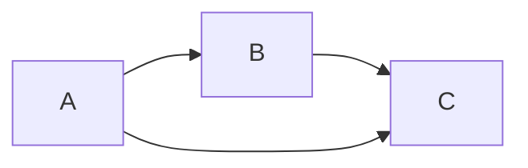

# 集合论基础

## 目录

- [集合论基础](#集合论基础)
  - [目录](#目录)
  - [1. 引言](#1-引言)
    - [1.1 集合论的历史发展](#11-集合论的历史发展)
    - [1.2 集合论的重要性](#12-集合论的重要性)
  - [2. 集合的基本概念](#2-集合的基本概念)
    - [2.1 集合的定义与表示](#21-集合的定义与表示)
    - [2.2 集合的基本运算](#22-集合的基本运算)
      - [2.2.1 并集 (Union)](#221-并集-union)
      - [2.2.2 交集 (Intersection)](#222-交集-intersection)
      - [2.2.3 差集 (Difference)](#223-差集-difference)
      - [2.2.4 补集 (Complement)](#224-补集-complement)
      - [2.2.5 对称差 (Symmetric Difference)](#225-对称差-symmetric-difference)
    - [2.3 集合的关系](#23-集合的关系)
      - [2.3.1 包含关系](#231-包含关系)
      - [2.3.2 相等关系](#232-相等关系)
      - [2.3.3 幂集 (Power Set)](#233-幂集-power-set)
  - [3. 公理化集合论](#3-公理化集合论)
    - [3.1 ZFC公理系统](#31-zfc公理系统)
      - [3.1.1 外延公理 (Axiom of Extensionality)](#311-外延公理-axiom-of-extensionality)
      - [3.1.2 空集公理 (Axiom of Empty Set)](#312-空集公理-axiom-of-empty-set)
      - [3.1.3 配对公理 (Axiom of Pairing)](#313-配对公理-axiom-of-pairing)
      - [3.1.4 并集公理 (Axiom of Union)](#314-并集公理-axiom-of-union)
      - [3.1.5 幂集公理 (Axiom of Power Set)](#315-幂集公理-axiom-of-power-set)
      - [3.1.6 分离公理模式 (Axiom Schema of Separation)](#316-分离公理模式-axiom-schema-of-separation)
      - [3.1.7 替换公理模式 (Axiom Schema of Replacement)](#317-替换公理模式-axiom-schema-of-replacement)
      - [3.1.8 无穷公理 (Axiom of Infinity)](#318-无穷公理-axiom-of-infinity)
      - [3.1.9 正则公理 (Axiom of Regularity)](#319-正则公理-axiom-of-regularity)
    - [3.2 选择公理 (Axiom of Choice)](#32-选择公理-axiom-of-choice)
    - [3.3 连续统假设 (Continuum Hypothesis)](#33-连续统假设-continuum-hypothesis)
  - [4. 基数与序数](#4-基数与序数)
    - [4.1 基数理论](#41-基数理论)
      - [4.1.1 等势关系](#411-等势关系)
      - [4.1.2 基数的定义](#412-基数的定义)
      - [4.1.3 基数的比较](#413-基数的比较)
      - [4.1.4 重要的基数](#414-重要的基数)
    - [4.2 序数理论](#42-序数理论)
      - [4.2.1 良序集](#421-良序集)
      - [4.2.2 序数的定义](#422-序数的定义)
      - [4.2.3 序数的运算](#423-序数的运算)
  - [5. 集合论在数学基础中的作用](#5-集合论在数学基础中的作用)
    - [5.1 数学对象的构造](#51-数学对象的构造)
    - [5.2 函数的概念](#52-函数的概念)
    - [5.3 关系的概念](#53-关系的概念)
  - [6. 批判性分析](#6-批判性分析)
    - [6.1 集合论的局限性](#61-集合论的局限性)
      - [6.1.1 罗素悖论](#611-罗素悖论)
      - [6.1.2 公理系统的局限性](#612-公理系统的局限性)
    - [6.2 替代方案](#62-替代方案)
      - [6.2.1 类型论](#621-类型论)
      - [6.2.2 范畴论](#622-范畴论)
    - [6.3 哲学思考](#63-哲学思考)
      - [6.3.1 数学实在论 vs 形式主义](#631-数学实在论-vs-形式主义)
      - [6.3.2 无穷的本质](#632-无穷的本质)
  - [7. 总结](#7-总结)

---

## 1. 引言

集合论是现代数学的基础，为整个数学体系提供了统一的语言和框架。它通过公理化方法建立了严格的数学基础，使得所有数学对象都可以在集合论的框架下进行形式化处理。

### 1.1 集合论的历史发展

集合论由德国数学家格奥尔格·康托尔（Georg Cantor）在19世纪末创立。康托尔通过研究无穷集合的性质，发现了基数理论，为现代数学的发展奠定了基础。

### 1.2 集合论的重要性

- **统一性**：为所有数学分支提供统一的语言
- **严格性**：通过公理化方法确保数学推理的严格性
- **基础性**：作为数学大厦的基石，支撑整个数学体系

## 2. 集合的基本概念

### 2.1 集合的定义与表示

**定义**：集合是某些确定的不同对象的总体，这些对象称为该集合的元素。

**表示方法**：

- 列举法：$A = \{1, 2, 3, 4, 5\}$
- 描述法：$A = \{x \mid x \text{ 是自然数且 } 1 \leq x \leq 5\}$
- 文氏图：用图形表示集合间的关系

**特殊集合**：

- 空集：$\emptyset = \{\}$
- 全集：$U$（在特定讨论范围内所有对象的集合）
- 单元素集：$\{a\}$

### 2.2 集合的基本运算

#### 2.2.1 并集 (Union)

$$A \cup B = \{x \mid x \in A \text{ 或 } x \in B\}$$

**性质**：

- 交换律：$A \cup B = B \cup A$
- 结合律：$(A \cup B) \cup C = A \cup (B \cup C)$
- 幂等律：$A \cup A = A$

#### 2.2.2 交集 (Intersection)

$$A \cap B = \{x \mid x \in A \text{ 且 } x \in B\}$$

**性质**：

- 交换律：$A \cap B = B \cap A$
- 结合律：$(A \cap B) \cap C = A \cap (B \cap C)$
- 幂等律：$A \cap A = A$

#### 2.2.3 差集 (Difference)

$$A - B = \{x \mid x \in A \text{ 且 } x \notin B\}$$

#### 2.2.4 补集 (Complement)

$$A^c = U - A = \{x \mid x \notin A\}$$

#### 2.2.5 对称差 (Symmetric Difference)

$$A \triangle B = (A - B) \cup (B - A)$$

### 2.3 集合的关系

#### 2.3.1 包含关系

- **子集**：$A \subseteq B$ 当且仅当 $\forall x(x \in A \rightarrow x \in B)$
- **真子集**：$A \subset B$ 当且仅当 $A \subseteq B$ 且 $A \neq B$

#### 2.3.2 相等关系

$$A = B \text{ 当且仅当 } A \subseteq B \text{ 且 } B \subseteq A$$

#### 2.3.3 幂集 (Power Set)

$$\mathcal{P}(A) = \{X \mid X \subseteq A\}$$

**性质**：如果 $|A| = n$，则 $|\mathcal{P}(A)| = 2^n$

## 3. 公理化集合论

### 3.1 ZFC公理系统

ZFC（Zermelo-Fraenkel with Choice）是现代集合论的标准公理系统，包含以下公理：

#### 3.1.1 外延公理 (Axiom of Extensionality)

$$\forall x \forall y [\forall z(z \in x \leftrightarrow z \in y) \rightarrow x = y]$$

#### 3.1.2 空集公理 (Axiom of Empty Set)

$$\exists x \forall y(y \notin x)$$

#### 3.1.3 配对公理 (Axiom of Pairing)

$$\forall x \forall y \exists z \forall w(w \in z \leftrightarrow w = x \vee w = y)$$

#### 3.1.4 并集公理 (Axiom of Union)

$$\forall F \exists A \forall x(x \in A \leftrightarrow \exists B(B \in F \wedge x \in B))$$

#### 3.1.5 幂集公理 (Axiom of Power Set)

$$\forall x \exists y \forall z(z \in y \leftrightarrow z \subseteq x)$$

#### 3.1.6 分离公理模式 (Axiom Schema of Separation)

$$\forall x \exists y \forall z(z \in y \leftrightarrow z \in x \wedge \phi(z))$$

#### 3.1.7 替换公理模式 (Axiom Schema of Replacement)

$$\forall x \exists!y \phi(x,y) \rightarrow \forall A \exists B \forall y(y \in B \leftrightarrow \exists x \in A \phi(x,y))$$

#### 3.1.8 无穷公理 (Axiom of Infinity)

$$\exists x(\emptyset \in x \wedge \forall y(y \in x \rightarrow y \cup \{y\} \in x))$$

#### 3.1.9 正则公理 (Axiom of Regularity)

$$\forall x(x \neq \emptyset \rightarrow \exists y \in x(y \cap x = \emptyset))$$

### 3.2 选择公理 (Axiom of Choice)

选择公理是ZFC系统中最具争议性的公理：

$$\forall F(\emptyset \notin F \wedge \forall x \forall y(x \in F \wedge y \in F \wedge x \neq y \rightarrow x \cap y = \emptyset) \rightarrow \exists C \forall x \in F(\exists z(z \in x \cap C)))$$

**等价形式**：

- **佐恩引理**：每个偏序集都有极大链
- **良序定理**：任何集合都可以良序化
- **乘积非空**：非空集合族的笛卡尔积非空

### 3.3 连续统假设 (Continuum Hypothesis)

连续统假设是关于实数集基数的问题：

$$2^{\aleph_0} = \aleph_1$$

**广义连续统假设**：
$$\forall \alpha(2^{\aleph_\alpha} = \aleph_{\alpha+1})$$

**哥德尔-科恩定理**：连续统假设在ZFC中既不能被证明，也不能被否证。

## 4. 基数与序数

### 4.1 基数理论

#### 4.1.1 等势关系

两个集合 $A$ 和 $B$ 等势（记作 $A \sim B$），如果存在双射 $f: A \rightarrow B$。

#### 4.1.2 基数的定义

集合 $A$ 的基数 $|A|$ 是与 $A$ 等势的所有集合的等价类。

#### 4.1.3 基数的比较

- $|A| \leq |B|$ 当且仅当存在单射 $f: A \rightarrow B$
- $|A| < |B|$ 当且仅当 $|A| \leq |B|$ 且 $|A| \neq |B|$

#### 4.1.4 重要的基数

- $\aleph_0 = |\mathbb{N}|$（可数无穷）
- $\aleph_1 = |\omega_1|$（第一个不可数基数）
- $2^{\aleph_0} = |\mathbb{R}|$（连续统的基数）

### 4.2 序数理论

#### 4.2.1 良序集

集合 $A$ 上的二元关系 $<$ 是良序，如果：

1. $<$ 是全序
2. $A$ 的每个非空子集都有最小元素

#### 4.2.2 序数的定义

序数是传递的良序集。

#### 4.2.3 序数的运算

- **后继序数**：$\alpha + 1 = \alpha \cup \{\alpha\}$
- **极限序数**：$\lambda = \bigcup_{\alpha < \lambda} \alpha$

## 5. 集合论在数学基础中的作用

### 5.1 数学对象的构造

在集合论框架下，所有数学对象都可以用集合来构造：

```haskell
-- 自然数的冯·诺依曼构造
data Natural = Zero | Succ Natural

-- 在集合论中的表示
zero = {}
one = {zero} = {{}}
two = {zero, one} = {{}, {{}}}
three = {zero, one, two} = {{}, {{}}, {{}, {{}}}}
```

### 5.2 函数的概念

函数可以定义为满足特定条件的二元关系：

$$f: A \rightarrow B \text{ 是一个函数当且仅当}$$
$$\forall x \in A \exists! y \in B((x,y) \in f)$$

### 5.3 关系的概念

关系是笛卡尔积的子集：

$$R \subseteq A \times B$$

## 6. 批判性分析

### 6.1 集合论的局限性

#### 6.1.1 罗素悖论

罗素悖论揭示了朴素集合论的内在矛盾：

$$R = \{x \mid x \notin x\}$$

如果 $R \in R$，则 $R \notin R$；如果 $R \notin R$，则 $R \in R$。

#### 6.1.2 公理系统的局限性

- 哥德尔不完备定理表明，任何足够强的形式系统都是不完备的
- 选择公理的独立性使得某些数学命题的真假无法确定

### 6.2 替代方案

#### 6.2.1 类型论

类型论提供了另一种数学基础，避免了集合论中的某些悖论：

```rust
// 在类型论中定义自然数
enum Nat {
    Zero,
    Succ(Box<Nat>)
}

// 函数类型
type Function<A, B> = fn(A) -> B;
```

#### 6.2.2 范畴论

范畴论提供了更高层次的抽象，关注对象间的关系而非对象本身：



### 6.3 哲学思考

#### 6.3.1 数学实在论 vs 形式主义

- **数学实在论**：数学对象独立于人类思维而存在
- **形式主义**：数学只是符号游戏，没有独立的存在性

#### 6.3.2 无穷的本质

- 潜无穷 vs 实无穷
- 无穷在数学中的合法性问题

## 7. 总结

集合论作为现代数学的基础，为整个数学体系提供了统一的语言和严格的公理化框架。虽然存在一些内在的局限性和哲学争议，但它仍然是数学发展的重要基石。理解集合论不仅有助于掌握数学的基础概念，也为深入理解数学的本质和局限性提供了重要视角。

---

**参考文献**：

1. Jech, T. (2003). Set Theory. Springer.
2. Kunen, K. (2011). Set Theory: An Introduction to Independence Proofs. Elsevier.
3. Halmos, P. R. (2017). Naive Set Theory. Dover Publications.
