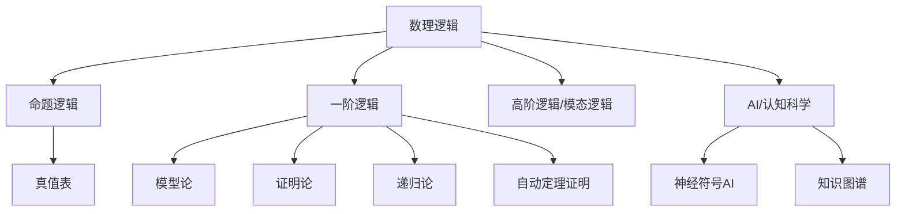
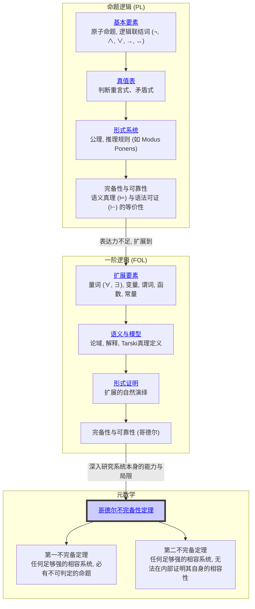

# 1. 数理逻辑总览

## 本地目录

- [1. 数理逻辑总览](#1-数理逻辑总览)
  - [本地目录](#本地目录)
  - [国际标准定义与多语种术语](#国际标准定义与多语种术语)
    - [数理逻辑（Mathematical Logic）](#数理逻辑mathematical-logic)
  - [理论基础与核心定理](#理论基础与核心定理)
    - [1. 命题逻辑（Propositional Logic）](#1-命题逻辑propositional-logic)
    - [2. 一阶逻辑（First-Order Logic, FOL）](#2-一阶逻辑first-order-logic-fol)
    - [3. 形式系统与可判定性](#3-形式系统与可判定性)
    - [4. 逻辑系统的分级与扩展](#4-逻辑系统的分级与扩展)
  - [认知科学视角与AI前沿应用](#认知科学视角与ai前沿应用)
  - [哲学反思与历史演化](#哲学反思与历史演化)
  - [典型案例与系统工具](#典型案例与系统工具)
  - [可视化结构与知识图谱建议](#可视化结构与知识图谱建议)
  - [国际标准文献与归档索引](#国际标准文献与归档索引)
  - [1.1. 引言：数学的语法](#11-引言数学的语法)
  - [1.2. 知识地图 (Mermaid)](#12-知识地图-mermaid)
  - [1.3. 探索路径](#13-探索路径)
  - [1.4. 本地知识图谱](#14-本地知识图谱)
  - [哲学批判与反思](#哲学批判与反思)

**版本**: 1.0
**日期**: 2025-07-02

---

## 国际标准定义与多语种术语

### 数理逻辑（Mathematical Logic）

- **国际标准定义**：数理逻辑是研究形式语言、推理规则、证明系统及其能力与局限的学科，涵盖命题逻辑、一阶逻辑、模型论、证明论、递归论等分支，为数学推理和自动化提供理论基础。
- **多语种术语**：
  - 英：Mathematical Logic
  - 法：Logique mathématique
  - 中：数理逻辑

---

## 理论基础与核心定理

### 1. 命题逻辑（Propositional Logic）

- **定义**：研究原子命题及其通过逻辑联结词（¬, ∧, ∨, →, ↔）组合而成的复合命题的推理系统。
- **核心定理**：可靠性定理、完备性定理、真值表方法。
- **典型应用**：电路设计、自动推理、SAT求解。

### 2. 一阶逻辑（First-Order Logic, FOL）

- **定义**：在命题逻辑基础上引入量词（∀, ∃）、谓词、函数、常量，极大提升表达能力。
- **核心定理**：哥德尔完备性定理、紧致性定理、洛文海姆-斯科伦定理。
- **典型应用**：数学理论公理化、知识表示、自动定理证明。

### 3. 形式系统与可判定性

- **定义**：形式系统由形式语言、公理集、推理规则组成。
- **可判定性**：部分逻辑系统（如命题逻辑）可判定，一阶逻辑整体不可判定。

### 4. 逻辑系统的分级与扩展

- **高阶逻辑**、**模态逻辑**、**时序逻辑**等扩展了表达力，应用于AI、程序验证、自然语言处理等领域。

---

## 认知科学视角与AI前沿应用

- **认知科学**：数理逻辑揭示了人类推理的结构性与局限性，认知科学研究逻辑推理能力的发展、神经基础与演化。
- **AI前沿**：
  - 自动定理证明（如Coq、Lean、Isabelle）
  - 知识表示与推理（如Prolog、知识图谱）
  - 神经符号AI（结合深度学习与逻辑推理）
  - Transformer等大模型在逻辑推理、程序合成、自动化数学发现中的应用
- **教育科学**：逻辑思维训练、结构化课程设计、可视化推理工具。

---

## 哲学反思与历史演化

- **逻辑主义**：弗雷格、罗素等主张数学可还原为逻辑。
- **直觉主义/构造主义**：布劳威尔等强调数学对象的构造性，拒绝排中律的普适性。
- **形式主义**：希尔伯特提出以形式系统为基础，关注一致性与可证明性。
- **现代反思**：哥德尔不完备定理、图灵不可判定性等揭示了形式系统的极限，推动多元逻辑体系与AI认知科学的融合。
- **历史演化**：从亚里士多德三段论到现代自动化推理，逻辑体系不断扩展，影响数学、计算机、语言学、哲学等领域。

---

## 典型案例与系统工具

- **自动定理证明器**：Coq、Lean、Isabelle、HOL、Prover9
- **知识表示与推理系统**：Prolog、OWL、RDF、知识图谱
- **AI与大模型**：OpenAI GPT、Transformer、神经符号推理系统
- **可视化工具**：Mermaid、Graphviz、Neo4j

---

## 可视化结构与知识图谱建议

---

## 国际标准文献与归档索引

- **典型文献**：
  - Frege, G. (1879). Begriffsschrift.
  - Russell, B., & Whitehead, A. N. (1910). Principia Mathematica.
  - Hilbert, D., & Ackermann, W. (1928). Grundzüge der theoretischen Logik.
  - Gödel, K. (1931). Über formal unentscheidbare Sätze.
  - Turing, A. (1936). On computable numbers.
  - Church, A. (1936). An unsolvable problem of elementary number theory.
  - Chomsky, N. (1956). Three models for the description of language.
  - Enderton, H. B. (2001). A Mathematical Introduction to Logic.
- **归档索引**：
  - [命题逻辑-联结词与真值表](./01-命题逻辑-联结词与真值表.md)
  - [命题逻辑-自然演绎系统](./02-命题逻辑-自然演绎系统.md)
  - [一阶逻辑-量词谓词与模型](./03-一阶逻辑-量词谓词与模型.md)
  - [一阶逻辑-形式证明](./04-一阶逻辑-形式证明.md)
  - [元数学与哥德尔不完备定理](./05-元数学与哥德尔不完备定理.md)

---

## 1.1. 引言：数学的语法

如果说集合论是数学的"操作系统"，提供了基本对象，那么 **数理逻辑 (Mathematical Logic)** 就是这门语言的 **"语法规则"**。
它为我们提供了精确的形式语言来无歧义地陈述数学命题，并提供了一套可靠的推理规则来保证我们的证明过程是严谨有效的。

本模块的核心目标是理解数学家如何从自然语言的模糊性中抽离出来，建立一个纯粹符号化的、可机械验证的推理系统。我们将探索这个系统的两个主要层次：

1. **命题逻辑 (Propositional Logic)**: 处理最基本的逻辑单元——原子命题（如"$P$"代表"今天下雨"）——以及如何通过逻辑联结词（与、或、非、蕴含）将它们组合成更复杂的复合命题。
2. **一阶逻辑 (First-Order Logic / Predicate Logic)**: 在命题逻辑的基础上，引入了更强大的表达工具——**量词**（所有 $\forall$, 存在 $\exists$）和**谓词**（如 $P(x)$ 代表"$x$是偶数"）。这使得我们能够深入到对象的属性和关系层面，从而能够形式化几乎所有的数学理论。

最终，我们将触及逻辑本身的边界，了解 **元数学 (Metamathematics)** 的惊人发现，特别是哥德尔不完备性定理，它揭示了任何足够强大的形式系统都存在的固有局限。

## 1.2. 知识地图 (Mermaid)

## 1.3. 探索路径

1. **[01-命题逻辑：联结词与真值表.md](./01-命题逻辑-联结词与真值表.md)**: 我们将从最基础的命题逻辑开始，学习如何使用 **与 (∧), 或 (∨), 非 (¬), 蕴含 (→)** 等联结词来构建复杂的逻辑表达式，并通过 **真值表** 这种简单而强大的工具来系统地分析其真假。
2. **[02-命题逻辑：自然演绎系统.md](./02-命题逻辑-自然演绎系统.md)**: 探索命题逻辑的"语法"层面。我们将建立一个形式化的 **自然演绎 (Natural Deduction)** 系统，它包含一组公理和推理规则（如著名的"假言推理"），并学习如何在这个系统内一步一步地构造出严格的 **形式证明 (Formal Proof)**。
3. **[03-一阶逻辑：量词、谓词与模型.md](./03-一阶逻辑-量词、谓词与模型.md)**: 为了表达更复杂的数学思想，我们将把命题逻辑升级到一阶逻辑。本节将引入 **量词 (∀, ∃)** 和 **谓词**，并探讨其 **语义 (Semantics)**，即如何在一个具体的"模型"（如自然数集）中解释这些符号并赋予它们真值。
4. **[04-一阶逻辑：形式证明.md](./04-一阶逻辑-形式证明.md)**: 将自然演绎系统扩展到一阶逻辑，学习如何处理涉及量词的推理规则。
5. **[05-元数学与哥德尔不完备定理.md](./05-元数学与哥德尔不完备定理.md)**: 最后，我们将站在一个更高的"元"视角，审视我们建立的形式系统本身。我们将深入探讨 **哥德尔不完备性定理** 的革命性思想，理解为何任何一个足够强大、无矛盾的数学公理系统，都必然存在其无法证明也无法证伪的"真"命题。

## 1.4. 本地知识图谱

- [01-命题逻辑-联结词与真值表.md](./01-命题逻辑-联结词与真值表.md)
- [02-命题逻辑-自然演绎系统.md](./02-命题逻辑-自然演绎系统.md)
- [03-一阶逻辑-量词谓词与模型.md](./03-一阶逻辑-量词谓词与模型.md)
- [04-一阶逻辑-形式证明.md](./04-一阶逻辑-形式证明.md)
- [05-元数学与哥德尔不完备定理.md](./05-元数学与哥德尔不完备定理.md)
- [../00-数学基础与逻辑总览.md](../00-数学基础与逻辑总览.md)
- [../../01-数学哲学-元数学与形式化/00-数学哲学与元数学总览.md](../../01-数学哲学-元数学与形式化/00-数学哲学与元数学总览.md)
- [../../09-项目总览/00-项目总览.md](../../09-项目总览/00-项目总览.md)

---

## 哲学批判与反思

- **历史人物与思想年表**：

  | 年代 | 人物 | 主要思想/事件 | 影响 |
  |------|------|---------------|------|
  | 19世纪末 | 弗雷格 | 形式逻辑体系化 | 现代数理逻辑奠基 |
  | 1900s | 罗素 | 逻辑主义推进，悖论发现 | 推动形式化与公理化 |
  | 1920s | 希尔伯特 | 形式主义与元数学 | 逻辑系统分析方法 |
  | 1930s | 哥德尔 | 不完备定理 | 逻辑系统极限揭示 |
  | 20世纪 | 图灵 | 可计算性与判定性 | 计算理论基础 |

- **主要争议事件与哲学分歧**：
  - 形式逻辑能否穷尽数学推理？
  - 逻辑系统的“真理”与“可证性”分离，如何影响数学权威？
  - 直觉主义、构造主义等对经典逻辑的挑战。
  - 逻辑与语言、认知、社会的关系是否可被形式系统完全刻画？

- **哲学认知与哲科批判性分析**：
  - 数理逻辑的“普遍性”与“局限性”并存，既是数学基础，也是认知边界的体现。
  - 逻辑推理的“机械性”与“创造性”张力，反映了人类思维的复杂性。
  - 现代AI、自动证明等领域推动了逻辑系统的应用，但也暴露了形式化理解的局限。
  - 哲学批判性要求我们反思：逻辑的“唯一性”是否只是工具性选择？多元逻辑体系是否更能适应复杂认知？

- **认知科学视角**：
  - 逻辑推理能力的发展与人类大脑结构、进化历史密切相关。
  - 认知科学研究表明，形式逻辑仅覆盖了人类推理的一部分，实际思维常常依赖启发、类比、直觉等非形式机制。
  - 儿童与非人类动物的推理实验揭示，逻辑能力具有发展阶段性和生物基础。
  - 现代神经科学、心理学、AI等多学科交叉，正在重塑我们对“逻辑”与“理性”的理解。

[历史版本变迁说明与归档索引见主线末尾归档区块]

[返回上一级: 02-数学基础与逻辑总览](../00-数学基础与逻辑总览.md) | [返回项目总览](../../09-项目总览/00-项目总览.md)
