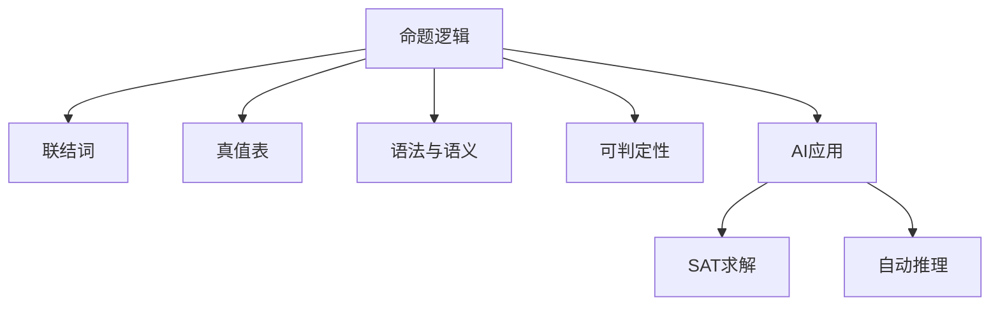

# 命题逻辑：联结词与真值表

---

## 国际标准定义与多语种术语

- **命题逻辑（Propositional Logic）**：研究命题及其通过逻辑联结词（¬, ∧, ∨, →, ↔）组合而成的复合命题的推理系统，是数理逻辑的基础分支。
- **多语种术语**：
  - 英：Propositional Logic / Sentential Logic
  - 法：Logique propositionnelle
  - 中：命题逻辑

---

## 理论基础与核心定理

### 1. 基本元素
- **命题**：可判定真假的语句。
- **联结词**：
  - 否定（¬/NOT）
  - 合取（∧/AND）
  - 析取（∨/OR）
  - 蕴含（→/IMPLIES）
  - 等值（↔/IFF）

### 2. 真值表
- 每个联结词对应一个真值表，描述输入命题真假组合下输出真假。
- 复合命题的真假可递归计算。

| p | q | ¬p | p∧q | p∨q | p→q | p↔q |
|---|---|----|-----|-----|-----|-----|
| T | T | F  |  T  |  T  |  T  |  T  |
| T | F | F  |  F  |  T  |  F  |  F  |
| F | T | T  |  F  |  T  |  T  |  F  |
| F | F | T  |  F  |  F  |  T  |  T  |

### 3. 语法与语义
- **语法**：如何用联结词递归构造合法命题公式。
- **语义**：每个公式在不同赋值下的真假。

### 4. 可判定性与完备性
- 命题逻辑是可判定的（存在算法判定任意公式是否为重言式）。
- 可靠性与完备性定理：语法推导与语义真值一致。

---

## 认知科学与AI前沿应用

- **认知科学**：命题逻辑反映人类基本推理模式，研究其在认知发展、教育中的作用。
- **AI应用**：
  - SAT求解器（布尔可满足性问题）
  - 自动推理系统
  - 形式化验证与电路设计
- **教育科学**：逻辑思维训练、可视化推理工具。

---

## 哲学反思与历史演化

- **哲学意义**：命题逻辑是形式逻辑的起点，奠定了现代逻辑体系的基础。
- **历史演化**：从亚里士多德三段论到布尔代数、弗雷格的形式化，推动了数学、计算机科学、语言学等领域的发展。
- **局限性**：无法表达量词、谓词等结构，需扩展到一阶逻辑。

---

## 典型案例与系统工具

- **SAT求解器**：MiniSAT、Z3、CryptoMiniSat
- **自动推理工具**：Prover9、Coq（命题部分）
- **可视化工具**：逻辑电路仿真、真值表生成器、Mermaid

---

## 可视化结构与知识图谱建议

---

## 国际标准文献与归档索引

- **典型文献**：
  - Boole, G. (1854). An Investigation of the Laws of Thought.
  - Frege, G. (1879). Begriffsschrift.
  - Mendelson, E. (2015). Introduction to Mathematical Logic.
- **归档索引**：
  - [自然演绎系统](./02-命题逻辑-自然演绎系统.md)
  - [一阶逻辑-量词谓词与模型](./03-一阶逻辑-量词谓词与模型.md)

---

[返回上一级: 数理逻辑总览](./00-数理逻辑总览.md) | [返回项目总览](../../09-项目总览/00-项目总览.md)
