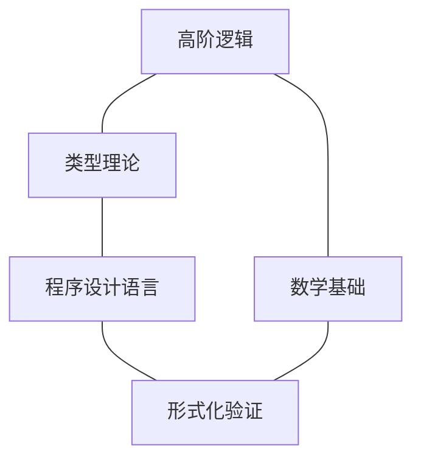

# 高阶逻辑

## 目录

- [高阶逻辑](#高阶逻辑)
  - [目录](#目录)
  - [1. 引言](#1-引言)
    - [1.1 历史背景](#11-历史背景)
    - [1.2 与一阶逻辑的区别](#12-与一阶逻辑的区别)
  - [2. 基本概念](#2-基本概念)
    - [2.1 语法](#21-语法)
    - [2.2 语义](#22-语义)
    - [2.3 类型理论视角](#23-类型理论视角)
  - [3. 二阶逻辑](#3-二阶逻辑)
    - [3.1 语法与语义](#31-语法与语义)
    - [3.2 表达能力](#32-表达能力)
    - [3.3 局限性](#33-局限性)
  - [4. 高阶逻辑系统](#4-高阶逻辑系统)
    - [4.1 简单类型理论](#41-简单类型理论)
    - [4.2 多态类型系统](#42-多态类型系统)
    - [4.3 依值类型系统](#43-依值类型系统)
  - [5. 元理论性质](#5-元理论性质)
    - [5.1 完备性与不完备性](#51-完备性与不完备性)
    - [5.2 紧致性](#52-紧致性)
    - [5.3 可判定性](#53-可判定性)
  - [6. 应用领域](#6-应用领域)
    - [6.1 数学基础](#61-数学基础)
    - [6.2 计算机科学](#62-计算机科学)
    - [6.3 形式化验证](#63-形式化验证)
  - [7. 代码实现](#7-代码实现)
    - [7.1 Rust实现](#71-rust实现)
    - [7.2 Haskell实现](#72-haskell实现)
  - [8. 哲学思考](#8-哲学思考)
    - [8.1 本体论意义](#81-本体论意义)
    - [8.2 认知论意义](#82-认知论意义)
  - [9. 参考文献](#9-参考文献)

---

## 1. 引言

高阶逻辑(Higher-Order Logic, HOL)是对一阶逻辑的扩展，允许量化不仅可以应用于个体变量，还可以应用于谓词、函数和更高阶的实体。这种扩展大大增强了逻辑系统的表达能力，使其能够更直接地表达数学中的许多概念，但也带来了一些元理论性质的变化。

### 1.1 历史背景

高阶逻辑的发展可以追溯到20世纪初，当时数学家和逻辑学家正在寻找建立数学基础的方法：

- **1908年**：罗素(Russell)和怀特海(Whitehead)在《数学原理》中使用类型化的高阶逻辑
- **1930年代**：丘奇(Church)发展了简单类型理论(Simple Theory of Types)
- **1940年代**：塔尔斯基(Tarski)发展了高阶逻辑的语义理论
- **1970年代以后**：高阶逻辑在计算机科学和形式化验证领域得到广泛应用

### 1.2 与一阶逻辑的区别

高阶逻辑与一阶逻辑的主要区别在于：

1. **量化范围**：
   - 一阶逻辑：只允许对个体变量进行量化
   - 高阶逻辑：允许对谓词、函数和更高阶实体进行量化

2. **表达能力**：
   - 一阶逻辑：无法直接表达"有限性"、"可数性"等概念
   - 高阶逻辑：可以表达许多一阶逻辑无法直接表达的概念

3. **元理论性质**：
   - 一阶逻辑：具有完备性、紧致性和可数模型性质
   - 高阶逻辑：失去了完备性和紧致性，但获得了更强的表达能力

## 2. 基本概念

### 2.1 语法

高阶逻辑的语法是类型化的，每个表达式都有一个关联的类型。基本类型包括：

- **个体类型**：通常记为$\iota$，表示论域中的个体
- **命题类型**：通常记为$o$，表示真值
- **函数类型**：如果$\sigma$和$\tau$是类型，则$\sigma \to \tau$是从$\sigma$到$\tau$的函数类型

高阶逻辑的语法包括：

1. **变量**：每个变量都有一个特定的类型
2. **常量**：包括逻辑连接词($\land$, $\lor$, $\neg$, $\to$)和量词($\forall$, $\exists$)
3. **应用**：如果$f$是类型$\sigma \to \tau$的表达式，$t$是类型$\sigma$的表达式，则$f(t)$是类型$\tau$的表达式
4. **抽象**：如果$x$是类型$\sigma$的变量，$t$是类型$\tau$的表达式，则$\lambda x.t$是类型$\sigma \to \tau$的表达式

### 2.2 语义

高阶逻辑的标准语义是基于类型化的模型：

- 每个类型$\sigma$对应一个非空集合$D_\sigma$
- 个体类型$\iota$对应论域$D_\iota$
- 命题类型$o$对应真值集合$\{T, F\}$
- 函数类型$\sigma \to \tau$对应函数空间$D_{\sigma \to \tau} = D_\tau^{D_\sigma}$

解释函数$\mathcal{I}$将：

- 类型$\sigma$的常量$c$映射到$D_\sigma$中的元素
- 类型$\sigma$的变量$x$在赋值$\nu$下映射到$D_\sigma$中的元素

表达式的语义值递归定义：

- $[\![x]\!]_\nu = \nu(x)$
- $[\![c]\!]_\nu = \mathcal{I}(c)$
- $[\![f(t)]\!]_\nu = [\![f]\!]_\nu([\![t]\!]_\nu)$
- $[\![\lambda x.t]\!]_\nu = $ 函数$g$，其中对任意$a \in D_\sigma$，$g(a) = [\![t]\!]_{\nu[x \mapsto a]}$

### 2.3 类型理论视角

高阶逻辑与类型理论密切相关，可以从类型理论的角度理解：

- 高阶逻辑可以视为简单类型$\lambda$演算加上逻辑常量
- 柯里-霍华德同构(Curry-Howard isomorphism)建立了逻辑与类型系统的对应关系
- 命题对应类型，证明对应程序，逻辑推理对应程序转换



## 3. 二阶逻辑

二阶逻辑是高阶逻辑的一个特例，它允许量化谓词变量，但不允许量化更高阶的实体。

### 3.1 语法与语义

二阶逻辑的语法扩展了一阶逻辑：

- 除了个体变量外，还有谓词变量$P, Q, R, ...$
- 允许对谓词变量进行量化：$\forall P. \varphi$和$\exists P. \varphi$

语义解释：

- 谓词变量$P$的解释是论域的子集或关系
- $\forall P. \varphi$为真当且仅当对论域的所有子集/关系$P$，$\varphi$都为真

### 3.2 表达能力

二阶逻辑比一阶逻辑具有更强的表达能力：

1. **可以定义自然数**：

   $$\forall P. [P(0) \land \forall n. (P(n) \to P(n+1)) \to \forall n. P(n)]$$

2. **可以表达有限性**：

   $$\exists n. \exists f. [\text{Injective}(f) \land \forall x. f(x) < n]$$

3. **可以表达同构**：

   $$\exists f. [\text{Bijective}(f) \land \forall x,y. R(x,y) \leftrightarrow S(f(x),f(y))]$$

### 3.3 局限性

尽管二阶逻辑表达能力强，但它有一些重要的局限性：

1. **不完备性**：根据哥德尔不完备性定理，任何包含足够算术的形式系统都不是完备的
2. **不可判定性**：二阶逻辑的有效性问题是不可判定的
3. **非标准模型**：二阶逻辑仍然有非标准模型，尽管比一阶逻辑少

## 4. 高阶逻辑系统

### 4.1 简单类型理论

简单类型理论(Simple Theory of Types)是由丘奇发展的高阶逻辑系统：

- 基于类型化的$\lambda$演算
- 包含两个基本类型：个体类型$\iota$和命题类型$o$
- 递归构造函数类型：$\sigma \to \tau$

形式化规则包括：

- $\beta$-规约：$(\lambda x.t)(s) \to t[s/x]$
- $\eta$-规约：$\lambda x.f(x) \to f$（当$x$不在$f$中自由出现时）
- 逻辑公理和推理规则

### 4.2 多态类型系统

多态类型系统扩展了简单类型理论，引入了类型变量和类型量化：

- 系统F（吉拉德-雷诺多二阶$\lambda$演算）
- 允许类型参数化：$\forall \alpha. \tau$
- 增强了表达能力和抽象能力

例如，恒等函数的多态类型：

$$\Lambda \alpha. \lambda x:\alpha. x : \forall \alpha. \alpha \to \alpha$$

### 4.3 依值类型系统

依值类型系统(Dependent Type System)进一步扩展了类型系统：

- 类型可以依赖于值
- 允许表达更精确的规范
- 例如：向量类型$\text{Vec}(A, n)$表示长度为$n$的$A$类型元素的向量

依值类型系统的例子：

- Martin-Löf类型论
- 演算结构(Calculus of Constructions)
- Coq、Agda等证明助手的基础

## 5. 元理论性质

### 5.1 完备性与不完备性

高阶逻辑的一个重要特性是它的不完备性：

- **定理**：标准语义下，二阶及更高阶逻辑不存在完备的形式系统
- 这意味着总存在语义上为真但无法在形式系统中证明的命题
- 这是由哥德尔不完备性定理导致的

然而，存在一些替代语义（如Henkin语义）下的完备性结果：

- Henkin语义限制了模型中函数和谓词的范围
- 在Henkin语义下，高阶逻辑可以有完备的公理化

### 5.2 紧致性

高阶逻辑在标准语义下不具有紧致性：

- **紧致性**：如果一个理论的每个有限子集都有模型，那么整个理论也有模型
- 一阶逻辑具有紧致性，这是其许多重要性质的基础
- 高阶逻辑失去了这一性质，这导致了许多元理论结果的差异

例如，可以在二阶逻辑中表达"集合是可数的"，但不能表达"集合是不可数的"的公理集合，尽管每个有限子集都有模型。

### 5.3 可判定性

高阶逻辑的有效性问题是不可判定的：

- 不存在算法能够判定任意高阶逻辑公式是否有效
- 这比一阶逻辑的半可判定性更弱
- 实际应用中，通常需要人机交互的证明系统

## 6. 应用领域

### 6.1 数学基础

高阶逻辑在数学基础研究中有重要应用：

- **集合论**：可以在高阶逻辑中形式化ZFC集合论
- **数学分析**：实数理论和分析的形式化
- **范畴论**：高阶概念的形式化

例如，连续性的高阶表达：

$$\forall P. (\exists x. P(x)) \to (\exists x. P(x) \land \forall y. (P(y) \to x \leq y))$$

### 6.2 计算机科学

高阶逻辑在计算机科学中有广泛应用：

- **程序语义**：使用高阶逻辑描述程序行为
- **类型系统**：现代编程语言类型系统的理论基础
- **规范语言**：软件规范和验证的形式语言

例如，函数式编程中的高阶函数直接对应于高阶逻辑中的高阶谓词。

### 6.3 形式化验证

高阶逻辑是许多形式化验证系统的基础：

- **HOL系列**：HOL4、HOL Light、ProofPower等
- **Isabelle/HOL**：基于高阶逻辑的交互式证明助手
- **Coq**：基于演算结构的证明助手，支持依值类型

这些系统被用于验证硬件设计、软件系统、数学定理等。

## 7. 代码实现

### 7.1 Rust实现

以下是高阶逻辑中简单类型系统的Rust实现示例：

```rust
#[derive(Clone, Debug, PartialEq)]
enum Type {
    Base(String),       // 基本类型，如个体类型ι或命题类型o
    Function(Box<Type>, Box<Type>),  // 函数类型 σ -> τ
}

#[derive(Clone, Debug)]
enum Term {
    Variable(String, Type),          // 变量，带类型
    Constant(String, Type),          // 常量，带类型
    Application(Box<Term>, Box<Term>), // 应用 f(t)
    Abstraction(String, Type, Box<Term>), // 抽象 λx:σ.t
}

// 类型检查函数
fn type_check(term: &Term, context: &[(String, Type)]) -> Result<Type, String> {
    match term {
        Term::Variable(name, ty) => {
            // 检查变量是否在上下文中
            if let Some((_, context_ty)) = context.iter().find(|(n, _)| n == name) {
                if context_ty == ty {
                    Ok(ty.clone())
                } else {
                    Err(format!("Type mismatch for variable {}", name))
                }
            } else {
                Err(format!("Unbound variable {}", name))
            }
        },
        Term::Constant(_, ty) => Ok(ty.clone()),
        Term::Application(f, arg) => {
            // 检查函数应用
            let f_type = type_check(f, context)?;
            let arg_type = type_check(arg, context)?;
            
            match f_type {
                Type::Function(param_type, return_type) => {
                    if *param_type == arg_type {
                        Ok(*return_type)
                    } else {
                        Err("Function argument type mismatch".to_string())
                    }
                },
                _ => Err("Expected function type".to_string())
            }
        },
        Term::Abstraction(var_name, var_type, body) => {
            // 检查抽象
            let mut extended_context = context.to_vec();
            extended_context.push((var_name.clone(), var_type.clone()));
            
            let body_type = type_check(body, &extended_context)?;
            Ok(Type::Function(Box::new(var_type.clone()), Box::new(body_type)))
        }
    }
}
```

### 7.2 Haskell实现

以下是高阶逻辑谓词演算的Haskell实现示例：

```haskell
-- 类型定义
data Type = TyBase String         -- 基本类型
          | TyFunc Type Type      -- 函数类型
          deriving (Eq, Show)

-- 项定义
data Term = Var String Type       -- 变量
          | Const String Type     -- 常量
          | App Term Term         -- 应用
          | Lam String Type Term  -- 抽象
          deriving (Show)

-- 逻辑公式
data Formula = Atom Term                -- 原子公式
             | And Formula Formula      -- 合取
             | Or Formula Formula       -- 析取
             | Implies Formula Formula  -- 蕴含
             | Not Formula              -- 否定
             | Forall String Type Formula -- 全称量化
             | Exists String Type Formula -- 存在量化
             deriving (Show)

-- 类型检查
typeCheck :: [(String, Type)] -> Term -> Either String Type
typeCheck ctx (Var name ty) =
  case lookup name ctx of
    Just contextTy -> if contextTy == ty
                      then Right ty
                      else Left $ "Type mismatch for variable " ++ name
    Nothing -> Left $ "Unbound variable " ++ name
    
typeCheck ctx (Const _ ty) = Right ty

typeCheck ctx (App f arg) = do
  fTy <- typeCheck ctx f
  argTy <- typeCheck ctx arg
  case fTy of
    TyFunc paramTy retTy ->
      if paramTy == argTy
      then Right retTy
      else Left "Function argument type mismatch"
    _ -> Left "Expected function type"
    
typeCheck ctx (Lam var varTy body) =
  let extendedCtx = (var, varTy) : ctx
  in TyFunc varTy <$> typeCheck extendedCtx body

-- 检查公式良构性
checkWellFormed :: [(String, Type)] -> Formula -> Either String ()
checkWellFormed ctx (Atom t) = do
  ty <- typeCheck ctx t
  if ty == TyBase "o"  -- 检查是否为命题类型
  then Right ()
  else Left "Atomic formula must have proposition type"
  
checkWellFormed ctx (And f1 f2) = do
  checkWellFormed ctx f1
  checkWellFormed ctx f2
  
checkWellFormed ctx (Or f1 f2) = do
  checkWellFormed ctx f1
  checkWellFormed ctx f2
  
checkWellFormed ctx (Implies f1 f2) = do
  checkWellFormed ctx f1
  checkWellFormed ctx f2
  
checkWellFormed ctx (Not f) =
  checkWellFormed ctx f
  
checkWellFormed ctx (Forall var ty f) =
  checkWellFormed ((var, ty) : ctx) f
  
checkWellFormed ctx (Exists var ty f) =
  checkWellFormed ((var, ty) : ctx) f
```

## 8. 哲学思考

### 8.1 本体论意义

高阶逻辑的本体论意义涉及对数学对象存在性的理解：

1. **柏拉图主义**：高阶逻辑似乎预设了对抽象实体（如集合、函数、关系）的柏拉图式承诺
2. **实在论与唯名论**：高阶逻辑中的量化可以从实在论（量化指代实际存在的抽象对象）或唯名论（量化只是语言结构）角度理解
3. **本体论简约**：昆因(Quine)等哲学家倾向于一阶逻辑，部分原因是其本体论承诺较少

高阶逻辑的使用引发了关于我们应该接受什么样的抽象实体的问题，以及这些实体的本质是什么。

### 8.2 认知论意义

高阶逻辑在认知和知识表示方面也有深刻意义：

1. **概念层次**：高阶逻辑自然地表达了人类思维中的概念层次结构
2. **抽象能力**：反映了人类形成高阶抽象概念的认知能力
3. **语言与思维**：探讨了形式语言表达能力与人类思维能力的关系

高阶思维是人类认知的特征之一，高阶逻辑可以看作是这种能力的形式化表达。

## 9. 参考文献

1. Andrews, P. B. (2002). An Introduction to Mathematical Logic and Type Theory: To Truth Through Proof. Springer.
2. Church, A. (1940). A Formulation of the Simple Theory of Types. Journal of Symbolic Logic, 5(2), 56-68.
3. Henkin, L. (1950). Completeness in the Theory of Types. Journal of Symbolic Logic, 15(2), 81-91.
4. Shapiro, S. (1991). Foundations without Foundationalism: A Case for Second-order Logic. Oxford University Press.
5. Manzano, M. (1996). Extensions of First-Order Logic. Cambridge University Press.
6. Thompson, S. (1999). Type Theory and Functional Programming. Addison Wesley.
7. Lambek, J., & Scott, P. J. (1988). Introduction to Higher-Order Categorical Logic. Cambridge University Press.
8. Barendregt, H., Dekkers, W., & Statman, R. (2013). Lambda Calculus with Types. Cambridge University Press.
