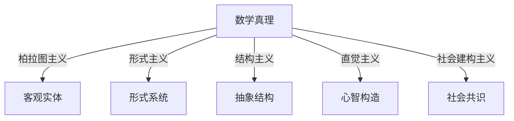

# 05-哲学与形式化反思

## 目录

- [05-哲学与形式化反思](#05-哲学与形式化反思)
  - [目录](#目录)
  - [1. 数学哲学流派](#1-数学哲学流派)
    - [1.1 柏拉图主义（Platonism）](#11-柏拉图主义platonism)
    - [1.2 形式主义（Formalism）](#12-形式主义formalism)
    - [1.3 逻辑主义（Logicism）](#13-逻辑主义logicism)
    - [1.4 直觉主义与构造主义（Intuitionism/Constructivism）](#14-直觉主义与构造主义intuitionismconstructivism)
    - [1.5 结构主义（Structuralism）](#15-结构主义structuralism)
    - [1.6 社会建构主义与后现代视角](#16-社会建构主义与后现代视角)
  - [2. 形式化的意义与局限](#2-形式化的意义与局限)
  - [3. 数学真理、知识的确定性与认知](#3-数学真理知识的确定性与认知)
  - [4. AI、认知科学与数理逻辑](#4-ai认知科学与数理逻辑)
  - [5. 批判性分析与多表征](#5-批判性分析与多表征)
  - [6. 本地跳转与引用](#6-本地跳转与引用)

---

## 1. 数学哲学流派

### 1.1 柏拉图主义（Platonism）

- 数学对象独立存在，数学发现而非发明。
- 代表人物：柏拉图、哥德尔、彭罗斯。
- 优势：解释数学的客观性和普遍性，符合数学家的直觉。
- 挑战：难以解释抽象对象的认知与存在方式。

### 1.2 形式主义（Formalism）

- 数学是符号操作的游戏，强调形式系统和推理规则。
- 代表人物：希尔伯特、卡尔纳普。
- 优势：避免本体论问题，强调数学的结构性。
- 挑战：难以解释数学的应用性和美感。

### 1.3 逻辑主义（Logicism）

- 数学可还原为逻辑，所有数学真理皆为逻辑真理。
- 代表人物：弗雷格、罗素。
- 优势：为数学提供逻辑基础，统一数学与逻辑。
- 挑战：罗素悖论、需要额外公理（如无穷公理）。

### 1.4 直觉主义与构造主义（Intuitionism/Constructivism）

- 强调构造性证明，拒绝非构造性存在性证明。
- 代表人物：布劳威尔、海廷。
- 优势：强调数学的构造性，与计算机科学密切相关。
- 挑战：限制了经典数学的发展，与实际工作有差距。

### 1.5 结构主义（Structuralism）

- 数学对象由其结构关系定义，关注结构的普遍性。
- 代表人物：雷斯尼克、夏皮罗。
- 优势：强调对象间的关系和同构。
- 教育意义：关注结构的发现与理解。

### 1.6 社会建构主义与后现代视角

- 数学知识是社会建构的产物，强调多样性与认知基础。
- 代表人物：欧内斯特、库恩。
- 教育意义：强调合作学习和交流。

---

## 2. 形式化的意义与局限

- 形式化提升了数学的严密性和可验证性，但也揭示了形式系统的内在局限（如哥德尔不完备性定理）。
- 形式化与非形式化的张力，过度形式化可能抑制创造性，直觉难以完全形式化。
- 多元数学观：不同文化、认知背景下的数学多样性。
- 典型问题：选择公理与连续统假设的独立性、直觉主义对排中律的批判。

---

## 3. 数学真理、知识的确定性与认知

- 数学真理的本质：绝对性/相对性、确定性基础、与逻辑真理的关系。
- 主要真理理论：符合论（Platonism）、融贯论（Formalism）、实用/构造论（Intuitionism）、结构主义、社会建构论。
- 认知结构：数学认知是人类获取、处理、存储和使用抽象信息的过程，具有高度抽象性、符号依赖性、创造性。
- 认知对数学哲学的影响：不同哲学流派对认知过程有不同解释。
- 典型案例：从具体实例抽象出一般规律（如从自然数加法到群的抽象）。

---

## 4. AI、认知科学与数理逻辑

- 数理逻辑在人工智能、认知科学中的作用。
- 形式系统与人类心智、机器推理的关系。
- 哥德尔定理对AI与心智哲学的启示：真理与可证性的分离。
- 认知科学揭示数学活动中的非形式化因素。
- 典型应用：自动定理证明、知识表示、逻辑推理引擎。

---

## 5. 批判性分析与多表征

- 形式化与直觉的张力：过度形式化可能抑制创造性，直觉又难以完全形式化。
- 多元数学观：不同文化、认知背景下的数学多样性。
- 认知偏差与数学客观性：高度形式化领域也难以完全消除主观影响。
- 多表征：结构图、表格、代码、案例、哲学论证等。
- 典型问题：哥德尔不完备定理对形式主义的冲击、选择公理与连续统假设的独立性、直觉主义对排中律的批判。
- 教育启示：多表征有助于数学理解和创新。

**Mermaid结构图：多元哲学视角**:



**Lean代码片段：形式化证明**:

```lean
theorem and_comm (p q : Prop) : p ∧ q ↔ q ∧ p :=
iff.intro
  (assume h : p ∧ q,
    show q ∧ p, from and.intro h.right h.left)
  (assume h : q ∧ p,
    show p ∧ q, from and.intro h.right h.left)
```

---

## 6. 本地跳转与引用

- 相关内容详见：[00-数理逻辑总览](00-数理逻辑总览.md)
- 交叉主题见：[04-元数学与元理论](04-元数学与元理论.md)
- 哲学基础详见：[../../01-数学哲学-元数学与形式化/02-数学哲学.md](../../01-数学哲学-元数学与形式化/02-数学哲学.md)
- 理念驱动体系详见：[../../Mathematical_Knowledage/数学理念/理念驱动的数学哲学体系.md](../../Mathematical_Knowledage/数学理念/理念驱动的数学哲学体系.md)
