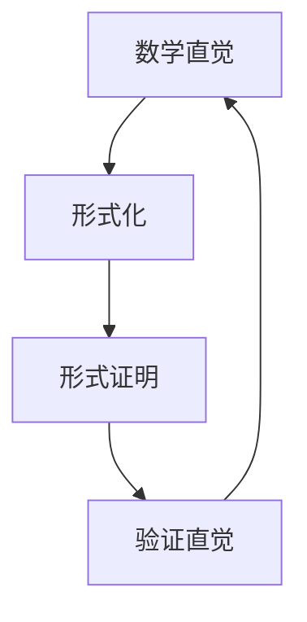

# 数理逻辑基础

## 目录

- [数理逻辑基础](#数理逻辑基础)
  - [目录](#目录)
  - [1. 引言](#1-引言)
    - [1.1 数理逻辑的目标](#11-数理逻辑的目标)
    - [1.2 数理逻辑的方法](#12-数理逻辑的方法)
  - [2. 形式语言与语法](#2-形式语言与语法)
    - [2.1 命题逻辑](#21-命题逻辑)
      - [2.1.1 语言结构](#211-语言结构)
      - [2.1.2 语义解释](#212-语义解释)
    - [2.2 一阶谓词逻辑](#22-一阶谓词逻辑)
      - [2.2.1 语言结构](#221-语言结构)
      - [2.2.2 语义解释](#222-语义解释)
    - [2.3 高阶逻辑](#23-高阶逻辑)
      - [2.3.1 类型系统](#231-类型系统)
      - [2.3.2 高阶量词](#232-高阶量词)
  - [3. 语义学](#3-语义学)
    - [3.1 真值语义](#31-真值语义)
      - [3.1.1 真值表方法](#311-真值表方法)
      - [3.1.2 重言式与矛盾式](#312-重言式与矛盾式)
    - [3.2 模型论语义](#32-模型论语义)
      - [3.2.1 模型的概念](#321-模型的概念)
      - [3.2.2 同构与初等等价](#322-同构与初等等价)
  - [4. 证明系统](#4-证明系统)
    - [4.1 希尔伯特系统](#41-希尔伯特系统)
      - [4.1.1 公理模式](#411-公理模式)
      - [4.1.2 证明的概念](#412-证明的概念)
    - [4.2 自然演绎](#42-自然演绎)
      - [4.2.1 引入和消除规则](#421-引入和消除规则)
      - [4.2.2 假设的引入和消除](#422-假设的引入和消除)
    - [4.3 相继式演算](#43-相继式演算)
      - [4.3.1 相继式的概念](#431-相继式的概念)
      - [4.3.2 规则系统](#432-规则系统)
  - [5. 元理论性质](#5-元理论性质)
    - [5.1 一致性](#51-一致性)
    - [5.2 完备性](#52-完备性)
    - [5.3 可靠性](#53-可靠性)
    - [5.4 可判定性](#54-可判定性)
  - [6. 批判性分析](#6-批判性分析)
    - [6.1 形式化的局限性](#61-形式化的局限性)
      - [6.1.1 哥德尔不完备定理的哲学意义](#611-哥德尔不完备定理的哲学意义)
      - [6.1.2 形式化与直觉的关系](#612-形式化与直觉的关系)
    - [6.2 逻辑的哲学问题](#62-逻辑的哲学问题)
      - [6.2.1 逻辑真理的本质](#621-逻辑真理的本质)
      - [6.2.2 逻辑多元主义](#622-逻辑多元主义)
    - [6.3 计算视角](#63-计算视角)
      - [6.3.1 逻辑与计算的关系](#631-逻辑与计算的关系)
      - [6.3.2 构造性逻辑](#632-构造性逻辑)
    - [6.4 现代发展](#64-现代发展)
      - [6.4.1 类型论](#641-类型论)
      - [6.4.2 证明助手](#642-证明助手)
  - [7. 总结](#7-总结)

---

## 1. 引言

数理逻辑是数学的一个分支，它使用形式化的方法来研究数学推理的有效性、数学理论的基础和数学证明的性质。通过建立精确的符号语言和严格的推演规则，数理逻辑将数学的严密性提升到新的高度。

### 1.1 数理逻辑的目标

1. **精确化数学推理**：将直观的数学论证转化为无歧义的、可机械验证的形式推导
2. **研究数学基础**：探讨数学公理系统的性质，如一致性、完备性和独立性
3. **探索可计算的边界**：界定哪些问题是算法可解的，哪些是不可解的
4. **理解数学的局限性**：通过哥德尔不完备定理等深刻结果，揭示形式系统的固有局限

### 1.2 数理逻辑的方法

1. **形式语言**：构建包含逻辑符号和特定理论符号的精确语言
2. **形式系统**：定义公理集合和推理规则，用于从公理推导出定理
3. **语义解释**：为形式语言中的符号和公式提供明确的意义
4. **元数学**：以数学方法研究形式系统本身的性质

## 2. 形式语言与语法

### 2.1 命题逻辑

#### 2.1.1 语言结构

**字母表**：

- 命题变元：$p, q, r, \ldots$
- 逻辑联结词：$\neg, \land, \lor, \rightarrow, \leftrightarrow$
- 辅助符号：$(, )$

**合式公式的形成规则**：

1. 每个命题变元都是合式公式
2. 如果 $\phi$ 是合式公式，则 $\neg \phi$ 是合式公式
3. 如果 $\phi$ 和 $\psi$ 是合式公式，则 $(\phi \land \psi)$、$(\phi \lor \psi)$、$(\phi \rightarrow \psi)$、$(\phi \leftrightarrow \psi)$ 是合式公式

#### 2.1.2 语义解释

**真值函数**：

- $\neg A$ 为真当且仅当 $A$ 为假
- $A \land B$ 为真当且仅当 $A$ 和 $B$ 都为真
- $A \lor B$ 为真当且仅当 $A$ 或 $B$ 至少有一个为真
- $A \rightarrow B$ 为真当且仅当 $A$ 为假或 $B$ 为真
- $A \leftrightarrow B$ 为真当且仅当 $A$ 和 $B$ 具有相同的真值

### 2.2 一阶谓词逻辑

#### 2.2.1 语言结构

**字母表**：

- 个体变元：$x, y, z, \ldots$
- 个体常元：$a, b, c, \ldots$
- 函数符号：$f, g, h, \ldots$
- 谓词符号：$P, Q, R, \ldots$
- 逻辑符号：$\neg, \land, \lor, \rightarrow, \leftrightarrow, \forall, \exists$
- 辅助符号：$(, ), ,$

**项的形成规则**：

1. 个体变元和个体常元是项
2. 如果 $t_1, \ldots, t_n$ 是项，$f$ 是 $n$ 元函数符号，则 $f(t_1, \ldots, t_n)$ 是项

**合式公式的形成规则**：

1. 如果 $t_1, \ldots, t_n$ 是项，$P$ 是 $n$ 元谓词符号，则 $P(t_1, \ldots, t_n)$ 是合式公式
2. 如果 $\phi$ 是合式公式，则 $\neg \phi$ 是合式公式
3. 如果 $\phi$ 和 $\psi$ 是合式公式，则 $(\phi \land \psi)$、$(\phi \lor \psi)$、$(\phi \rightarrow \psi)$、$(\phi \leftrightarrow \psi)$ 是合式公式
4. 如果 $\phi$ 是合式公式，$x$ 是变元，则 $\forall x \phi$ 和 $\exists x \phi$ 是合式公式

#### 2.2.2 语义解释

**结构**：一个结构 $\mathcal{A}$ 包含：

- 非空域 $A$
- 对每个个体常元 $c$ 的解释 $c^{\mathcal{A}} \in A$
- 对每个函数符号 $f$ 的解释 $f^{\mathcal{A}}: A^n \rightarrow A$
- 对每个谓词符号 $P$ 的解释 $P^{\mathcal{A}} \subseteq A^n$

**满足关系**：

- $\mathcal{A} \models P(t_1, \ldots, t_n)$ 当且仅当 $(t_1^{\mathcal{A}}, \ldots, t_n^{\mathcal{A}}) \in P^{\mathcal{A}}$
- $\mathcal{A} \models \forall x \phi$ 当且仅当对所有 $a \in A$，$\mathcal{A} \models \phi[a/x]$
- $\mathcal{A} \models \exists x \phi$ 当且仅当存在 $a \in A$，$\mathcal{A} \models \phi[a/x]$

### 2.3 高阶逻辑

#### 2.3.1 类型系统

高阶逻辑引入了类型系统来区分不同层次的数学对象：

```haskell
-- 类型定义
type Type = 
  | BaseType String
  | FunctionType Type Type
  | ProductType Type Type

-- 项的类型
data Term = 
  | Variable String Type
  | Application Term Term
  | Abstraction String Type Term
  | Pair Term Term
  | First Term
  | Second Term
```

#### 2.3.2 高阶量词

高阶逻辑允许对函数和谓词进行量化：

$$\forall F \forall x (F(x) \rightarrow F(x))$$

## 3. 语义学

### 3.1 真值语义

#### 3.1.1 真值表方法

对于命题逻辑，可以使用真值表来确定公式的真值：

| $p$ | $q$ | $p \land q$ | $p \lor q$ | $p \rightarrow q$ |
|-----|-----|-------------|------------|-------------------|
| T   | T   | T           | T          | T                 |
| T   | F   | F           | T          | F                 |
| F   | T   | F           | T          | T                 |
| F   | F   | F           | F          | T                 |

#### 3.1.2 重言式与矛盾式

- **重言式**：在所有真值赋值下都为真的公式
- **矛盾式**：在所有真值赋值下都为假的公式
- **可满足式**：至少在一个真值赋值下为真的公式

### 3.2 模型论语义

#### 3.2.1 模型的概念

一个模型是满足某个理论的结构：

$$\mathcal{A} \models T \text{ 当且仅当 } \mathcal{A} \models \phi \text{ 对所有 } \phi \in T$$

#### 3.2.2 同构与初等等价

**同构**：两个结构 $\mathcal{A}$ 和 $\mathcal{B}$ 同构，如果存在双射 $f: A \rightarrow B$ 保持所有函数和关系。

**初等等价**：两个结构 $\mathcal{A}$ 和 $\mathcal{B}$ 初等等价，如果它们满足相同的句子。

## 4. 证明系统

### 4.1 希尔伯特系统

#### 4.1.1 公理模式

**命题逻辑的公理**：

1. $\phi \rightarrow (\psi \rightarrow \phi)$
2. $(\phi \rightarrow (\psi \rightarrow \chi)) \rightarrow ((\phi \rightarrow \psi) \rightarrow (\phi \rightarrow \chi))$
3. $(\neg \phi \rightarrow \neg \psi) \rightarrow (\psi \rightarrow \phi)$

**推理规则**：

- **分离规则**：从 $\phi$ 和 $\phi \rightarrow \psi$ 推出 $\psi$

#### 4.1.2 证明的概念

一个证明是公式的有限序列 $\phi_1, \ldots, \phi_n$，其中每个 $\phi_i$ 要么是公理，要么是通过推理规则从前面的公式得到的。

### 4.2 自然演绎

#### 4.2.1 引入和消除规则

**合取规则**：

- 引入：从 $\phi$ 和 $\psi$ 推出 $\phi \land \psi$
- 消除：从 $\phi \land \psi$ 推出 $\phi$ 或 $\psi$

**蕴含规则**：

- 引入：如果从假设 $\phi$ 可以推出 $\psi$，则推出 $\phi \rightarrow \psi$
- 消除：从 $\phi$ 和 $\phi \rightarrow \psi$ 推出 $\psi$

#### 4.2.2 假设的引入和消除

自然演绎系统允许引入临时假设，并在适当的时候消除它们。

### 4.3 相继式演算

#### 4.3.1 相继式的概念

相继式是形如 $\Gamma \vdash \Delta$ 的表达式，其中 $\Gamma$ 和 $\Delta$ 是公式的有限集合。

#### 4.3.2 规则系统

**左规则和右规则**：

- 左规则：操作相继式左边的公式
- 右规则：操作相继式右边的公式

**切消规则**：
$$\frac{\Gamma \vdash \Delta, \phi \quad \phi, \Sigma \vdash \Pi}{\Gamma, \Sigma \vdash \Delta, \Pi}$$

## 5. 元理论性质

### 5.1 一致性

**定义**：一个形式系统是一致的，如果它不能同时证明一个命题 $P$ 和它的否定 $\neg P$。

**重要性**：一致性是形式系统最基本的要求，否则系统将毫无意义。

### 5.2 完备性

**定义**：一个形式系统是完备的，如果对于该系统语言中的任何一个命题 $P$，它要么可以证明 $P$，要么可以证明 $\neg P$。

**哥德尔完备性定理**：一阶谓词逻辑是完备的。

**哥德尔不完备定理**：任何包含算术的足够强的一致形式系统都是不完备的。

### 5.3 可靠性

**定义**：一个形式系统的推理规则是可靠的，如果它们只能从真前提推导出真结论。

**重要性**：可靠性确保所有可证的定理在其标准模型中都是真的。

### 5.4 可判定性

**定义**：一个形式系统是可判定的，如果存在一个算法，对于系统中的任何一个命题，该算法都能在有限步骤内判定该命题是否为系统中的定理。

**结果**：

- 命题逻辑是可判定的
- 一阶谓词逻辑是不可判定的（丘奇-图灵定理）

## 6. 批判性分析

### 6.1 形式化的局限性

#### 6.1.1 哥德尔不完备定理的哲学意义

哥德尔不完备定理揭示了形式化方法的根本局限性：

1. **认识论意义**：人类数学直觉超越了任何形式系统
2. **本体论意义**：数学真理不能完全形式化
3. **方法论意义**：形式化只是数学研究的一种工具，而非全部

#### 6.1.2 形式化与直觉的关系



### 6.2 逻辑的哲学问题

#### 6.2.1 逻辑真理的本质

- **分析性**：逻辑真理是否仅仅是分析的？
- **必然性**：逻辑真理是否具有必然性？
- **先天性**：逻辑知识是否先天的？

#### 6.2.2 逻辑多元主义

不同的逻辑系统可能适用于不同的领域：

```rust
// 经典逻辑
fn classical_logic(p: bool, q: bool) -> bool {
    !p || q  // p -> q
}

// 直觉主义逻辑
fn intuitionistic_logic(p: bool, q: bool) -> Option<bool> {
    if p {
        Some(q)
    } else {
        None  // 无法确定
    }
}
```

### 6.3 计算视角

#### 6.3.1 逻辑与计算的关系

**柯里-霍华德对应**：逻辑中的证明对应于计算中的程序：

```haskell
-- 逻辑：A -> B 的证明
-- 计算：从 A 到 B 的函数
proof :: A -> B

-- 逻辑：A /\ B 的证明
-- 计算：A 和 B 的积类型
proof :: (A, B)

-- 逻辑：A \/ B 的证明
-- 计算：A 或 B 的和类型
proof :: Either A B
```

#### 6.3.2 构造性逻辑

构造性逻辑强调证明的构造性内容：

- **存在性证明**：必须提供具体的构造方法
- **排中律**：不承认 $\phi \lor \neg \phi$ 的一般有效性
- **双重否定**：$\neg \neg \phi$ 不能直接推出 $\phi$

### 6.4 现代发展

#### 6.4.1 类型论

现代类型论提供了逻辑和计算的新视角：

```haskell
-- 依赖类型
data Vec (n : Nat) (a : Type) where
  Nil  : Vec 0 a
  Cons : a -> Vec n a -> Vec (S n) a

-- 命题作为类型
data Equal (a : Type) (x : a) : a -> Type where
  Refl : Equal a x x
```

#### 6.4.2 证明助手

现代证明助手如 Coq、Agda、Lean 等实现了逻辑和计算的结合：

```coq
Theorem plus_comm : forall n m : nat, n + m = m + n.
Proof.
  intros n m.
  induction n.
  - simpl. rewrite <- plus_n_O. reflexivity.
  - simpl. rewrite IHn. rewrite plus_Sn_m. reflexivity.
Qed.
```

## 7. 总结

数理逻辑作为数学的基础学科，不仅为数学提供了严格的推理框架，也深刻影响了计算机科学、人工智能和哲学等领域。通过形式化方法，数理逻辑揭示了数学推理的本质，同时也展现了形式化方法的边界和局限性。理解数理逻辑不仅有助于掌握数学的基础概念，也为深入理解计算、认知和知识提供了重要视角。

---

**参考文献**：

1. Enderton, H. B. (2001). A Mathematical Introduction to Logic. Academic Press.
2. Shoenfield, J. R. (2001). Mathematical Logic. A K Peters.
3. van Dalen, D. (2013). Logic and Structure. Springer.
4. Troelstra, A. S., & Schwichtenberg, H. (2000). Basic Proof Theory. Cambridge University Press.
