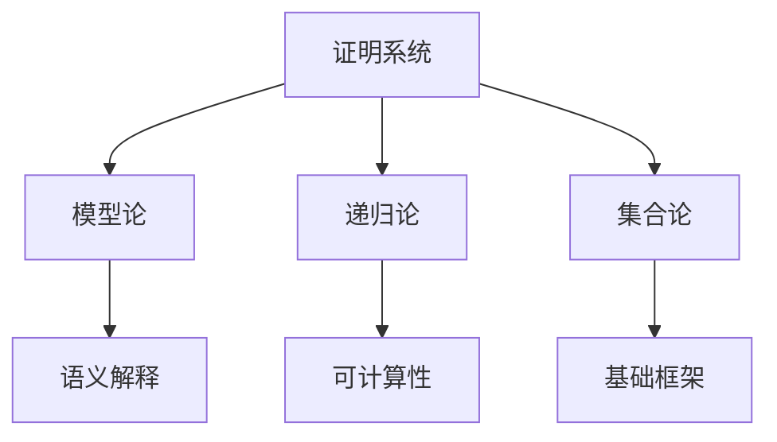

# 证明系统

## 目录

- [证明系统](#证明系统)
  - [目录](#目录)
  - [1. 引言](#1-引言)
    - [1.1 证明系统的哲学基础](#11-证明系统的哲学基础)
    - [1.2 形式化证明的意义](#12-形式化证明的意义)
    - [1.3 与其他逻辑分支的关系](#13-与其他逻辑分支的关系)
  - [2. 自然演绎系统](#2-自然演绎系统)
    - [2.1 基本思想与哲学](#21-基本思想与哲学)
    - [2.2 命题逻辑自然演绎](#22-命题逻辑自然演绎)
      - [2.2.1 基本规则](#221-基本规则)
      - [2.2.2 派生规则](#222-派生规则)
      - [2.2.3 证明示例](#223-证明示例)
    - [2.3 谓词逻辑自然演绎](#23-谓词逻辑自然演绎)
      - [2.3.1 量词规则](#231-量词规则)
      - [2.3.2 等词规则](#232-等词规则)
      - [2.3.3 证明示例](#233-证明示例)
  - [3. 公理化系统](#3-公理化系统)
    - [3.1 希尔伯特系统](#31-希尔伯特系统)
      - [3.1.1 公理模式](#311-公理模式)
      - [3.1.2 推理规则](#312-推理规则)
      - [3.1.3 系统性质](#313-系统性质)
    - [3.2 其他公理系统](#32-其他公理系统)
      - [3.2.1 弗雷格系统](#321-弗雷格系统)
      - [3.2.2 卢卡西维茨系统](#322-卢卡西维茨系统)
  - [4. 相继式演算](#4-相继式演算)
    - [4.1 相继式的基本概念](#41-相继式的基本概念)
    - [4.2 结构规则](#42-结构规则)
    - [4.3 逻辑规则](#43-逻辑规则)
      - [4.3.1 命题逻辑规则](#431-命题逻辑规则)
      - [4.3.2 谓词逻辑规则](#432-谓词逻辑规则)
    - [4.4 切消定理](#44-切消定理)
  - [5. 元理论结果](#5-元理论结果)
    - [5.1 一致性](#51-一致性)
    - [5.2 完备性](#52-完备性)
    - [5.3 可靠性](#53-可靠性)
    - [5.4 紧致性](#54-紧致性)
  - [6. 证明复杂性](#6-证明复杂性)
    - [6.1 证明长度](#61-证明长度)
    - [6.2 证明深度](#62-证明深度)
    - [6.3 最优证明](#63-最优证明)
  - [7. 应用与拓展](#7-应用与拓展)
    - [7.1 自动定理证明](#71-自动定理证明)
    - [7.2 程序验证](#72-程序验证)
    - [7.3 类型理论](#73-类型理论)
  - [总结](#总结)

---

## 1. 引言

证明系统是数理逻辑的核心组成部分，它提供了从公理和假设出发，通过严格的推理规则构造数学证明的框架。本章将从哲学批判性分析的视角，深入探讨各种证明系统的理论基础、结构特征和元理论性质。

### 1.1 证明系统的哲学基础

证明系统体现了数学推理的形式化本质，反映了人类理性思维的结构化特征：

**形式化与直觉的统一**：

- 形式化系统将直觉推理转化为可机械验证的符号操作
- 保持了数学推理的严谨性和可靠性
- 为数学知识的客观性提供了基础

**构造性与非构造性**：

- 构造性证明系统强调证明的可构造性
- 非构造性系统允许存在性证明
- 反映了数学哲学中直觉主义与形式主义的对立

### 1.2 形式化证明的意义

**可靠性保证**：

- 形式化证明消除了自然语言推理的歧义性
- 提供了证明有效性的客观标准
- 为数学知识的确定性奠定了基础

**计算应用**：

- 形式化证明系统为自动定理证明提供了理论基础
- 在程序验证和人工智能中有重要应用
- 推动了计算机科学的发展

### 1.3 与其他逻辑分支的关系



---

## 2. 自然演绎系统

### 2.1 基本思想与哲学

自然演绎系统由 Gentzen 和 Prawitz 发展，旨在模拟人类自然推理过程。其核心思想是：

**引入与消去规则**：

- 每个逻辑连接词都有引入规则和消去规则
- 引入规则说明如何构造复合命题
- 消去规则说明如何使用复合命题

**假设的引入与消去**：

- 允许临时引入假设进行推理
- 通过适当的规则消去假设
- 体现了条件推理的本质

### 2.2 命题逻辑自然演绎

#### 2.2.1 基本规则

**合取规则**：

引入规则：

```latex
φ    ψ
─────── (∧I)
φ ∧ ψ
```

消去规则：

```latex
φ ∧ ψ
───── (∧E₁)
  φ
```

```latex
φ ∧ ψ
───── (∧E₂)
  ψ
```

**析取规则**：

引入规则：

```latex
  φ
───── (∨I₁)
φ ∨ ψ
```

```latex
  ψ
───── (∨I₂)
φ ∨ ψ
```

消去规则：

```latex
φ ∨ ψ    [φ] ⊢ χ    [ψ] ⊢ χ
────────────────────────── (∨E)
           χ
```

**蕴含规则**：

引入规则：

```latex
[φ]
 ⋮
 ψ
───── (→I)
φ → ψ
```

消去规则（分离规则）：

```latex
φ    φ → ψ
────────── (→E)
    ψ
```

**否定规则**：

引入规则：

```latex
[φ]
 ⋮
⊥
───── (¬I)
¬φ
```

消去规则：

```latex
φ    ¬φ
──────── (¬E)
   ⊥
```

**矛盾规则**：

```latex
⊥
── (⊥E)
φ
```

#### 2.2.2 派生规则

**双重否定**：

```latex
¬¬φ
──── (¬¬E)
 φ
```

**反证法**：

```latex
[¬φ]
 ⋮
⊥
──── (RAA)
 φ
```

**排中律**：

```latex
──── (LEM)
φ ∨ ¬φ
```

#### 2.2.3 证明示例

**示例1**：证明 \( (p \land q) \to (q \land p) \)

```latex
[p ∧ q]₁
──────── (∧E₂)
   q

[p ∧ q]₁
──────── (∧E₁)
   p

   q    p
   ─────── (∧I)
   q ∧ p
──────────────── (→I)
(p ∧ q) → (q ∧ p)
```

**示例2**：证明 \( \neg(p \land \neg p) \)

```latex
[p ∧ ¬p]₁
───────── (∧E₁)
   p

[p ∧ ¬p]₁
───────── (∧E₂)
  ¬p

   p    ¬p
   ─────── (¬E)
    ⊥
──────────────── (¬I)
¬(p ∧ ¬p)
```

### 2.3 谓词逻辑自然演绎

#### 2.3.1 量词规则

**全称量词规则**：

引入规则：

```latex
φ(a)
───── (∀I)
∀x φ(x)
```

其中 \(a\) 是任意常数，且不在假设中出现。

消去规则：

```latex
∀x φ(x)
─────── (∀E)
 φ(t)
```

其中 \(t\) 是任意项。

**存在量词规则**：

引入规则：

```latex
φ(t)
───── (∃I)
∃x φ(x)
```

其中 \(t\) 是任意项。

消去规则：

```latex
∃x φ(x)    [φ(a)] ⊢ ψ
───────────────────── (∃E)
         ψ
```

其中 \(a\) 是新的常数，不在 \(\psi\) 或假设中出现。

#### 2.3.2 等词规则

**等词引入**：

```latex
───── (=I)
t = t
```

**等词消去**：

```latex
t₁ = t₂    φ(t₁)
──────────────── (=E)
     φ(t₂)
```

#### 2.3.3 证明示例

**示例**：证明 \( \forall x (P(x) \to Q(x)) \land \forall x P(x) \to \forall x Q(x) \)

```latex
[∀x(P(x) → Q(x)) ∧ ∀x P(x)]₁
──────────────────────────── (∧E₁)
      ∀x(P(x) → Q(x))

[∀x(P(x) → Q(x)) ∧ ∀x P(x)]₁
──────────────────────────── (∧E₂)
        ∀x P(x)

      ∀x P(x)
      ─────── (∀E)
       P(a)

    ∀x(P(x) → Q(x))
    ─────────────── (∀E)
    P(a) → Q(a)

    P(a)    P(a) → Q(a)
    ─────────────────── (→E)
           Q(a)
    ─────────────────── (∀I)
         ∀x Q(x)
──────────────────────────────── (→I)
(∀x(P(x) → Q(x)) ∧ ∀x P(x)) → ∀x Q(x)
```

---

## 3. 公理化系统

### 3.1 希尔伯特系统

#### 3.1.1 公理模式

**命题逻辑公理**：

1. \( \phi \to (\psi \to \phi) \) (肯定前件)
2. \( (\phi \to (\psi \to \chi)) \to ((\phi \to \psi) \to (\phi \to \chi)) \) (分配律)
3. \( (\neg \phi \to \neg \psi) \to (\psi \to \phi) \) (逆否律)

**谓词逻辑公理**：

1. \( \forall x \phi(x) \to \phi(t) \) (全称实例化)
2. \( \phi(t) \to \exists x \phi(x) \) (存在概括)
3. \( \forall x (\phi \to \psi) \to (\phi \to \forall x \psi) \) (全称分配)
4. \( \forall x (\phi \to \psi) \to (\exists x \phi \to \psi) \) (存在分配)

#### 3.1.2 推理规则

**分离规则 (Modus Ponens)**：

```latex
φ    φ → ψ
────────── (MP)
    ψ
```

**概括规则**：

```latex
φ
───── (Gen)
∀x φ
```

#### 3.1.3 系统性质

**一致性**：系统不能同时证明 \(\phi\) 和 \(\neg \phi\)。

**完备性**：所有有效的公式都是可证明的。

**可靠性**：所有可证明的公式都是有效的。

### 3.2 其他公理系统

#### 3.2.1 弗雷格系统

弗雷格在《概念文字》中提出了第一个完整的公理化系统：

**公理**：

1. \( p \to (q \to p) \)
2. \( (p \to (q \to r)) \to ((p \to q) \to (p \to r)) \)
3. \( (p \to (q \to r)) \to (q \to (p \to r)) \)
4. \( (p \to q) \to (\neg q \to \neg p) \)
5. \( \neg \neg p \to p \)
6. \( p \to \neg \neg p \)

#### 3.2.2 卢卡西维茨系统

卢卡西维茨提出了一个简洁的三公理系统：

**公理**：

1. \( (p \to q) \to ((q \to r) \to (p \to r)) \)
2. \( (\neg p \to p) \to p \)
3. \( p \to (\neg p \to q) \)

---

## 4. 相继式演算

### 4.1 相继式的基本概念

**相继式**：形如 \(\Gamma \vdash \Delta\) 的表达式，其中 \(\Gamma\) 和 \(\Delta\) 是公式的多重集。

**语义解释**：\(\Gamma \vdash \Delta\) 表示如果 \(\Gamma\) 中所有公式为真，则 \(\Delta\) 中至少有一个公式为真。

**初始相继式**：\(\phi \vdash \phi\)

### 4.2 结构规则

**弱化规则**：

```latex
Γ ⊢ Δ
────── (WL)
Γ, φ ⊢ Δ
```

```latex
Γ ⊢ Δ
────── (WR)
Γ ⊢ Δ, φ
```

**收缩规则**：

```latex
Γ, φ, φ ⊢ Δ
─────────── (CL)
  Γ, φ ⊢ Δ
```

```latex
Γ ⊢ Δ, φ, φ
─────────── (CR)
  Γ ⊢ Δ, φ
```

**交换规则**：

```latex
Γ, φ, ψ, Σ ⊢ Δ
────────────── (XL)
Γ, ψ, φ, Σ ⊢ Δ
```

```latex
Γ ⊢ Δ, φ, ψ, Σ
────────────── (XR)
Γ ⊢ Δ, ψ, φ, Σ
```

### 4.3 逻辑规则

#### 4.3.1 命题逻辑规则

**合取规则**：

```latex
Γ, φ, ψ ⊢ Δ
─────────── (∧L)
Γ, φ ∧ ψ ⊢ Δ
```

```latex
Γ ⊢ Δ, φ    Γ ⊢ Δ, ψ
───────────────────── (∧R)
    Γ ⊢ Δ, φ ∧ ψ
```

**析取规则**：

```latex
Γ, φ ⊢ Δ    Γ, ψ ⊢ Δ
───────────────────── (∨L)
   Γ, φ ∨ ψ ⊢ Δ
```

```latex
Γ ⊢ Δ, φ
───────── (∨R₁)
Γ ⊢ Δ, φ ∨ ψ
```

```latex
Γ ⊢ Δ, ψ
───────── (∨R₂)
Γ ⊢ Δ, φ ∨ ψ
```

**蕴含规则**：

```latex
Γ ⊢ Δ, φ    Γ, ψ ⊢ Σ
───────────────────── (→L)
  Γ, φ → ψ ⊢ Δ, Σ
```

```latex
Γ, φ ⊢ Δ, ψ
─────────── (→R)
Γ ⊢ Δ, φ → ψ
```

**否定规则**：

```latex
Γ ⊢ Δ, φ
───────── (¬L)
Γ, ¬φ ⊢ Δ
```

```latex
Γ, φ ⊢ Δ
───────── (¬R)
Γ ⊢ Δ, ¬φ
```

#### 4.3.2 谓词逻辑规则

**全称量词规则**：

```latex
Γ, φ(t) ⊢ Δ
─────────── (∀L)
Γ, ∀x φ(x) ⊢ Δ
```

```latex
Γ ⊢ Δ, φ(a)
─────────── (∀R)
Γ ⊢ Δ, ∀x φ(x)
```

**存在量词规则**：

```latex
Γ, φ(a) ⊢ Δ
─────────── (∃L)
Γ, ∃x φ(x) ⊢ Δ
```

```latex
Γ ⊢ Δ, φ(t)
─────────── (∃R)
Γ ⊢ Δ, ∃x φ(x)
```

### 4.4 切消定理

**切消定理**：如果 \(\Gamma \vdash \Delta, \phi\) 和 \(\Gamma', \phi \vdash \Delta'\) 都是可证明的，那么 \(\Gamma, \Gamma' \vdash \Delta, \Delta'\) 也是可证明的。

**证明策略**：

1. 对证明的高度进行归纳
2. 考虑最后一个规则的类型
3. 处理各种情况

**意义**：

- 保证了证明系统的子公式性质
- 为证明搜索算法提供了基础
- 简化了证明的结构

---

## 5. 元理论结果

### 5.1 一致性

**定义**：一个证明系统是一致的，如果它不能同时证明 \(\phi\) 和 \(\neg \phi\)。

**证明方法**：

1. **语义方法**：构造一个模型，使得所有公理为真
2. **语法方法**：通过证明变换技术
3. **相对一致性**：将一致性归结为其他系统的一致性

**示例**：命题逻辑的一致性

**定理**：命题逻辑的希尔伯特系统是一致的。

**证明**：构造一个赋值函数 \(v\)，使得所有公理为真，且分离规则保持真值。

### 5.2 完备性

**定义**：一个证明系统是完备的，如果所有有效的公式都是可证明的。

**哥德尔完备性定理**：一阶逻辑是完备的。

**证明思路**：

1. 构造一个典范模型
2. 证明每个一致的理论都有模型
3. 通过反证法证明完备性

**意义**：

- 建立了语法和语义的对应关系
- 为模型论提供了基础
- 保证了证明系统的充分性

### 5.3 可靠性

**定义**：一个证明系统是可靠的，如果所有可证明的公式都是有效的。

**证明方法**：

1. 验证所有公理都是有效的
2. 证明推理规则保持有效性
3. 通过归纳法证明所有定理都是有效的

**意义**：

- 保证了证明系统的正确性
- 为数学推理提供了可靠性保证
- 是形式化系统的基本要求

### 5.4 紧致性

**紧致性定理**：一个理论有模型当且仅当其每个有限子集都有模型。

**证明**：

1. 使用超积构造
2. 应用超滤子理论
3. 通过模型论方法

**应用**：

- 证明某些理论的一致性
- 构造非标准模型
- 在代数几何中的应用

---

## 6. 证明复杂性

### 6.1 证明长度

**定义**：证明的长度是指证明中公式的数量。

**下界定理**：存在公式，其最短证明的长度是指数级的。

**证明方法**：

1. 构造特定的公式族
2. 分析证明的结构
3. 使用组合论方法

### 6.2 证明深度

**定义**：证明的深度是指证明树的最大高度。

**深度与长度的关系**：

- 深度可以控制长度
- 存在深度和长度的权衡
- 在自动定理证明中有重要应用

### 6.3 最优证明

**最优证明**：在某种度量下最短或最简单的证明。

**寻找最优证明的困难**：

- 证明搜索空间巨大
- 最优性难以判定
- 需要启发式方法

---

## 7. 应用与拓展

### 7.1 自动定理证明

**基于证明系统的方法**：

1. **归结方法**：基于归结推理
2. **表方法**：基于语义表
3. **自然演绎**：基于自然演绎规则

**实现技术**：

- 证明搜索算法
- 启发式策略
- 学习技术

### 7.2 程序验证

**霍尔逻辑**：基于一阶逻辑的程序验证方法。

**分离逻辑**：用于指针程序验证的扩展逻辑。

**应用领域**：

- 安全关键系统
- 编译器验证
- 协议验证

### 7.3 类型理论

**Curry-Howard对应**：证明与程序之间的对应关系。

**依赖类型**：类型可以依赖于值。

**同伦类型论**：结合了类型论和同伦论。

---

## 总结

证明系统是数理逻辑的核心组成部分，它提供了形式化数学推理的框架。本章从哲学批判性分析的视角，深入探讨了自然演绎、公理化系统和相继式演算等主要证明系统。

**主要成果**：

1. **系统化理论**：建立了完整的证明系统理论框架
2. **元理论分析**：深入分析了证明系统的性质
3. **应用拓展**：探讨了在计算机科学中的应用

**未来方向**：

1. **证明复杂性**：深入研究证明的复杂性理论
2. **自动证明**：发展更高效的自动定理证明方法
3. **交互式证明**：结合人机交互的证明系统

证明系统的研究不仅推动了数理逻辑的发展，也为计算机科学和人工智能提供了重要的理论基础。通过持续的研究和创新，证明系统将在数学和计算机科学中发挥更加重要的作用。

---

**参考文献**：

1. Gentzen, G. (1935). Untersuchungen über das logische Schließen. Mathematische Zeitschrift, 39(1), 176-210.
2. Prawitz, D. (1965). Natural deduction: A proof-theoretical study. Almqvist & Wiksell.
3. Girard, J. Y., Lafont, Y., & Taylor, P. (1989). Proofs and types. Cambridge University Press.
4. Troelstra, A. S., & Schwichtenberg, H. (2000). Basic proof theory. Cambridge University Press.
